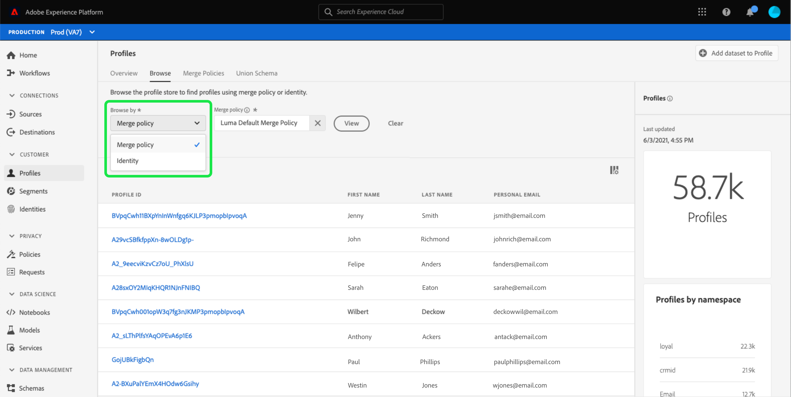
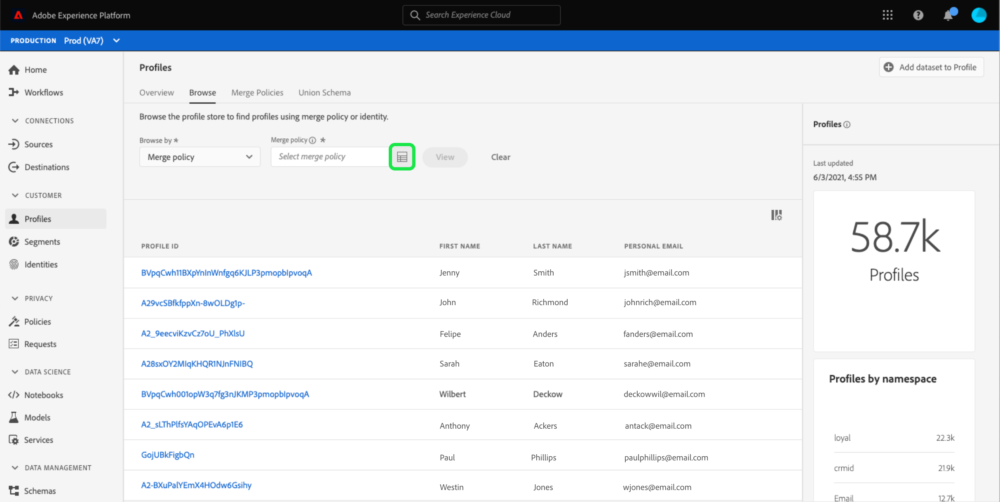

# [!DNL Real-time Customer Profile] Användargränssnittsguide

[!DNL Real-time Customer Profile] skapar en helhetsbild av var och en av era enskilda kunder och kombinerar data från flera kanaler, inklusive online-, offline-, CRM- och tredjepartsdata. Det här dokumentet fungerar som en guide för interaktion med [!DNL Real-time Customer Profile]-data i Adobe Experience Platform användargränssnitt.

## Komma igång

Användargränssnittshandboken kräver förståelse för de olika [!DNL Experience Platform]-tjänsterna som används för att hantera [!DNL Real-time Customer Profiles]. Innan du läser den här handboken eller arbetar i användargränssnittet bör du läsa dokumentationen för följande tjänster:

* [[!DNL Real-time Customer Profile] översikt](../home.md): Ger en enhetlig konsumentprofil i realtid baserad på aggregerade data från flera källor.
* [[!DNL Identity Service]](../../identity-service/home.md): Möjliggör  [!DNL Real-time Customer Profile] genom att överbrygga identiteter från olika datakällor när de hämtas till  [!DNL Platform].
* [[!DNL Experience Data Model (XDM)]](../../xdm/home.md): Det standardiserade ramverket som  [!DNL Platform] organiserar kundupplevelsedata.

## [!UICONTROL Overview]

I användargränssnittet för Experience Platform väljer du **[!UICONTROL Profiles]** i den vänstra navigeringen för att öppna fliken **[!UICONTROL Overview]** med profilkontrollpanelen.

>[!NOTE]
>
>Om din organisation är ny på Platform och ännu inte har aktiva profildatauppsättningar eller sammanslagningsprinciper skapade, visas inte kontrollpanelen [!UICONTROL Profiles]. Istället visar fliken [!UICONTROL Overview] länkar och dokumentation som hjälper dig att komma igång med kundprofilen i realtid.

### Kontrollpanel för profil {#profile-dashboard}

På profilkontrollpanelen visas viktiga mätvärden för din organisations profildata.

Mer information finns i [guiden för profilkontrollpanelen](../../dashboards/guides/profiles.md).

## [!UICONTROL Browse] tabbvärden

Välj fliken **[!UICONTROL Browse]** om du vill visa flera mätvärden som är relaterade till organisationens profildata. Du kan även använda den här fliken för att bläddra i profilarkivet med hjälp av en sammanfogningsprincip eller en identitet, vilket beskrivs i nästa avsnitt i den här handboken.

Till höger på fliken **[!UICONTROL Browse]** finns [antal profiler](#profile-count) och en lista över [profiler efter namnområde](#profiles-by-namespace).

>[!NOTE]
>
>Profilmåtten kan skilja sig från de värden som visas på [profilkontrollpanelen](#profile-dashboard) eftersom de utvärderas med organisationens standardsammanfogningsprincip. Mer information om hur du arbetar med sammanfogningsprinciper, inklusive hur du definierar en standardsammanfogningsprincip, finns i [översikten över sammanfogningsprinciper](../merge-policies/overview.md).

Förutom dessa mått innehåller det här avsnittet ett senaste uppdaterat datum och tid som visar när mätvärdena senast utvärderades.

### Profilantal {#profile-count}

Profilantalet visar det totala antalet profiler som din organisation har i Experience Platform, efter att organisationens standardpolicy för sammanfogning har sammanfogats med profilfragment för att bilda en enda profil för varje enskild kund. Med andra ord kan din organisation ha flera profilfragment kopplade till en enskild kund som interagerar med ert varumärke i olika kanaler, men dessa fragment skulle slås samman (enligt standardprincipen för sammanslagning) och skulle returnera antalet&quot;1&quot;-profil eftersom de alla är kopplade till samma individ.

Profilantalet omfattar även både profiler med attribut (postdata) och profiler som endast innehåller tidsseriedata (händelsedata), t.ex. Adobe Analytics-profiler. Profilantalet uppdateras regelbundet för att ge ett aktuellt totalt antal profiler inom plattformen.

#### Uppdaterar måttet för antal profiler

När inmatningen av poster i [!DNL Profile]-butiken ökar eller minskar antalet med mer än 5 %, utlöses ett jobb för att uppdatera antalet. För arbetsflöden med direktuppspelningsdata görs en timkontroll för att avgöra om tröskelvärdet på 5 % har uppnåtts eller ej. Om så är fallet utlöses ett jobb automatiskt för att uppdatera antalet profiler. Om tröskelvärdet på 5 % ökning eller minskning är uppfyllt, körs ett jobb för att uppdatera profilantalet för batchintag inom 15 minuter efter att en batch har importerats till profilbutiken.

### [!UICONTROL Profiles by namespace] {#profiles-by-namespace}

Måttet **[!UICONTROL Profiles by namespace]** visar totalt antal och uppdelning av namnutrymmen för alla sammanfogade profiler i din profilbutik. Det totala antalet profiler per namnutrymme (med andra ord, om de värden som visas för varje namnutrymme läggs ihop) kommer alltid att vara högre än det för antalet profiler, eftersom en profil kan ha flera namnutrymmen kopplade till sig. Om en kund till exempel interagerar med varumärket i mer än en kanal kommer flera namnutrymmen att kopplas till den enskilda kunden.

#### Uppdaterar [!UICONTROL Profiles by namespace]-måttet

Ungefär som [profilantalet](#profile-count), när inmatningen av poster i [!DNL Profile]-arkivet ökar eller minskar antalet med mer än 5 %, utlöses ett jobb för att uppdatera namnutrymmesmåtten. För arbetsflöden med direktuppspelningsdata görs en timkontroll för att avgöra om tröskelvärdet på 5 % har uppnåtts eller ej. Om så är fallet utlöses ett jobb automatiskt för att uppdatera antalet profiler. Om tröskelvärdet på 5 % ökning eller minskning uppnås körs ett jobb för att uppdatera mätvärdena för batchförbrukning inom 15 minuter efter att en batch har importerats till [!DNL Profile]-butiken.

## Använd fliken [!UICONTROL Browse] för att visa profiler

På fliken **[!UICONTROL Browse]** kan du visa exempelprofiler med hjälp av en sammanfogningsprincip eller leta upp specifika profiler med hjälp av ett ID-namnutrymme och värde.

### Bläddra efter [!UICONTROL Merge policy]

Väljaren **[!UICONTROL Browse by]** är inställd på [!UICONTROL Merge policy] som standard och **[!UICONTROL Merge policy]** som är vald är standardprincip för sammanslagning för din organisation.

Mer information om sammanfogningsprinciper och deras roll inom plattformen finns i [översikten över sammanfogningsprinciper](../merge-policies/overview.md).

Profilerna som visas representerar ett urval på upp till 20 profiler från din organisations profilbutik efter att den valda sammanfogningsprincipen har tillämpats. Exempelprofilerna för den valda sammanfogningsprincipen uppdateras när nya data läggs till i din organisations profilarkiv.

Om du vill visa information om en av exempelprofilerna väljer du **[!UICONTROL Profile ID]**. Mer information finns i avsnittet senare i den här guiden om [att visa profilinformation](#profile-detail).

Om du vill välja en annan sammanfogningsprincip markerar du `X` bredvid sammanfogningsprincipnamnet och använder sedan väljaren för att öppna dialogrutan **[!UICONTROL Select merge policy]**.

Om du vill välja en sammanfogningsprincip i dialogrutan **[!UICONTROL Select merge policy]** markerar du alternativknappen bredvid principnamnet och använder sedan **[!UICONTROL Select]** för att gå tillbaka till fliken [!UICONTROL Browse]. Du kan sedan välja **[!UICONTROL View]** om du vill uppdatera exempelprofilerna och se ett exempel på profiler med den nya sammanfogningsprincipen.

### Bläddra efter [!UICONTROL Identity]

Med **[!UICONTROL Browse by]**-väljaren kan du välja [!UICONTROL Identity] om du vill söka efter en viss profil med ett identitetsvärde. Om du bläddrar efter en identitet måste du också ange en sammanfogningsprincip, ett identitetsnamnutrymme och ett identitetsvärde.

Använd **[!UICONTROL Merge policy]**-väljaren för att öppna dialogrutan **[!UICONTROL Select merge policy]** och välj den sammanfogningsprincip som du vill använda.

Använd sedan **[!UICONTROL Identity namespace]**-väljaren för att öppna dialogrutan **[!UICONTROL Select identity namespace]** och välj det namnutrymme som du vill söka efter. Om din organisation har många namnutrymmen kan du använda sökfältet i dialogrutan för att börja skriva namnet på ett namnutrymme.

Du kan markera ett namnutrymme om du vill visa mer information eller välja ett namnutrymme genom att markera alternativknappen. Du kan sedan använda **[!UICONTROL Select]** för att fortsätta.

När du har valt ett [!UICONTROL Identity namespace]-värde och återgår till fliken [!UICONTROL Browse] kan du ange ett **[!UICONTROL Identity value]**-värde som är relaterat till det namnutrymme som du har valt.

>[!NOTE]
>
>Det här värdet är specifikt för en enskild kundprofil och måste vara en giltig post för det angivna namnutrymmet. Om du t.ex. väljer identitetsnamnet&quot;E-post&quot; krävs ett identitetsvärde i form av en giltig e-postadress.

När ett värde har angetts väljer du **[!UICONTROL View]** och en enda profil som matchar värdet returneras. Välj **[!UICONTROL Profile ID]** för att visa profilinformationen.

## Visa profilinformation {#profile-detail}

När du har valt en **[!UICONTROL Profile ID]** öppnas fliken **[!UICONTROL Detail]**. Profilinformationen som visas på fliken **[!UICONTROL Detail]** har sammanfogats från flera profilfragment till en enda vy över den enskilda kunden. Detta inkluderar kundinformation som grundläggande attribut, länkade identiteter och kanalinställningar.

Standardfälten som visas kan också ändras på organisationsnivå för att visa de önskade profilattributen. Om du vill veta mer om hur du anpassar de här fälten, inklusive stegvisa instruktioner för att lägga till och ta bort attribut och ändra storlek på kontrollpaneler, läser du [anpassningsguiden för profildetaljer](profile-customization.md).

Du kan visa ytterligare information om den enskilda profilen genom att välja en annan av de tillgängliga flikarna. Dessa flikar innehåller attribut, händelser och fliken för segmentmedlemskap som visar de segment som profilen är kvalificerad för just nu.

## Sammanfoga profiler

På huvudmenyn **[!UICONTROL Profiles]** väljer du fliken **[!UICONTROL Merge Policies]** för att visa en lista över sammanfogningsprinciper som tillhör din organisation. Varje listad princip visar sitt namn, oavsett om det är standardprincipen för sammanslagning eller inte, och schemaklassen som den gäller för.

Mer information om sammanfogningsprinciper finns i [översikten över sammanfogningsprinciper](../merge-policies/overview.md).

## Unionsschema {#union-schema}

På huvudmenyn **[!UICONTROL Profiles]** väljer du fliken **[!UICONTROL Union Schema]** för att visa tillgängliga unionsscheman för dina inkapslade data. Ett unionsschema är en sammanslagning av alla [!DNL Experience Data Model] (XDM)-fält under samma klass, vars scheman har aktiverats för användning i [!DNL Real-time Customer Profile].

Mer information om unionsscheman finns i [gränssnittsguiden för unionsscheman](union-schema.md).

## Nästa steg

Genom att läsa den här guiden kan du visa och hantera din organisations profildata med hjälp av användargränssnittet i Experience Platform. Mer information om hur du arbetar med profildata med Experience Platform API:er finns i [API-handboken för kundprofiler i realtid](../api/overview.md).
