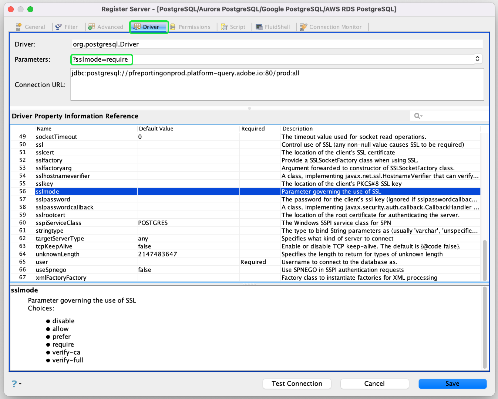

# Anslut [!DNL Aqua Data Studio] till frågetjänsten

Det här dokumentet innehåller stegen för att ansluta [!DNL Aqua Data Studio] med Adobe Experience Platform [!DNL Query Service].

>[!NOTE]
>
> Den här handboken förutsätter att du redan har tillgång till [!DNL Aqua Data Studio] och är bekant med hur du navigerar i dess gränssnitt. Mer information om [!DNL Aqua Data Studio] finns i [officiell [!DNL Aqua Data Studio] dokumentation](https://www.aquaclusters.com/app/home/project/public/aquadatastudio/wikibook/Documentation21.1/page/0/Aqua-Data-Studio-21-1).

När du har installerat [!DNL Aqua Data Studio] måste du först registrera servern. På huvudmenyn väljer du **[!DNL Server]** följt av **[!DNL Register Server]**.

Dialogrutan **[!DNL Register Server]** visas. Under fliken **[!DNL General]** väljer du **[!DNL PostgreSQL]** i listan till vänster. Ange följande information för serverinställningarna i dialogrutan som visas.

- **[!DNL Name]**: Namnet på anslutningen.
- **[!DNL Login Name and Password]**: De inloggningsuppgifter som ska användas. Användarnamnet har formatet `ORG_ID@AdobeOrg`.
- **[!DNL Host and Port]**: Värdslutpunkten och dess port för  [!DNL Query Service]. Du måste använda port 80 för att ansluta med [!DNL Query Service].
- **[!DNL Database]:** Databasen som ska användas.

>[!NOTE]
>
>Mer information om hur du hittar inloggningsuppgifter, värd, port och databasnamn finns på sidan [inloggningsuppgifter på Platform](https://platform.adobe.com/query/configuration). Logga in på [!DNL Platform] och välj **[!UICONTROL Queries]** följt av **[!UICONTROL Credentials]** för att hitta dina inloggningsuppgifter.

Klicka på fliken **[!DNL Driver]**.  Under **[!DNL Parameters]** anger du `?sslmode=require` som värde

När du har angett anslutningsinformationen väljer du **[!DNL Test Connection]** för att se till att dina autentiseringsuppgifter fungerar som de ska. Om anslutningen lyckas väljer du **[!DNL Save]** för att registrera servern. Anslutningen visas på instrumentpanelen när registreringen är klar, vilket bekräftar att du nu kan ansluta till servern och visa dess schemaobjekt.

## Nästa steg

Nu när du har anslutit till [!DNL Query Service] kan du använda **[!DNL Query Analyzer]** i [!DNL Aqua Data Studio] för att köra och redigera SQL-satser. Mer information om hur du skriver och kör frågor finns i [frågeguiden](../best-practices/writing-queries.md) som körs.