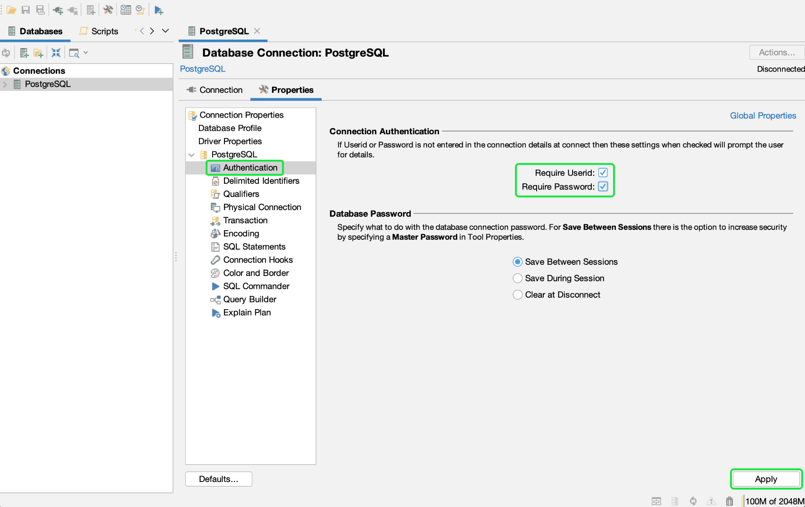
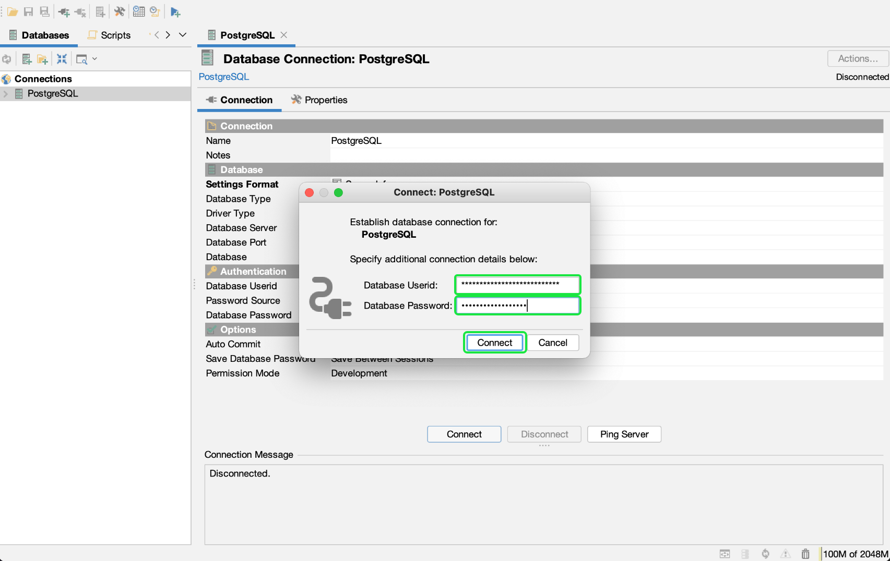

# Anslut [!DNL DbVisualizer] till [!DNL Query Service] {#connect-dbvisualizer}

Det här dokumentet innehåller stegen för att ansluta [!DNL DbVisualizer] databasverktyg med Adobe Experience Platform [!DNL Query Service].

## Komma igång

Den här guiden kräver att du redan har tillgång till [!DNL DbVisualizer] och känner till hur man navigerar i gränssnittet. Ladda ned [!DNL DbVisualizer] eller för mer information, se [officiell [!DNL DbVisualizer] dokumentation](https://www.dbvis.com/download/).

>[!NOTE]
>
>Det finns [!DNL Windows], [!DNL macOS]och [!DNL Linux] versioner av [!DNL DbVisualizer]. Skärmbilder i den här guiden har tagits med [!DNL macOS] datorprogram. Det kan finnas små skillnader i användargränssnittet mellan versionerna.

Hämta nödvändiga autentiseringsuppgifter för anslutning [!DNL  DbVisualizer] för Experience Platform måste du ha tillgång till arbetsytan Frågor i användargränssnittet för plattformen. Kontakta IMS-organisationens administratör om du inte har tillgång till arbetsytan Frågor.

## Skapa en databasanslutning {#connect-database}

När du har installerat datorprogrammet på din lokala dator startar du programmet och väljer **[!DNL Create a Database Connection]** från början [!DNL DbVisualizer] -menyn. Välj sedan **[!DNL Create a Connection]** i panelen till höger.

![The [!DNL DbVisualizer] huvudmenyn med &quot;Skapa en databasanslutning&quot; markerad.](../images/clients/dbvisualizer/create-db-connection.png)

Använd sökfältet eller markera [!DNL PostgreSQL] i listrutan med drivrutinsnamn. Arbetsytan Databasanslutning visas.

![Drivrutinens namn-listruta med [!DNL PostgreSQL] markerad.](../images/clients/dbvisualizer/driver-name.png)

På arbetsytan för databasanslutning väljer du **[!DNL Properties]** följt av **[!DNL Driver Properties]** från navigeringssidlisten.

De tre obligatoriska drivrutinsegenskaperna visas i tabellen nedan.

| Egenskap | Beskrivning |
| ------ | ------ |
| `PGHOST` | Värdnamnet för [!DNL PostgreSQL] server. Det här värdet är din Experience Platform [!UICONTROL Host] autentiseringsuppgifter. |
| `SSL` | Detta styr användningen av SSL-krav. Du **måste** använd värdet `require` för att aktivera detta krav. |
| `user` | Användarnamnet som är kopplat till databasen är ditt företags-ID. Det är en alfanumerisk sträng som slutar i `@adobe.org` |

>[!IMPORTANT]
>
>Se [[!DNL Query Service] SSL-dokumentation](./ssl-modes.md) om du vill veta mer om SSL-stöd för tredjepartsanslutningar till Adobe Experience Platform Query Service och hur du ansluter med `verify-full` SSL-läge.

### [!DNL Query Service] autentiseringsuppgifter

The `PGHOST` och `user` värden hämtas från dina Adobe Experience Platform-uppgifter. Logga in på användargränssnittet för plattformen och välj **[!UICONTROL Queries]** från vänster navigering, följt av **[!UICONTROL Credentials]**. Mer information om hur du hittar databasnamn, värd, port och inloggningsuppgifter finns i [inloggningsguide](../ui/credentials.md).

[!DNL Query Service] erbjuder även icke-utgångsdatum för att möjliggöra en engångskonfiguration med tredjepartsklienter. Läs dokumentationen för [fullständiga anvisningar om hur du genererar och använder ej utgångsdatum](../ui/credentials.md#non-expiring-credentials).

Använd sökfältet för att hitta varje egenskap och markera sedan motsvarande cell för parameterns värde. Cellen markeras med blått. Ange dina autentiseringsuppgifter för plattformen i värdefältet och välj **[!DNL Apply]** för att lägga till drivrutinsegenskapen.

>[!NOTE]
>
>Lägga till en sekund `user` profil, välja `user` i parameterkolumnen väljer du den blå + (plus)-ikonen för att lägga till inloggningsuppgifter för varje användare. Välj **[!DNL Apply]** för att lägga till drivrutinsegenskapen.

The [!DNL Edited] kolumnen visar en bockmarkering som anger att parametervärdet har uppdaterats.

## Autentisering

Om du vill kräva ett användar-ID och lösenordsbaserad autentisering varje gång en anslutning upprättas väljer du **[!DNL Authentication]** från navigeringssidlisten under [!DNL PostgreSQL].

På panelen Anslutningsautentisering kontrollerar du båda **[!DNL Require Userid]** och **[!DNL Require Password]** kryssrutor markera **[!DNL Apply]**.

## Anslut till plattform

Om du vill skapa en anslutning väljer du **[!DNL Connection]** på arbetsytan Databasanslutning och ange dina inloggningsuppgifter för Experience Platform för följande inställningar.

- **Namn**: Du bör ange ett eget namn för att känna igen anslutningen.
- **Databasserver**: Det här är din Experience Platform [!UICONTROL Host] autentiseringsuppgifter.
- **Databasport**: Porten för [!DNL Query Service]. Du måste använda port 80 för att ansluta till [!DNL Query Service].
- **Databas**: Använd autentiseringsuppgifterna `dbname` value `prod:all`.
- **Databas-Userid**: Detta är ditt organisations-ID för plattformen. Userid har formatet `ORG_ID@AdobeOrg`.
- **Databaslösenord**: Det här är en alfanumerisk sträng som finns på [!DNL Query Service] Instrumentpanel för autentiseringsuppgifter.

När du har angett alla relevanta autentiseringsuppgifter väljer du **[!DNL Connect]**.

The [!DNL Connect] visas vid det första tillfället av sessionen.

Ange ditt serienummer och lösenord och välj **[!DNL Connect]**. Ett meddelande visas i loggen som bekräftar att anslutningen lyckades.

## Nästa steg

Nu när du är ansluten [!DNL DbVisualizer] med [!DNL Query Service]kan du använda [!DNL DbVisualizer] för att skriva frågor. Mer information om hur du skriver och kör frågor finns i [guide för frågekörning](../best-practices/writing-queries.md).
