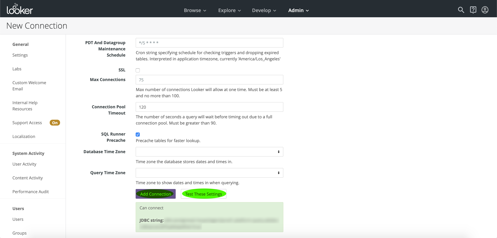

# Anslut med Looker

Följ stegen nedan för att ansluta Looker till Adobe Query Service på Adobe Experience Platform:

När du har loggat in på Looker klickar du på **Admin**, följt av **Anslutningar**.

På den här sidan klickar du på **Ny anslutning**.

Härifrån kan du fylla i informationen för anslutningsinställningarna.

- **Namn:** Namnet på anslutningen.
- **Dialekt:** Den dialekt som används för SQL-databasen. Frågetjänsten använder **PostgreSQL**.
- **Värd och port:** Värdslutpunkten och dess port för Query Service.
- **Databas:** Databasen som ska användas.
- **Användarnamn och lösenord:** De inloggningsuppgifter som ska användas. Användarnamnet kommer att ha formatet `ORG_ID@AdobeOrg`.

>[!NOTE]
>
>Mer information om hur du hittar värd och port, databasnamn och inloggningsuppgifter finns på [inloggningssidan på Platform](https://platform.adobe.com/query/configuration). Logga in på Platform, klicka på **Frågor** och klicka sedan på **Autentiseringsuppgifter** för att hitta dina inloggningsuppgifter.

När du har angett anslutningsinformationen klickar du på **Testa de här inställningarna** för att kontrollera att inloggningsuppgifterna fungerar som de ska. Om de gör det visas ett meddelande om att du kan ansluta nedan. Om anslutningen lyckas klickar du på **Lägg till anslutning** för att skapa anslutningen.

## Nästa steg

Nu när du har anslutit till frågetjänsten kan du använda Looker för att skriva frågor. Mer information om hur du skriver och kör frågor finns i [frågeguiden](../creating-queries/creating-queries.md).