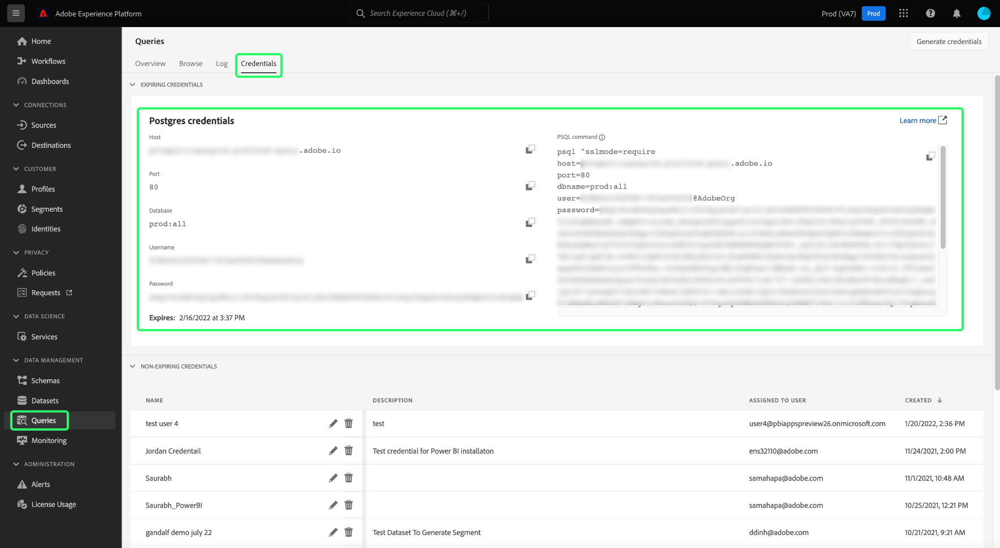

# Anslut [!DNL Power BI] till frågetjänst

Det här dokumentet innehåller stegen för anslutning [!DNL Power BI] Skrivbord med Adobe Experience Platform Query Service.

## Komma igång

Den här guiden kräver att du redan har tillgång till [!DNL Power BI] och känner till hur man navigerar i gränssnittet. För nedladdning [!DNL Power BI] Skrivbordet eller för mer information, se [officiell [!DNL Power BI] dokumentation](https://docs.microsoft.com/en-us/power-bi/).

>[!IMPORTANT]
>
> The [!DNL Power BI] datorprogrammet är **endast** som är tillgängliga på Windows-enheter.

Hämta nödvändiga autentiseringsuppgifter för anslutning [!DNL Power BI] för Experience Platform måste du ha tillgång till arbetsytan Frågor i användargränssnittet för plattformen. Kontakta IMS-organisationens administratör om du inte har tillgång till arbetsytan Frågor.

Efter installation [!DNL Power BI]måste du installera `Npgsql`, ett .NET-drivrutinspaket för PostgreSQL. Mer information om Npgsql finns i [Npgsql-dokumentation](https://www.npgsql.org/doc/index.html).

>[!IMPORTANT]
>
>Du måste hämta v4.0.10 eller tidigare, eftersom nyare versioner orsakar fel.

Under &quot;[!DNL Npgsql GAC Installation]&quot; på skärmen för anpassade inställningar väljer du **[!DNL Will be installed on local hard drive]**.

För att säkerställa att Npgsql har installerats korrekt måste du starta om datorn innan du fortsätter till nästa steg.

## Anslut [!DNL Power BI] till frågetjänst {#connect-power-bi}

Ansluta [!DNL Power BI] till frågetjänst, öppna [!DNL Power BI] och markera **[!DNL Get Data]** i menyfliksområdet på den översta menyn.

![The [!DNL Power BI] hempanelen med Hämta data markerat.](../images/clients/power-bi/open-power-bi.png)

Ange &quot;[!DNL PostgreSQL]&quot; i sökfältet för att begränsa listan med datakällor. Under resultaten som visas väljer du **[!DNL PostgreSQL database]**, följt av **[!DNL Connect]**.

![Dialogrutan Hämta data med [!DNL PostgreSQL] databas och Connect är markerade.](../images/clients/power-bi/get-data.png)

The [!DNL PostgreSQL] Databasdialogrutan visas där värden begärs för servern och databasen. Dessa värden hämtas från dina Adobe Experience Platform-uppgifter. Logga in på användargränssnittet för plattformen och välj **[!UICONTROL Queries]** från vänster navigering, följt av **[!UICONTROL Credentials]**. Mer information om hur du hittar databasnamn, värd, port och inloggningsuppgifter finns i [inloggningsguide](../ui/credentials.md).

För **[!DNL Server]** i Power BI anger du värdet för värddatorn som finns i avsnittet med autentiseringsuppgifter för frågetjänsten. Lägg till port för produktion `:80` till slutet av värdsträngen. Exempel, `made-up.platform-query.adobe.io:80`.

The **[!DNL Database]** -fältet kan vara antingen&quot;all&quot; eller ett datamängdstabellnamn. Exempel, `prod:all`.

>[!IMPORTANT]
>
>Kapslade datastrukturer i BI-verktyg från tredje part kan förenklas för att förbättra användbarheten och minska den arbetsbelastning som krävs för att hämta, analysera, omvandla och rapportera data. Läs dokumentationen på[`FLATTEN` funktion](../best-practices/flatten-nested-data.md) för instruktioner om hur du aktiverar den här inställningen vid anslutning till en databas.

![The [!DNL Power BI] kontrollpanelen med server- och databasindatafälten markerade.](../images/clients/power-bi/postgresql-database-dialog.png)

### Dataanslutningsläge

Nu kan du välja **[!DNL Data Connectivity mode]**. Välj **[!DNL Import]** följt av **[!DNL OK]** om du vill visa en lista över alla tillgängliga tabeller, eller väljer **[!DNL DirectQuery]** att fråga datakällan direkt utan att importera eller kopiera data direkt till [!DNL Power BI].

Mer information om **[!DNL Import]** mode, please read the section on [importera en tabell](#import). Mer information om **[!DNL DirectQuery]** mode, please read the section on [fråga en datauppsättning utan att importera data](#direct-query).

Välj **[!DNL OK]** när du har bekräftat databasinformationen.

![The [!DNL PostgreSQL] databasdialogrutan med Data Connectivity-läget markerat.](../images/clients/power-bi/connectivity-mode.png)

### Autentisering

En fråga om ditt användarnamn, lösenord och programinställningar visas. Användarnamnet är i det här fallet ditt företags-ID och lösenordet är din autentiseringstoken. Båda finns på sidan med autentiseringsuppgifter för frågetjänsten.

Fyll i dessa uppgifter och välj **[!DNL Connect]** för att fortsätta till nästa steg.

## Importera en tabell {#import}

Genom att välja **[!DNL Import]** [!DNL Data Connectivity mode]importeras hela datauppsättningen så att du kan använda de markerade tabellerna och kolumnerna i [!DNL Power BI] persondatorprogrammet i befintligt skick.

>[!IMPORTANT]
>
>Om du vill se dataändringar som har gjorts sedan den första importen måste du uppdatera data i [!DNL Power BI] genom att importera hela datauppsättningen igen.

Om du vill importera en tabell anger du server- och databasinformation [enligt ovan](#connect-power-bi) och väljer **[!DNL Import]** [!DNL Data Connectivity mode], följt av **[!DNL OK]**. En dialogruta med en lista över alla tillgängliga tabeller visas. Markera tabellen som du vill förhandsgranska, följt av **[!DNL Load]** för att föra in datauppsättningen i Power BI.

Tabellen importeras nu till [!DNL Power BI].

![The [!DNL Power BI] kontrollpanelen med instruktioner om hur du skapar anpassade visualiseringar markerade.](../images/clients/power-bi/import-table.png)

### Importera tabeller med anpassad SQL

[!DNL Power BI] och andra tredjepartsverktyg som Tableau tillåter för närvarande inte användare att importera kapslade objekt, som XDM-objekt i Platform. För att ta hänsyn till detta [!DNL Power BI] gör att du kan använda anpassad SQL för att komma åt dessa kapslade fält och skapa en förenklad vy av data. [!DNL Power BI] läser sedan in den förenklade vyn av tidigare kapslade data som en normal tabell.

Från [!DNL PostgreSQL] databaspotens, markera **[!DNL Advanced options]** för att ange en anpassad SQL-fråga i **[!DNL SQL statement]** -avsnitt. Den här anpassade frågan bör användas för att förenkla JSON-par med namn och värde till ett tabellformat.

![The [!DNL PostgreSQL] databasdialogrutan med avancerade alternativ markerade för dataanslutningsläget. Med dessa kan du skapa en anpassad SQL-sats.](../images/clients/power-bi/custom-sql-statement.png)

När du har angett en egen fråga väljer du **[!DNL OK]** för att fortsätta ansluta databasen. Se [autentisering](#authentication) om du vill ha vägledning om hur du ansluter en databas från den här delen av arbetsflödet ovan.

När autentiseringen är klar visas en förhandsgranskning av de förenklade data som finns i [!DNL Power BI] Kontrollpanel för datorer som en tabell. Servern och databasnamnet visas högst upp i dialogrutan. Välj **[!DNL Load]** för att slutföra importprocessen.

![En visualisering av en förenklad, importerad tabell i [!DNL Power BI] kontrollpanel.](../images/clients/power-bi/imported-table-preview.png)

Visualiseringarna är nu tillgängliga för redigering och export från [!DNL Power BI] Skrivbordsapp.

## Fråga datauppsättningen utan att importera data {#direct-query}

The **[!DNL DirectQuery]** [!DNL Data Connectivity mode] frågar datakällan direkt utan att importera eller kopiera data till [!DNL Power BI] Skrivbord. I det här anslutningsläget kan du uppdatera alla visualiseringar med aktuella data via gränssnittet. Den tid som krävs för att skapa eller uppdatera visualiseringen varierar dock beroende på den underliggande datakällans prestanda.

Om du vill använda [!DNL Data Connectivity mode]väljer du **[!DNL DirectQuery]** växla sedan **[!DNL Advanced options]** för att ange en anpassad SQL-fråga i **[!DNL SQL statement]** -avsnitt. Kontrollera att **[!DNL Include relationship columns]** är markerat. När du har slutfört frågan väljer du **[!DNL OK]** för att fortsätta.

![The [!DNL PostgreSQL] databasdialogrutan med de inställningar som krävs för att använda Data Connectivity-läget markerat.](../images/clients/power-bi/direct-query-mode.png)

En förhandsgranskning av frågan visas. Välj **[!DNL Load]** för att se resultatet av frågan.

## Nästa steg

Genom att läsa det här dokumentet bör du nu förstå hur du ansluter till [!DNL Power BI] Datorprogrammet och de olika dataanslutningslägena som är tillgängliga. Mer information om hur du skriver och kör frågor finns i [riktlinjer för frågekörning](../best-practices/writing-queries.md).
