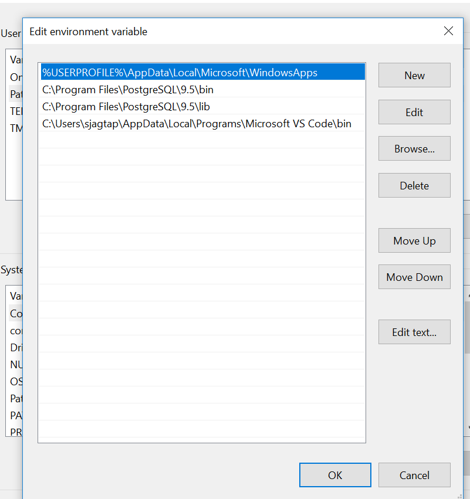

# Anslut med PSQL

PSQL är ett kommandoradsgränssnitt som medföljer när du installerar [!DNL Postgres] på datorn. Du kan installera det genom att följa dessa anvisningar.

## Installera Postgres på en Mac

Öppna ett terminalfönster och skicka följande tre kommandon:

```shell
/usr/bin/ruby -e "$(curl -fsSL https://raw.githubusercontent.com/Homebrew/install/master/install)"
```

```shell
brew install postgres
```

```shell
which psql
```

När du har skapat dessa kommandon bör du se följande:

```shell
/usr/local/bin/psql
```

## Installera [!DNL Postgres] på en dator

Hämta och installera [!DNL Postgres] från den här [platsen](https://www.postgresql.org/download/windows/).

Redigera din sökvägsvariabel:



Lägg till de två rader som visas och som innehåller &quot;[!DNL Postgres]&quot;.

Spara uppdateringarna, öppna en kommandotolk och skriv:

```shell
psql -V
```

Du borde se något liknande:

```shell
psql (PostgreSQL) 9.5.14
```

## Anslut PSQL och [!DNL Query Service]

Återgå till [!DNL Platform] gränssnittet på **[!UICONTROL Connect BI Tools]** sidan.

Klicka **[!UICONTROL copy]** för **[!UICONTROL PSQL Command]**.


>[!IMPORTANT]
>
>Om du är på en dator använder du en textredigerare för att ta bort radbrytningarna i kommandosträngen och kopierar sedan strängen.

Klistra in kommandosträngen i ett terminal- eller kommandofönster och tryck på Retur.

Du bör se följande resultat:

```shell
psql (10.5, server 0.1.0)
SSL connection (protocol: TLSv1.2, cipher: ECDHE-RSA-AES256-GCM-SHA384, bits: 256, compression: off)
Type "help" for help.
all=>
```

Om du inte ser minst version 10.5 måste du ladda ned den versionen eller senare.