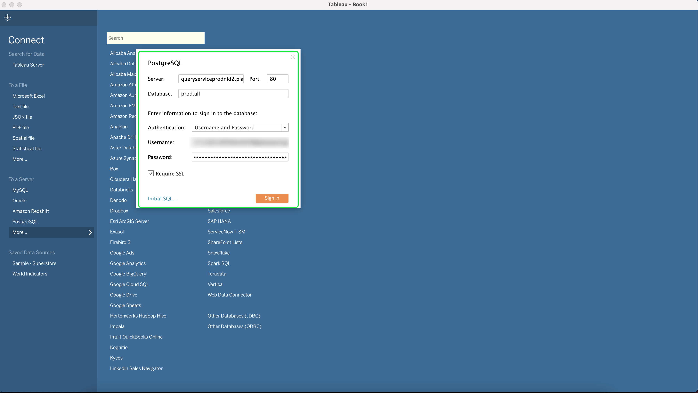

# Anslut [!DNL Tableau] till frågetjänsten

Det här dokumentet innehåller stegen för att ansluta Tablet PC med Adobe Experience Platform [!DNL Query Service].

>[!NOTE]
>
> Den här handboken förutsätter att du redan har tillgång till [!DNL Tableau] och är bekant med hur du navigerar i dess gränssnitt. Mer information om [!DNL Tableau] finns i [officiell [!DNL Tableau] dokumentation](https://help.tableau.com/current/pro/desktop/en-us/default.htm).

Om du vill ansluta [!DNL Tableau] till [!DNL Query Service] öppnar du [!DNL Tableau] och i avsnittet **[!DNL To a Server]** väljer du **[!DNL More]** följt av **[!DNL PostgreSQL]**

Nu kan du ange värden som ska kopplas till Adobe Experience Platform. Mer information om hur du hittar databasnamn, värd, port och inloggningsuppgifter finns på sidan [inloggningsuppgifter på Platform](https://platform.adobe.com/query/configuration). Logga in på [!DNL Platform] och välj **[!UICONTROL Queries]** följt av **[!UICONTROL Credentials]** för att hitta dina inloggningsuppgifter.

Kontrollera att du har markerat rutan **[!UICONTROL SSL Required]** innan du försöker ansluta.

När du har fyllt i alla dina inloggningsuppgifter väljer du **[!DNL Sign In]** för att fortsätta.

Du har nu anslutit till Adobe Experience Platform, med en lista över tabellerna på sidan.

## Nästa steg

Nu när du är ansluten till [!DNL Query Service] kan du använda [!DNL Tableau] för att skriva frågor. Mer information om hur du skriver och kör frågor finns i guiden [kör frågor](../best-practices/writing-queries.md).