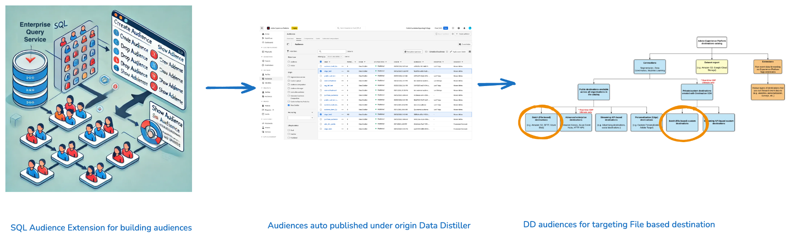

# Bygg målgrupper med SQL

Använd SQL-målgruppstillägget för att bygga målgrupper med data från datasjön, inklusive befintliga dimensionsenheter (som kundattribut eller produktinformation).

Om du använder det här SQL-tillägget förbättras möjligheten att skapa målgrupper eftersom du inte behöver rådata i dina profiler när du definierar målgruppssegment. Publiker som skapas med den här metoden registreras automatiskt på arbetsytan för målgrupper, där du kan rikta dem ytterligare mot filbaserade mål.



Det här dokumentet beskriver hur du använder SQL-målgruppstillägget i Adobe Experience Platform Data Distiller för att skapa, hantera och publicera målgrupper med hjälp av SQL-kommandon.

## Livscykel för att skapa målgrupper i Data Distiller {#audience-creation-lifecycle}

Följ de här stegen för att skapa, hantera och aktivera era målgrupper. Skapade målgrupper integreras smidigt i &#39;målgruppsflödet&#39; så att ni kan skapa segment från basmålgrupper och målfilsbaserade destinationer (till exempel CSV-överföringar eller molnlagringsplatser) för kundkontakt. &#39;Målgruppsflöde&#39; avser hela processen att skapa, hantera och aktivera målgrupper och säkerställa en smidig integrering mellan olika destinationer.

Som en del av ditt målgruppsflöde använder du följande SQL-kommandon för att [skapa](#create-audience), [ändra](#add-profiles-to-audience) och [ta bort](#delete-audience) målgrupper i Adobe Experience Platform.

### Skapa en målgrupp {#create-audience}

Använd kommandot `CREATE AUDIENCE AS SELECT` för att definiera en ny målgrupp. Den skapade målgruppen sparas i en datauppsättning och registreras på arbetsytan [!UICONTROL Audiences] under Data Distiller.

```sql
CREATE AUDIENCE table_name  
WITH (primary_identity='IdentitycolName', identity_namespace='Namespace for the identity used', [schema='target_schema_title'])
AS (select_query)
```

**Parametrar**

Använd de här parametrarna för att definiera frågan för att skapa SQL-målgrupper:

| Parameter | Beskrivning |
|--------------------|------------------------------------------------------------------|
| `schema` | Valfritt. Definierar XDM-schemat för den datauppsättning som skapas av frågan. |
| `table_name` | Namnet på tabellen och målgruppen. |
| `primary_identity` | Anger den primära identitetskolumnen för målgruppen. |
| `identity_namespace` | Identitetens namnområde. Du kan använda ett befintligt namnutrymme eller skapa ett nytt. Om du vill visa tillgängliga namnutrymmen använder du kommandot `SHOW NAMESPACES`. Använd `CREATE NAMESPACE` om du vill skapa ett nytt namnområde. Till exempel: `CREATE NAMESPACE lumaCrmId WITH (code='testns', TYPE='Email')`. |
| `select_query` | En SELECT-sats som definierar målgruppen. Syntaxen för SELECT-frågan finns i avsnittet [SELECT-frågor](../sql/syntax.md#select-queries). |

{style="table-layout:auto"}

>[!NOTE]
>
>Om du vill ha större flexibilitet för komplexa datastrukturer kan du kapsla in berikade attribut när du definierar målgrupper. Utökade attribut, som `orders`, `total_revenue`, `recency`, `frequency` och `monetization`, kan användas för att filtrera målgrupper efter behov.

**Exempel:**

I följande exempel visas hur du strukturerar frågan för att skapa en SQL-målgrupp:

```sql
CREATE Audience aud_test
WITH (primary_identity=userId, identity_namespace=lumaCrmId)
AS SELECT userId, orders, total_revenue, recency, frequency, monetization FROM profile_dim_customer;
```

I det här exemplet identifieras kolumnen `userId` som identitetskolumn och ett lämpligt namnutrymme (`lumaCrmId`) tilldelas. De återstående kolumnerna (`orders`, `total_revenue`, `recency`, `frequency` och `monetization`) är berikade attribut som ger ytterligare kontext för målgruppen.

**Begränsningar:**

Tänk på följande begränsningar när du använder SQL för att skapa målgrupper:

- Den primära identitetskolumnen **måste** vara på den högsta nivån i datauppsättningen, utan att vara kapslad i andra attribut eller kategorier.
- Externa målgrupper som skapats med SQL-kommandon har en kvarhållningsperiod på 30 dagar. Efter 30 dagar raderas dessa målgrupper automatiskt, vilket är en viktig faktor för att planera strategier för målgruppshantering.

### Lägga till profiler till en befintlig målgrupp {#add-profiles-to-audience}

Använd kommandot `INSERT INTO` för att lägga till profiler (eller hela målgrupper) till en befintlig målgrupp.

```sql
INSERT INTO table_name
SELECT select_query
```

**Parametrar**

Tabellen nedan förklarar de parametrar som krävs för kommandot `INSERT INTO`:

| Parameter | Beskrivning |
|----------------|--------------------------------------------------------------------------------|
| `table_name` | Namnet på den tabell som skapades som en del av kommandot Skapa målgrupp. |
| `select_query` | EN SELECT-sats. Syntaxen för SELECT-frågan finns i SELECT-frågeavsnittet. |

{style="table-layout:auto"}

**Exempel:**

I följande exempel visas hur du lägger till profiler till en befintlig publik med kommandot `INSERT INTO`:

```sql
INSERT INTO Audience aud_test
SELECT userId, orders, total_revenue, recency, frequency, monetization FROM customer_ds;
```

### Exempel på publik i RFM-modell {#rfm-model-audience-example}

I följande exempel visas hur du skapar en målgrupp med hjälp av modellen Recency, Frequency och Monetization (RFM). I det här exemplet segmenteras kunder baserat på deras senaste, frekventa och intäktsgenereringspoäng för att identifiera nyckelgrupper, som lojala kunder, nya kunder och värdefulla kunder.

<!--  Q) Since the focus of this document is on external audiences, or should I just include this temporarily? We could simply provide a link to the separate RFM modeling documentation rather than including the full example here. (Add link to new RFM document when it is published) -->

Följande fråga skapar ett schema för RFM-målgruppen. Programsatsen ställer in fält för kundinformation som `userId`, `days_since_last_purchase`, `orders`, `total_revenue` och så vidare.

```sql
CREATE Audience adls_rfm_profile
WITH (primary_identity=userId, identity_namespace=lumaCrmId) AS
SELECT
    cast(NULL AS string) userId,
    cast(NULL AS integer) days_since_last_purchase,
    cast(NULL AS integer) orders,
    cast(NULL AS decimal(18,2)) total_revenue,
    cast(NULL AS integer) recency,
    cast(NULL AS integer) frequency,
    cast(NULL AS integer) monetization,
    cast(NULL AS string) rfm_model
WHERE false;
```

Fyll i målgruppen med kunddata och segmentera profilerna baserat på deras RFM-poäng. I SQL-satsen nedan används funktionen `NTILE(4)` för att rangordna kunder i kvartiler baserat på deras RFM-poäng (Recency, Frequency, Monetization). Dessa poäng kategoriserar kunderna i sex segment, t.ex.&quot;Core&quot;,&quot;Loyal&quot; och&quot;Whales&quot;. Den segmenterade kundinformationen infogas sedan i målgruppstabellen `adls_rfm_profile`.&quot;

```sql
INSERT INTO Audience adls_rfm_profile
SELECT
    userId,
    days_since_last_purchase,
    orders,
    total_revenue,
    recency,
    frequency,
    monetization,
    CASE
        WHEN Recency=1 AND Frequency=1 AND Monetization=1 THEN '1. Core - Your Best Customers'
        WHEN Recency IN(1,2,3,4) AND Frequency=1 AND Monetization IN (1,2,3,4) THEN '2. Loyal - Your Most Loyal Customers'
        WHEN Recency IN(1,2,3,4) AND Frequency IN (1,2,3,4) AND Monetization=1 THEN '3. Whales - Your Highest Paying Customers'
        WHEN Recency IN(1,2,3,4) AND Frequency IN(1,2,3) AND Monetization IN(2,3,4) THEN '4. Promising - Faithful Customers'
        WHEN Recency=1 AND Frequency=4 AND Monetization IN (1,2,3,4) THEN '5. Rookies - Your Newest Customers'
        WHEN Recency IN (2,3,4) AND Frequency=4 AND Monetization IN (1,2,3,4) THEN '6. Slipping - Once Loyal, Now Gone'
    END AS rfm_model
FROM (
    SELECT
        userId,
        days_since_last_purchase,
        orders,
        total_revenue,
        NTILE(4) OVER (ORDER BY days_since_last_purchase) AS recency,
        NTILE(4) OVER (ORDER BY orders DESC) AS frequency,
        NTILE(4) OVER (ORDER BY total_revenue DESC) AS monetization
    FROM (
        SELECT
            userid,
            DATEDIFF(current_date, MAX(purchase_date)) AS days_since_last_purchase,
            COUNT(purchaseid) AS orders,
            CAST(SUM(total_revenue) AS double) AS total_revenue
        FROM (
            SELECT DISTINCT
                ENDUSERIDS._EXPERIENCE.EMAILID.ID AS userid,
                commerce.`ORDER`.purchaseid AS purchaseid,
                commerce.`ORDER`.pricetotal AS total_revenue,
                TO_DATE(timestamp) AS purchase_date
            FROM sample_data_for_ootb_templates
            WHERE commerce.`ORDER`.purchaseid IS NOT NULL
        ) AS b
        GROUP BY userId
    )
);
```

### Ta bort en målgrupp (DROP AUDIENCE) {#delete-audience}

Använd kommandot `DROP AUDIENCE` om du vill ta bort en befintlig målgrupp. Om målgruppen inte finns inträffar ett undantag om inte `IF EXISTS` anges.

```sql
DROP AUDIENCE [IF EXISTS] [db_name.]table_name
```

**Parametrar**

Tabellen innehåller de parametrar som krävs för kommandot `DROP AUDIENCE`:

| Parameter | Beskrivning |
|----------------|----------------------------------------------------------------------------------------|
| `IF EXISTS` | Valfritt. Om detta anges genereras inget undantag om tabellen inte hittas. |
| `db_name` | Anger den datagrupp som används för att kvalificera målgruppsdatauppsättningen. |
| `table_name` | Namnet på den tabell som skapades som en del av kommandot Skapa målgrupp. |

{style="table-layout:auto"}

**Exempel:**

I följande exempel visas hur du tar bort en målgrupp med kommandot DROP AUDIENCE:

```sql
DROP AUDIENCE IF EXISTS aud_test;
```

### Automatisk registrering och tillgänglighet {#registration-and-availability}

Publiker som skapas med SQL-tillägget registreras automatiskt under Data Distiller [!UICONTROL Origin] på målarbetsytan. När de väl har registrerats är dessa målgrupper tillgängliga för målgruppsanpassning på filbaserade destinationer, vilket förbättrar segmenterings- och målinriktningsstrategier. Denna process kräver ingen ytterligare konfiguration, vilket effektiviserar målgruppshanteringen. Mer information om hur du visar, hanterar och skapar målgrupper i användargränssnittet i Experience Platform finns i [Översikt över målportalen](../../segmentation/ui/audience-portal.md).

<!-- Q) Do you know how long it takes for the audience to register? This info would help manage user expectations. -->


## Aktivera målgrupper för destinationer {#activate-audiences}

Aktivera era målgrupper genom att rikta dem mot valfritt filbaserat mål, till exempel [!DNL Amazon S3], [!DNL SFTP] eller [!DNL Azure Blob]. De berikade målgruppsattributen är tillgängliga för ytterligare finjustering och filtrering efter behov.


## Förklara funktioner {#faqs}

I det här avsnittet behandlas vanliga frågor om hur du skapar och hanterar externa målgrupper med hjälp av SQL i Data Distiller.

**Frågor**:

- Stöds målgruppsgenerering endast för platta datauppsättningar?

+++Svar

För närvarande är målgruppsframtagningen begränsad till platta (rotnivå) attribut när målgruppen definieras.

+++

- Skapar målgruppen en enda datauppsättning eller flera datauppsättningar, eller varierar den beroende på konfigurationen?

+++Svar

Det finns en 1:1-mappning mellan en målgrupp och en datauppsättning.

+++

- Markeras datauppsättningen som skapades när målgrupper skapades för profil?

+++Svar

Nej, datauppsättningen som skapades när målgrupper skapades markeras inte för Profil.

+++

- Skapas datauppsättningen på datasjön?

+++Svar

Ja, den datauppsättning som är associerad med målgruppen skapas på datasjön. Attributen från den här datauppsättningen är tillgängliga i Audience Composer och målflödet som förhöjda attribut.

+++

- Är attributen i målgruppen begränsade till gruppfilsbaserade mål för företag? (Ja eller Nej)

+++Svar

Nej. Utökade attribut för målgruppen kan användas både i grupper och på filbaserade destinationer. Om du råkar ut för ett fel som&quot;Följande segment-ID:n har namnutrymmen som inte tillåts för det här målet: e917f626-a038-42f7-944c-xyxyx&quot; skapar du ett nytt segment i Data Distiller och använder det med alla tillgängliga mål.

+++

- Kan jag skapa en målgrupp som använder en Data Distiller-målgrupp?

+++Svar

Ja, ni kan skapa en målgrupp som använder en Data Distiller-målgrupp.

+++

- Visas de här målgrupperna i Adobe Journey Optimizer? Om inte, vad händer när jag skapar en ny publik i regelbyggaren som inkluderar alla medlemmar i den här publiken?

+++Svar

Data som Distiller-målgrupper finns också i Adobe Journey Optimizer. Du kan använda Data Distiller-målgrupper i Adobe Journey Optimizer och filtrera resultaten baserat på de berikade attributen.

+++

- Tar Data Distiller-målgrupper bort var 30:e dag eftersom de är externa målgrupper?

+++Svar

Ja, Distiller målgrupper tas bort var 30:e dag eftersom de är externa målgrupper.

+++

## Nästa steg

När du har läst det här dokumentet har du lärt dig att använda SQL-målgruppstillägget i Data Distiller för att skapa, hantera och publicera målgrupper effektivt med hjälp av SQL-kommandon. Nu kan ni anpassa målgruppsdefinitioner baserat på era unika affärskrav och aktivera dem på olika destinationer, optimera era era marknadsföringsstrategier och datadrivna beslut.

Därefter kan du läsa följande dokumentation för att vidareutveckla och optimera dina Experience Platform strategier för målgruppshantering:

- **Utforska målgruppsutvärdering**: Lär dig mer om [målgruppsutvärderingsmetoderna i Adobe Experience Platform](../../segmentation/home.md#evaluate-segments): direktuppspelningssegmentering för realtidsuppdateringar, batchsegmentering för schemalagd bearbetning eller behovsbaserad bearbetning och kantsegmentering för direktutvärdering i Edge Network.
- **Integrera med mål**: Läs guiden om hur du [exporterar filer på begäran till gruppmål](../../destinations/ui/export-file-now.md) med hjälp av användargränssnittet för Experience Platform-destinationer.
- **Granska målgruppsprestanda**: Analysera hur dina SQL-definierade målgrupper fungerar i olika kanaler. Använd datainsikter för att justera och förbättra era målgruppsdefinitioner och målinriktningsstrategier. Läs dokumentet om [målgruppsinsikter](../../dashboards/insights/audiences.md) om du vill veta hur du får tillgång till och kan anpassa SQL-frågor för målgruppsinsikter i Adobe Real-Time CDP. Sedan kan ni skapa egna insikter och omvandla rådata till användbar information genom att anpassa Publikkontrollpanelen för att effektivt visualisera och använda dessa insikter för bättre beslutsfattande.

