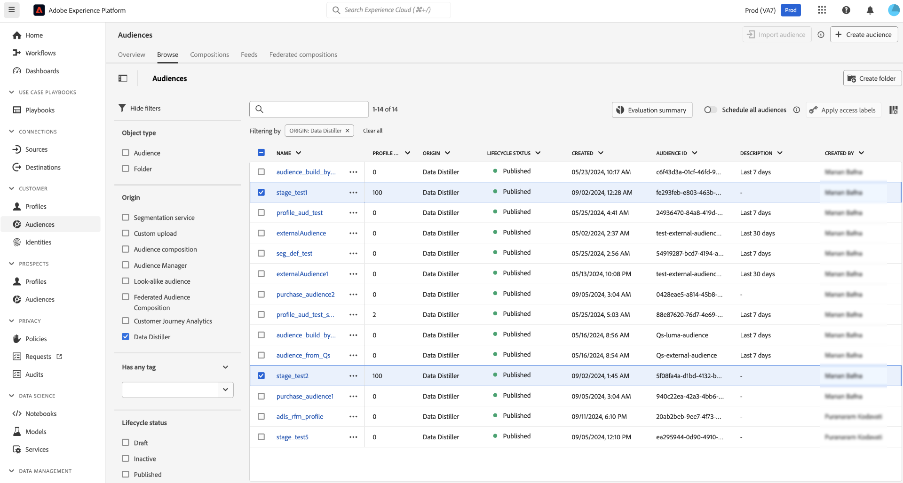

# Bygg målgrupper med SQL

Det här dokumentet beskriver hur du använder SQL-målgruppstillägget i Adobe Experience Platform Data Distiller för att skapa, hantera och publicera målgrupper med hjälp av SQL-kommandon.

Använd SQL-målgruppstillägget för att bygga målgrupper med data från datarjön, inklusive befintliga dimensionsenheter. Med det här tillägget kan du definiera målgruppssegment direkt med hjälp av SQL, vilket ger flexibilitet utan att du behöver ha rådata i dina profiler. Publiker som skapas med den här metoden registreras automatiskt på arbetsytan för målgrupper, där du kan rikta dem ytterligare mot filbaserade mål.


## Livscykel för att skapa målgrupper i Data Distiller {#audience-creation-lifecycle}

Följ de här stegen för att effektivt hantera era målgrupper. Skapade målgrupper integreras smidigt i målgruppsflödet så att ni kan skapa segment från dessa basmålgrupper och målfilsbaserade destinationer för kundanpassning. Använd följande SQL-kommandon för att [skapa](#create-audience), [ändra](#add-profiles-to-audience) och [ta bort](#delete-audience) målgrupper inom Adobe Experience Platform.

### Skapa en målgrupp {#create-audience}

Använd kommandot `CREATE AUDIENCE AS SELECT` för att definiera en ny målgrupp. Den skapade målgruppen sparas i en datauppsättning och registreras på arbetsytan [!UICONTROL Audiences] under Data Distiller.

```sql
CREATE AUDIENCE table_name  
WITH (primary_identity='IdentitycolName', identity_namespace='Namespace for the identity used', [schema='target_schema_title']) 
AS (select_query)
```

**Parametrar**

Använd de här parametrarna för att definiera frågan för att skapa SQL-målgrupper:

| Parameter | Beskrivning |
|--------------------|------------------------------------------------------------------|
| `schema` | Valfritt. Definierar XDM-schemat för den datauppsättning som skapas av frågan. |
| `table_name` | Namnet på tabellen och målgruppen. |
| `primary_identity` | Anger den primära identitetskolumnen för målgruppen. |
| `identity_namespace` | Identitetens namnområde. |
| `select_query` | En SELECT-sats som definierar målgruppen. Syntaxen för SELECT-frågan finns i avsnittet [SELECT-frågor](../sql/syntax.md#select-queries). |

{style="table-layout:auto"}

**Exempel:**

I följande exempel visas hur du strukturerar frågan för att skapa en SQL-målgrupp:

```sql
CREATE Audience aud_test 
WITH (primary_identity=month, identity_namespace=queryService) 
AS SELECT month FROM profile_dim_date LIMIT 5;
```

**Begränsningar:**

Tänk på följande begränsningar när du använder SQL för att skapa målgrupper:

- Den primära identitetskolumnen **måste** finnas på rotnivån.
- Nya grupper skriver över befintliga datauppsättningar. Funktionen för att lägga till stöds inte för närvarande.
- Kapslade attribut stöds för närvarande inte.

### Lägg till profiler till en befintlig målgrupp {#add-profiles-to-audience}

Använd kommandot `INSERT INTO` för att lägga till profiler till en befintlig målgrupp.

```sql
INSERT INTO table_name 
SELECT select_query
```

**Parametrar**

Tabellen nedan förklarar de parametrar som krävs för kommandot `INSERT INTO`:

| Parameter | Beskrivning |
|----------------|--------------------------------------------------------------------------------|
| `table_name` | Namnet på den tabell som skapades som en del av kommandot Skapa målgrupp. |
| `select_query` | EN SELECT-sats. Syntaxen för SELECT-frågan finns i SELECT-frågeavsnittet. |

{style="table-layout:auto"}

**Exempel:**

I följande exempel visas hur du lägger till profiler till en befintlig publik med kommandot `INSERT INTO`:

```sql
INSERT INTO Audience aud_test 
SELECT month FROM profile_dim_date LIMIT 10;
```

### Ta bort en målgrupp (DROP AUDIENCE) {#delete-audience}

Använd kommandot `DROP AUDIENCE` om du vill ta bort en befintlig målgrupp. Om målgruppen inte finns inträffar ett undantag om inte `IF EXISTS` anges.

```sql
DROP AUDIENCE [IF EXISTS] [db_name.]table_name
```

**Parametrar**

Tabellen innehåller de parametrar som krävs för kommandot `DROP AUDIENCE`:

| Parameter | Beskrivning |
|----------------|----------------------------------------------------------------------------------------|
| `IF EXISTS` | Valfritt. Om detta anges genereras inget undantag om tabellen inte hittas. |
| `db_name` | Anger den datagrupp som används för att kvalificera målgruppsdatauppsättningen. |
| `table_name` | Namnet på den tabell som skapades som en del av kommandot Skapa målgrupp. |

{style="table-layout:auto"}

**Exempel:**

I följande exempel visas hur du tar bort en målgrupp med kommandot DROP AUDIENCE:

```sql
DROP AUDIENCE IF EXISTS aud_test;
```

### Publicera målgrupper automatiskt {#auto-publish-audiences}

Publiker som har skapats med SQL-tillägget registreras automatiskt under Data Distiller i målarbetsytan. När de väl har registrerats är dessa målgrupper tillgängliga för målinriktning och kan användas i filbaserade destinationer, vilket förbättrar er segmentering och era strategier för målinriktning.



## Aktivera målgrupper för destinationer {#activate-audiences}

Aktivera era målgrupper genom att rikta dem mot valfritt filbaserat mål, till exempel [!DNL Amazon S3], [!DNL SFTP] eller [!DNL Azure Blob]. De berikade målgruppsattributen är tillgängliga för ytterligare finjustering och filtrering efter behov.


## Förklara funktioner {#faqs}

I det här avsnittet behandlas vanliga frågor om hur du skapar och hanterar externa målgrupper med hjälp av SQL i Data Distiller.

+++Välj för att visa frågor och svar

**Frågor**:

- Stöds målgruppsgenerering endast för platta datauppsättningar?

+++Svar

Kapslade datauppsättningar stöds också, men endast platta attribut är tillgängliga i målgruppen.

+++

- Skapar målgruppen en enda datauppsättning eller flera datauppsättningar, eller varierar den beroende på konfigurationen?

+++Svar

Det finns en 1:1-mappning mellan en målgrupp och en datauppsättning.

+++

- Markeras datauppsättningen som skapades när målgrupper skapades för profil?

+++Svar

Nej, datauppsättningen som skapades när målgrupper skapades markeras inte för Profil.

+++

- Skapas datauppsättningen på datasjön?

+++Svar

Ja, datauppsättningen skapas på datasjön.

+++

- Är attributen i målgruppen begränsade till att endast användas i gruppfilsbaserade mål för företag? (Ja eller Nej)

+++Svar

Ja, attribut i målgruppen är begränsade till att endast användas i gruppfilsbaserade mål för företag.

+++

- Kan jag skapa en målgrupp som använder en Data Distiller-målgrupp?

+++Svar

Ja, ni kan skapa en målgrupp som använder en Data Distiller-målgrupp.

+++

- Visas de här målgrupperna i Adobe Journey Optimizer? Om inte, vad händer när jag skapar en ny publik i regelbyggaren som inkluderar alla medlemmar i den här publiken?

+++Svar

Målgrupper som framställer data är inte tillgängliga i Adobe Journey Optimizer. Du måste skapa en ny målgrupp i Adobe Journey Optimizer regelbyggare för att den ska vara tillgänglig i Adobe Journey Optimizer.

+++

- Hur ska jag skapa två Data Distiller-målgrupper med olika scheman? Hur många datauppsättningar som skapas och markeras de för profil?

+++Svar

Två datauppsättningar skapas eftersom varje målgrupp har en underliggande datauppsättning. Dessa datauppsättningar är dock inte markerade som Profil. De två datauppsättningarna hanteras enligt sina egna individuella scheman.

+++

- Hur tar jag bort en publik?

+++Svar

Om du vill ta bort en målgrupp kan du använda kommandot [`DROP AUDIENCE`](#delete-audience) i kommandoradsgränssnittet eller använda snabbåtgärderna på arbetsytan [Publiker](../../segmentation/ui/audience-portal.md#quick-actions). Obs! Publiker som används i underordnade destinationer eller är beroende av andra målgrupper kan inte tas bort.

+++

- När jag publicerar en målgrupp till en profil, hur snart är den tillgänglig i segmentbyggargränssnittet och när blir den tillgänglig i Destinations?

+++Svar

När exporten av ögonblicksbilder är klar kan profiler ses i publiken.

+++

- Tar Data Distiller-målgrupper bort var 30:e dag eftersom de är externa målgrupper?

+++Svar

Ja, Distiller målgrupper tas bort var 30:e dag eftersom de är externa målgrupper.

+++

- Visas Data Distiller Audiences i publikinventeringen?

+++Svar

Ja, Data Distiller Audiences visas i publiklagret under det ursprungliga namnet Data Distiller.

+++

+++

## Nästa steg

När du har läst det här dokumentet har du lärt dig att använda SQL-målgruppstillägget i Data Distiller för att skapa, hantera och publicera målgrupper effektivt med hjälp av SQL-kommandon. Nu kan ni anpassa målgruppsdefinitioner baserat på era unika affärskrav och aktivera dem på olika destinationer, optimera era era marknadsföringsstrategier och datadrivna beslut.

Därefter kan du läsa följande dokumentation för att vidareutveckla och optimera era era strategier för målgruppshantering för plattformar:

- **Utforska målgruppsutvärdering**: Lär dig mer om [målgruppsutvärderingsmetoderna i Adobe Experience Platform](../../segmentation/home.md#evaluate-segments): direktuppspelningssegmentering för realtidsuppdateringar, batchsegmentering för schemalagd eller on demand-bearbetning samt kantsegmentering för direktutvärdering på Edge Network.
- **Integrera med mål**: Läs guiden om hur du [exporterar filer på begäran till gruppmål](../../destinations/ui/export-file-now.md) med hjälp av användargränssnittet för plattformsmål.
- **Granska målgruppsprestanda**: Analysera hur dina SQL-definierade målgrupper fungerar i olika kanaler. Använd datainsikter för att justera och förbättra era målgruppsdefinitioner och målinriktningsstrategier. Läs dokumentet om [målgruppsinsikter](../../dashboards/insights/audiences.md) om du vill veta hur du får tillgång till och kan anpassa SQL-frågor för målgruppsinsikter i Adobe Real-time Customer Data Platform. Sedan kan ni skapa egna insikter och omvandla rådata till användbar information genom att anpassa Publikkontrollpanelen för att effektivt visualisera och använda dessa insikter för bättre beslutsfattande.
