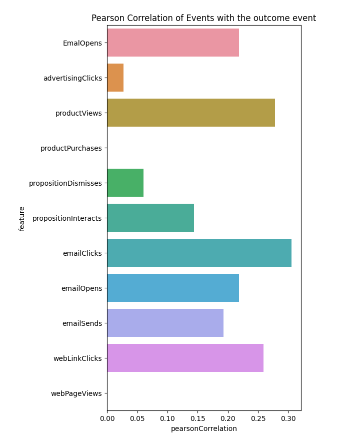

# Förberedande dataanalys

Det här dokumentet innehåller några grundläggande exempel och metodtips för att använda Data Distiller för att utforska och analysera data från en [!DNL Python] anteckningsbok.

## Komma igång

Kontrollera att du har skapat en anslutning till Data Distiller i [!DNL Python] anteckningsbok. I dokumentationen finns instruktioner om hur du [koppla en [!DNL Python] anteckningsbok till Data Distiller](./establish-connection.md).

## Hämta grundläggande statistik {#basic-statistics}

Använd koden nedan för att hämta antalet rader och distinkta profiler i en datauppsättning.

```python
table_name = 'ecommerce_events'

basic_statistics_query = f"""
SELECT
    COUNT(_id) as "totalRows",
    COUNT(DISTINCT _id) as "distinctUsers"
FROM {table_name}"""

df = qs_cursor.query(basic_statistics_query, output="dataframe")
df
```

**Exempelutdata**

|     | totalRows | clearUsers |
| --- | ----------- | -------------- |
| 0 | 1276563 | 1276563 |

## Skapa en provversion av stora datamängder {#create-dataset-sample}

Om den datauppsättning du vill fråga är mycket stor, eller om exakta resultat från undersökande frågor inte är nödvändiga, använder du [samplingsfunktion](../../key-concepts/dataset-samples.md) finns för frågor om Data Distiller. Detta är en tvåstegsprocess:

- Första, **analysera** datauppsättningen för att skapa en provversion med en angiven samplingsproportion
- Fråga sedan efter den samplade versionen av datauppsättningen. Beroende på vilka funktioner du använder för den samplade datauppsättningen kanske du vill skala utdata till siffrorna i hela datauppsättningen

### Skapa ett prov på 5 % {#create-sample}

Exemplet nedan analyserar datauppsättningen och skapar ett 5 %-prov:

```python
# A sampling rate of 10 is 100% in Query Service, so for 5% use a sampling rate 0.5
sampling_rate = 0.5

analyze_table_query=f"""
SET aqp=true;
ANALYZE TABLE {table_name} TABLESAMPLE SAMPLERATE {sampling_rate}"""

qs_cursor.query(analyze_table_query, output="raw")
```

### Visa dina exempel {#view-sample}

Du kan använda `sample_meta` för att visa alla exempel som har skapats från en viss datauppsättning. Kodfragmentet nedan visar hur du använder `sample_meta` funktion.

```python
sampled_version_of_table_query = f'''SELECT sample_meta('{table_name}')'''

df_samples = qs_cursor.query(sampled_version_of_table_query, output="dataframe")
df_samples
```

**Exempelutdata**:

|   | sample_table_name | sample_dataset_id | parent_dataset_id | sample_type | samplingsfrekvens | filter_condition_on_source_dataset | sample_num_rows | skapad |
|---|---|---|---|---|---|---|---|---|
| 0 | cmle_sync_data_experience_event_dataset_c.. | 650f7a09ed6c3e28d34d7fc2 | 64fb4d7a7d748828d304a2f4 | enhetlig | 0.5 | 6427 | 23/09/2023 | 11:51:37 |

{style="table-layout:auto"}

### Fråga ditt exempel {#query-sample-data}

Du kan skicka frågor direkt till exempeltabellen genom att referera till exempeltabellnamnet från returnerade metadata. Du kan sedan multiplicera resultatet med samplingsförhållandet för att få en uppskattning.

```python
sample_table_name = df_samples[df_samples["sampling_rate"] == sampling_rate]["sample_table_name"].iloc[0]

count_query=f'''SELECT count(*) as cnt from {sample_table_name}'''

df = qs_cursor.query(count_query, output="dataframe")
# Divide by the sampling rate to extrapolate to the full dataset
approx_count = df["cnt"].iloc[0] / (sampling_rate / 100)

print(f"Approximate count: {approx_count} using {sampling_rate *10}% sample")
```

**Exempelutdata**

```console
Approximate count: 1284600.0 using 5.0% sample
```

## E-posttrattanalys {#email-funnel-analysis}

En trattanalys är ett sätt att förstå de steg som krävs för att nå ett målresultat och hur många användare som får igenom varje steg. Exemplet nedan visar en enkel trattanalys av de steg som leder till att en användare prenumererar på ett nyhetsbrev. Prenumerationsresultatet representeras av en händelsetyp av `web.formFilledOut`.

Kör först en fråga för att hämta antalet användare i varje steg.

```python
simple_funnel_analysis_query = f'''SELECT eventType, COUNT(DISTINCT _id) as "distinctUsers",COUNT(_id) as "distinctEvents" FROM {table_name} GROUP BY eventType ORDER BY distinctUsers DESC'''

funnel_df = qs_cursor.query(simple_funnel_analysis_query, output="dataframe")
funnel_df
```

**Exempelutdata**

|   | eventType | clearUsers | clearEvents |
|---|---|---|---|
| 0 | directMarketing.emailSent | 598840 | 598840 |
| 1 | directMarketing.emailOpened | 239028 | 239028 |
| 2 | web.webpagedetails.pageViews | 120118 | 120118 |
| 3 | advertising.impressions | 119669 | 119669 |
| 4 | directMarketing.emailClicked | 51581 | 51581 |
| 5 | commerce.productViews | 37915 | 37915 |
| 6 | decisioning.propositionDisplay | 37650 | 37650 |
| 7 | web.webinteraction.linkClicks | 37581 | 37581 |
| 8 | web.formFilledOut | 17860 | 17860 |
| 9 | advertising.clicks | 7610 | 7610 |
| 10 | decisioning.propositionInteract | 2964 | 2964 |
| 11 | decisioning.propositionDismiss | 2889 | 2889 |
| 12 | commerce.purchases | 2858 | 2858 |

{style="table-layout:auto"}

### Resultat av ritningsfråga {#plot-results}

Därefter ritar du frågeresultaten med [!DNL Python] `plotly` bibliotek:

```python
import plotly.express as px

email_funnel_events = ["directMarketing.emailSent", "directMarketing.emailOpened", "directMarketing.emailClicked", "web.formFilledOut"]
email_funnel_df = funnel_df[funnel_df["eventType"].isin(email_funnel_events)]

fig = px.funnel(email_funnel_df, y='eventType', x='distinctUsers')
fig.show()
```

**Exempelutdata**


## Händelsekorrelationer {#event-correlations}

En annan vanlig analys är att beräkna korrelationer mellan händelsetyper och händelsetyp för målkonvertering. I det här exemplet representeras prenumerationshändelsen av `web.formFilledOut`. I det här exemplet används [!DNL Spark] funktioner som är tillgängliga i Data Distiller queries för att utföra följande steg:

1. Räkna antalet händelser för varje händelsetyp per profil.
2. Sammanställ antalet för varje händelsetyp i olika profiler och beräkna korrelationer för varje händelsetyp med `web,formFilledOut`.
3. Omvandla bildrutan med antal och korrelationer till en tabell med Pearson-korrelationskoefficienter för varje funktion (antal händelsetyper) med målhändelsen.
4. Visualisera resultatet i en teckning.

The [!DNL Spark] funktioner sammanställer data för att returnera en liten resultattabell, så att du kan köra den här typen av fråga på hela datauppsättningen.

```python
large_correlation_query=f'''
SELECT SUM(webFormsFilled) as webFormsFilled_totalUsers,
       SUM(advertisingClicks) as advertisingClicks_totalUsers,
       SUM(productViews) as productViews_totalUsers,
       SUM(productPurchases) as productPurchases_totalUsers,
       SUM(propositionDismisses) as propositionDismisses_totaUsers,
       SUM(propositionDisplays) as propositionDisplays_totaUsers,
       SUM(propositionInteracts) as propositionInteracts_totalUsers,
       SUM(emailClicks) as emailClicks_totalUsers,
       SUM(emailOpens) as emailOpens_totalUsers,
       SUM(webLinkClicks) as webLinksClicks_totalUsers,
       SUM(webPageViews) as webPageViews_totalusers,
       corr(webFormsFilled, emailOpens) as webForms_EmailOpens,
       corr(webFormsFilled, advertisingClicks) as webForms_advertisingClicks,
       corr(webFormsFilled, productViews) as webForms_productViews,
       corr(webFormsFilled, productPurchases) as webForms_productPurchases,
       corr(webFormsFilled, propositionDismisses) as webForms_propositionDismisses,
       corr(webFormsFilled, propositionInteracts) as webForms_propositionInteracts,
       corr(webFormsFilled, emailClicks) as webForms_emailClicks,
       corr(webFormsFilled, emailOpens) as webForms_emailOpens,
       corr(webFormsFilled, emailSends) as webForms_emailSends,
       corr(webFormsFilled, webLinkClicks) as webForms_webLinkClicks,
       corr(webFormsFilled, webPageViews) as webForms_webPageViews
FROM(
    SELECT _{tenant_id}.cmle_id as userID,
            SUM(CASE WHEN eventType='web.formFilledOut' THEN 1 ELSE 0 END) as webFormsFilled,
            SUM(CASE WHEN eventType='advertising.clicks' THEN 1 ELSE 0 END) as advertisingClicks,
            SUM(CASE WHEN eventType='commerce.productViews' THEN 1 ELSE 0 END) as productViews,
            SUM(CASE WHEN eventType='commerce.productPurchases' THEN 1 ELSE 0 END) as productPurchases,
            SUM(CASE WHEN eventType='decisioning.propositionDismiss' THEN 1 ELSE 0 END) as propositionDismisses,
            SUM(CASE WHEN eventType='decisioning.propositionDisplay' THEN 1 ELSE 0 END) as propositionDisplays,
            SUM(CASE WHEN eventType='decisioning.propositionInteract' THEN 1 ELSE 0 END) as propositionInteracts,
            SUM(CASE WHEN eventType='directMarketing.emailClicked' THEN 1 ELSE 0 END) as emailClicks,
            SUM(CASE WHEN eventType='directMarketing.emailOpened' THEN 1 ELSE 0 END) as emailOpens,
            SUM(CASE WHEN eventType='directMarketing.emailSent' THEN 1 ELSE 0 END) as emailSends,
            SUM(CASE WHEN eventType='web.webinteraction.linkClicks' THEN 1 ELSE 0 END) as webLinkClicks,
            SUM(CASE WHEN eventType='web.webinteraction.pageViews' THEN 1 ELSE 0 END) as webPageViews
    FROM {table_name}
    GROUP BY userId
)
'''
large_correlation_df = qs_cursor.query(large_correlation_query, output="dataframe")
large_correlation_df
```

**Exempelutdata**:

|   | webFormsFilled_totalUsers | advertisingClicks_totalUsers | productViews_totalUsers | productPurchases_totalUsers | propositionDismisses_toUsers | propositionDisplay_toUsers | propositionInteracts_totalUsers | emailClicks_totalUsers | emailOpen_totalUsers | webLinksClicks_totalUsers | ... | webForms_advertisingClicks | webForms_productViews | webForms_productPurchases | webForms_propositionDismisses | webForms_propositionInteracts | webForms_emailClicks | webForms_emailOpen | webForms_emailSends | webForms_webLinkClicks | webForms_webPageViews |
|---|---|---|---|---|---|---|---|---|---|---|---|---|---|---|---|---|---|---|---|---|---|
| 0 | 17860 | 7610 | 37915 | 0 | 2889 | 37650 | 2964 | 51581 | 239028 | 37581 | … | 0.026805 | 0.2779 | Ingen | 0.06014 | 0.143656 | 0.305657 | 0.218874 | 0.192836 | 0.259353 | Ingen |

{style="table-layout:auto"}

### Omvandla raden till händelsetyp {#event-type-correlation}

Omvandla sedan den enstaka dataraden i frågerutdata ovan till en tabell som visar korrelationen mellan varje händelsetyp och målprenumerationshändelsen:

```python
cols = large_correlation_df.columns
corrdf = large_correlation_df[[col for col in cols if ("webForms_"  in col)]].melt()
corrdf["feature"] = corrdf["variable"].apply(lambda x: x.replace("webForms_", ""))
corrdf["pearsonCorrelation"] = corrdf["value"]

corrdf.fillna(0)
```

**Exempelutdata**:

|    | variabel | value | funktion | pearsonCorrelation |
| --- | ---  |  ---  |  ---  | --- |
| 0 | `webForms_EmailOpens` | 0.218874 | EmailOpen | 0.218874 |
| 1 | `webForms_advertisingClicks` | 0.026805 | advertisingClicks | 0.026805 |
| 2 | `webForms_productViews` | 0.277900 | productViews | 0.277900 |
| 3 | `webForms_productPurchases` | 0.000000 | productPurchases | 0.000000 |
| 4 | `webForms_propositionDismisses` | 0.060140 | propositionDismisses | 0.060140 |
| 5 | `webForms_propositionInteracts` | 0.143656 | propositionInteracts | 0.143656 |
| 6 | `webForms_emailClicks` | 0.305657 | emailClicks | 0.305657 |
| 7 | `webForms_emailOpens` | 0.218874 | emailOpen | 0.218874 |
| 8 | `webForms_emailSends` | 0.192836 | emailSends | 0.192836 |
| 9 | `webForms_webLinkClicks` | 0.259353 | webLinkClicks | 0.259353 |
| 10 | `webForms_webPageViews` | 0.000000 | webPageViews | 0.000000 |


Slutligen kan du visualisera korrelationerna med `matplotlib` [!DNL Python] bibliotek:

```python
import matplotlib.pyplot as plt
fig, ax = plt.subplots(figsize=(5,10))
sns.barplot(data=corrdf.fillna(0), y="feature", x="pearsonCorrelation")
ax.set_title("Pearson Correlation of Events with the outcome event")
```



## Nästa steg

Genom att läsa det här dokumentet har du lärt dig att använda Data Distiller för att utforska och analysera data från en [!DNL Python] anteckningsbok. Nästa steg på vägen från Experience Platform till anpassade modeller i maskininlärningsmiljön är att [maskininlärningsfunktioner](./feature-engineering.md).
