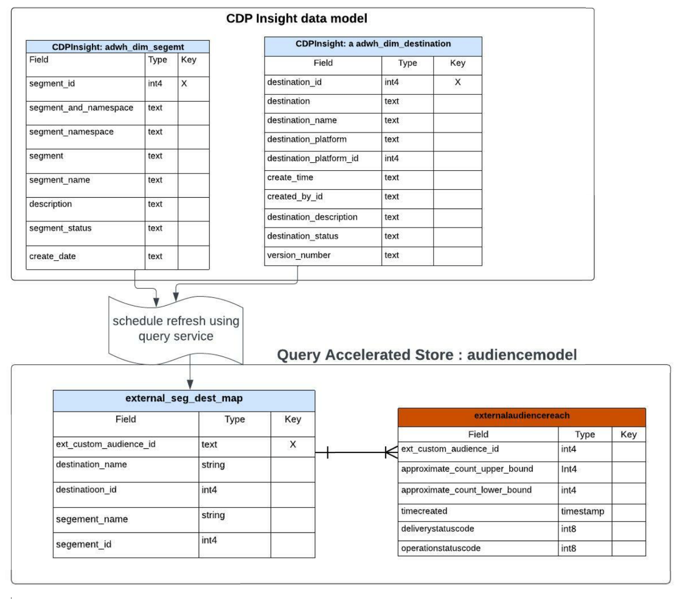

# Handbok för rapportinsikter om frågerapporter med accelererat arkiv

Med det frågeaccelererade arkivet kan du minska den tid och processorkraft som krävs för att få viktiga insikter från dina data. Vanligtvis behandlas data med regelbundna intervall (t.ex. varje timme eller dag) där aggregerade vyer skapas och rapporteras. Analysen av dessa rapporter som genereras utifrån aggregerade data ger insikter som är avsedda att förbättra affärsresultatet. Det frågeaccelererade arkivet tillhandahåller en cachetjänst, samtidighet, en interaktiv upplevelse och ett tillståndslöst API. Det förutsätter dock att data är förbearbetade och optimerade för aggregerad fråga och inte för rådatafrågor.

Med det frågeaccelererade arkivet kan du skapa en anpassad datamodell och/eller utöka en befintlig Adobe Real-time Customer Data Platform datamodell. Sedan kan ni interagera med eller bädda in era rapportinsikter i ett rapporterings-/visualiseringsramverk som ni väljer. Läs dokumentationen om Real-time Customer Data Platform Insights-datamodellen om du vill veta mer om [anpassa dina SQL-frågemallar för att skapa Real-Time CDP-rapporter för dina KPI-fall (Marketing and Key Performance Indicator)](../../../dashboards/cdp-insights-data-model.md).

Real-Time CDP datamodell från Adobe Experience Platform ger insikter om profiler, segment och destinationer och möjliggör Real-Time CDP insiktspaneler. I det här dokumentet får du hjälp med att skapa datamodellen för dina rapportinsikter och hur du kan utöka Real-Time CDP datamodeller efter behov.

## Förutsättningar

I den här självstudien används användardefinierade kontrollpaneler för att visualisera data från din anpassade datamodell i plattformsgränssnittet. Se [användardefinierad dokumentation för kontrollpaneler](../../../dashboards/user-defined-dashboards.md) om du vill veta mer om den här funktionen.

## Komma igång

Data Distiller SKU krävs för att skapa en anpassad datamodell för dina rapportinsikter och för att utöka Real-Time CDP datamodeller som innehåller data från den nya plattformen. Se [packning](../../packages.md), [skyddsräcken](../../guardrails.md#query-accelerated-store)och [licensiering](../../data-distiller/license-usage.md) dokumentation som relaterar till Data Distiller SKU. Om du inte har Data Distiller SKU kontaktar du Adobe kundtjänstrepresentanten för mer information.

## Bygg en datamodell för rapportinsikter

I den här självstudiekursen används ett exempel på hur man skapar en datamodell med målgruppsinsikter. Om ni använder en eller flera annonseringsplattformar för att nå er målgrupp kan ni använda annonsörens API för att få ett ungefärligt antal träffar hos er målgrupp.

Till att börja med har ni en första datamodell från era källor (eventuellt från er annonsörsplattforms-API). Om du vill få en sammanställd vy över dina rådata skapar du en modell för rapportinsikter enligt beskrivningen i bilden nedan. På så sätt kan en datauppsättning få de övre och nedre gränserna för målgruppsmatchningen.


I det här exemplet `externalaudiencereach` tabellen/datamängden baseras på ett ID och spårar de nedre och övre gränserna för antalet matchningar. The `externalaudiencemapping` dimensionstabell/datamängd mappar det externa ID:t till ett mål och ett segment på plattformen.

## Skapa en modell för att rapportera insikter med Data Distiller

Skapa sedan en rapportinsiktsmodell (`audienceinsight` i det här exemplet) och använda SQL-kommandot `ACCOUNT=acp_query_batch and TYPE=QSACCEL` för att säkerställa att den skapas i den accelererade butiken. Använd sedan frågetjänsten för att skapa en `audienceinsight.audiencemodel` schema för `audienceinsight` databas.

>[!NOTE]
>
>Data Distiller SKU krävs för `ACCOUNT=acp_query_batch` -kommando. Utan den skapas en vanlig datamodell på datasjön.

```sql
CREATE database audienceinsight WITH (TYPE=QSACCEL, ACCOUNT=acp_query_batch);
 
CREATE schema audienceinsight.audiencemodel;
```

## Skapa tabeller, relationer och fylla i data

Nu när du har skapat `audienceinsight` rapportinsiktsmodell, skapa `externalaudiencereach` och `externalaudiencemapping` tabeller och upprätta relationer mellan dem. Använd sedan `ALTER TABLE` om du vill lägga till en sekundärnyckelbegränsning mellan tabellerna och definiera en relation. I följande SQL-exempel visas hur du gör detta.

```sql
CREATE TABLE IF NOT exists audienceinsight.audiencemodel.externalaudiencereach
WITH ( DISTRIBUTION = REPLICATE ) AS
  SELECT cast(null as int) approximate_count_upper_bound,
         cast(null as string) deliverystatusdescription,
         cast(null as timestamp)  timeupdated ,
         cast(null as int) operationstatuscode ,
         cast(null as string) operationstatusdescription,
         cast(null as int) approximate_count_lower_bound,
         cast(null as timestamp)timecreated ,
         cast(null as timestamp)timecontentupdated ,
         cast(null as int) deliverystatuscode ,
         cast(null as int)  ext_custom_audience_id
   WHERE false;
 
CREATE TABLE IF NOT exists audienceinsight.audiencemodel.externalaudiencemapping
WITH ( DISTRIBUTION = REPLICATE ) AS
SELECT cast(null as int) segment_id,
       cast(null as int) destination_id,
       cast(null as int) ext_custom_audience_id
 WHERE false;
 
ALTER TABLE externalaudiencereach ADD  CONSTRAINT FOREIGN KEY (ext_custom_audience_id) REFERENCES externalaudiencemapping (ext_custom_audience_id) NOT enforced;
```

Efter det att båda programmen har körts `ALTER TABLE` -kommandon skapas relationen mellan faktabladet och dimensionstabellen.

När programsatserna har körts använder du `SHOW datagroups;` om du vill returnera en lista över tillgängliga datauppsättningar i det accelererade arkivet från `audienceinsight.audiencemodel`. Resultatet i tabellform bör likna det exempel som ges nedan.

>[!IMPORTANT]
>
>Det går bara att komma åt data i det accelererade arkivet från den tillståndslösa API-slutpunkten för frågetjänsten `POST /data/foundation/query/accelerated-queries`.

```console
    Database     |    Schema     | GroupType |      ChildType       |        ChildName        | PhysicalParent |               ChildId               
-----------------+---------------+-----------+----------------------+-------------------------+----------------+--------------------------------------
 audienceinsight | audiencemodel | QSACCEL   | Data Warehouse Table | externalaudiencemapping | true           | 9155d3b4-889d-41da-9014-5b174f6fa572
 audienceinsight | audiencemodel | QSACCEL   | Data Warehouse Table | externalaudiencereach   | true           | 1b941a6d-6214-4810-815c-81c497a0b636
```

## Fråga datamodellen för rapportinsikter

Använd frågetjänsten för att fråga `audiencemodel.externalaudiencereach` dimensionstabell. En exempelfråga visas nedan.

```sql
SELECT a.ext_custom_audience_id,
       a.approximate_count_upper_bound
FROM   audiencemodel.externalaudiencereach AS a
       LEFT OUTER JOIN audiencemodel.externalaudiencemapping AS b
                    ON ( ( a.ext_custom_audience_id ) =
                         ( b.ext_custom_audience_id ) )
GROUP  BY a.ext_custom_audience_id,
          a.approximate_count_upper_bound
LIMIT  5000 ;
```

Resultatet i tabellen innehåller ett antal och ett ID.

```console
ext_custom_audience_id | approximate_count_upper_bound
------------------------+-------------------------------
 23850912218170554      |                          1000
 23850808585120554      |                       1012000
 23850808585220554      |                        100000
 23850814978560554      |                          1000
 23850808585180554      |                        421000
 23850814978510554      |                       3001000
 23850814978530554      |                        300000
 23850912218160554      |                        105000
 23850808584990554      |                          1000
 23850809520110554      |                          1000
(10 rows)
```

## Utöka din datamodell med datamodellen Real-Time CDP insights

Du kan utöka målgruppsmodellen med ytterligare information för att skapa en mer omfattande dimensionstabell. Du kan till exempel mappa segmentnamnet och målnamnet till den externa publikens identifierare. Det gör du genom att använda frågetjänsten för att skapa eller uppdatera en ny datauppsättning och lägga till den i målgruppsmodellen som kombinerar segment och mål med en extern identitet. Bilden nedan visar konceptet för det här datamodelltillägget.



## Skapa dimensionstabeller för att utöka er modell för rapportinsikter

Använd frågetjänsten för att lägga till nyckelbeskrivande attribut från de berikade Real-Time CDP-dimensionsuppsättningarna i `audienceinsight` datamodell och skapa en relation mellan faktatabellen och den nya dimensionstabellen. SQL nedan visar hur du integrerar befintliga dimensionstabeller i datamodellen för rapportinsikter.

```sql
CREATE TABLE audienceinsight.audiencemodel.external_seg_dest_map AS
  SELECT ext_custom_audience_id,
         destination_name,
         segment_name,
         destination_status,
         a.destination_id,
         a.segment_id
  FROM   externalaudiencemapping AS a
         LEFT OUTER JOIN adwh_dim_segments AS b
                      ON ( ( a.segment_id ) = ( b.segment_id ) )
         LEFT OUTER JOIN adwh_dim_destination AS c
                      ON ( ( a.destination_id ) = ( c.destination_id ) );
 
ALTER TABLE externalaudiencereach  ADD  CONSTRAINT FOREIGN KEY (ext_custom_audience_id) REFERENCES external_seg_dest_map (ext_custom_audience_id) NOT enforced;
```

Använd `SHOW datagroups;` för att bekräfta att ytterligare `external_seg_dest_map` dimensionstabell.

```console
    Database     |     Schema     | GroupType |      ChildType       |                ChildName  | PhysicalParent |               ChildId               
-----------------+----------------+-----------+----------------------+----------------------------------------------------+----------------+--------------------------------------
 audienceinsight | audiencemodel | QSACCEL   | Data Warehouse Table | external_seg_dest_map      | true           | 4b4b86b7-2db7-48ee-a67e-4b28cb900810
 audienceinsight | audiencemodel | QSACCEL   | Data Warehouse Table | externalaudiencemapping    | true           | b0302c05-28c3-488b-a048-1c635d88dca9
 audienceinsight | audiencemodel | QSACCEL   | Data Warehouse Table | externalaudiencereach      | true           | 4485c610-7424-4ed6-8317-eed0991b9727
```

## Fråga om datamodell för utökad accelererad butiksrapportering

Nu när `audienceinsight` datamodellen har utökats, den är klar att efterfrågas. Följande SQL visar en lista över mappade mål och segment.

```sql
SELECT a.ext_custom_audience_id,
       b.destination_name,
       b.segment_name,
       b.destination_status,
       b.destination_id,
       b.segment_id
FROM   audiencemodel.externalaudiencereach1 AS a
       LEFT OUTER JOIN audiencemodel.external_seg_dest_map AS b
                    ON ( ( a.ext_custom_audience_id ) = (
                         b.ext_custom_audience_id ) )
LIMIT  25; 
```

Frågan returnerar alla datauppsättningar i det snabblagrade arkivet:

```console
ext_custom_audience_id | destination_name |       segment_name        | destination_status | destination_id | segment_id 
------------------------+------------------+---------------------------+--------------------+----------------+-------------
 23850808595110554      | FCA_Test2        | United States             | enabled            |     -605911558 | -1357046572
 23850799115800554      | FCA_Test2        | Born in 1980s             | enabled            |     -605911558 | -1224554872
 23850799115790554      | FCA_Test2        | Born in 1970s             | enabled            |     -605911558 |  1899603869
 23850798177620554      | FCA_Test1        | Billionaires              | enabled            |      321720439 |  1401872665
 23850814978560554      | FCA_Test3        | Canada - Saskatchewan     | enabled            |     1182494936 | -1917996562
 23850808585180554      | FCA_Test3        | United States             | enabled            |     1182494936 | -1357046572
 23850814978530554      | FCA_Test3        | Canada - British Columbia | enabled            |     1182494936 |  -652840507
 23850808585120554      | FCA_Test3        | Canada - Quebec           | enabled            |     1182494936 |  -519557860
 23850809520110554      | FCA_Test3        | Born in 1960s             | enabled            |     1182494936 |   237824266
 23850808585220554      | FCA_Test3        | Western Canada            | enabled            |     1182494936 |  1075937528
 23850808584990554      | FCA_Test3        | Canada - Ontario          | enabled            |     1182494936 |  1593438041
 23850814978510554      | FCA_Test3        | Canada - Alberta          | enabled            |     1182494936 |  1862946783
 23850912218170554      | FCA_Test4        | Canada - Alberta          | enabled            |     1549248886 |  1862946783
 23850912218160554      | FCA_Test4        | Born in 1970s             | enabled            |     1549248886 |  1899603869
```

## Visualisera data med användardefinierade kontrollpaneler

Nu när du har skapat en anpassad datamodell är du redo att visualisera dina data med anpassade frågor och användardefinierade dashboards.

Följande SQL ger en fördelning av antalet matchningar per målgrupp i ett mål och en uppdelning av varje målgrupp efter segment.

```sql
SELECT b.destination_name,
       a.approximate_count_upper_bound,
       b.segment_name
FROM   audiencemodel.externalaudiencereach AS a
       LEFT OUTER JOIN audiencemodel.external_seg_dest_map AS b
                    ON ( ( a.ext_custom_audience_id ) = (
                         b.ext_custom_audience_id ) )
GROUP  BY b.destination_name,
          a.approximate_count_upper_bound,
          b.segment_name
ORDER BY b.destination_name
LIMIT  5000
```

Bilden nedan visar ett exempel på möjliga anpassade visualiseringar med datamodellen för rapportinsikter.


Din anpassade datamodell finns i listan över tillgängliga datamodeller på den användardefinierade kontrollpanelens arbetsyta. Se [användardefinierad kontrollpanelguide](../../../dashboards/user-defined-dashboards.md) för vägledning om hur du använder din anpassade datamodell.
