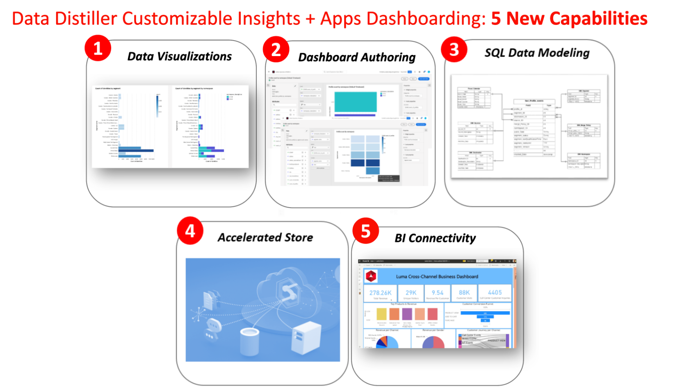

# SQL Insights

Skapa skräddarsydda rapportdatamodeller för att få djupare insikter, optimera strategier och anpassa analyser efter specifika affärsbehov med Data Distiller SQL Insights. Använd SQL Insights-funktionen för att förbättra transparensen och få operativa insikter från era Adobe Experience Platform-data i olika dimensioner som profiler, målgrupper, kampanjer, resor, berättiganden och samtycke. Denna funktion är en flexibel, anpassningsbar lösning som skräddarsyr organisationens rapporteringsdatamodeller för att passa just era affärsbehov.

Om du vill [visualisera dina SQL-insikter](../../../dashboards/sql-insights-query-pro-mode/overview.md) kan du använda [frågeproffsläget](../../../dashboards/sql-insights-query-pro-mode/overview.md) för att utföra komplexa analyser med anpassade SQL-frågor och omvandla dina data till lätttolkade diagram. Använd frågeproffsläget för att skapa skräddarsydda insikter och visualiseringar på kontrollpanelerna och ta hänsyn till både tekniska och icke-tekniska målgrupper genom att ladda ned insikter som CSV-filer.

Det här dokumentet innehåller användningsexempel, viktiga funktioner och nödvändiga steg för att utveckla en SQL insights-instrumentpanel med Data Distiller.

## Förhandskrav

I den här självstudien används användardefinierade kontrollpaneler för att visualisera data från din anpassade datamodell i Experience Platform användargränssnitt. Mer information om den här funktionen finns i [användardefinierad dokumentation för kontrollpaneler](../../../dashboards/standard-dashboards.md).

## Komma igång

Data Distiller SKU krävs för att skapa en anpassad datamodell för dina rapportinsikter och för att utöka Real-Time CDP datamodeller som innehåller berikade Experience Platform-data. Se dokumentationen för [paketering](../../packaging.md), [skyddsutkast](../../guardrails.md#query-accelerated-store) och [licensiering](../../data-distiller/license-usage.md) som gäller Data Distiller SKU. Om du inte har Data Distiller SKU kontaktar du Adobe kundtjänstrepresentant för mer information.

## Användningsfall för SQL Insights {#use-cases}

Nedan visas vanliga användningsområden som kan hanteras effektivt via SQL Insights i Data Distiller.

### Genomskinlighet för profil- och målgruppsanvändning {#usage-transparency}

**Problem:** Så här bryter du ned nyckeltal (KPI) efter specifika kriterier som affärsenheter, lojalitetsstatus eller kundens livstidsvärde (CLTV).

**SQL Insights-lösning:** Data-Distiller möjliggör tillägg av rapportdatamodeller i Adobe Experience Platform, vilket underlättar för [ att lägga till anpassade profilattribut som CLTV](../../use-cases/customer-lifetime-value.md) eller lojalitetsstatus.

### Åtkomst till avvikelsespårning {#consent-anomaly-tracking}

**Utmaning:** Så här tillämpar du målgruppsöverlappnings- och storlekstrendlinjerapporter på anpassade medgivandeattribut för kanaler som e-post, SMS och telefon.

**SQL Insights-lösning:** Rapportdatamodellen kan utökas för att spåra ändringar i medgivandeinställningarna över tid. Detta innebär att du skapar ytterligare fakt- och dimensionstabeller för att trendanpassa medgivandeinställningar och schemalägga [inkrementell datauppdatering](../../key-concepts/incremental-load.md).

### Optimera strategi för målgruppssegmentering {#optimize-audience-segmentation-strategy}

**Utmaning:** Så här integrerar du ML-modellgenererade benägenhetspoäng i målgruppernas KPI-rapporter.

**SQL Insights-lösning:** Data-Distiller tillåter att [benägenhetspoäng från anpassade ML-modeller](../../use-cases/propensity-score.md) inkluderas, vilket underlättar beräkningen av aggregerade poängvärden på målgruppsnivå. Dessa data kan sedan rapporteras tillsammans med vanliga KPI:er.

### Målgruppsexpansion {#audience-expansion}

**Utmaning:** Så här förvärvar du fler än bara antalet profiler i målgrupper överlappar rapporter och uppnår ytterligare demografiska data eller inställningar som kan vägleda strategier för målgruppsexpansion.

**SQL Insights-lösning:** Genom att utöka rapportdatamodellen kan användare inkludera ytterligare profilattribut, vilket förbättrar publikens överlappningsrapport med relevanta demografiska data och inställningar.

## Viktiga funktioner för att generera SQL-insikter {#key-capabilities}

Bilden nedan visar flera viktiga funktioner för att generera SQL-insikter. Bland dessa funktioner finns:

1. **Datavisualiseringar:** Innehåller visuella element som trender och stapeldiagram för en heltäckande bild av datatrender.
1. **Instrumentpanelsredigering:** Gör det möjligt att skapa anpassade instrumentpaneler som är anpassade till specifika användningsfall, vilket ger en mer personaliserad och målinriktad analysupplevelse.
1. **Flexibel SQL-datamodellering:** Använd en mångsidig metod för SQL-datamodellering som gör det möjligt för användare att sömlöst kombinera och ändra olika datauppsättningar, förbättra anpassningsförmågan och analytiskt djup.
1. **Accelerated store:** Implementera en accelererad butiksmekanism för att effektivt hantera aggregerade insikter via SQL, vilket ger smidig och snabb åtkomst till värdefull information.
1. **BI-anslutning:** Underlättar smidig integrering med vanliga Business Intelligence-verktyg (BI), inklusive Power BI, Tableau, Looker och Apache Superset. Den här anslutningen garanterar kompatibilitet med olika BI-miljöer, vilket ger användarna flexibilitet att använda sina valverktyg för djupgående analyser och rapporter.

## Steg för att skapa SQL-insikter {#steps-to-create}

Följ instruktionerna nedan om du vill utveckla en SQL Insights-instrumentpanel i Data Distiller.

1. **Ad hoc-frågeutforskande:** Börja med att köra ad hoc `SELECT` -frågor för att utforska raw-data i datasjön. På så sätt kan man experimentera direkt och experimentera med data och validera data där resultaten av frågorna inte lagras i datasjön.
1. **Använd batchfråga:** Använd batchfrågor för att [skapa schemalagda jobb](../../api/scheduled-queries.md#create-a-new-scheduled-query) för att generera sammanställda insikter, vilket ger en systematisk och automatiserad databearbetning. Gruppfrågor kör `INSERT TABLE AS SELECT`- och `CREATE TABLE AS SELECT`-frågor för att rensa, forma, manipulera och förbättra data. Resultatet av dessa frågor lagras i datasjön.
1. **Aggregerade insikter läses in:** Läs in de genererade aggregerade insikterna i det accelererade arkivet och använd SQL för att testa frågor, och se till att data hämtas på ett korrekt och effektivt sätt. Mer information om hur du [ställer tillståndslösa frågor till det accelererade arkivet](../../api/accelerated-queries.md) finns i dokumentationen.
1. **Åtkomst och integrering:** Få tillgång till insikter som lagras i den accelererade butiken sömlöst genom att integrera med Adobe Experience Platform [användardefinierade Dashboards](../../../dashboards/standard-dashboards.md) eller andra Business Intelligence (BI)-verktyg. Dessa integreringar med tredjepartsklienter underlättar en sammanhängande och intuitiv upplevelse för användarna.

## Nästa steg

Genom att läsa det här dokumentet får du nu en bättre förståelse för användningsfall, viktiga funktioner och nödvändiga steg för att utveckla en instrumentpanel för SQL-insikter med Data Distiller. Mer information om hur du skapar anpassade rapportdatamodeller finns i [guiden ](./reporting-insights-data-model.md) om datamodellen för rapportinsikter.
