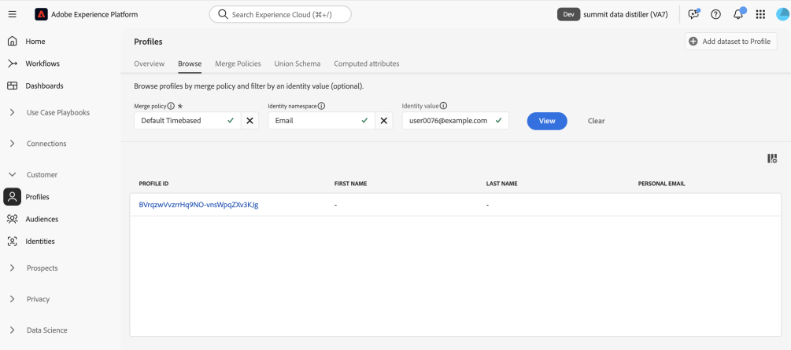

# De bästa tipsen för att maximera värdet med Adobe Experience Platform Data Distiller - OS656

Den här sidan innehåller exempeldatauppsättningen för att du ska kunna använda det du lärt dig i Adobe Summit-sessionen&quot;OS656 - De bästa tipsen för att maximera värdet med Adobe Experience Platform Data Distiller&quot;. Du får lära dig att snabba upp implementeringen av Adobe Real-Time Customer Data Platform och Journey Optimizer genom att förbättra kundprofildata i realtid. Denna fördjupning utnyttjar djupgående insikter i kundbeteendemönster för att skapa målgrupper för upplevelseleverans och optimering.

Genom fallstudien Luma kommer du att analysera användarbeteendedata och skapa en *Recency, Frequency, Economic (RFM)* -modell - en marknadsföringsanalysteknik för kundsegmentering baserad på köpmönster.

## Förutsättning

Din Adobe Experience Platform-instans måste ha licens för [Data Distiller](./overview.md) för att kunna köra det här användningsfallet. Kontakta Adobe om du vill ha mer information.

Du måste också känna till din **organisations klient-ID**, vilket krävs för att köra frågor. Ditt klient-ID är den första delen av webbadressen när du loggar in på Experience Platform, som visas direkt efter @-symbolen.

I följande URL:

```http
https://experience.adobe.com/#/@pfreportingonprod/sname:prod/platform/home
```

Klient-ID är `pfreportingonprod`.

## Översikt över RFM-modellen {#rfm-overview}

RFM, short for Recency (R), Frequency (F) och Economic (M), är en datadriven metod för kundsegmentering och -analys. Den här metoden utvärderar tre viktiga aspekter av kundbeteendet: hur nyligen en kund gjorde ett köp, hur ofta de interagerar och hur mycket de spenderar. Genom att kvantifiera dessa faktorer kan företag få åtgärdbara insikter i kundsegment och utveckla riktade marknadsföringsstrategier som bättre motsvarar enskilda kunders behov.

## Förstå kundbeteende med RFM-modellen {#understand-customer-behavior}

RFM-modellen segmenterar kunder baserat på transaktionsbeteenden med tre huvudparametrar.

- **Nyhet** mäter tiden sedan en kunds senaste köp, vilket anger engagemangsnivåer och potential för framtida köp.
- **Frekvens** spårar hur ofta en kund interagerar, vilket är en tydlig indikator på lojalitet och ett starkt engagemang.
- **Monetärt värde** utvärderar kundernas totala utgifter och framhäver deras totala värde för företaget.

Genom att kombinera dessa faktorer tilldelar företag numeriska poäng (vanligtvis på en skala från `1` till `4`) till varje kund. Lägre poäng ger ett mer gynnsamt resultat. En kundpoäng `1` i alla kategorier anses till exempel vara bland de bästa, vilket visar på senaste aktivitet, högt engagemang och betydande utgifter.

## Fördelar och begränsningar för RFM-modellen {#benefits-and-limitations}

Alla marknadsföringsmodelleringstekniker innefattar kompromisser, som erbjuder både fördelar och begränsningar. RFM-modellering är ett värdefullt verktyg för att förstå kundbeteenden och förfina marknadsföringsstrategier. Fördelarna är bland annat att segmentera kunder för att personalisera meddelanden, optimera intäkterna och förbättra svarsfrekvenserna, kundlojaliteten, kundnöjdheten och kundens livstidsvärde (CLTV).

RFM-modellering har dock begränsningar. Det förutsätter enhetlighet inom segment baserat på senaste, frekventa och monetära värden, vilket kan göra kundbeteendet överdrivet. Modellen tilldelar också dessa faktorer samma vikt, vilket eventuellt inte motsvarar kundens värde. Dessutom tar den inte hänsyn till sammanhanget, t.ex. produktspecifika egenskaper eller kundpreferenser, vilket kan leda till missförstånd i köpbeteendet.

## Bygg en dynamisk RFM-poängbaserad SQL-målgrupp {#build-a-dynamic-rfm-audience}

Följande infografik ger en översikt på hög nivå över arbetsflödet för att skapa RFM SQL-målgrupper som beskrivs i den här självstudien.


Innan du påbörjar fallstudien Luma måste du importera en exempeldatauppsättning. Först [markerar du länken för att hämta `luma_web_data.zip`-datauppsättningen lokalt](../resources/luma_web_data.zip). Exempeldatauppsättningen är en csv-fil i ett komprimerat ZIP-format som är anpassad efter användningsfallet. Dekomprimera den här ZIP-filen med Adobe Acrobat eller ett pålitligt filextraheringsverktyg, till exempel det inbyggda verktyget i operativsystemet. I praktiken hämtar du vanligtvis data från Adobe Analytics, Adobe Commerce eller Adobe Web/Mobile SDK.

Under den här självstudiekursen använder du Data Distiller för att extrahera relevanta händelser och fält till ett standardiserat CSV-format. Målet är att inkludera endast viktiga fält och samtidigt ha en plan datastruktur som är effektiv och enkel att använda.

### Steg 1: Överför CSV-data till Experience Platform {#upload-csv-data}

Följ de här stegen för att överföra en CSV-fil till Adobe Experience Platform.

#### Skapa en datauppsättning från en CSV-fil {#create-a-dataset}

I Experience Platform-gränssnittet väljer du **[!UICONTROL Datasets]** i den vänstra navigeringslisten, följt av **[!UICONTROL Create dataset]**. Välj sedan **[!UICONTROL Create dataset from CSV file]** bland de tillgängliga alternativen.

Panelen [!UICONTROL Configure Dataset] visas. I fältet **[!UICONTROL Name]** anger du datauppsättningsnamnet som luma_web_data och väljer **[!UICONTROL Next]**.

Panelen [!UICONTROL Add data] visas. Dra och släpp CSV-filen i rutan **[!UICONTROL Add data]** eller välj **[!UICONTROL Choose File]** för att bläddra och överföra filen.

Om du vill veta mer om den här processen kan du läsa självstudiekursen [om gruppfrågor](../../ingestion/tutorials/ingest-batch-data.md) och arbetsflödet för att skapa [datauppsättningar](../../catalog/datasets/user-guide.md#create) i användargränssnittsguiden för datauppsättningar.

#### Granska och slutför överföringen {#review-and-complete-upload}

När filen har överförts visas en förhandsgranskning av data längst ned i användargränssnittet. Välj **[!UICONTROL Finish]** för att slutföra överföringen.


Vyn för datauppsättningsaktiviteter för datauppsättningen&quot;luma_web_data&quot; visas. Manuell överföring av CSV-filen
har importerats som en grupp och identifieras av en [!UICONTROL Batch ID]. Tabellnamnet visas som `luma_web_data` på en panel till höger.

>[!TIP]
>
>När du skriver frågor i Data Distiller ska du använda tabellnamnet i stället för datauppsättningsnamnet. Datauppsättningsnamnet används bara för att bläddra i användargränssnittet.


<!--  
My table name is; luma_web_data_20250312_235611_817 Should we explain the suffix? 
-->

När data har bearbetats klart väljer du [!UICONTROL Preview dataset] i det övre högra hörnet för att förhandsgranska datauppsättningen. Så här ser datauppsättningsförhandsvisningen ut:


#### Schemaöverväganden {#schema-considerations}

Ett strukturerat XDM-schema (till exempel post-, händelse- eller B2B-scheman) krävs inte eftersom data importeras som en CSV-råfil. I stället använder datauppsättningen ett ad hoc-schema.

>[!TIP]
>
>Ad hoc-scheman är XDM-scheman med fält som namnges för att endast användas av en enskild datauppsättning. Ad hoc-scheman används i olika arbetsflöden för dataöverföring för Experience Platform och för att skapa vissa typer av källanslutningar.

Data Distiller stöder alla schematyper, men den sista datauppsättningen för inmatning i kundprofilen i realtid använder ett Record XDM-schema.

### Steg 2: Anslut till datasjön och utforska tillgängliga datamängder {#connect-to-the-data-lake-and-explore-datasets}

Nästa steg är att utforska data i Adobe Experience Platform datasjön för att säkerställa precision och integritet. Data måste vara korrekta och fullständiga för att man ska få meningsfulla insikter, men fel, inkonsekvenser eller saknade värden kan uppstå under dataöverföringar. Detta gör att dataverifiering och -utforskning är mycket viktigt.

>[!TIP]
>
>Data Lake lagrar råa, obearbetade data, till exempel händelseloggar, klickströmsdata och massinmatade poster, för analys och bearbetning. Profilarkivet innehåller identifierbara data, inklusive identitetssammanfogade händelser och attributinformation, som stöder personalisering och aktivering i realtid.

Använd Data Distiller för att verifiera datauppsättningens kvalitet och fullständighet genom olika åtgärder. Om du vill bekräfta att data översattes korrekt under importen kör du `SELECT` frågor för att inspektera, validera och analysera dem. Denna process hjälper till att identifiera och lösa avvikelser, inkonsekvenser eller information som saknas.

#### Utför en grundläggande undersökningsfråga {#basic-exploration-queries}

I Adobe Experience Platform-gränssnittet väljer du **[!UICONTROL Queries]** i den vänstra navigeringslisten och sedan **[!UICONTROL Create Query]**. Frågeredigeraren visas.

Klistra in följande fråga i redigeraren och kör den:

```sql
SELECT * FROM luma_web_data; 
```

Frågeresultaten visas under Frågeredigeraren på fliken **[!UICONTROL Results]**. Om du vill utöka resultaten i en ny dialogruta väljer du **[!UICONTROL View results]**. Resultatet ser ut ungefär som bilden nedan.


Mer information finns i [den allmänna vägledningen för frågekörning](../best-practices/writing-queries.md).

#### Fokusera på order och exkludera annullerade transaktioner {#focus-orders-exclude-cancelled}

RFM-modellen utvärderar senaste, återkommande och penningvärde baserat på slutförda köp. Icke-transaktionshändelser, som sidvisningar och utcheckningsinteraktioner, ingår inte i analysen. Dessutom måste annullerade order tas bort eftersom de inte bidrar till giltiga RFM-beräkningar och kräver en annan bearbetningsmetod.

För att säkerställa noggrannhet:

- Identifiera inköps-ID:n som är kopplade till annulleringar och gruppera dem med `GROUP BY`.
- Undanta dessa inköps-ID:n från datauppsättningen.
- Filtrera data så att endast slutförda order behålls.

Följande frågor visar hur du identifierar och exkluderar annullerade order från datauppsättningen.

Den första frågan markerar alla köp-ID som inte är null och som är associerade med en annullering och sammanställer dem med `GROUP BY`. De resulterande köp-ID:n måste uteslutas från datauppsättningen.

```sql
CREATE VIEW orders_cancelled
AS
  SELECT purchase_id
  FROM   luma_web_data
  WHERE  event_type IN ( 'order', 'cancellation' )
         AND purchase_id IS NOT NULL
  GROUP  BY purchase_id
  HAVING Count(DISTINCT event_type) = 2; 
```

Den andra frågan hämtar endast de köp-ID:n som inte finns i den här uteslutna uppsättningen.

```sql
SELECT *
FROM   luma_web_data
WHERE  purchase_id NOT IN (SELECT purchase_id
                           FROM   orders_cancelled)
        OR purchase_id IS NULL; 
```

Den tredje frågan tar bort alla icke-ordnade händelser från datauppsättningen.

```sql
SELECT *
FROM   luma_web_data
WHERE  event_type = 'order'
       AND purchase_id NOT IN (SELECT purchase_id
                               FROM   orders_cancelled); 
```

### Steg 3: Förbättra data med Data Distiller-funktioner {#enrich-the-data}

Använd sedan Data Distiller för att extrahera och omvandla kunddata, generera RFM-poäng, sammanställa transaktioner och segmentera kunder genom att köpa beteenden. Följ de här stegen för att beräkna värden för senaste, frekvens och monetära (RFM), skapa en målgruppsmodell och förbereda insikter för aktivering.

#### Beräkna RFM-poängen för varje unikt användar-ID

Extrahera nyckelfält från rådata med fältfiltrering för att beräkna RFM-poängen.

Nästa fråga bygger på logiken i föregående avsnitt genom att välja e-post som `userid`, eftersom varje order kräver en e-postinloggning. Data Distiller använder funktionen `TO_DATE` för att konvertera tidsstämpeln till ett datumformat. Fältet `total_revenue` representerar priset för varje transaktion och sammanställs senare genom att summera det för varje `userid`.

```sql
SELECT email AS userid, 
       purchase_id AS purchaseid, 
       price_total AS total_revenue, -- reflects the price for each individual transaction
       TO_DATE(timestamp) AS purchase_date -- converts timestamp to date format
FROM luma_web_data 
WHERE event_type = 'order' 
      AND purchase_id NOT IN (SELECT purchase_id FROM orders_cancelled) 
      AND email IS NOT NULL;
```

Resultatet ser ut som bilden nedan.


Skapa sedan en `TABLE` för att lagra resultatet av föregående fråga i en härledd datauppsättning. Kopiera och klistra in följande kommando i Frågeredigeraren för att skapa en `TABLE`.

```sql
CREATE TABLE IF NOT EXISTS order_data AS
  SELECT email              AS userid,
         purchase_id        AS purchaseid,
         price_total        AS total_revenue,
         To_date(timestamp) AS purchase_date
  FROM   luma_web_data
  WHERE  event_type = 'order'
         AND purchase_id NOT IN (SELECT purchase_id FROM orders_cancelled)
         AND email IS NOT NULL; 
```

Resultatet ser ut ungefär som i följande bild men med ett annat datauppsättnings-ID.


Som bästa praxis bör du köra en enkel utforska fråga för att inspektera data i datauppsättningen. Använd följande programsats för att visa dina data.

```sql
SELECT * FROM order_data;
```


#### Samla transaktionerna för att generera RFM-värdena {#aggregate-transactions}

För att beräkna RFM-värden sammanställer den här frågan transaktioner för varje användare.

Funktionen `DATEDIFF(CURRENT_DATE, MAX(purchase_date)) AS days_since_last_purchase` beräknar antalet dagar sedan det senaste köpet för varje användare.

Använd följande SQL-fråga:

```sql
SELECT 
    userid, 
    DATEDIFF(CURRENT_DATE, MAX(purchase_date)) AS days_since_last_purchase, 
    COUNT(purchaseid) AS orders, 
    SUM(total_revenue) AS total_revenue 
FROM order_data 
GROUP BY userid;
```

Resultatet ser ut som bilden nedan.


Om du vill förbättra frågans effektivitet och återanvändbarhet skapar du en `VIEW` som lagrar de aggregerade RFM-värdena.

```sql
CREATE VIEW rfm_values
AS
  SELECT userid,
         DATEDIFF(current_date, MAX(purchase_date)) AS days_since_last_purchase,
         COUNT(purchaseid)                          AS orders,
         SUM(total_revenue)                         AS total_revenue
  FROM   order_data
  GROUP BY userid; 
```

Resultatet liknar följande bild men med ett annat ID.


Som bästa praxis kan du även köra en enkel utforska fråga för att inspektera data i vyn. Använd följande programsats.

```sql
SELECT * FROM rfm_values;
```

I följande skärmbild visas ett exempelresultat av frågan med de beräknade RFM-värdena för varje användare. Resultatet motsvarar vy-ID:t från frågan `CREATE VIEW`.


#### Generera RFM-flerdimensionell kub {#generate-multi-dimensional-cube}

Använd en flerdimensionell RFM-kub för att segmentera kunder baserat på deras RFM-poäng. Fönsterfunktionen `NTILE` sorterar värden i rankade intervall och delar upp varje dimension i fyra lika stora grupper (kvartiler), vilket möjliggör strukturerad segmentering.

- Senaste: Kunderna rangordnas efter hur nyligen de har köpt ett köp (`days_since_last_purchase`). De som köpt senast tillhör grupp 1, medan de som inte köpt på längst tid ingår i grupp 4.
- Frekvens: Kunderna rangordnas efter hur ofta de gör inköp (`ORDER BY orders DESC`). De mest frekventa köparna tillhör grupp 1, medan de som är mest frekventa är i grupp 4.
- Ekonomi: Kunderna rangordnas efter totala utgifter (`total_revenue`). De största utgivarna finns i grupp 1, medan de lägsta är i grupp 4.

Kör följande SQL-fråga för att generera RFM-flerdimensionell kub:

```sql
SELECT userid,
       days_since_last_purchase,
       orders,
       total_revenue,
       5 - NTILE(4)
             OVER (
               ORDER BY days_since_last_purchase DESC) AS recency,
       NTILE(4)
         OVER (
           ORDER BY orders DESC)                       AS frequency,
       NTILE(4)
         OVER (
           ORDER BY total_revenue DESC)                AS monetization
FROM rfm_values; 
```

Resultatet ser ut som bilderna nedan.


Använd sedan följande programsats för att skapa en `VIEW` för dessa data.

Om du skapar en `VIEW` för RFM-flerdimensionell kub förbättras effektiviteten genom att försegmenterade data lagras, vilket eliminerar behovet av att beräkna om RFM-poängen i framtida frågor. Det förenklar SQL-satser, säkerställer datainkonsekvent och förbättrar återanvändbarheten för ytterligare analys.

```sql
CREATE OR replace VIEW rfm_scores
AS
  SELECT userid,
         days_since_last_purchase,
         orders,
         total_revenue,
         5 - NTILE(4)
               over (
                 ORDER BY days_since_last_purchase DESC) AS recency,
         NTILE(4)
           over (
             ORDER BY orders DESC)                       AS frequency,
         NTILE(4)
           over (
             ORDER BY total_revenue DESC)                AS monetization
  FROM   rfm_values;
```

Resultatet ser ut ungefär som i följande bild men med ett annat vy-ID.


#### Modell-RFM-segment {#model-rfm-segments}

När RFM-poängen har beräknats kan kunderna kategoriseras i följande sex prioriterade segment:

1. `Core`: Bästa kunder med hög Recency, Frequency och monetärt värde (Recency = 1, Frequency = 1, Economic = 1).
1. `Loyal`: Vanliga kunder som är konsekventa men inte topputlånade (frekvens = 1).
1. `Whales`: De högsta intervallen, oavsett senaste och frekvens (monetär = 1).
1. `Promising`: Vanliga men lägre intervall (frekvens = 1, 2, 3; Monetär = 2, 3, 4).
1. `Rookies`: Nya kunder med låg frekvens (senaste aktivitet = 1, frekvens = 4).
1. `Slipping`: Tidigare lojala kunder med minskad aktivitet (Recency = 2, 3, 4; Frequency = 4).

Om du vill effektivisera åtkomst och återanvändning skapar du en `VIEW` som lagrar RFM-segment, poäng och värden.

`CASE`-satserna i följande SQL-satser kategoriserar kunder i segment baserat på deras RFM-poäng och tilldelar resultaten till variabeln `RFM_Model`.

+++Välj för att visa SQL

```sql
CREATE OR replace VIEW rfm_model_segment
AS
  SELECT userid,
         days_since_last_purchase,
         orders,
         total_revenue,
         recency,
         frequency,
         monetization,
         CASE
           WHEN recency = 1
                AND frequency = 1
                AND monetization = 1 THEN '1. Core - Your Best Customers'
           WHEN recency IN( 1, 2, 3, 4 )
                AND frequency = 1
                AND monetization IN ( 1, 2, 3, 4 ) THEN
           '2. Loyal - Your Most Loyal Customers'
           WHEN recency IN( 1, 2, 3, 4 )
                AND frequency IN ( 1, 2, 3, 4 )
                AND monetization = 1 THEN
           '3. Whales - Your Highest Paying Customers'
           WHEN recency IN( 1, 2, 3, 4 )
                AND frequency IN ( 1, 2, 3 )
                AND monetization IN( 2, 3, 4 ) THEN
           '4. Promising - Faithful customers'
           WHEN recency = 1
                AND frequency = 4
                AND monetization IN ( 1, 2, 3, 4 ) THEN
           '5. Rookies - Your Newest Customers'
           WHEN recency IN ( 2, 3, 4 )
                AND frequency = 4
                AND monetization IN ( 1, 2, 3, 4 ) THEN
           '6. Slipping - Once Loyal, Now Gone'
         END RFM_Model
  FROM   rfm_scores; 
```

+++

Den genererade `VIEW` följer samma struktur som tidigare skapelser, men med ett annat ID.

Det bästa är att köra en enkel utforska fråga för att inspektera data i vyn. Använd följande programsats.

<!-- Double check this SQL. I wrote it.- it was absent fom the KT doc. -->

```sql
SELECT * FROM rfm_model_segment;
```

<!-- Perhaps these VIEW results could be chopped? -->

I följande skärmbilder visas ett exempelresultat av frågan `SELECT * FROM rfm_model_segment;` som visar segmenterade RFM-modelldata. Utdata återspeglar strukturen för den genererade `VIEW`, inklusive tilldelade kundsegment baserade på RFM-poäng.


### Steg 4: Använd SQL för att batchimportera RFM-data till kundprofilen i realtid {#sql-batch-ingest-rfm-data}

Därefter gruppimporterar vi RFM-berikade kunddata till kundprofilen i realtid. Börja med att skapa en profilaktiverad datauppsättning och infoga transformerade data med SQL.

#### Skapa en härledd datauppsättning för att lagra RFM-attribut {#create-a-derived-dataset}

Eftersom den här datauppsättningen kommer att importeras till profilarkivet krävs en partitionsnyckel.

>[!TIP]
>
>Det primära identitetsfältet fungerar som partitionsnyckel och ger effektiv datadistribution, hämtning och frågeprestanda. När du tilldelar en primär identitet med ett identitetsnamnutrymme grupperas relaterade profilposter, vilket optimerar sökningar och uppdateringar i profilarkivet.

Skapa en tom datamängd för att lagra RFM-attribut och tilldela en primär identitet.

I den här SQL-satsen:

- `userId TEXT PRIMARY IDENTITY NAMESPACE 'Email'`: Definierar kolumnen userId som primär identitet med namnområdet Email. &#x200B;
- `days_since_last_purchase INTEGER`: Lagrar antalet dagar sedan användarens senaste köp. &#x200B;
- `orders INTEGER`: Representerar det totala antalet order som har placerats av användaren. &#x200B;
- `total_revenue DECIMAL(18, 2)`: Hämtar den totala intäkten som genererats av användaren, med en noggrannhet på upp till 18 siffror och två decimaler. &#x200B;
- `recency INTEGER, frequency INTEGER, monetization INTEGER`: Lagra respektive RFM-poäng för användaren. &#x200B;
- `rfm_model TEXT`: Innehåller RFM-segmentklassificeringen som tilldelats användaren. &#x200B;
- `WITH (LABEL = 'PROFILE')`: Markerar tabellen som profilaktiverad i Experience Platform och ser till att inmatade data bidrar till att skapa kundprofiler i realtid. &#x200B;

>[!NOTE]
>
>Namnområdet Email är ett [standardidentitetsnamnområde](../../identity-service/features/namespaces.md#standard) i Adobe Experience Platform. När du definierar identitetsfält måste du se till att rätt namnutrymme anges för att underlätta en korrekt identitetsupplösning. &#x200B;
>
>Mer information om hur du definierar identitetsfält och arbetar med identitetsnamnutrymmen finns i [dokumentationen för identitetstjänsten](../../identity-service/home.md) eller i handboken [om hur du definierar ett identitetsfält i Adobe Experience Platform-gränssnittet](../../xdm/ui/fields/identity.md).

Eftersom Frågeredigeraren stöder sekventiell körning kan du inkludera frågor om att skapa och infoga data i en enda session. I följande SQL skapas först en profilaktiverad tabell för lagring av RFM-attribut. Sedan infogar den RFM-berikade kunddata från `rfm_model_segment` i tabellen `adls_rfm_profile`, vilket strukturerar varje post under ditt klientspecifika namnområde, vilket krävs för att kunna lägga till kundprofil i realtid.

Eftersom Frågeredigeraren stöder sekventiell körning kan du köra frågor om att skapa och infoga data i en enda session. I följande SQL skapas först en profilaktiverad tabell för lagring av RFM-attribut. Sedan infogas RFM-berikade kunddata från `rfm_model_segment` i tabellen `adls_rfm_profile`, vilket säkerställer att varje post är korrekt strukturerad under ditt klientspecifika namnutrymme (`_{TENANT_ID}`). Det här namnutrymmet är nödvändigt för kundprofilsinmatning i realtid och korrekt identitetsupplösning.

>[!IMPORTANT]
>
>Ersätt `_{TENANT_ID}` med din organisations klientnamnområde. Namnutrymmet är unikt för din organisation och säkerställer att alla inkapslade data tilldelas korrekt i Adobe Experience Platform.

```sql
CREATE TABLE IF NOT EXISTS adls_rfm_profile (
    userId TEXT PRIMARY IDENTITY NAMESPACE 'Email',
    days_since_last_purchase INTEGER,
    orders INTEGER,
    total_revenue DECIMAL(18, 2),
    recency INTEGER,
    frequency INTEGER,
    monetization INTEGER,
    rfm_model TEXT
) WITH (LABEL = 'PROFILE');

INSERT INTO adls_rfm_profile
SELECT STRUCT(userId, days_since_last_purchase, orders, total_revenue, recency,
              frequency, monetization, rfm_model) _{TENANT_ID}
FROM rfm_model_segment;
```

Resultatet av den här frågan liknar tidigare datauppsättningar i den här spelningsboken, men med ett annat ID.

När du har skapat datauppsättningen navigerar du till **[!UICONTROL Datasets]** > **[!UICONTROL Browse]** > `adls_rfm_profile` för att verifiera att datauppsättningen är tom.


Du kan också navigera till **[!UICONTROL Schemas]** > **[!UICONTROL Browse]** > `adls_rfm_profile` för att visa XDM-schemat för enskild profil för din nya datamängd och dess anpassade fältgrupper.


#### Infoga data i den nyligen skapade härledda datauppsättningen {#insert-data-into-derived-dataset}

Infoga sedan data från `rfm_model_segment VIEW` i `adls_rfm_profile`, som är aktiverat för kundprofilen i realtid.

Kontrollera att fältordningen i `SELECT`-frågan för programsatsen `INSERT` matchar strukturen för `rfm_model_segment` exakt. Justeringen ser till att värden från `rfm_model_segment` infogas korrekt i motsvarande fält i måltabellen. Felpassning mellan käll- och målfält kan orsaka datamatchningsfel.

>[!NOTE]
>
>Den här frågan körs i batchläge, vilket kräver att ett kluster snurras för att processen ska kunna köras. Åtgärden läser data från datasjön, bearbetar dem i klustret och skriver tillbaka resultaten till datasjön.

```sql
INSERT INTO adls_rfm_profile
SELECT Struct(userid, days_since_last_purchase, orders, total_revenue, recency,
              frequency, monetization, rfm_model) _{TENANT_ID}
FROM   rfm_model_segment; 
```

När frågan är klar visas&quot;Fråga slutförd&quot; i konsolen.

### Steg 5: Schemalägg frågan för batchbearbetning {#schedule-the-query}

Nu när din SQL-kod genererar en härledd datauppsättning och aktiverar den för kundprofil i realtid är nästa steg att automatisera uppdateringar genom att schemalägga frågan så att den körs med specifika intervall. Genom automatiska uppdateringar av datauppsättningar slipper ni manuell körning.

#### Schemalägg frågekörning

När du har sparat SQL går du till fliken **[!UICONTROL Templates]** för att visa den sparade frågan och starta schemaläggningsprocessen. Det finns två sätt att schemalägga en fråga:

Välj **[!UICONTROL Add Schedule]** från den högra sidopanelen.


Du kan också välja fliken **[!UICONTROL Schedules]** under mallnamnet och sedan välja **[!UICONTROL Add Schedule]**.


Mer information om schemaläggning av frågor finns i [dokumentationen för frågescheman](../ui/query-schedules.md).

Vyn [!UICONTROL Schedule details] visas. Här anger du följande information för att konfigurera schemat:

- **[!UICONTROL Execution Frequency]**: **Varje vecka**
- **[!UICONTROL Day of Execution]**: **Måndag och tisdag**
- **[!UICONTROL Schedule Execution Time]**: **10:10 UTC**
- **[!UICONTROL Schedule Period]**: **17 mars - 30 april 2025**

Välj **[!UICONTROL Save]** för att bekräfta schemat.


När du har sparat schemat kan du navigera till fliken **[!UICONTROL Scheduled Queries]** när som helst för att övervaka schemalagda Data Distiller-jobb. Mer information om att [visa frågekörningsstatus, felmeddelanden och aviseringar](../ui/monitor-queries.md) finns i dokumentet Övervaka schemalagda frågor.

När SQL-frågan är konfigurerad körs den automatiskt med definierade intervall, vilket säkerställer att data hålls uppdaterade utan att manuell åtgärd krävs.

### Steg 6: Skapa och aktivera en RFM-baserad målgrupp

<!-- double check this intro paragraph ... -->

Det finns två metoder för att skapa och aktivera en RFM-baserad målgrupp i den här självstudiekursen.

- Lösning 1: Skapa och aktivera en målgrupp direkt med Data Distiller och SQL-frågor.
- Lösning 2: Definiera och hantera en målgrupp i Experience Platform UI med förberäknade RFM-attribut, utan SQL.

Välj den metod som passar ditt arbetsflöde bäst.

#### Lösning 1: SQL-målgrupper via Data Distiller {#data-distiller-sql-audience}

Använd kommandot `CREATE AUDIENCE AS SELECT` för att definiera en ny målgrupp. Den skapade målgruppen sparas i en datauppsättning och registreras i arbetsytan **[!UICONTROL Audiences]** under **[!UICONTROL Data Distiller]**.

Publiker som skapas med SQL-tillägget registreras automatiskt under [!UICONTROL Data Distiller]-origo på arbetsytan i [!UICONTROL Audiences]. Från [målgruppsportalen](../../segmentation/ui/audience-portal.md) kan du visa, hantera och aktivera dina målgrupper efter behov.


Mer information om SQL-målgrupper finns i [Data Distiller Audiences-dokumentationen](../data-distiller-audiences/overview.md). Mer information om hur du hanterar målgrupper i användargränssnittet finns i [Översikt över publikportalen](../../segmentation/ui/audience-portal.md#audience-list).

#### Skapa en målgrupp {#create-an-audience}

Använd följande SQL-kommandon om du vill skapa en målgrupp:

```sql
-- Define an audience for best customers based on RFM scores
CREATE AUDIENCE rfm_best_customer 
WITH (
    primary_identity = _{TENANT_ID}.userId, 
    identity_namespace = queryService
) AS ( 
    SELECT * FROM adls_rfm_profile 
    WHERE _{TENANT_ID}.recency = 1 
        AND _{TENANT_ID}.frequency = 1 
        AND _{TENANT_ID}.monetization = 1 
);

-- Define an audience that includes all customers
CREATE AUDIENCE rfm_all_customer 
WITH (
    primary_identity = _{TENANT_ID}.userId, 
    identity_namespace = queryService
) AS ( 
    SELECT * FROM adls_rfm_profile 
);

-- Define an audience for core customers based on email identity
CREATE AUDIENCE rfm_core_customer 
WITH (
    primary_identity = _{TENANT_ID}.userId, 
    identity_namespace = Email
) AS ( 
    SELECT * FROM adls_rfm_profile 
    WHERE _{TENANT_ID}.recency = 1 
        AND _{TENANT_ID}.frequency = 1 
        AND _{TENANT_ID}.monetization = 1 
);
```

#### Skapa en tom målgruppsdatauppsättning {#create-empty-audience-dataset}

Skapa en tom datauppsättning för att lagra målgruppsposter innan du lägger till profiler.

```sql
-- Create an empty audience dataset
CREATE AUDIENCE adls_rfm_audience 
WITH (
    primary_identity = userId, 
    identity_namespace = Email
) AS 
SELECT 
    CAST(NULL AS STRING) userId, 
    CAST(NULL AS INTEGER) days_since_last_purchase, 
    CAST(NULL AS INTEGER) orders, 
    CAST(NULL AS DECIMAL(18,2)) total_revenue, 
    CAST(NULL AS INTEGER) recency, 
    CAST(NULL AS INTEGER) frequency, 
    CAST(NULL AS INTEGER) monetization, 
    CAST(NULL AS STRING) rfm_model 
WHERE FALSE;
```

#### Infoga profiler i en befintlig målgrupp {#insert-an-audience}

Om du vill lägga till profiler till en befintlig publik använder du kommandot INSERT INTO. På så sätt kan ni lägga till enskilda profiler eller hela målgruppssegment i en befintlig målgruppsdatauppsättning.

```sql
-- Insert profiles into the audience dataset
INSERT INTO AUDIENCE adls_rfm_audience 
SELECT 
    _{TENANT_ID}.userId, 
    _{TENANT_ID}.days_since_last_purchase, 
    _{TENANT_ID}.orders, 
    _{TENANT_ID}.total_revenue, 
    _{TENANT_ID}.recency, 
    _{TENANT_ID}.frequency, 
    _{TENANT_ID}.monetization 
FROM adls_rfm_profile 
WHERE _{TENANT_ID}.rfm_model = '6. Slipping - Once Loyal, Now Gone';
```

#### Ta bort en målgrupp {#delete-an-audience}

Om du vill ta bort en befintlig målgrupp använder du kommandot DROP AUDIENCE. Om målgruppen inte finns inträffar ett undantag såvida inte IF EXISTS anges.

```sql
DROP AUDIENCE IF EXISTS adls_rfm_audience;
```

#### Lösning 2: Skapa en målgrupp med RFM-attribut {#create-audience-with-rfm-attributes}

Använd RFM-attribut för att segmentera användare baserat på deras beteende och egenskaper. I det här avsnittet får du hjälp med att definiera en målgrupp med hjälp av RFM-poäng i Adobe Experience Platform användargränssnitt.

Navigera till **[!UICONTROL Customers]> [!UICONTROL Profiles] >[!UICONTROL Browse]** för att verifiera att data har lästs in i kundprofilen i realtid. Välj **[!UICONTROL Identity Namespace]** som `Email` och ange `user0076@example.com`. Kontrollera profilinformationen för att bekräfta att den innehåller de förväntade RFM-attributen.




Om du vill bläddra bland befintliga målgrupper väljer du **[!UICONTROL Audiences]** i den vänstra navigeringspanelen och ser till att fliken **[!UICONTROL Browse]** är markerad. Listan över tillgängliga målgrupper i sandlådan visas. Om du väljer en målgrupp visas dess beskrivning, kvalificeringsregler och antalet profiler som ingår.

Om du vill skapa en ny målgrupp väljer du **[!UICONTROL Create Audience]** i det övre högra hörnet. En dialogruta med två alternativ visas. Välj **[!UICONTROL Build Rule]** följt av **[!UICONTROL Create]**.


Användargränssnittet för måldisposition ger åtkomst till profilattribut. Navigera till **[!UICONTROL Attributes]>[!UICONTROL XDM Individual Profile]** om du vill visa tillgängliga attribut.

Mer information om hur du använder Audience Composition finns i handboken [Audience Composition UI](../../segmentation/ui/audience-composition.md). Mer information om hur du använder Segment Builder finns i [Användargränssnittshandboken för Segment Builder](../../segmentation/ui/segment-builder.md).


Anpassade attribut som skapas i Data Distiller lagras i den mapp som matchar innehavarens namnområdesnamn, som visas bredvid sandlådans namn. Dessa attribut kan användas för att definiera kriterier för målgruppssegmentering.


Om du vill skapa en målgrupp med RFM-attribut drar och släpper du attributet `Rfm_Model` i Audience Composer. Dessa attribut kan användas för Edge, direktuppspelning och gruppmålgrupper.


Slutför målgruppen genom att välja **[!UICONTROL Save and Publish]** i det övre högra hörnet. När du har sparat visas den nya målgruppen på arbetsytan [!UICONTROL Audiences], där du kan granska sammanfattningen och kvalificeringskriterierna.

Använd Segment Builder för att komma åt de härledda RFM-attributen och utforma ytterligare målgrupper. Aktivera den nyskapade SQL-målgruppen baserat på RFM-poäng och skicka den till valfri destination, inklusive Adobe Journey Optimizer.
