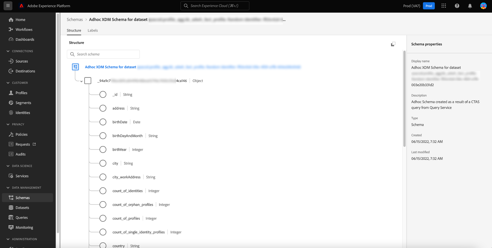

# Attributbaserad åtkomstkontroll för ad hoc-scheman

Alla data som hämtas in till Adobe Experience Platform kapslas in av XDM-scheman (Experience Data Model) och kan vara föremål för användarbegränsningar som definieras av din organisation eller av juridiska bestämmelser.

Genom att köra en CTAS-fråga via frågetjänsten när inget schema anges, genereras ett ad hoc-schema automatiskt. Det är ofta nödvändigt att begränsa användningen av vissa fält, eller datauppsättningar, i ad hoc-scheman för att kontrollera tillgången till både känsliga personuppgifter och personligt identifierbar information. Adobe Experience Platform underlättar den här åtkomstkontrollen genom att göra det möjligt att etikettera schemafält via plattformsgränssnittet med hjälp av den attributbaserade åtkomstkontrollen.

Etiketter kan användas när som helst, vilket ger flexibilitet i hur du väljer att styra data. Även om det är bäst att märka data så snart de har importerats till plattformen, eller så snart dessa data blir tillgängliga för användning i plattformen.

Schemabaserad märkning är en viktig komponent i den attributbaserade åtkomstkontrollen för att bättre hantera åtkomsten för användare eller grupper av användare. Med Adobe Experience Platform kan du begränsa åtkomsten till alla fält i ett ad hoc-schema genom att skapa och använda etiketter.

Det här dokumentet innehåller en självstudiekurs för att hantera åtkomst till känsliga data genom att tillämpa etiketter på datafält för ad hoc-scheman som genererats via Query Service.

## Komma igång

Handboken kräver en fungerande förståelse av följande komponenter i Adobe Experience Platform:

* [Experience Data Model (XDM) System](../../xdm/home.md): Det standardiserade ramverk som Experience Platform använder för att ordna kundupplevelsedata.
   * [[!DNL Schema Editor]](../../xdm/ui/overview.md): Lär dig hur du skapar och hanterar scheman och andra resurser i plattformsgränssnittet.
* [[!DNL Data Governance]](../../data-governance/home.md): Lär dig mer [!DNL Data Governance] gör att ni kan hantera kunddata och säkerställa att ni följer regler, begränsningar och policyer som gäller för dataanvändning.
* [Attributbaserad åtkomstkontroll](../../access-control/abac/overview.md): Attributbaserad åtkomstkontroll är en funktion i Adobe Experience Platform som gör att administratörer kan styra åtkomsten till specifika objekt och/eller funktioner baserat på attribut. Attribut kan läggas till i ett objekt, t.ex. en etikett som lagts till i ett ad hoc- eller reguljärt schemafält. En administratör definierar åtkomstprinciper som innehåller attribut för att hantera behörigheter för användaråtkomst.

## Skapa ett ad hoc-schema

När frågan har körts och resultaten har genererats genereras ett ad hoc-schema automatiskt och läggs till i schemalagret.

Om du vill lägga till en dataetikett går du till [!UICONTROL Schemas] kontrollpanelens flik genom att välja [!UICONTROL Schemas] till vänster i användargränssnittet för plattformen. Schemalagret visas.

>[!NOTE]
>
>Ad hoc-scheman visas inte som standard i schemalagret.

## Upptäck ad hoc-scheman i schemalagret för plattformsgränssnittet {#discover-ad-hoc-schemas}

Om du vill aktivera visning av ad hoc-scheman i plattformsgränssnittet väljer du filterikonen () till vänster om sökfältet och välj sedan **[!UICONTROL Show adhoc schemas] i den vänstra listen som visas.

Markera namnet på det senast skapade ad hoc-schemat i listan över tillgängliga. En visualisering av ad hoc-schemastrukturen visas.

## Redigera styrningsetiketter

Om du vill redigera dataetiketter för ditt ad hoc-schema väljer du [!UICONTROL Labels] -fliken. På arbetsytan Etiketter kan du använda, skapa och redigera etiketter i dina ad hoc-schemafält och styra åtkomstbehörigheter via gränssnittet. Alla fält i ad hoc-schemat visas här.

## Redigera etiketter för schemat eller fältet

Om du vill redigera etiketterna för hela schemat väljer du pennikonen () till sidan av schemats namn under [!UICONTROL Labels] -fliken.

Om du vill använda en etikett på ett befintligt fält väljer du ett eller flera fält i listan följt av [!UICONTROL Edit governance labels] till höger.

## Redigera etikettpekaren

The [!UICONTROL Edit labels] popover visas. I den här vyn kan du skapa eller redigera befintliga styrningsetiketter via användargränssnittet.

I dokumentationen finns anvisningar om hur du [skapa eller redigera etiketter för det valda schemat eller fältet](../../xdm/tutorials/labels.md#edit-the-labels-for-the-schema-or-field).

>[!NOTE]
>
>Om du vill skapa en ny etikett eller redigera en befintlig etikett måste du ha administratörsbehörighet för organisationen. Om du inte har administratörsbehörighet kontaktar du systemadministratören för att ordna åtkomst.

Etiketter kan också skapas med arbetsytan Behörigheter. Se [guide om hur du skapar etiketter på arbetsytan Behörigheter](../../access-control/abac/ui/labels.md) för instruktioner.

När rätt nivå av attributbaserad åtkomstkontroll har tillämpats gäller följande systembeteende för frågor som körs via frågetjänsten när en användare försöker få åtkomst till data som inte är tillgängliga:

1. Om en användare nekas åtkomst till ett av fälten i ett schema kan användaren inte läsa eller skriva i det begränsade fältet. Detta gäller följande vanliga scenarier:

   * När en användare försöker köra en fråga med endast en begränsad kolumn, kommer systemet att generera ett fel om att kolumnen inte finns.
   * När en användare försöker köra en fråga med flera kolumner som innehåller en begränsad kolumn, returneras endast utdata för alla kolumner som inte är begränsade.

1. Om en användare begär åtkomst till ett beräkningsfält måste användaren ha åtkomst till alla fält som används i kompositionen, annars nekas användaren åtkomst till beräkningsfältet.

Om en identitet eller primär identitet anges i ad hoc-schema, uppfyller systemet automatiskt alla associerade datahygienförfrågningar och rensar data i de datauppsättningar som är kopplade till identitetskolumnen.

## Nästa steg

När du har läst det här dokumentet får du en bättre förståelse för hur du lägger till dataanvändningsetiketter i ad hoc-scheman som skapats med Query Service CTAS-frågor. Om du inte redan har gjort det kan följande dokument vara användbara för att förbättra din förståelse för datastyrning i frågetjänsten:

* [Ad hoc-schematidentiteter](./ad-hoc-schema-identities.md)
* [Datastyrning](../../data-governance/home.md)
