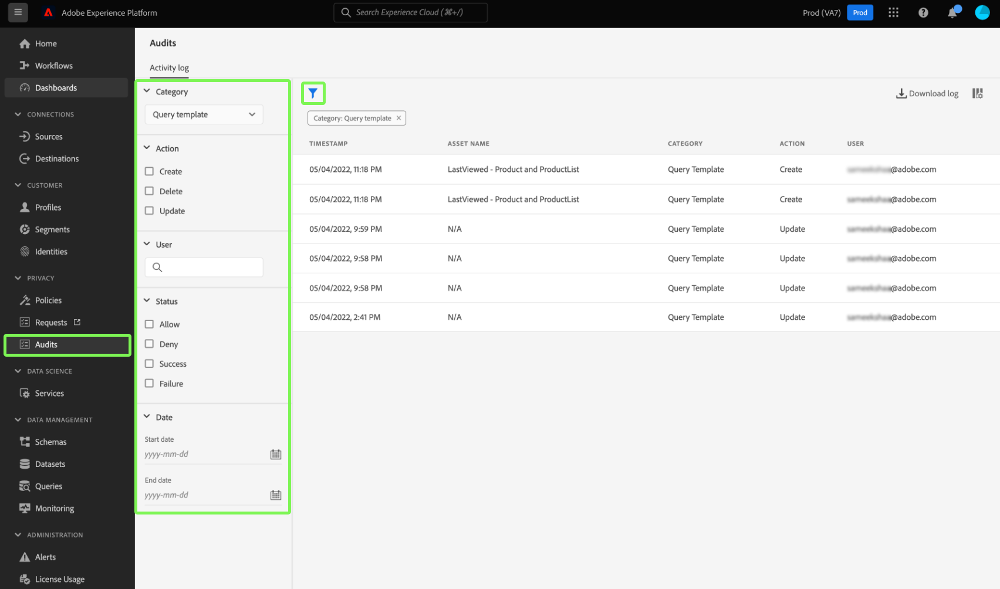

# Integrering av granskningslogg för [!DNL Query Service]

Granskningsloggsintegrationen i Adobe Experience Platform [!DNL Query Service] innehåller poster för frågerelaterade användaråtgärder. Granskningsloggar är ett viktigt verktyg för felsökning och för att följa företagets policyer för datahantering och krav på regelefterlevnad. Med den här funktionen kan du returnera en åtgärdslogg för många händelsetyper och filtrera och exportera posterna. Loggarna kan nås antingen via plattformsgränssnittet eller [API:t för granskningsfråga](https://www.adobe.io/experience-platform-apis/references/audit-query/) och hämtas i filformaten CSV eller JSON.

Mer information om användargränssnittet för granskningsloggar finns i [översiktsdokumentet för granskningsloggar](../../landing/governance-privacy-security/audit-logs/overview.md). Mer information om hur du anropar plattforms-API:er finns i [API-handboken för granskningsloggar](../../landing/api-guide.md).

## Förhandskrav

Du måste ha behörigheten [!DNL Data Governance] [!UICONTROL View User Activity Log] aktiverad för att kunna visa kontrollloggens kontrollpanel i plattformens användargränssnitt. Behörigheten aktiveras via Adobe [Admin Console](https://adminconsole.adobe.com/). Kontakta organisationens administratör om du inte har administratörsbehörighet för att aktivera den här behörigheten. I åtkomstkontrollsdokumentationen finns [fullständiga instruktioner om hur du lägger till behörigheter via Admin Console](../../access-control/home.md).

## [!DNL Query Service] granskningsloggskategorier {#audit-log-categories}

Granskningsloggkategorierna som tillhandahålls av [!DNL Query Service] är följande.

| Kategori | Beskrivning |
|---|---|
| [!UICONTROL Query] | Med den här kategorin kan du granska frågekörningar. |
| [!UICONTROL Query template] | Med den här kategorin kan du granska de olika åtgärder (skapa, uppdatera och ta bort) som har utförts på en frågemall. |
| [!UICONTROL Scheduled query] | Med den här kategorin kan du granska scheman som har skapats, uppdaterats eller tagits bort i [!DNL Query Service]. |

## Utför en [!DNL Query Service]-granskningslogg {#perform-an-audit-log}

Om du vill utföra en granskning för [!DNL Query Service] aktiviteter väljer du **[!UICONTROL Audits]** i den vänstra navigeringen, följt av panelikonen () om du vill visa en lista med filterkontroller för att begränsa resultatet.

På fliken [!UICONTROL Audits] dashboard [!UICONTROL Activity log] kan du filtrera alla inspelade plattformsåtgärder efter någon av [!DNL Query Service]-kategorierna. Loggresultaten kan filtreras ytterligare baserat på den tidsperiod som de kördes, vilken åtgärd/funktion som utfördes eller vilken användare som tog emot frågan. I granskningsloggens dokumentation finns [fullständiga anvisningar om hur du filtrerar loggarna baserat på kategori, åtgärd, användare och status](../../landing/governance-privacy-security/audit-logs/overview.md#managing-audit-logs-in-the-ui).

Returnerade granskningsloggdata innehåller följande information om alla frågor som uppfyller de valda filtervillkoren.

| Kolumnnamn | Beskrivning |
|---|---|
| [!UICONTROL Timestamp] | Exakt datum och tid för åtgärden som utfördes i formatet `month/day/year hour:minute AM/PM`. |
| [!UICONTROL Asset Name] | Värdet för fältet [!UICONTROL Asset Name] beror på vilken kategori som valts som ett filter. När du använder kategorin [!UICONTROL Scheduled query] är det här **schemanamnet**. När du använder kategorin [!UICONTROL Query template] är det här **mallnamnet**. När du använder kategorin [!UICONTROL Query] är detta **sessions-ID** |
| [!UICONTROL Category] | Det här fältet matchar den kategori som du har valt i listrutan för filter. |
| [!UICONTROL Action] | Det kan vara antingen skapa, ta bort, uppdatera eller köra. Vilka åtgärder som är tillgängliga beror på vilken kategori som valts som filter. |
| [!UICONTROL User] | Det här fältet innehåller användar-ID:t som körde frågan. |

>[!NOTE]
>
>Mer frågeinformation ges genom att du hämtar loggresultaten i antingen CSV- eller JSON-filformat, än vad som visas som standard på kontrollpanelen för granskningsloggen.

## Detaljpanel

Välj en rad med granskningsloggresultat för att öppna en informationspanel till höger på skärmen.

Du kan använda informationspanelen för att hitta [!UICONTROL Asset ID] och [!UICONTROL Event status].

Värdet för [!UICONTROL Asset ID] ändras beroende på vilken kategori som används i granskningen.

* När du använder kategorin [!UICONTROL Query] är [!UICONTROL Asset ID] sessions-ID **.**
* När du använder kategorin [!UICONTROL Query template] är [!UICONTROL Asset ID] mall-ID:t **** och prefixet `[!UICONTROL templateID:]`.
* När du använder kategorin [!UICONTROL Scheduled query] är [!UICONTROL Asset ID] **Schedule-ID** och prefixet med `[!UICONTROL scheduleID:]`.

Värdet för [!UICONTROL Event status] ändras beroende på vilken kategori som används i granskningen.

* När du använder kategorin [!UICONTROL Query] innehåller fältet [!UICONTROL Event status] en lista med alla **fråge-ID:n** som körts av användaren i den sessionen.
* När du använder kategorin [!UICONTROL Query template] anger fältet [!UICONTROL Event status] **mallnamnet** som ett prefix för händelsestatusen.
* När du använder kategorin [!UICONTROL Query schedule] anger fältet [!UICONTROL Event status] **schemanamnet** som ett prefix för händelsestatusen.

## Tillgängliga filter för [!DNL Query Service] granskningsloggskategorier {#available-filters}

Vilka filter som är tillgängliga varierar beroende på vilken kategori som har valts i listrutan. Följande tabell visar vilka filter som är tillgängliga för [[!DNL Query Service] granskningsloggskategorier](#audit-log-categories).

| Filter | Beskrivning |
|---|---|
| Kategori | En fullständig lista över tillgängliga kategorier finns i avsnittet [[!DNL Query Service] kategorier för granskningsloggar](#audit-log-categories). |
| Åtgärd | När du refererar till [!DNL Query Service] granskningskategorier är uppdateringen en **ändring av det befintliga formuläret**. Ta bort är **borttagningen av schemat eller mallen**, skapa **skapar ett nytt schema eller en ny mall** och kör **kör en fråga**. |
| Användare | Ange det fullständiga användar-ID:t (till exempel johndoe@acme.com) som ska filtreras efter användare. |
| Status | Alternativen [!UICONTROL Allow], [!UICONTROL Success] och [!UICONTROL Failure] filtrerar loggarna baserat på &quot;Status&quot; eller &quot;Händelsestatus&quot;, medan alternativet [!UICONTROL Deny] filtrerar bort **alla** loggar. |
| Datum | Välj ett startdatum och/eller ett slutdatum för att definiera ett datumintervall som resultaten ska filtreras efter. |

## Nästa steg

Genom att läsa det här dokumentet får du en bättre förståelse för [!DNL Query Service]-granskningsloggfunktionen och hur den kan användas för att filtrera [!DNL Query Service]-användaråtgärder.

Om du använder funktionen [!DNL Query Service] för granskningslogg i felsökningssyfte rekommenderar vi att du läser [felsökningsguiden](../troubleshooting-guide.md).
