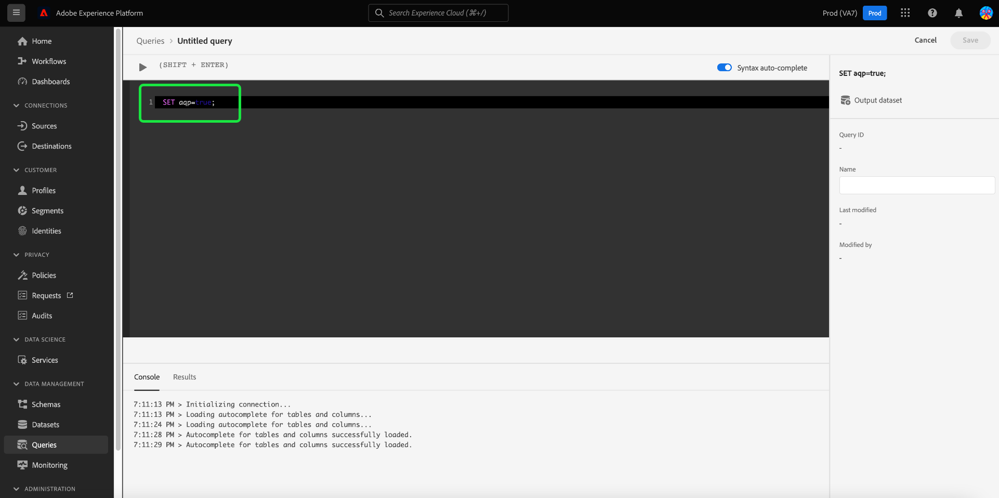

# Datauppsättningsexempel

Adobe Experience Platform Query Service innehåller exempeldatauppsättningar som en del av de ungefärliga frågebearbetningsfunktionerna. Exempeldatauppsättningar skapas med enhetliga slumpmässiga exempel från befintliga [!DNL Azure Data Lake Storage]-datauppsättningar (ADLS) som bara använder en procentandel av posterna från originalet. Denna procentandel kallas samplingsfrekvensen. Genom att justera samplingsfrekvensen för att styra balansen mellan noggrannhet och bearbetningstid kan du utföra undersökande frågor på stora data med avsevärt reducerad bearbetningstid på bekostnad av frågans exakthet.

Eftersom många användare inte behöver ett exakt svar för en sammanställningsåtgärd över en datauppsättning, är det effektivare att skicka en ungefärlig fråga för att returnera ett ungefärligt svar för undersökande frågor på stora datauppsättningar. Eftersom exempeldatauppsättningar bara innehåller en procentandel av data från den ursprungliga datauppsättningen, kan du få en mer exakt svarstid genom att utbyta frågor. Vid läsning måste Query Service skanna färre rader, vilket ger snabbare resultat än om du skulle fråga hela datauppsättningen.

För att du ska kunna hantera dina exempel för ungefärlig frågebearbetning har frågetjänsten stöd för följande åtgärder för datauppsättningsexempel:

- [Datauppsättningsexempel](#dataset-samples)
   - [Komma igång {#get-started}](#getting-started-get-started)
   - [Skapa ett enhetligt slumpmässigt datauppsättningsexempel {#create-a-sample}](#create-a-uniform-random-dataset-sample-create-a-sample)
   - [Du kan också ange filtervillkor {#optional-filter-criteria}](#optionally-specify-a-filter-criteria-optional-filter-criteria)
   - [Visa listan med exempel {#view-list-of-samples}](#view-the-list-of-samples-view-list-of-samples)
   - [Fråga exempeldatamängden {#query-sample-datasets}](#query-the-sample-dataset-query-sample-datasets)
   - [Ta bort datauppsättningsexempel {#delete-a-sample}](#delete-dataset-samples-delete-a-sample)

## Komma igång {#get-started}

Om du vill använda funktionerna för att skapa och ta bort ungefärliga frågebearbetningsfunktioner som beskrivs i det här dokumentet måste du ange sessionsflaggan till `true`. Ange kommandot `SET aqp=true;` från kommandoraden i antingen Frågeredigeraren eller din PSQL-klient.

>[!NOTE]
>
>Du måste aktivera sessionsflaggan varje gång du loggar in på plattformen.



## Skapa ett enhetligt exempel på en slumpmässig datauppsättning {#create-a-sample}

Använd kommandot `ANALYZE TABLE <table_name> TABLESAMPLE SAMPLERATE x` med ett datauppsättningsnamn för att skapa ett enhetligt slumpmässigt urval från den datauppsättningen.

Samplingsfrekvensen är procentandelen poster som tagits från den ursprungliga datauppsättningen. Du kan kontrollera samplingsfrekvensen med nyckelorden `TABLESAMPLE SAMPLERATE`. I det här exemplet motsvarar värdet 5,0 en samplingsfrekvens på 50 %. Värdet 2,5 motsvarar 25 % och så vidare.

>[!IMPORTANT]
>
>Systemet tillåter högst fem samplingar för varje datauppsättning. Om du försöker skapa en sjätte exempeldatauppsättning visas ett felmeddelande på skärmen om att samplingsgränsen har nåtts.

```sql
ANALYZE TABLE example_dataset_name TABLESAMPLE SAMPLERATE 5.0;
```

## Du kan också ange filtervillkor {#optional-filter-criteria}

Du kan välja att ange filtervillkor för dina enhetliga slumpmässiga prov. På så sätt kan du skapa ett exempel baserat på den filtrerade delmängden av den analyserade tabellen.

När du skapar ett exempel tillämpas det valfria filtret först, sedan skapas exemplet från den filtrerade vyn av datauppsättningen. Ett datauppsättningsexempel med ett tillämpat filter följer följande frågeformat:

```sql
ANALYZE TABLE <tableToAnalyze> TABLESAMPLE FILTERCONTEXT (<filter_condition>) SAMPLERATE X.Y;
ANALYZE TABLE <tableToAnalyze> TABLESAMPLE FILTERCONTEXT (<filter_condition_1> AND/OR <filter_condition_2>) SAMPLERATE X.Y;
ANALYZE TABLE <tableToAnalyze> TABLESAMPLE FILTERCONTEXT (<filter_condition_1> AND (<filter_condition_2> OR <filter_condition_3>)) SAMPLERATE X.Y;
```

Praktiska exempel på den här typen av filtrerade exempeldatauppsättningar är följande:

```sql
ANALYZE TABLE large_table TABLESAMPLE FILTERCONTEXT (month(to_timestamp(timestamp)) in ('8', '9')) SAMPLERATE 10;
ANALYZE TABLE large_table TABLESAMPLE FILTERCONTEXT (month(to_timestamp(timestamp)) in ('8', '9') AND product.name = "product1") SAMPLERATE 10;
ANALYZE TABLE large_table TABLESAMPLE FILTERCONTEXT (month(to_timestamp(timestamp)) in ('8', '9') AND (product.name = "product1" OR product.name = "product2")) SAMPLERATE 10;
```

I de angivna exemplen är tabellnamnet `large_table`, filtervillkoret i den ursprungliga tabellen är `month(to_timestamp(timestamp)) in ('8', '9')` och samplingsfrekvensen är (X% av filtrerade data), i det här fallet `10`.

## Visa listan med exempel {#view-list-of-samples}

Använd funktionen `sample_meta()` för att visa listan med exempel som är associerade med en ADLS-tabell.

```sql
SELECT sample_meta('example_dataset_name')
```

Listan med datauppsättningsexempel visas i formatet för exemplet nedan.

```shell
                  sample_table_name                  |    sample_dataset_id     |    parent_dataset_id     | sample_type | sampling_rate | sample_num_rows |       created      
-----------------------------------------------------+--------------------------+--------------------------+-------------+---------------+-----------------+---------------------
 x5e5cd8ea0a83c418a8ef0928_uniform_4_0_percent_ughk7 | 62ff19853d338f1c07b18965 | 5e5cd8ea0a83c418a8ef0928 | uniform     |           4.0 |             391 | 19/08/2022 05:03:01
(1 row)
```

## Fråga exempeldatauppsättningen {#query-sample-datasets}

Använd `{EXAMPLE_DATASET_NAME}` för att fråga exempeltabeller direkt. Du kan också lägga till nyckelordet `WITHAPPROXIMATE` i slutet av en fråga så använder frågetjänsten automatiskt det exempel som skapades senast.

```sql
SELECT * FROM example_dataset_name WITHAPPROXIMATE;
```

## Ta bort datauppsättningsexempel {#delete-a-sample}

Med borttagningsåtgärden kan du skapa nya exempel när den maximala gränsen på fem datauppsättningsexempel har nåtts.

```sql
DROP TABLESAMPLE x5e5cd8ea0a83c418a8ef0928_uniform_2_0_percent_bnhmc;
```

>[!NOTE]
>
>Om du har flera exempeldatauppsättningar som härletts från en ursprunglig ADLS-datauppsättning, tas även alla associerade exempel bort när originalet tas bort.
