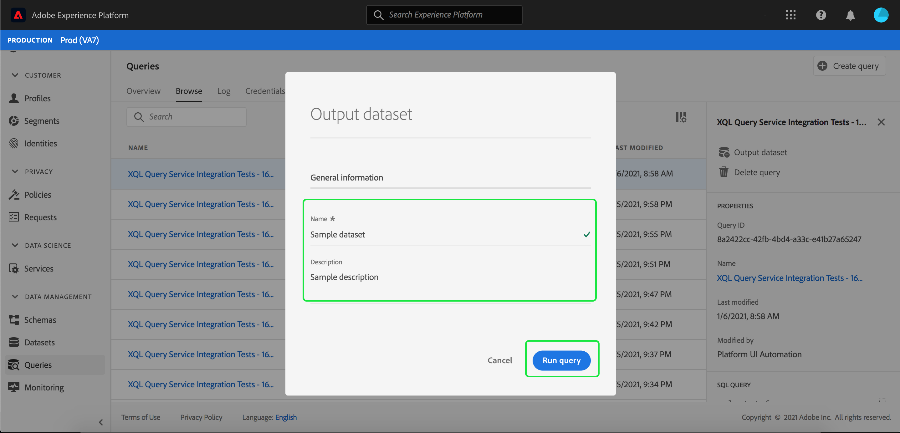

# Generera datauppsättningar från frågeresultat

Den verkliga styrkan hos [!DNL Query Service] visas när frågor används för att generera datauppsättningar i [!DNL Data Lake] som ska användas som indata i fler frågor eller i andra tjänster som [!DNL Data Science Workspace], [!DNL Real-time Customer Profile] eller [!DNL Analysis Workspace].

[!DNL Query Service] gör det möjligt att skapa datauppsättningar från användargränssnittet. Följ de här stegen:

1. Skriv frågan med en ansluten klient och validera utdata.
2. Logga in på användargränssnittet för [!DNL Platform] och gå till Frågor.
3. Leta reda på frågan i listan och hovra över raden.
4. Klicka på **[!UICONTROL Create Dataset]**. 
5. Ange ett datauppsättningsnamn som föregås av ditt LDAP-ID (behöver inte vara unikt eller SQL-säkert). systemet genererar ett&quot;tabellnamn&quot; baserat på det namn som anges här).
6. Ange en datauppsättningsbeskrivning och klicka på **[!UICONTROL Run Query]**.
7. Se frågan färdig och gå sedan till listsidan för datauppsättningar för att se den datauppsättning du just skapade.

När en datauppsättning har skapats kan den nås på samma sätt som andra datauppsättningar i [!DNL Data Lake] och användas för olika användningsområden.

>[!NOTE]
>
>I en aktiv implementering måste du använda [!DNL Data Governance]-etiketter när datauppsättningen har skapats.

## Generera datauppsättningar med ett fördefinierat [!DNL Experience Data Model]-schema

Om du vill generera en datauppsättning med ett fördefinierat [!DNL Experience Data Model]-schema (XDM) måste du använda SQL-syntaxen. Mer information om vilken syntax du måste använda finns i [SQL Syntax Guide](../sql/syntax.md#create-table-as-select).

## Utdatauppsättningar

Datauppsättningar som skapas med den här funktionen genereras med ett ad hoc-schema som matchar strukturen för utdata enligt SQL-satsen. Vissa underordnade tjänster kräver datauppsättningar med särskilda XDM-scheman ([!DNL Experience Data Model]). Kontrollera dataformateringskraven för tjänster längre fram i kedjan innan du skriver frågorna.