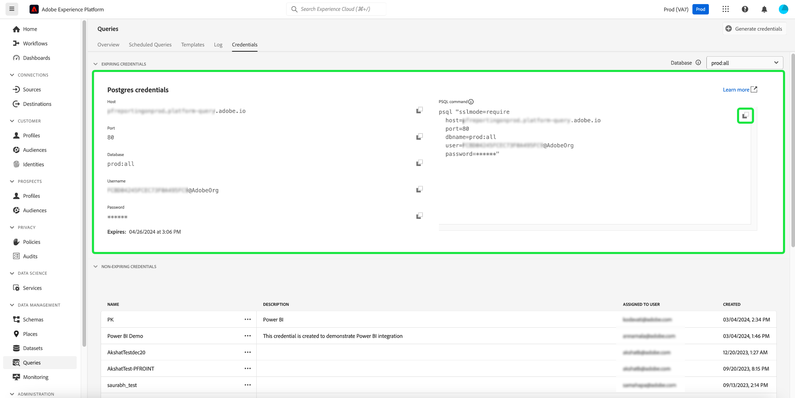

# Handbok för autentiseringsuppgifter

Med Adobe Experience Platform Query Service kan du ansluta till externa klienter. Du kan ansluta till dessa externa klienter genom att använda antingen utgångsdatum eller ej utgångsdatum.

## Utgående autentiseringsuppgifter

Du kan använda utgångsuppgifter för att snabbt konfigurera en anslutning till en extern klient.

Avsnittet **[!UICONTROL Expiring credentials]** innehåller följande information:

- **[!UICONTROL Host]**: Namnet på värden som du ansluter till. Vid anslutning till frågetjänsten innehåller detta namnet på den IMS-organisation som du för närvarande använder.
- **[!UICONTROL Port]**: Portnumret för värddatorn som du ansluter till.
- **[!UICONTROL Database]**: Namnet på den databas som du ansluter till.
- **[!UICONTROL Username]**: Användarnamnet som du använder för att ansluta till frågetjänsten.
- **[!UICONTROL Password]**: Lösenordet som du ska använda för att ansluta till frågetjänsten.
- **[!UICONTROL PSQL command]**: Ett kommando som automatiskt har infogat all relevant information för att ansluta till frågetjänsten med PSQL på kommandoraden.
- **[!UICONTROL Expires]**: Utgångsdatumet för inloggningsuppgifterna. Autentiseringsuppgifterna går ut 24 timmar efter att de har skapats.

## Giltiga autentiseringsuppgifter

Du kan använda autentiseringsuppgifter som inte upphör att gälla för att konfigurera en mer permanent anslutning till en extern klient.

Välj **[!UICONTROL Generate credentials]** om du vill skapa en uppsättning icke-förfallande autentiseringsuppgifter.

>[!NOTE]
>
>Innan du kan skapa autentiseringsuppgifter som inte förfaller måste du ha både behörigheterna **Sandlådor** och **Hantera frågetjänstintegrering**. Läs dokumentationen om [Åtkomstkontroll](../../access-control/home.md) om du vill lära dig hur du tilldelar dessa behörigheter.

Genereringen av autentiseringsuppgifter modal visas. Om du vill skapa inloggningsuppgifter som inte förfaller måste du ange följande information:

- **[!UICONTROL Name]**: Namnet på de autentiseringsuppgifter som du genererar.
- **[!UICONTROL Description]**: (Valfritt) En beskrivning av de autentiseringsuppgifter som du genererar.
- **[!UICONTROL Assigned to]**: Användaren som autentiseringsuppgifterna ska tilldelas. Värdet ska vara e-postadressen till den användare som skapar inloggningsuppgifterna.
- **[!UICONTROL Password]** (Valfritt) Ett valfritt lösenord för dina inloggningsuppgifter. Om lösenordet inte är inställt genererar Adobe automatiskt ett lösenord åt dig.

När du har angett all nödvändig information väljer du **[!UICONTROL Generate credentials]** för att generera dina autentiseringsuppgifter.

>[!IMPORTANT]
>
>När du har valt knappen **[!UICONTROL Generate credentials]**, en konfigurationsfil som innehåller information om till exempel tekniskt kontonamn, tekniskt konto-ID och autentiseringsuppgifter. Eftersom Adobe **inte** spelar in de genererade autentiseringsuppgifterna måste du **lagra den hämtade filen säkert och spara en inloggningsuppgift.**
>
>Om inloggningsuppgifterna inte används på 90 dagar rensas de också.

Nu när du har sparat dina genererade autentiseringsuppgifter väljer du **[!UICONTROL Close]**. Nu kan du se en lista över alla dina ej förfallna autentiseringsuppgifter.

Du kan antingen redigera eller ta bort dina uppgifter som inte förfaller. Om du vill redigera en referens som inte upphör att gälla väljer du pennikonen (). Om du vill ta bort en autentiseringsuppgift som inte förfaller väljer du borttagningsikonen ().

När du redigerar en referens som inte förfaller visas ett modalt värde. Du kan uppdatera följande information:

- **[!UICONTROL Name]**: Namnet på de autentiseringsuppgifter som du genererar.
- **[!UICONTROL Description]**: (Valfritt) En beskrivning av de autentiseringsuppgifter som du genererar.
- **[!UICONTROL Assigned to]**: Användaren som autentiseringsuppgifterna ska tilldelas. Värdet ska vara e-postadressen till den användare som skapar inloggningsuppgifterna.

När du har angett all nödvändig information väljer du **[!UICONTROL Update account]** för att slutföra uppdateringen av dina autentiseringsuppgifter.

## Använda autentiseringsuppgifter för att ansluta till externa klienter

Du kan använda autentiseringsuppgifterna som förfaller eller inte förfaller för att ansluta till externa klienter, som Aqua Data Studio, Looker eller Power BI.

När du ansluter till dessa externa klienter måste du vanligtvis inkludera följande information:

- **Server/värd**: Namnet på den server/värd som du ansluter till. Det här värdet har formen `server.adobe.io` och finns under **[!UICONTROL Host]** i avsnittet med förfallande autentiseringsuppgifter.
- **Port**: Porten för den server/värd som du ansluter till. Det här värdet finns under **[!UICONTROL Port]** i avsnittet med förfallande autentiseringsuppgifter. Ett exempelvärde för porten skulle vara `80`.
- **Användarnamn**: Användarnamnet för användaren som ansluter till den externa klienten. Detta har formen `ID@AdobeOrg` och finns under **[!UICONTROL Username]** i avsnittet med förfallna autentiseringsuppgifter.
- **Lösenord**: Lösenordet för den användare som ansluter till den externa klienten. Om du använder inloggningsuppgifter som förfaller finns dessa under **[!UICONTROL Password]** i avsnittet med inloggningsuppgifter som förfaller. Om du använder inloggningsuppgifter som inte upphör att gälla, består det här värdet av både det tekniska konto-ID:t och inloggningsuppgifterna i formuläret: `technicalAccountId:credential`.
- **Databas**: Databasen som du ansluter till. Det här värdet finns under **[!UICONTROL Database]** i avsnittet med förfallande autentiseringsuppgifter. Ett exempelvärde för databasen skulle vara `prod:all`.

## Nästa steg

Nu när du förstår hur både förfallodatum och icke-utgångsdatum fungerar kan du använda dessa autentiseringsuppgifter för att ansluta till externa klienter. Mer information om externa klienter finns i [Ansluta klienter till frågetjänstguiden](../clients/overview.md).