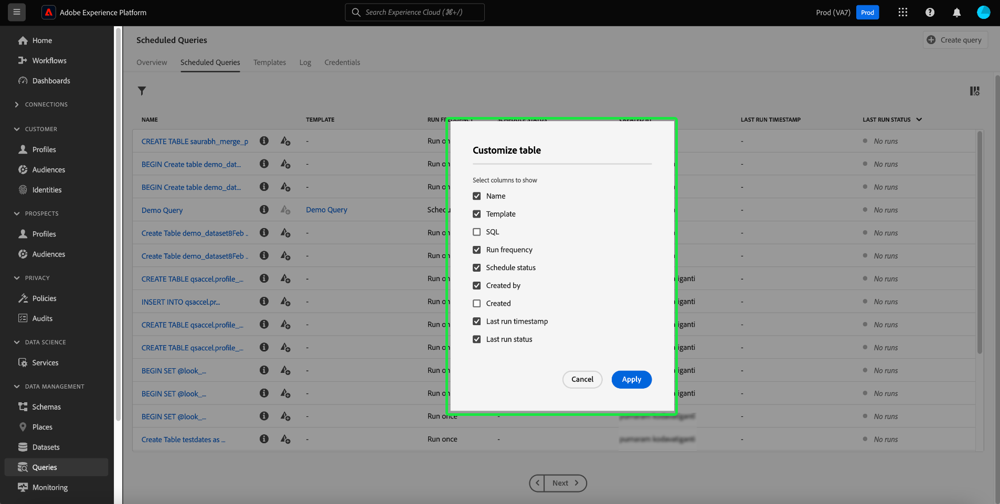

# Övervaka schemalagda frågor

Adobe Experience Platform ger bättre synlighet för status för alla frågefunktioner via användargränssnittet. På fliken [!UICONTROL Scheduled Queries] kan du nu hitta viktig information om dina frågekörningar som omfattar status, schemainformation och felmeddelanden/koder om de skulle misslyckas. Du kan även prenumerera på aviseringar för frågor baserat på deras status via användargränssnittet för någon av dessa frågor via fliken [!UICONTROL Scheduled Queries].

## [!UICONTROL Scheduled Queries]

Fliken [!UICONTROL Scheduled Queries] innehåller en översikt över alla dina schemalagda CTAS- och ITAS-frågor. Det går att hitta körningsinformation för alla schemalagda frågor samt felkoder och meddelanden för eventuella misslyckade frågor.

Om du vill navigera till fliken [!UICONTROL Scheduled Queries] väljer du **[!UICONTROL Queries]** i det vänstra navigeringsfältet följt av **[!UICONTROL Scheduled Queries]**

Tabellen nedan beskriver varje tillgänglig kolumn.

>[!NOTE]
>
>Ikonen för aviseringsprenumerationer () finns i varje rad i en namnlös kolumn. Mer information finns i avsnittet [Varningsprenumerationer](#alert-subscription).

| Kolumn | Beskrivning |
|---|---|
| **[!UICONTROL Name]** | Namnfältet är antingen mallnamnet eller de första tecknen i SQL-frågan. Alla frågor som skapas via gränssnittet med Frågeredigeraren får i början ett namn. Om frågan skapades med API:t blir dess namn ett fragment av den ursprungliga SQL-kod som användes för att skapa frågan. Om du vill visa en lista över alla körningar som är associerade med frågan väljer du ett objekt i kolumnen [!UICONTROL Name]. Mer information finns i avsnittet [Frågor kör schemainformation](#query-runs). |
| **[!UICONTROL Template]** | Frågans mallnamn. Välj ett mallnamn för att gå till Frågeredigeraren. Frågemallen visas i Frågeredigeraren. Om det inte finns något mallnamn markeras raden med ett bindestreck och det går inte att omdirigera till Frågeredigeraren för att visa frågan. |
| **[!UICONTROL SQL]** | Ett fragment av SQL-frågan. |
| **[!UICONTROL Run frequency]** | Den gräns som frågan är inställd på att köras vid. De tillgängliga värdena är `Run once` och `Scheduled`. |
| **[!UICONTROL Created by]** | Namnet på den användare som skapade frågan. |
| **[!UICONTROL Created]** | Tidsstämpeln när frågan skapades, i UTC-format. |
| **[!UICONTROL Last run timestamp]** | Den senaste tidsstämpeln när frågan kördes. Den här kolumnen visar om en fråga har körts enligt det aktuella schemat. |
| **[!UICONTROL Last run status]** | Status för den senaste frågekörningen. Statusvärdena är: `Success`, `Failed`, `In progress` och `No runs`. |
| **[!UICONTROL Schedule Status]** | Den schemalagda frågans aktuella status. Det finns sex möjliga värden, [!UICONTROL Registering], [!UICONTROL Active], [!UICONTROL Inactive], [!UICONTROL Deleted], ett bindestreck och [!UICONTROL Quarantined].<ul><li>Statusen **[!UICONTROL Registering]** anger att systemet fortfarande bearbetar skapandet av det nya schemat för frågan. Observera att du inte kan inaktivera eller ta bort en schemalagd fråga medan den registreras.</li><li>Statusen **[!UICONTROL Active]** anger att den schemalagda frågan **ännu inte har passerat** sitt slutförandedatum och sin slutförandetid.</li><li>Statusen **[!UICONTROL Inactive]** anger att den schemalagda frågan har **passerat** sitt slutförandedatum och sin slutförandetid eller har markerats av en användare som inaktiv.</li><li>Statusen **[!UICONTROL Deleted]** anger att frågeschemat har tagits bort.</li><li>Avstavningen anger att den schemalagda frågan är en enstaka, icke återkommande fråga.</li><li>Statusen **[!UICONTROL Quarantined]** indikerar att frågan har misslyckats tio körningar i följd och kräver att du gör något innan fler körningar kan utföras.</li></ul> |

>[!TIP]
>
>Om du går till Frågeredigeraren kan du välja **[!UICONTROL Queries]** för att gå tillbaka till fliken [!UICONTROL Templates].

## Anpassa tabellinställningar för schemalagda frågor {#customize-table}

Du kan justera kolumnerna på fliken [!UICONTROL Scheduled Queries] efter dina behov. Om du vill öppna dialogrutan [!UICONTROL Customize table]-inställningar och redigera tillgängliga kolumner väljer du inställningsikonen () i skärmens övre högra hörn.

>[!NOTE]
>
>Kolumnen [!UICONTROL Created] som refererar till datumet då schemat skapades är dold som standard.

Växla mellan de relevanta kryssrutorna för att ta bort eller lägga till en tabellkolumn. Välj sedan **[!UICONTROL Apply]** för att bekräfta dina val.

>[!NOTE]
>
>Alla frågor som har skapats via användargränssnittet blir en namngiven mall som en del av skapandeprocessen. Mallnamnet visas i mallkolumnen. Om frågan skapades via API är mallkolumnen tom.

## Hantera schemalagda frågor med infogade åtgärder {#inline-actions}

I vyn [!UICONTROL Scheduled Queries] finns olika infogade åtgärder för att hantera alla dina schemalagda frågor från en plats. Textbundna åtgärder anges på varje rad med ellips. Markera ellipsen för en schemalagd fråga som du vill hantera för att se de tillgängliga alternativen på en snabbmeny. De tillgängliga alternativen är [[!UICONTROL Disable schedule]](#disable) eller [!UICONTROL Enable schedule], [[!UICONTROL Delete schedule]](#delete), [[!UICONTROL Subscribe]](#alert-subscription) för att fråga efter varningar och [Aktivera eller [!UICONTROL Disable quarantine]](#quarantined-queries).

### Inaktivera eller aktivera en schemalagd fråga {#disable}

Om du vill inaktivera en schemalagd fråga markerar du ellipsen för den schemalagda fråga som du vill hantera och väljer sedan **[!UICONTROL Disable schedule]** bland alternativen på snabbmenyn. En dialogruta visas där du kan bekräfta åtgärden. Välj **[!UICONTROL Disable]** för att bekräfta inställningen.

När en schemalagd fråga har inaktiverats kan du aktivera schemat via samma process. Markera ellipsen och välj sedan **[!UICONTROL Enable schedule]** bland de tillgängliga alternativen.

>[!NOTE]
>
>Om en fråga har placerats i karantän bör du granska mallens SQL innan du aktiverar dess schema. Detta förhindrar slöseri med beräkningstimmar om mallfrågan fortfarande har problem.

### Ta bort en schemalagd fråga {#delete}

Om du vill ta bort en schemalagd fråga markerar du ellipsen för den schemalagda fråga som du vill hantera och väljer sedan **[!UICONTROL Delete schedule]** bland alternativen på snabbmenyn. En dialogruta visas där du kan bekräfta åtgärden. Välj **[!UICONTROL Delete]** för att bekräfta inställningen.

När en schemalagd fråga har tagits bort tas den **inte** bort från listan med schemalagda frågor. De infogade åtgärder som tillhandahålls av ellipserna tas bort och ersätts av den nedtonade prenumerationsikonen för att lägga till aviseringar. Du kan inte prenumerera på aviseringar för det borttagna schemat. Raden finns kvar i användargränssnittet för att ge information om körningar som utförts som en del av den schemalagda frågan.

Om du vill schemalägga körningar för den frågemallen väljer du mallnamnet på lämplig rad för att navigera till frågeredigeraren och följer sedan [instruktionerna för att lägga till ett schema i en fråga](./query-schedules.md#create-schedule) enligt beskrivningen i dokumentationen.

### Prenumerera på aviseringar {#alert-subscription}

Om du vill prenumerera på aviseringar för schemalagda frågekörningar väljer du ikonen `...` (ellips) eller aviseringsprenumeration () för den schemalagda frågan som du vill hantera. Listrutan för textbundna åtgärder visas. Välj sedan **[!UICONTROL Subscribe]** bland de tillgängliga alternativen.

Dialogrutan [!UICONTROL Alerts] öppnas. Dialogrutan [!UICONTROL Alerts] prenumererar på både UI-meddelanden och e-postaviseringar. Det finns flera olika prenumerationsalternativ: `start`, `success`, `failure`, `quarantine` och `delay`. Markera lämpliga rutor och välj **[!UICONTROL Save]** att prenumerera på.

Tabellen nedan förklarar vilka frågeartikeltyper som stöds:

| Aviseringstyp | Beskrivning |
|---|---|
| `start` | Den här varningen meddelar dig när en schemalagd frågekörning initieras eller börjar bearbetas. |
| `success` | Den här varningen informerar dig när en schemalagd frågekörning har slutförts, vilket anger att frågan har körts utan fel. |
| `failed` | Den här varningen utlöses när en schemalagd frågekörning påträffar ett fel eller misslyckas med att köras. Det hjälper er att snabbt identifiera och åtgärda problem. |
| `quarantine` | Den här varningen aktiveras när en schemalagd frågekörning sätts i karantän. När frågor registreras i [karantänfunktionen](#quarantined-queries) placeras automatiskt alla schemalagda frågor som misslyckas tio på varandra följande körningar i tillståndet [!UICONTROL Quarantined]. De måste sedan ingripa innan fler avrättningar kan utföras. |
| `delay` | Den här varningen meddelar dig om det finns en [fördröjning i resultatet av en frågekörning](#query-run-delay) över ett angivet tröskelvärde. Du kan ange en anpassad tid som utlöser varningen när frågan körs för den tidslängden utan att slutföra eller misslyckas. |

>[!NOTE]
>
>Om du vill bli meddelad om att en fråga håller på att sättas i karantän måste du först registrera den schemalagda frågan som körs i [karantänfunktionen](#quarantined-queries).

Mer information finns i [API-dokumentationen för aviseringsprenumerationer](../api/alert-subscriptions.md).

### Visa frågedetaljer {#query-details}

Välj informationsikonen () om du vill visa informationspanelen för frågan. Panelen Detaljer innehåller all relevant information om frågan utöver de fakta som finns i tabellen med schemalagda frågor. Ytterligare information omfattar fråge-ID, senaste ändringsdatum, frågans SQL, schema-ID och aktuellt uppsättningsschema.

## Frågor i karantän {#quarantined-queries}

>[!NOTE]
>
>Karantänsvarningen är inte tillgänglig för ad hoc-frågor som körs en gång. Karantänsvarningen gäller endast för schemalagda batchfrågor (CTAS och ITAS).

När en schemalagd fråga som misslyckas tio på varandra följande körningar registreras i karantänfunktionen får automatiskt statusen [!UICONTROL Quarantined]. En fråga med den här statusen blir inaktiv och körs inte vid den schemalagda tidpunkten. Sedan måste du ingripa innan fler exekveringar kan utföras. Detta skyddar systemresurser eftersom du måste granska och korrigera problemen med din SQL innan fler körningar utförs.

Om du vill aktivera en schemalagd fråga för karantänfunktionen väljer du ellipserna (`...`) följt av [!UICONTROL Enable quarantine] i listrutan som visas.

Frågor kan också registreras i karantänfunktionen när schemat skapas. Mer information finns i [dokumentationen om frågescheman](./query-schedules.md#quarantine).

## Fördröjning för frågekörning {#query-run-delay}

Ha full kontroll över beräkningstiden genom att ange varningar för fördröjning av frågor. Du kan övervaka frågeprestanda och få meddelanden om en frågas status inte ändras efter en viss period. Använd aviseringen [!UICONTROL Query Run Delay] om du vill få ett meddelande om en fråga fortsätter att bearbetas efter en viss tidsperiod utan att slutföras.

När du [prenumererar på aviseringar](#alert-subscription) för schemalagda frågekörningar är en av de tillgängliga aviseringarna [!UICONTROL Query Run Delay]. Den här varningen kräver att du anger en tröskel för hur lång tid som har ägnats åt att köra. Då får du ett meddelande om fördröjningen i bearbetningen.

Om du vill välja en tröskelvaraktighet som utlöser meddelandet anger du antingen ett tal i textinmatningsfältet eller använder upp- och nedpilarna för att öka i steg om en minut. Eftersom tröskelvärdet anges i minuter är den längsta tiden för att observera en fördröjning av frågekörning 1 440 minuter (24 timmar). Standardtidsperioden för en körningsfördröjning är 150 minuter.

>[!NOTE]
>
>En frågekörning kan bara ha en körfördröjningstid. Om du ändrar fördröjningströskeln ändras den för användaren som prenumererar på aviseringen och för hela organisationen.

Se avsnittet om prenumerationer på aviseringar om du vill veta mer om hur du [prenumererar på [!UICONTROL Query Run Delay] aviseringar](#alert-subscription).

## Filtrera frågor {#filter}

Du kan filtrera frågor baserat på körningsfrekvens. På fliken [!UICONTROL Scheduled Queries] väljer du filterikonen () för att öppna filtersidofältet.

Om du vill filtrera listan med frågor baserat på deras körningsfrekvens markerar du kryssrutorna **[!UICONTROL Scheduled]** eller **[!UICONTROL Run once]** för filtret.

>[!NOTE]
>
>Alla frågor som har körts men inte schemalagts kvalificeras som [!UICONTROL Run once].

När du har aktiverat filtervillkoren väljer du **[!UICONTROL Hide Filters]** för att stänga filterpanelen.

## Information om schemaläggning av frågekörningar {#query-runs}

Om du vill öppna sidan med schemainformation väljer du ett frågenamn på fliken [!UICONTROL Scheduled Queries]. Den här vyn innehåller en lista över alla körningar som har utförts som en del av den schemalagda frågan. Informationen omfattar start- och sluttid, status och datauppsättning som används.

Den här informationen finns i en tabell med fem kolumner. Varje rad betecknar en frågekörning.

| Kolumnnamn | Beskrivning |
|---|---|
| **[!UICONTROL Query run ID]** | Frågekörnings-ID för daglig körning. Välj **[!UICONTROL Query run ID]** för att navigera till [!UICONTROL Query run overview]. |
| **[!UICONTROL Query run start]** | Tidsstämpeln när frågan kördes. Tidsstämpeln är i UTC-format. |
| **[!UICONTROL Query run complete]** | Tidsstämpeln när frågan slutfördes. Tidsstämpeln är i UTC-format. |
| **[!UICONTROL Status]** | Status för den senaste frågekörningen. Statusvärdena är: `Success`, `Failed`, `In progress` eller `Quarantined`. |
| **[!UICONTROL Dataset]** | Den datauppsättning som ingår i körningen. |

Information om frågan som schemaläggs kan visas på panelen [!UICONTROL Properties]. Panelen innehåller det inledande fråge-ID:t, klienttyp, mallnamn, frågans SQL-kod och schemats avslutning.

Välj ett ID för frågekörning för att navigera till sidan med körningsinformation och visa frågeinformation.

## Översikt över frågekörning {#query-run-overview}

[!UICONTROL Query run overview] innehåller information om enskilda körningar för den här schemalagda frågan och en mer detaljerad beskrivning av körningsstatusen. Den här sidan innehåller även klientinformation och information om eventuella fel som kan ha gjort att frågan misslyckades.

I avsnittet med frågestatus finns felkoden och felmeddelandet om frågan skulle ha misslyckats.

Du kan kopiera frågans SQL till Urklipp från den här vyn. Om du vill kopiera frågan väljer du kopieringsikonen i det övre högra hörnet av SQL-fragmentet. Ett popup-meddelande bekräftar att koden har kopierats.

### Kör information för frågor med anonymt block {#anonymous-block-queries}

Frågor som använder anonyma block för att bilda SQL-satser separeras till sina individuella underfrågor. Genom att dela upp i underfrågor kan du inspektera körningsinformationen för varje frågeblock individuellt.

>[!NOTE]
>
>Körningsinformationen för ett anonymt block som använder DROP-kommandot **rapporteras inte** som en separat underfråga. Separata körningsdetaljer finns tillgängliga för CTAS-frågor, ITAS-frågor och COPY-satser som används som anonyma blockunderfrågor. Körningsinformation för DROP-kommandot stöds för närvarande inte.

Anonyma block markeras med ett `$$`-prefix före frågan. Mer information om anonyma block i frågetjänsten finns i [det anonyma blockdokumentet](../key-concepts/anonymous-block.md).

Anonyma blockunderfrågor har tabbar till vänster om körningsstatusen. Välj en flik för att visa körningsinformation.

Om en anonym blockfråga misslyckas, kan du hitta felkoden för just det blocket via det här användargränssnittet.

Välj **[!UICONTROL Query]** om du vill återgå till skärmen med schemainformation eller **[!UICONTROL Scheduled Queries]** om du vill gå tillbaka till fliken [!UICONTROL Scheduled Queries].

