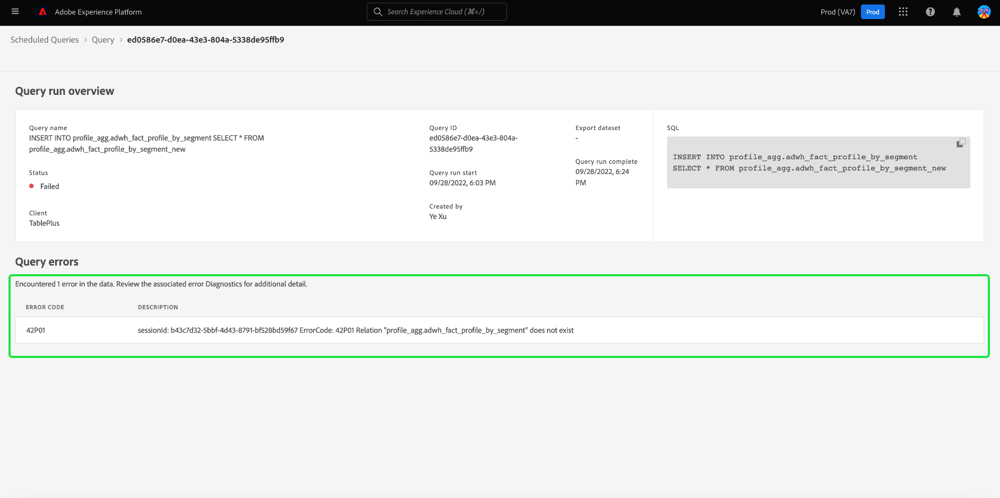

# Övervaka schemalagda frågor

Adobe Experience Platform ger bättre synlighet för status för alla frågefunktioner via användargränssnittet. Från [!UICONTROL Scheduled Queries] kan du nu hitta viktig information om frågekörningar som innehåller status, schemainformation och felmeddelanden/koder om de skulle misslyckas. Du kan även prenumerera på aviseringar för frågor baserat på deras status via användargränssnittet för någon av dessa frågor via [!UICONTROL Scheduled Queries] -fliken.

## [!UICONTROL Scheduled Queries]

The [!UICONTROL Scheduled Queries] ger en översikt över alla dina schemalagda CTAS- och ITAS-frågor. Det går att hitta körningsinformation för alla schemalagda frågor samt felkoder och meddelanden för eventuella misslyckade frågor.

Navigera till [!UICONTROL Scheduled Queries] flik, välja **[!UICONTROL Queries]** från vänster navigeringsfält följt av **[!UICONTROL Scheduled Queries]**

Tabellen nedan beskriver varje tillgänglig kolumn.

>[!NOTE]
>
>Varningssymbolen för prenumerationer finns på varje rad i en namnlös kolumn. Se [aviseringsprenumerationer](#alert-subscription) för mer information.

| Kolumn | Beskrivning |
|---|---|
| **[!UICONTROL Name]** | Namnfältet är antingen mallnamnet eller de första tecknen i SQL-frågan. Alla frågor som skapas via gränssnittet med Frågeredigeraren får i början ett namn. Om frågan skapades med API blir dess namn ett fragment av den ursprungliga SQL som användes för att skapa frågan. Välj ett objekt från [!UICONTROL Name] om du vill visa en lista över alla körningar som är associerade med frågan. Mer information finns i [fråga kör schemadetaljer](#query-runs) -avsnitt. |
| **[!UICONTROL Template]** | Frågans mallnamn. Välj ett mallnamn för att gå till Frågeredigeraren. Frågemallen visas i Frågeredigeraren. Om det inte finns något mallnamn markeras raden med ett bindestreck och det går inte att omdirigera till Frågeredigeraren för att visa frågan. |
| **[!UICONTROL SQL]** | Ett fragment av SQL-frågan. |
| **[!UICONTROL Run frequency]** | Det här är den avslutning som frågan är inställd på att köras. De tillgängliga värdena är `Run once` och `Scheduled`. Frågor kan filtreras utifrån deras körningsfrekvens. |
| **[!UICONTROL Created by]** | Namnet på den användare som skapade frågan. |
| **[!UICONTROL Created]** | Tidsstämpeln när frågan skapades, i UTC-format. |
| **[!UICONTROL Last run timestamp]** | Den senaste tidsstämpeln när frågan kördes. Den här kolumnen visar om en fråga har körts enligt det aktuella schemat. |
| **[!UICONTROL Last run status]** | Status för den senaste frågekörningen. Statusvärdena är: `Success`, `Failed`, `In progress`och `No runs`. |

>[!TIP]
>
>Om du går till Frågeredigeraren kan du välja **[!UICONTROL Queries]** för att gå tillbaka till [!UICONTROL Templates] -fliken.

### Anpassa tabellinställningar för schemalagda frågor

Du kan justera kolumnerna på [!UICONTROL Scheduled Queries] efter behov. Välj inställningsikonen () för att öppna [!UICONTROL Customize table] och redigera tillgängliga kolumner.

Växla mellan de relevanta kryssrutorna för att ta bort eller lägga till en tabellkolumn. Nästa, välj **[!UICONTROL Apply]** för att bekräfta dina val.

>[!NOTE]
>
>Alla frågor som har skapats via användargränssnittet blir en namngiven mall som en del av skapandeprocessen. Mallnamnet visas i mallkolumnen. Om frågan skapades via API är mallkolumnen tom.

### Prenumerera på aviseringar {#alert-subscription}

Du kan prenumerera på aviseringar från [!UICONTROL Scheduled Queries] -fliken. Markera varningsmeddelandeikonen () bredvid ett frågenamn för att öppna [!UICONTROL Alerts] -dialogrutan. The [!UICONTROL Alerts] prenumererar på både UI-meddelanden och e-postaviseringar. Varningar baseras på frågans status. Det finns tre alternativ: `start`, `success`och `failure`. Markera lämplig ruta eller rutor och välj **[!UICONTROL Save]** prenumerera.

Se [API-dokumentation för aviseringsprenumerationer](../api/alert-subscriptions.md) för mer information.

### Filtrera frågor {#filter}

Du kan filtrera frågor baserat på körningsfrekvens. Från [!UICONTROL Scheduled Queries] väljer du filterikonen () för att öppna filtersidofältet.

Välj antingen **[!UICONTROL Scheduled]** eller **[!UICONTROL Run once]** kör kryssrutor för frekvensfilter för att filtrera listan med frågor.

>[!NOTE]
>
>Alla frågor som har körts men inte schemalagts kvalificeras som [!UICONTROL Run once].

När du har aktiverat filtervillkoren väljer du **[!UICONTROL Hide Filters]** för att stänga filterpanelen.

## Information om schemaläggning av frågekörningar {#query-runs}

Välj ett frågenamn för att navigera till sidan med schemainformation. Den här vyn innehåller en lista över alla körningar som har utförts som en del av den schemalagda frågan. Informationen omfattar start- och sluttid, status och datauppsättning som används.

Den här informationen finns i en tabell med fem kolumner. Varje rad betecknar en frågekörning.

| Kolumnnamn | Beskrivning |
|---|---|
| **[!UICONTROL Query run ID]** | Frågekörnings-ID för daglig körning. Välj **[!UICONTROL Query run ID]** för att navigera till [!UICONTROL Query run overview]. |
| **[!UICONTROL Query run start]** | Tidsstämpeln när frågan kördes. Detta är i UTC-format. |
| **[!UICONTROL Query run complete]** | Tidsstämpeln när frågan slutfördes. Detta är i UTC-format. |
| **[!UICONTROL Status]** | Status för den senaste frågekörningen. De tre statusvärdena är: `successful` `failed` eller `in progress`. |
| **[!UICONTROL Dataset]** | Den datauppsättning som ingår i körningen. |

Information om frågan som schemaläggs finns i [!UICONTROL Properties] -panelen. Panelen innehåller det inledande fråge-ID:t, klienttyp, mallnamn, frågans SQL-kod och schemats avslutning.

Välj ett ID för frågekörning för att navigera till sidan med körningsinformation och visa frågeinformation.

## Översikt över frågekörning {#query-run-overview}

The [!UICONTROL Query run overview] ger information om enskilda körningar för den här schemalagda frågan och en mer detaljerad beskrivning av körningsstatusen. Den här sidan innehåller även klientinformation och information om eventuella fel som kan ha gjort att frågan misslyckades.

Avsnittet med frågans status innehåller felkoden och felmeddelandet om frågan skulle ha misslyckats.

Du kan kopiera frågans SQL till Urklipp från den här vyn. Kopiera frågan genom att markera kopieringsikonen i det övre högra hörnet av SQL-fragmentet. Ett popup-meddelande bekräftar att koden har kopierats.

### Kör information för frågor med anonymt block {#anonymous-block-queries}

Frågor som använder anonyma block för att bilda SQL-satser separeras till sina individuella frågor. På så sätt kan du inspektera körningsinformationen för varje frågeblock individuellt.

Anonyma block markeras med en `$$` prefix före frågan. Se [anonymt blockdokument](../essential-concepts/anonymous-block.md) om du vill veta mer om anonyma block i frågetjänsten.

Anonyma blockfrågor har tabbar till vänster om körningsstatusen. Välj en flik för att visa körningsinformation.

Om en anonym blockfråga misslyckas, kan du hitta felkoden för just det blocket via det här användargränssnittet.

Välj **[!UICONTROL Query]** för att återgå till skärmen med schemainformation, eller **[!UICONTROL Scheduled Queries]** för att gå tillbaka till [!UICONTROL Scheduled Queries] -fliken.

