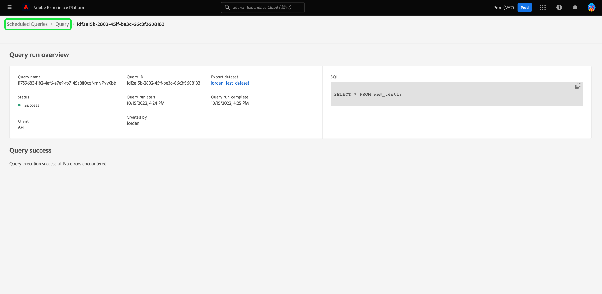

# Övervaka schemalagda frågor

Adobe Experience Platform ger bättre synlighet för status för alla frågefunktioner via användargränssnittet. Från [!UICONTROL Scheduled Queries] kan du nu hitta viktig information om frågekörningar som innehåller status, schemainformation och felmeddelanden/koder om de skulle misslyckas. Du kan även prenumerera på aviseringar för frågor baserat på deras status via användargränssnittet för någon av dessa frågor via [!UICONTROL Scheduled Queries] -fliken.

## [!UICONTROL Scheduled Queries]

The [!UICONTROL Scheduled Queries] ger en översikt över alla dina schemalagda CTAS- och ITAS-frågor. Det går att hitta körningsinformation för alla schemalagda frågor samt felkoder och meddelanden för eventuella misslyckade frågor.

Navigera till [!UICONTROL Scheduled Queries] flik, välja **[!UICONTROL Queries]** från vänster navigeringsfält följt av **[!UICONTROL Scheduled Queries]**

Tabellen nedan beskriver varje tillgänglig kolumn.

>[!NOTE]
>
>Varningssymbolen för prenumerationer finns på varje rad i en namnlös kolumn. Se [aviseringsprenumerationer](#alert-subscription) för mer information.

| Kolumn | Beskrivning |
|---|---|
| **[!UICONTROL Name]** | Namnfältet är antingen mallnamnet eller de första tecknen i SQL-frågan. Alla frågor som skapas via gränssnittet med Frågeredigeraren får i början ett namn. Om frågan skapades med API:t blir dess namn ett fragment av den ursprungliga SQL-kod som användes för att skapa frågan. Om du vill visa en lista över alla körningar som är associerade med frågan väljer du ett objekt i [!UICONTROL Name] kolumn. Mer information finns i [fråga kör schemadetaljer](#query-runs) -avsnitt. |
| **[!UICONTROL Template]** | Frågans mallnamn. Välj ett mallnamn för att gå till Frågeredigeraren. Frågemallen visas i Frågeredigeraren. Om det inte finns något mallnamn markeras raden med ett bindestreck och det går inte att omdirigera till Frågeredigeraren för att visa frågan. |
| **[!UICONTROL SQL]** | Ett fragment av SQL-frågan. |
| **[!UICONTROL Run frequency]** | Den gräns som frågan är inställd på att köras vid. De tillgängliga värdena är `Run once` och `Scheduled`. |
| **[!UICONTROL Created by]** | Namnet på den användare som skapade frågan. |
| **[!UICONTROL Created]** | Tidsstämpeln när frågan skapades, i UTC-format. |
| **[!UICONTROL Last run timestamp]** | Den senaste tidsstämpeln när frågan kördes. Den här kolumnen visar om en fråga har körts enligt det aktuella schemat. |
| **[!UICONTROL Last run status]** | Status för den senaste frågekörningen. Statusvärdena är: `Success`, `Failed`, `In progress`och `No runs`. |
| **[!UICONTROL Schedule Status]** | Den schemalagda frågans aktuella status. Det finns sex möjliga värden, [!UICONTROL Registering], [!UICONTROL Active], [!UICONTROL Inactive], [!UICONTROL Deleted], ett bindestreck och [!UICONTROL Quarantined].<ul><li>The **[!UICONTROL Registering]** status anger att systemet fortfarande bearbetar skapandet av det nya schemat för frågan. Observera att du inte kan inaktivera eller ta bort en schemalagd fråga medan den registreras.</li><li>The **[!UICONTROL Active]** status anger att den schemalagda frågan har **ännu inte godkänt** datum och tid för slutförande.</li><li>The **[!UICONTROL Inactive]** status anger att den schemalagda frågan har **passerad** datum och tid för slutförande eller har markerats av en användare som inaktiv.</li><li>The **[!UICONTROL Deleted]** status anger att frågeschemat har tagits bort.</li><li>Avstavningen anger att den schemalagda frågan är en enstaka, icke återkommande fråga.</li><li>The **[!UICONTROL Quarantined]** status anger att frågan har misslyckats tio gånger i följd och kräver att du gör något innan fler körningar kan utföras.</li></ul> |

>[!TIP]
>
>Om du går till Frågeredigeraren kan du välja **[!UICONTROL Queries]** för att gå tillbaka till [!UICONTROL Templates] -fliken.

## Anpassa tabellinställningar för schemalagda frågor {#customize-table}

Du kan justera kolumnerna på [!UICONTROL Scheduled Queries] efter behov. Öppna [!UICONTROL Customize table] inställningsdialogrutan och redigera tillgängliga kolumner väljer du inställningsikonen () längst upp till höger på skärmen.

>[!NOTE]
>
>The [!UICONTROL Created] kolumn som refererar till det datum då schemat skapades döljs som standard.

Växla mellan de relevanta kryssrutorna för att ta bort eller lägga till en tabellkolumn. Nästa, välj **[!UICONTROL Apply]** för att bekräfta dina val.

>[!NOTE]
>
>Alla frågor som har skapats via användargränssnittet blir en namngiven mall som en del av skapandeprocessen. Mallnamnet visas i mallkolumnen. Om frågan skapades via API är mallkolumnen tom.

## Hantera schemalagda frågor med infogade åtgärder {#inline-actions}

The [!UICONTROL Scheduled Queries] I vyn finns olika textbundna åtgärder för att hantera alla schemalagda frågor från en och samma plats. Textbundna åtgärder anges på varje rad med ellips. Markera ellipsen för en schemalagd fråga som du vill hantera för att se de tillgängliga alternativen på en snabbmeny. De tillgängliga alternativen omfattar [[!UICONTROL Disable schedule]](#disable) eller [!UICONTROL Enable schedule], [[!UICONTROL Delete schedule]](#delete), [[!UICONTROL Subscribe]](#alert-subscription) för att fråga efter varningar, och [Aktivera eller [!UICONTROL Disable quarantine]](#quarantined-queries).

### Inaktivera eller aktivera en schemalagd fråga {#disable}

Om du vill inaktivera en schemalagd fråga markerar du ellipsen för en schemalagd fråga som du vill hantera och väljer sedan **[!UICONTROL Disable schedule]** från alternativen på snabbmenyn. En dialogruta visas där du kan bekräfta åtgärden. Välj **[!UICONTROL Disable]** för att bekräfta inställningen.

När en schemalagd fråga har inaktiverats kan du aktivera schemat via samma process. Markera ellipsen och välj **[!UICONTROL Enable schedule]** bland de tillgängliga alternativen.

>[!NOTE]
>
>Om en fråga har placerats i karantän bör du granska mallens SQL innan du aktiverar dess schema. Detta förhindrar slöseri med beräkningstimmar om mallfrågan fortfarande har problem.

### Ta bort en schemalagd fråga {#delete}

Om du vill ta bort en schemalagd fråga markerar du ellipsen för en schemalagd fråga som du vill hantera och väljer sedan **[!UICONTROL Delete schedule]** från alternativen på snabbmenyn. En dialogruta visas där du kan bekräfta åtgärden. Välj **[!UICONTROL Delete]** för att bekräfta inställningen.

När en schemalagd fråga har tagits bort är den **not** som tagits bort från listan med schemalagda frågor. De infogade åtgärder som tillhandahålls av ellipserna tas bort och ersätts av den nedtonade ikonen för att lägga till varning. Du kan inte prenumerera på aviseringar för det borttagna schemat. Raden finns kvar i användargränssnittet för att ge information om körningar som utförts som en del av den schemalagda frågan.

Om du vill schemalägga körningar för den frågemallen väljer du mallnamnet på lämplig rad för att navigera till Frågeredigeraren och följer sedan [instruktioner för att lägga till ett schema i en fråga](./query-schedules.md#create-schedule) enligt beskrivningen i dokumentationen.

### Prenumerera på aviseringar {#alert-subscription}

Om du vill prenumerera på aviseringar för schemalagda frågekörningar markerar du ellipsen för en schemalagd fråga som du vill hantera och väljer sedan **[!UICONTROL Subscribe]** från alternativen på snabbmenyn.

The [!UICONTROL Alerts] öppnas. The [!UICONTROL Alerts] prenumererar på både UI-meddelanden och e-postaviseringar. Varningar baseras på frågans status. Det finns tre alternativ: `start`, `success`och `failure`. Markera lämplig ruta eller rutor och välj **[!UICONTROL Save]** prenumerera. Du kan prenumerera på aviseringar så länge de inte har en [!UICONTROL Last Run Timestamp] värde.

>[!NOTE]
>
>Om du vill få meddelanden om att en fråga hamnar i karantän måste du först registrera körningarna av den schemalagda frågan i [karantänfunktion](#quarantined-queries).

Se [API-dokumentation för aviseringsprenumerationer](../api/alert-subscriptions.md) för mer information.

### Visa frågedetaljer {#query-details}

Välj informationsikonen () om du vill visa informationspanelen för frågan. Panelen Detaljer innehåller all relevant information om frågan utöver de fakta som finns i tabellen med schemalagda frågor. Ytterligare information omfattar fråge-ID, senaste ändringsdatum, frågans SQL, schema-ID och aktuellt uppsättningsschema.

### Frågor i karantän {#quarantined-queries}

När en schemalagd fråga som misslyckas tio på varandra följande körningar registreras i en [!UICONTROL Quarantined] status. En fråga med den här statusen blir inaktiv och körs inte vid den schemalagda tidpunkten. Sedan måste du ingripa innan fler exekveringar kan utföras. Detta skyddar systemresurser eftersom du måste granska och korrigera problemen med din SQL innan fler körningar utförs.

Om du vill aktivera en schemalagd fråga för karantänfunktionen markerar du ellipserna (`...`) följt av [!UICONTROL Enable quarantine] i listrutan som visas.

Frågor kan också registreras i karantänfunktionen när schemat skapas. Se [dokumentation för frågescheman](./query-schedules.md#quarantine) för mer information.

## Filtrera frågor {#filter}

Du kan filtrera frågor baserat på körningsfrekvens. Från [!UICONTROL Scheduled Queries] väljer du filterikonen () för att öppna filtersidofältet.

Om du vill filtrera listan med frågor baserat på deras körningsfrekvens väljer du antingen **[!UICONTROL Scheduled]** eller **[!UICONTROL Run once]** filterkryssrutor.

>[!NOTE]
>
>Alla frågor som har körts men inte schemalagts kvalificeras som [!UICONTROL Run once].

När du har aktiverat filtervillkoren väljer du **[!UICONTROL Hide Filters]** för att stänga filterpanelen.

## Information om schemaläggning av frågekörningar {#query-runs}

Om du vill öppna sidan med schemainformation väljer du ett frågenamn på menyn [!UICONTROL Scheduled Queries] -fliken. Den här vyn innehåller en lista över alla körningar som har utförts som en del av den schemalagda frågan. Informationen omfattar start- och sluttid, status och datauppsättning som används.

Den här informationen finns i en tabell med fem kolumner. Varje rad betecknar en frågekörning.

| Kolumnnamn | Beskrivning |
|---|---|
| **[!UICONTROL Query run ID]** | Frågekörnings-ID för daglig körning. Välj **[!UICONTROL Query run ID]** navigera till [!UICONTROL Query run overview]. |
| **[!UICONTROL Query run start]** | Tidsstämpeln när frågan kördes. Tidsstämpeln är i UTC-format. |
| **[!UICONTROL Query run complete]** | Tidsstämpeln när frågan slutfördes. Tidsstämpeln är i UTC-format. |
| **[!UICONTROL Status]** | Status för den senaste frågekörningen. Statusvärdena är: `Success`, `Failed`, `In progress`, eller `Quarantined`. |
| **[!UICONTROL Dataset]** | Den datauppsättning som ingår i körningen. |

Information om frågan som schemaläggs finns i [!UICONTROL Properties] -panelen. Panelen innehåller det inledande fråge-ID:t, klienttyp, mallnamn, frågans SQL-kod och schemats avslutning.

Välj ett ID för frågekörning för att navigera till sidan med körningsinformation och visa frågeinformation.

## Översikt över frågekörning {#query-run-overview}

The [!UICONTROL Query run overview] ger information om enskilda körningar för den här schemalagda frågan och en mer detaljerad beskrivning av körningsstatusen. Den här sidan innehåller även klientinformation och information om eventuella fel som kan ha gjort att frågan misslyckades.

I avsnittet med frågestatus finns felkoden och felmeddelandet om frågan skulle ha misslyckats.

Du kan kopiera frågans SQL till Urklipp från den här vyn. Om du vill kopiera frågan väljer du kopieringsikonen i det övre högra hörnet av SQL-fragmentet. Ett popup-meddelande bekräftar att koden har kopierats.

### Kör information för frågor med anonymt block {#anonymous-block-queries}

Frågor som använder anonyma block för att bilda SQL-satser separeras till sina individuella underfrågor. Genom att dela upp i underfrågor kan du inspektera körningsinformationen för varje frågeblock individuellt.

>[!NOTE]
>
>Körningsinformationen för ett anonymt block som använder DROP-kommandot kommer att **not** rapporteras som en separat underfråga. Separata körningsdetaljer finns tillgängliga för CTAS-frågor, ITAS-frågor och COPY-satser som används som anonyma blockunderfrågor. Körningsinformation för DROP-kommandot stöds för närvarande inte.

Anonyma block markeras med en `$$` prefix före frågan. Mer information om anonyma block i frågetjänsten finns i [anonymt blockdokument](../key-concepts/anonymous-block.md).

Anonyma blockunderfrågor har tabbar till vänster om körningsstatusen. Välj en flik för att visa körningsinformation.

Om en anonym blockfråga misslyckas, kan du hitta felkoden för just det blocket via det här användargränssnittet.

Välj **[!UICONTROL Query]** för att återgå till skärmen med schemainformation, eller **[!UICONTROL Scheduled Queries]** för att gå tillbaka till [!UICONTROL Scheduled Queries] -fliken.

