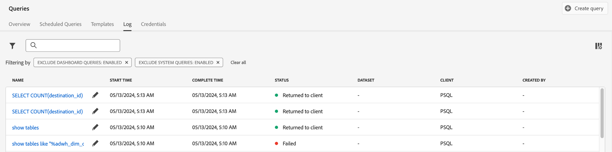

# Användargränssnittshandbok för [!DNL Query Service]

Adobe Experience Platform [!DNL Query Service] har ett användargränssnitt som kan användas för att skriva och köra frågor, visa frågor som har körts tidigare och få åtkomst till frågor som har sparats av användare i din organisation. Om du vill komma åt användargränssnittet i [Adobe Experience Platform](https://platform.adobe.com) väljer du **[!UICONTROL Queries]** i den vänstra navigeringen.

## [!DNL Query Editor]

Med [!DNL Query Editor] kan du skriva och köra frågor utan att använda en extern klient. Välj **[!UICONTROL Create Query]** om du vill öppna [!DNL Query Editor] och skapa en ny fråga. Du kan även komma åt [!DNL Query Editor] genom att välja en fråga på flikarna **[!UICONTROL Log]** eller **[!UICONTROL Templates]**. Om du väljer en fråga som redan har körts eller sparats öppnas [!DNL Query Editor] och SQL-uttrycket för den valda frågan visas.

[!DNL Query Editor] innehåller redigeringsutrymme där du kan börja skriva en fråga. När du skriver slutför redigeraren automatiskt reserverade ord, tabeller och fältnamn från SQL i tabeller. När du är klar med att skriva frågan väljer du knappen **Spela upp** för att köra frågan. Fliken **[!UICONTROL Console]** nedanför redigeraren visar vad [!DNL Query Service] gör för tillfället, vilket anger när en fråga har returnerats. Fliken **[!UICONTROL Result]**, bredvid konsolen, visar frågeresultat. Mer information om hur du använder [!DNL Query Editor] finns i [Frågeredigeringsguiden](./user-guide.md).

![En zoomad vy av [!DNL Query Editor].](../images/ui/overview/query-editor.png)

## Schemalagda frågor {#scheduled-queries}

Frågor som redan har sparats som en mall kan schemaläggas för att köras med en vanlig stängsel. När du schemalägger en fråga kan du välja körningsfrekvens, start- och slutdatum, veckodag som den schemalagda frågan körs samt vilken datamängd som frågan ska exporteras till. Frågescheman ställs in med Frågeredigeraren.

Mer information om hur du schemalägger en fråga via användargränssnittet finns i [guiden om schemalagda frågor](./user-guide.md#scheduled-queries). Om du vill lära dig hur du lägger till scheman med API:t läser du [slutpunktshandboken för schemalagda frågor](../api/scheduled-queries.md).

När en fråga har schemalagts visas den i listan med schemalagda frågor på fliken [!UICONTROL Scheduled Queries]. Du hittar fullständig information om frågan, körningar, skapare och tidsinställningar genom att välja en schemalagd fråga i listan.

| Kolumn | Beskrivning |
| --- | --- |
| **[!UICONTROL Name]** | Namnfältet är antingen mallnamnet eller de första tecknen i SQL-frågan. Alla frågor som skapas via gränssnittet med Frågeredigeraren får i början ett namn. Om frågan skapades via API är namnet på frågan ett fragment av det SQL-uttryck som användes för att skapa frågan. |
| **[!UICONTROL Template]** | Frågans mallnamn. Välj ett mallnamn för att gå till Frågeredigeraren. Frågemallen visas i Frågeredigeraren. Om det inte finns något mallnamn markeras raden med ett bindestreck och det går inte att omdirigera till Frågeredigeraren för att visa frågan. |
| **[!UICONTROL SQL]** | Ett fragment av SQL-frågan. |
| **[!UICONTROL Run frequency]** | Det här är den avslutning som frågan ska köras vid. De tillgängliga värdena är `Run once` och `Scheduled`. Frågor kan filtreras utifrån deras körningsfrekvens. |
| **[!UICONTROL Created by]** | Namnet på den användare som skapade frågan. |
| **[!UICONTROL Created]** | Tidsstämpeln när frågan skapades, i UTC-format. |
| **[!UICONTROL Last run timestamp]** | Den senaste tidsstämpeln när frågan kördes. Den här kolumnen visar om en fråga har körts enligt det aktuella schemat. |
| **[!UICONTROL Last run status]** | Status för den senaste frågekörningen. De tre statusvärdena är: `successful` `failed` eller `in progress`. |

Mer information om hur du [övervakar frågor via användargränssnittet för frågetjänsten](./monitor-queries.md) finns i dokumentationen.

## Mallar {#browse}

På fliken **[!UICONTROL Templates]** visas frågor som sparats av användare i din organisation. Det är praktiskt att tänka på dessa som frågeprojekt, eftersom frågor som sparas här fortfarande kan vara under uppbyggnad. Frågor som visas på fliken **[!UICONTROL Templates]** visas också som körningsfrågor på fliken **[!UICONTROL Log]** om de tidigare har körts av [!DNL Query Service].

| Kolumn | Beskrivning |
| --- | --- |
| **[!UICONTROL Name]** | Namnfältet är antingen frågenamnet som skapats av användaren eller de första tecknen i SQL-frågan. Alla frågor som skapas via gränssnittet med Frågeredigeraren får i början ett namn. Om frågan skapades via API är namnet på frågan ett fragment av det SQL-uttryck som användes för att skapa frågan. Du kan välja frågenamnet för att öppna frågan i [!DNL Query Editor]. Du kan också använda sökfältet för att söka efter [!UICONTROL Name] i en fråga. Sökningar är skiftlägeskänsliga. |
| **[!UICONTROL SQL]** | De första tecknen i SQL-frågan. Om du placerar pekaren över koden visas hela frågan. |
| **[!UICONTROL Modified by]** | Den sista användaren som ändrade frågan. Alla användare i organisationen som har åtkomst till [!DNL Query Service] kan ändra frågor. |
| **[!UICONTROL Last modified]** | Datum och tid för den senaste ändringen av frågan, i webbläsarens tidszon. |

Mer information om mallar i plattformsgränssnittet finns i [frågemallarna](./query-templates.md) .

## Logg {#log}

Fliken **[!UICONTROL Log]** innehåller en lista med frågor som tidigare har körts. Som standard listas frågorna i loggen i omvänd kronologi.

| Kolumn | Beskrivning |
| --- | --- |
| **[!UICONTROL Name]** | Frågenamnet som består av de första tecknen i SQL-frågan. Välj mallnamnet för att öppna vyn [!UICONTROL Query log details] för den körningen. Du kan använda sökfältet för att söka efter namnet på en fråga. Sökningar är skiftlägeskänsliga. |
| **[!UICONTROL Start time]** | Tiden då frågan kördes. |
| **[!UICONTROL Complete time]** | Den tidpunkt då frågan kördes. |
| **[!UICONTROL Status]** | Frågans aktuella status. |
| **[!UICONTROL Dataset]** | Den indatamängd som används av frågan. Välj den datauppsättning som du vill gå till informationsskärmen för indatauppsättningar. |
| **[!UICONTROL Client]** | Klienten som används för frågan. |
| **[!UICONTROL Created by]** | Namnet på den person som skapade frågan. |

>
>
>Välj pennikonen () från valfri rad i frågeloggen för att navigera till [!DNL Query Editor]. Frågan är ifylld i förväg för smidig redigering.

Mer information om loggfilerna som genereras automatiskt av en frågetaghändelse finns i [frågeloggsdokumentationen](./query-logs.md).

## Referenser

Fliken **[!UICONTROL Credentials]** visar både dina utgångsdatum och ej utgångsdatum. Mer information om hur du använder dessa autentiseringsuppgifter för att ansluta till externa klienter finns i [handboken för autentiseringsuppgifter](../clients/overview.md).

## Nästa steg

Nu när du är bekant med [!DNL Query Service]-användargränssnittet på [!DNL Platform] kan du komma åt [!DNL Query Editor] och börja skapa egna frågeprojekt som du kan dela med andra användare i organisationen. Mer information om hur du redigerar och kör frågor i [!DNL Query Editor] finns i [[!DNL Query Editor] användarhandboken](./user-guide.md).
