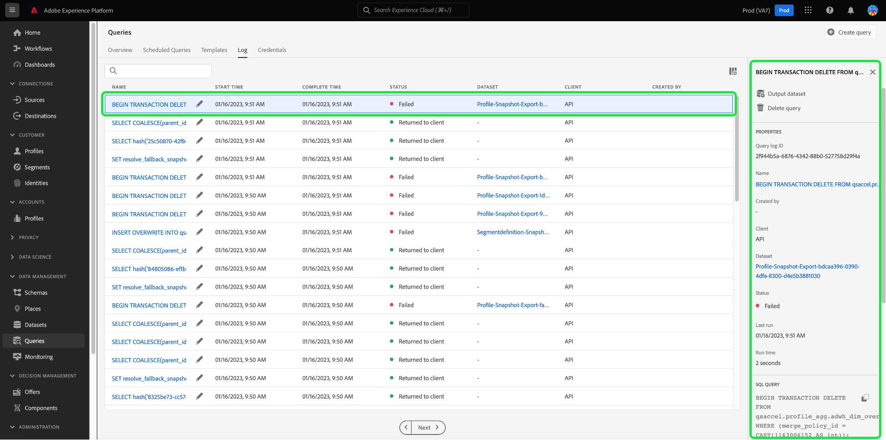
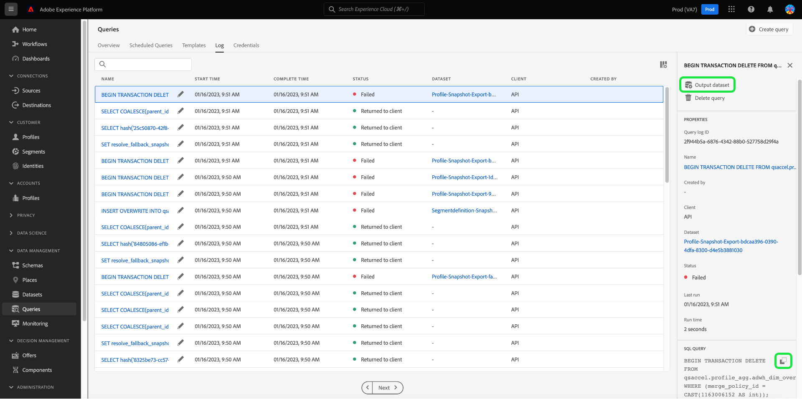
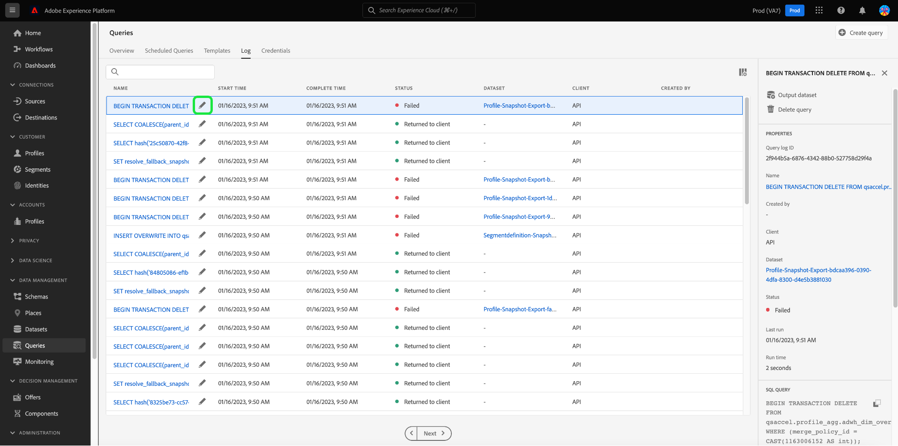
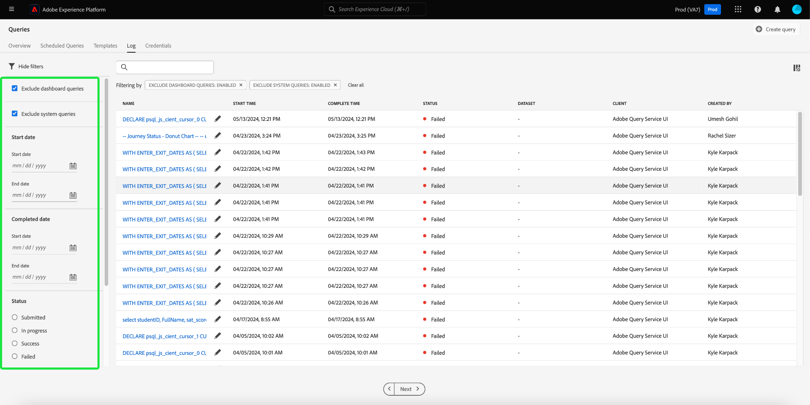
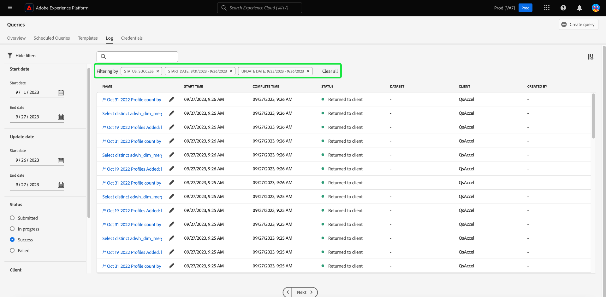

# Frågeloggar

>[!IMPORTANT]
>
>Vissa frågeloggfunktioner är för närvarande i en begränsad version och inte tillgängliga för alla kunder. Gränssnittet kan se lite annorlunda ut utan en redigeringsikon. Processen att välja ett frågenamn kan även gå till Frågeredigeraren i stället för till [!UICONTROL Query log details] vy.

Adobe Experience Platform har en logg över alla frågehändelser som inträffar via både API och gränssnittet. Den här informationen är tillgänglig i användargränssnittet för frågetjänsten från [!UICONTROL Logs] -fliken.

Loggfilerna genereras automatiskt av en frågehändelse och innehåller information om t.ex. vilken SQL som används, status för frågan, hur lång tid det tog och senaste körningstid. Du kan använda frågeloggdata som ett kraftfullt verktyg för felsökning av ineffektiva frågor eller problemfrågor. Mer omfattande logginformation finns i loggen i [granskningsloggens dokumentation](../../landing/governance-privacy-security/audit-logs/overview.md).

## Kontrollera frågeloggar

Om du vill kontrollera frågeloggarna väljer du [!UICONTROL Queries] för att gå till arbetsytan för frågetjänsten och välja [!UICONTROL Log] bland de tillgängliga alternativen.

## Anpassa och söka {#customize-and-search}

Frågetjänstloggar presenteras i ett anpassbart tabellformat. Om du vill anpassa tabellkolumnerna väljer du inställningsikonen () till höger på skärmen. A [!UICONTROL Customize Table] visas där varje kolumn kan avmarkeras.

Du kan också söka efter loggar som relaterar till särskilda frågemallar genom att skriva mallnamnet i sökfältet.

A [beskrivning för var och en av loggtabellkolumnerna](./overview.md#log) finns i loggavsnittet i översikten över frågetjänsten.

## Identifiera loggdata

Varje rad representerar loggdata för en frågekörning som är associerad med en frågemall. Markera en rad i tabellen för att fylla i den högra sidofältet med loggdata för den körningen.

På panelen med logginformation kan du utföra olika åtgärder. Du kan köra frågan som CTAS, vilket skapar en ny utdatamängd, se eller kopiera hela SQL-frågan som användes i körningen, eller ta bort frågan.

>[!NOTE]
>
>Alternativet att [!UICONTROL Run as CTAS] är bara tillgängligt för en SELECT-fråga.

>[!IMPORTANT]
>
>Vissa frågeloggfunktioner är för närvarande i en begränsad version och inte tillgängliga för alla kunder.

Du kan också välja ett frågemallsnamn i dialogrutan [!UICONTROL Name] kolumn som du vill navigera direkt till [!UICONTROL Query log details] vy.

>[!NOTE]
>
>Om frågan skapades med API:t och inget mallnamn angavs under initieringen visas i stället det första dussintalet tecken i SQL-frågan.

## Redigera loggar {#edit-logs}

Bredvid varje rads mallnamn eller SQL-kodfragment finns en pennikon () som du kan använda för att navigera till Frågeredigeraren. Frågan fylls sedan i automatiskt i redigeraren för redigering.

## Filterloggar {#filter-logs}

Du kan filtrera listan med frågeloggar baserat på olika inställningar. Markera filterikonen () längst upp till vänster på arbetsytan för att öppna en uppsättning filteralternativ i den vänstra listen.

Listan med tillgängliga filter visas.

I följande tabell visas en beskrivning av varje filter.

| Filter | Beskrivning |
| ------ | ----------- |
| [!UICONTROL Exclude dashboard queries] | Den här kryssrutan är aktiverad som standard och utesluter loggar som genereras av frågor som används för att generera insikter. Dessa frågor genereras av systemet och döljer posterna för användargenererade loggar som krävs för övervakning, administration och felsökning. Om du vill visa systemgenererade loggar avmarkerar du kryssrutan. |
| [!UICONTROL Start date] | Om du vill filtrera loggarna efter frågor som skapats under en viss period anger du [!UICONTROL Start] och [!UICONTROL End] datum i [!UICONTROL Start date] -avsnitt. |
| [!UICONTROL Completed date] | Om du vill filtrera loggarna efter frågor som har slutförts under en viss period anger du [!UICONTROL Start] och [!UICONTROL End] datum i [!UICONTROL Completed date] -avsnitt. |
| [!UICONTROL Status] | Filtrera loggar baserat på [!UICONTROL Status] Välj lämplig alternativknapp för frågan. De tillgängliga alternativen omfattar [!UICONTROL Submitted], [!UICONTROL In progress], [!UICONTROL Success]och [!UICONTROL Failed]. Du kan bara filtrera loggar baserat på ett statusvillkor åt gången. |
| [!UICONTROL Client] | Om du vill filtrera loggar baserat på frågeklienten anger du något av följande godkända värden i fritextfältet: `API`, `Adobe Query Service UI`, eller `QsAccel`. |
| [!UICONTROL My queries] | Använd [!UICONTROL My queries] växla för att filtrera loggarna efter frågor som du har utfört. |
| [!UICONTROL query log ID] | Om du vill filtrera baserat på ett frågas unika logg-ID anger du logg-ID i fritextfältet. Den här informationen finns i [!UICONTROL Log details]. |

Alla filter som används visas ovanför de filtrerade loggresultaten.

## Nästa steg

Genom att läsa det här dokumentet får du nu en bättre förståelse för hur frågeloggar används i användargränssnittet för frågetjänsten.

Se [Översikt över användargränssnittet](./overview.md)eller [API-guide för frågetjänst](../api/getting-started.md) om du vill veta mer om funktionerna i frågetjänsten.

Se [övervaka frågedokument](./monitor-queries.md) om du vill veta hur frågetjänsten förbättrar synligheten för schemalagda frågekörningar.
