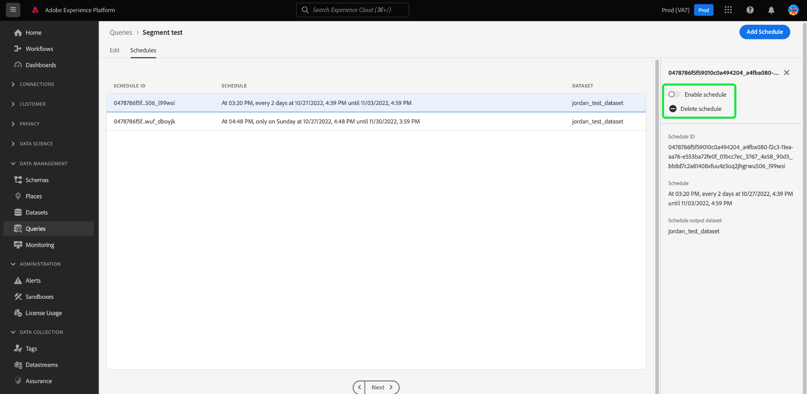

# Frågescheman

Du kan automatisera frågekörningar genom att skapa frågescheman. Schemalagda frågor körs på en anpassad cache för att hantera dina data baserat på frekvens, datum och tid. Du kan också välja en utdatamängd för dina resultat om det behövs. Frågor som har sparats som en mall kan schemaläggas från Frågeredigeraren.

>[!IMPORTANT]
>
>Du kan bara lägga till ett schema i en fråga som redan har skapats och sparats.

Alla schemalagda frågor läggs till i listan på fliken [!UICONTROL Scheduled queries]. Från den arbetsytan kan du övervaka statusen för alla schemalagda frågejobb via gränssnittet. På fliken [!UICONTROL Scheduled queries] kan du hitta viktig information om frågekörningar och prenumerera på aviseringar. Den tillgängliga informationen omfattar status, schemainformation och felmeddelanden/koder om en körning misslyckas. Mer information finns i dokumentet [Övervaka schemalagda frågor](./monitor-queries.md).

Det här arbetsflödet omfattar schemaläggningsprocessen i användargränssnittet för frågetjänsten. Om du vill lära dig hur du lägger till scheman med API:t läser du [slutpunktshandboken för schemalagda frågor](../api/scheduled-queries.md).

## Skapa ett frågeschema {#create-schedule}

Om du vill schemalägga en fråga väljer du en frågemall på fliken [!UICONTROL Templates] eller [!UICONTROL Template] på fliken [!UICONTROL Scheduled Queries]. Om du väljer mallnamnet kommer du till frågeredigeraren.

Om du öppnar en sparad fråga från Frågeredigeraren kan du skapa ett schema för frågan eller visa frågans schema från informationspanelen.

>[!TIP]
>
>Välj **[!UICONTROL View schedule]** om du vill navigera till arbetsytan för scheman och visa en översikt över schemalagda frågor.

![Frågeredigeraren med [!UICONTROL View schedule] och [!UICONTROL Add schedule] markerade.](../images/ui/query-schedules/view-add-schedule.png)

Välj **[!UICONTROL Add schedule]** om du vill navigera till sidan [Schemainformation](#schedule-details).

Du kan också välja fliken **[!UICONTROL Schedules]** under frågans namn.

Arbetsytan för scheman visas. Gränssnittet visar en lista över schemalagda körningar som mallen är kopplad till. Välj **[!UICONTROL Add Schedule]** om du vill skapa ett schema.

### Lägg till schemainformation {#schedule-details}

Sidan med schemainformation visas. På den här sidan kan du redigera olika detaljer för den schemalagda frågan. Detaljerna innehåller [frekvens och veckodag för körningen av den schemalagda frågan](#scheduled-query-frequency), start- och slutdatum, datamängden som resultaten ska exporteras till och [frågans statusaviseringar](#alerts-for-query-status).

>[!IMPORTANT]
>
>Användargränssnittet för frågeschemaläggaren stöder inte obestämd eller permanent schemaläggning. Ett slutdatum måste anges. Det finns ingen övre gräns för slutdatumet.

#### Schemalagd frågefrekvens {#scheduled-query-frequency}

Du kan välja följande alternativ för **[!UICONTROL Frequency]**:

- **[!UICONTROL Hourly]**: Den schemalagda frågan kommer att köras varje timme för den datumperiod du valde.
- **[!UICONTROL Daily]**: Den schemalagda frågan kommer att köras var X:e dag vid den tidpunkt och den datumperiod du valde. Observera att den valda tiden är i **UTC** och inte i din lokala tidszon.
- **[!UICONTROL Weekly]**: Den valda frågan kommer att köras på veckodagarna, tiden och den datumperiod som du valde. Observera att den valda tiden är i **UTC** och inte i din lokala tidszon.
- **[!UICONTROL Monthly]**: Den valda frågan kommer att köras varje månad med dag, tid och den datumperiod som du har valt. Observera att den valda tiden är i **UTC** och inte i din lokala tidszon.
- **[!UICONTROL Yearly]**: Den valda frågan kommer att köras varje år på den dag, månad, tid och den datumperiod du har valt. Observera att den valda tiden är i **UTC** och inte i din lokala tidszon.

### Ange datauppsättningsinformation {#dataset-details}

Hantera frågeresultaten genom att antingen lägga till data i en befintlig datauppsättning eller skapa en ny datauppsättning och lägga till data i den.

Välj **[!UICONTROL Create and append into new dataset]** om du vill skapa en datauppsättning när du kör en fråga för första gången. Efterföljande körningar fortsätter att infoga data i datauppsättningen. Ange slutligen ett namn och en beskrivning för datauppsättningen.

>[!IMPORTANT]
>
> Eftersom du antingen använder en befintlig eller skapar en ny datauppsättning, behöver du **inte** ta med `INSERT INTO` eller `CREATE TABLE AS SELECT` som en del av frågan, eftersom datauppsättningarna redan har angetts. Om du inkluderar antingen `INSERT INTO` eller `CREATE TABLE AS SELECT` som en del av dina schemalagda frågor uppstår ett fel.

![Panelen Schemainformation med datauppsättningsinformation och [!UICONTROL Create and append into new dataset] alternativ markerade.](../images/ui/query-schedules/dataset-details-create-and-append.png)

Du kan också välja **[!UICONTROL Append into existing dataset]** följt av datamängdikonen ().

Dialogrutan **[!UICONTROL Select output dataset]** visas.

Därefter kan du antingen bläddra bland befintliga datauppsättningar eller använda sökfältet för att filtrera alternativen. Markera den rad i datauppsättningen som du vill använda. Datauppsättningsinformationen visas i panelen till höger. Välj **[!UICONTROL Done]** för att bekräfta ditt val.

### Karantänfrågor om de kontinuerligt misslyckas {#quarantine}

När du skapar ett schema kan du registrera din fråga i karantänfunktionen för att skydda systemresurser och förhindra eventuella störningar. Karantänfunktionen identifierar och isolerar automatiskt frågor som misslyckas upprepade gånger genom att placera dem i ett [!UICONTROL Quarantined]-läge. Genom att sätta frågor i karantän efter tio på varandra följande misslyckanden kan du ingripa, granska och åtgärda problem innan du tillåter fler körningar. Detta bidrar till att upprätthålla er effektivitet och dataintegritet.

![Arbetsytan Frågescheman med [!UICONTROL Query Quarantine] markerad och Ja markerad.](../images/ui/query-schedules/quarantine-enroll.png)

När en fråga har registrerats för karantänfunktionen kan du prenumerera på aviseringar för den här frågestatusändringen. Om en schemalagd fråga inte är registrerad i karantän visas den inte som ett alternativ i [varningsdialogrutan](./monitor-queries.md#alert-subscription).

Du kan även registrera en schemalagd fråga i karantänfunktionen från de infogade åtgärderna på fliken [!UICONTROL Scheduled Queries]. Mer information finns i [dokumentationen för övervakningsfrågor](./monitor-queries.md#alert-subscription).

### Ange aviseringar för status för en schemalagd fråga {#alerts-for-query-status}

Du kan även prenumerera på frågeararm som en del av inställningarna för den schemalagda frågan. Du kan konfigurera dina inställningar så att du får meddelanden om olika situationer. Varningar kan ställas in för ett karantänläge, fördröjd frågebearbetning eller en statusändring för frågan. De tillgängliga varningsalternativen för frågans tillstånd är bland annat start, lyckad och misslyckad. Varningar kan tas emot antingen som popup-meddelanden eller e-postmeddelanden. Markera kryssrutan om du vill prenumerera på aviseringar om den schemalagda frågans status.

Tabellen nedan förklarar vilka frågeartikeltyper som stöds:

| Aviseringstyp | Beskrivning |
|---|---|
| `start` | Den här varningen meddelar dig när en schemalagd frågekörning initieras eller börjar bearbetas. |
| `success` | Den här varningen informerar dig när en schemalagd frågekörning har slutförts, vilket anger att frågan har körts utan fel. |
| `failed` | Den här varningen utlöses när en schemalagd frågekörning påträffar ett fel eller misslyckas med att köras. Det hjälper er att snabbt identifiera och åtgärda problem. |
| `quarantine` | Den här varningen aktiveras när en schemalagd frågekörning sätts i karantän. När en fråga [har registrerats i karantänfunktionen](#quarantine), kommer alla schemalagda frågor som misslyckas tio på varandra följande körningar automatiskt att hamna i tillståndet [!UICONTROL Quarantined]. En fråga i karantän kräver sedan att du gör något innan fler körningar kan utföras. Obs! Frågor måste registreras för karantänfunktionen för att du ska kunna prenumerera på karantänaviseringar. |
| `delay` | Den här varningen meddelar dig om det finns en [fördröjning i resultatet av en schemalagd frågekörning](./monitor-queries.md#query-run-delay) över ett angivet tröskelvärde. Du kan ange en anpassad tid som utlöser varningen när frågan körs för den aktuella varaktigheten utan att slutföras eller misslyckas. Standardbeteendet anger en varning i 150 minuter efter att frågan börjar bearbetas. |

>[!NOTE]
>
>Om du väljer att ställa in en [!UICONTROL Query Run Delay]-varning måste du ange önskad fördröjningstid i minuter i Experience Platform användargränssnitt. Ange längden i minuter. Maximal fördröjning är 24 timmar (1 440 minuter).

En översikt över aviseringar i Adobe Experience Platform, inklusive strukturen för hur varningsregler definieras, finns i [varningsöversikten](../../observability/alerts/overview.md). Mer information om hur du hanterar aviseringar och varningsregler i Adobe Experience Platform-gränssnittet finns i [Användargränssnittsguiden för aviseringar](../../observability/alerts/ui.md).

### Ange parametrar för en schemalagd parametriserad fråga {#set-parameters}

Om du skapar en schemalagd fråga för en parametriserad fråga måste du nu ange parametervärden för dessa frågekörningar.

När du har bekräftat din schemainformation väljer du **[!UICONTROL Save]** för att skapa ett schema. Du återgår till mallens flik för scheman. På den här arbetsytan visas information om det nya schemat, inklusive schema-ID, själva schemat och schemats utdatamängd.

## Visa schemalagda frågekörningar {#scheduled-query-runs}

På mallens [!UICONTROL Schedules]-flik väljer du schema-ID för att navigera till listan med frågekörningar för den nyligen schemalagda frågan.

Om du vill visa en lista över schemalagda körningar för en frågemall går du till fliken **[!UICONTROL Scheduled queries]** och väljer ett mallnamn i listan.

Listan över frågekörningar för den schemalagda frågan visas.

### Beräkna timmar på jobbnivå {#compute-hours}

Spåra beräknade timmar som förbrukats på frågekörningsnivån för dina CTAS/ITAS-batchfrågor. Den här funktionen ger insikter i hur datorn används, vilket hjälper dig att optimera resursallokeringen och förbättra frågeprestanda.

>[!AVAILABILITY]
>
>Funktionen Beräkna timmar är exklusiv för användare som har köpt [Data Distiller SKU](../data-distiller/overview.md). Kontakta Adobe om du vill ha mer information.

Följande tabell innehåller beskrivningar av de kolumner som är tillgängliga i informationsavsnittet som listar schemalagda frågekörningar.

| Kolumnrubrik | Beskrivning |
|---------------------|----------------------------------|
| [!UICONTROL Query Run ID] | Visar en unik identifierare för varje frågekörning så att du kan spåra och referera till enskilda körningar av dina schemalagda frågor. |
| [!UICONTROL Query Run Start] | Anger startdatum och starttid för frågekörningen, så att du lättare kan övervaka när varje körning påbörjades. |
| [!UICONTROL Query Run Complete] | Visar slutdatumet och sluttiden för frågekörningen för att ge insikt i körningens varaktighet och status. |
| [!UICONTROL Status] | Visar aktuell status för frågekörningen, till exempel `Completed,` `Running,` eller `Failed,`, för att snabbt utvärdera resultatet. |
| [!UICONTROL Datasets] | Visar de datauppsättningar som används i frågekörningen, för att visa vilka datakällor som ingick i körningen. |
| [!UICONTROL Compute Hours] | Visar beräkningstiden som används för varje frågekörning, mätt i timmar. Detta hjälper till att spåra resursanvändning och optimera frågeprestanda. |

{style="table-layout:auto"}

>[!NOTE]
>
>Data för beräkningstimmar är tillgängliga från 2024-08-15. Data före detta datum visas som Inte tillgängligt.

I guiden [Övervaka schemalagd fråga](./monitor-queries.md#inline-actions) finns fullständig information om hur du övervakar statusen för alla frågefunktioner via användargränssnittet.

Välj en **[!UICONTROL Query run ID]** i listan för att navigera till frågekörningsöversikten. En fullständig beskrivning av informationen som är tillgänglig i [frågekörningsöversikt](./monitor-queries.md#query-run-overview) finns i dokumentationen för övervakningsplanerade frågor.

Om du vill övervaka schemalagda frågor med hjälp av API:t för frågetjänsten läser du [guiden ](../api/runs-scheduled-queries.md) för schemalagda frågekörningsslutpunkter.

## Aktivera, inaktivera eller ta bort ett schema {#delete-schedule}

Du kan aktivera, inaktivera eller ta bort ett schema från arbetsytan Scheman för en viss fråga eller från arbetsytan [!UICONTROL Scheduled Queries] som listar alla schemalagda frågor.

Om du vill få åtkomst till fliken [!UICONTROL Schedules] i den valda frågan måste du välja namnet på en frågemall på fliken [!UICONTROL Templates] eller [!UICONTROL Scheduled Queries] . Detta navigerar till frågeredigeraren för den frågan. Välj **[!UICONTROL Schedules]** i frågeredigeraren för att komma åt arbetsytan för scheman.

Välj ett schema bland raderna med tillgängliga scheman för att fylla i informationspanelen. Använd växlingsknappen för att inaktivera (eller aktivera) den schemalagda frågan.

### Ta bort inaktiverade frågor

>[!IMPORTANT]
>
>Du måste inaktivera schemat innan du kan ta bort ett schema för en fråga.

En bekräftelsedialogruta visas. Välj **[!UICONTROL Disable]** för att bekräfta åtgärden.

Välj **[!UICONTROL Delete a schedule]** om du vill ta bort det inaktiverade schemat.

Fliken [!UICONTROL Scheduled Queries] innehåller också en samling infogade åtgärder för varje schemalagd fråga. De tillgängliga textbundna åtgärderna omfattar [!UICONTROL Disable schedule] eller [!UICONTROL Enable schedule], [!UICONTROL Delete schedule] och [!UICONTROL Subscribe] till varningar för den schemalagda frågan. Fullständiga anvisningar om hur du tar bort eller inaktiverar en schemalagd fråga via fliken Schemalagda frågor finns i guiden [Övervaka schemalagda frågor](./monitor-queries.md#inline-actions).
