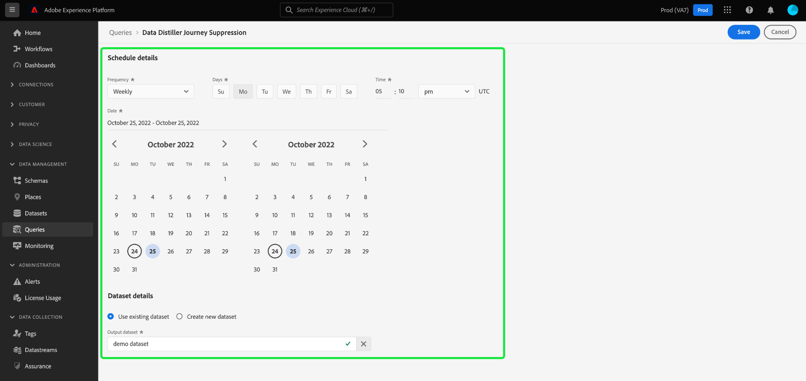

# [!DNL Query Editor] Användargränssnittsguide

[!DNL Query Editor] är ett interaktivt verktyg från Adobe Experience Platform  [!DNL Query Service]som gör att du kan skriva, validera och köra frågor om kundupplevelsedata i  [!DNL Experience Platform] användargränssnittet. [!DNL Query Editor] har stöd för utveckling av frågor för analys och datautforskande, och gör att du kan köra interaktiva frågor i utvecklingssyfte samt icke-interaktiva frågor för att fylla i datauppsättningar i  [!DNL Experience Platform].

Mer information om begrepp och funktioner i [!DNL Query Service] finns i [Query Service overview](../home.md). Mer information om hur du navigerar i användargränssnittet för frågetjänsten på [!DNL Platform] finns i översikten [Användargränssnitt för frågetjänst](./overview.md).

## Komma igång

[!DNL Query Editor] erbjuder flexibel körning av frågor genom att ansluta till  [!DNL Query Service], och frågor körs bara när den här anslutningen är aktiv.

### Ansluter till [!DNL Query Service]

[!DNL Query Editor] tar några sekunder att initiera och ansluta till  [!DNL Query Service] när den öppnas. Konsolen talar om när den är ansluten, så som visas nedan. Om du försöker köra en fråga innan redigeraren har anslutit, fördröjs körningen tills anslutningen är klar.

### Hur frågor körs från [!DNL Query Editor]

Frågor som körs från [!DNL Query Editor] körs interaktivt. Det innebär att om du stänger webbläsaren eller navigerar bort så avbryts frågan. Detta gäller även för frågor som skapas för att generera datauppsättningar från frågeutdata.

## Frågeredigering med [!DNL Query Editor]

Med [!DNL Query Editor] kan du skriva, köra och spara frågor för kundupplevelsedata. Alla frågor som körs i [!DNL Query Editor], eller sparas, är tillgängliga för alla användare i organisationen som har tillgång till [!DNL Query Service].

### Komma åt [!DNL Query Editor]

I gränssnittet för [!DNL Experience Platform] väljer du **[!UICONTROL Queries]** i den vänstra navigeringsmenyn för att öppna arbetsytan för [!DNL Query Service]. Välj sedan **[!UICONTROL Create Query]** längst upp till höger på skärmen för att börja skriva frågor. Den här länken är tillgänglig från någon av sidorna på arbetsytan [!DNL Query Service].

### Skriver frågor

[!UICONTROL Query Editor] är organiserat för att göra det så enkelt att skriva frågor som möjligt. Skärmbilden nedan visar hur redigeraren visas i användargränssnittet, med knappen **Spela upp** och SQL-postfältet markerat.

För att minimera utvecklingstiden rekommenderar vi att du utvecklar dina frågor med begränsningar för antalet rader som returneras. Exempel, `SELECT fields FROM table WHERE conditions LIMIT number_of_rows`. När du har verifierat att frågan skapar det förväntade resultatet tar du bort gränserna och kör frågan med `CREATE TABLE tablename AS SELECT` för att generera en datauppsättning med utdata.

### Skrivverktyg i [!DNL Query Editor]

- **Automatisk syntaxmarkering:** Gör det enklare att läsa och ordna SQL.

- **SQL-nyckelord slutförs automatiskt:** Börja skriva din fråga, använd piltangenterna för att navigera till önskad term och tryck på  **Retur**.

- **Tabell och fält har fyllts i automatiskt:** Börja skriva in det tabellnamn du vill  `SELECT` från, använd sedan piltangenterna för att navigera till den tabell du söker efter och tryck på  **Retur**. När en tabell är markerad identifieras fält i tabellen automatiskt.

### Felidentifiering

[!DNL Query Editor] validerar automatiskt en fråga medan du skriver den, vilket ger generisk SQL-validering och specifik körningsvalidering. Om en röd understrykning visas under frågan (som bilden nedan visar) representerar den ett fel i frågan.

När fel upptäcks kan du visa de specifika felmeddelandena genom att hovra över SQL-koden.

### Frågeinformation

När du visar en fråga i [!DNL Query Editor] innehåller panelen **[!UICONTROL Query Details]** verktyg för att hantera den valda frågan.

På den här panelen kan du generera en utdatamängd direkt från användargränssnittet, ta bort eller namnge den visade frågan och lägga till ett schema i frågan.

På den här panelen visas även användbara metadata som den senaste gången frågan ändrades och vem som ändrade den, om tillämpligt. Om du vill generera en datauppsättning väljer du **[!UICONTROL Output Dataset]**. Dialogrutan **[!UICONTROL Output Dataset]** visas. Ange ett namn och en beskrivning och välj sedan **[!UICONTROL Run Query]**. Den nya datauppsättningen visas på fliken **[!UICONTROL Datasets]** i [!DNL Query Service]-användargränssnittet på [!DNL Platform].

### Schemalagda frågor {#scheduled-queries}

>[!NOTE]
>
> Du kan bara lägga till ett schema i en fråga som redan har skapats, sparats och körts. Dessutom kan du **inte** lägga till ett schema i en parametriserad fråga.

Om du vill lägga till ett schema i en fråga väljer du **[!UICONTROL Add schedule]**.

Sidan **[!UICONTROL Schedule details]** visas. På den här sidan kan du välja frekvens för den schemalagda frågan, datum som den schemalagda frågan ska köras samt vilken datamängd som frågan ska exporteras till.

Du kan välja följande alternativ för **[!UICONTROL Frequency]**:

- **[!UICONTROL Hourly]**: Den schemalagda frågan kommer att köras varje timme för den datumperiod du har valt.
- **[!UICONTROL Daily]**: Den schemalagda frågan kommer att köras var X:e dag vid den tidpunkt och den datumperiod du har valt. Observera att den valda tiden är i **UTC** och inte i din lokala tidszon.
- **[!UICONTROL Weekly]**: Den valda frågan körs på de veckodagar, tidpunkter och datumperioder som du har valt. Observera att den valda tiden är i **UTC** och inte i din lokala tidszon.
- **[!UICONTROL Monthly]**: Den valda frågan kommer att köras varje månad på den dag, tid och den datumperiod du har valt. Observera att den valda tiden är i **UTC** och inte i din lokala tidszon.
- **[!UICONTROL Yearly]**: Den valda frågan kommer att köras varje år på den dag, månad, tid och den datumperiod du har valt. Observera att den valda tiden är i **UTC** och inte i din lokala tidszon.

För datauppsättningen kan du välja att antingen använda en befintlig datauppsättning eller skapa en ny datauppsättning.

>[!IMPORTANT]
>
> Eftersom du använder en befintlig eller skapar en ny datauppsättning måste du **inte** inkludera antingen `INSERT INTO` eller `CREATE TABLE AS SELECT` som en del av frågan, eftersom datauppsättningarna redan är angivna. Om du tar med antingen `INSERT INTO` eller `CREATE TABLE AS SELECT` som en del av dina schemalagda frågor uppstår ett fel.

När du har bekräftat alla dessa uppgifter väljer du **[!UICONTROL Save]** för att skapa ett schema.

Sidan med frågeinformation visas igen och visar nu information om det nyligen skapade schemat, inklusive schema-ID, själva schemat och schemats utdatamängd. Du kan använda schema-ID för att söka efter mer information om körningarna av själva den schemalagda frågan. Mer information finns i [guiden Slutpunkter för schemalagd frågekörning](../api/runs-scheduled-queries.md).

>[!NOTE]
>
> Du kan bara schemalägga en **frågemall** med användargränssnittet. Om du vill lägga till fler scheman i en frågemall måste du använda API:t. Om ett schema redan har lagts till med API:t kommer du att **inte** lägga till ytterligare scheman med hjälp av gränssnittet. Om flera scheman redan är kopplade till en frågemall visas endast det äldsta schemat. Läs [slutpunktshandboken för schemalagda frågor](../api/scheduled-queries.md) om du vill lära dig hur du lägger till scheman med API:t.
>
> Du bör dessutom uppdatera sidan om du vill vara säker på att du har det senaste läget för det schema som du visar.

#### Ta bort ett schema

Du kan ta bort ett schema genom att välja **[!UICONTROL Delete a schedule]**.

>[!IMPORTANT]
>
> Om du vill ta bort ett schema för en fråga måste du först inaktivera schemat.

### Sparar frågor

[!DNL Query Editor] innehåller en funktion för att spara som gör att du kan spara en fråga och arbeta med den senare. Om du vill spara en fråga väljer du **[!UICONTROL Save]** i det övre högra hörnet av [!DNL Query Editor]. Innan en fråga kan sparas måste ett namn anges för frågan med panelen **[!UICONTROL Query Details]**.

### Söka efter tidigare frågor

Alla frågor som körs från [!DNL Query Editor] hämtas i loggtabellen. Du kan använda sökfunktionen på fliken **[!UICONTROL Log]** för att hitta frågekörningar. Sparade frågor visas på fliken **[!UICONTROL Browse]**.

Mer information finns i översikten [Användargränssnitt för frågetjänst](./overview.md).

>[!NOTE]
>
>Frågor som inte körs sparas inte av loggen. Om frågan ska vara tillgänglig i [!DNL Query Service] måste den köras eller sparas i [!DNL Query Editor].

## Köra frågor med Frågeredigeraren

Om du vill köra en fråga i [!DNL Query Editor] kan du ange SQL i redigeraren eller läsa in en tidigare fråga från fliken **[!UICONTROL Log]** eller **[!UICONTROL Browse]** och välja **Spela upp**. Status för frågekörning visas på fliken **[!UICONTROL Console]** nedan och utdata visas på fliken **[!UICONTROL Results]**.

### Konsol

Konsolen ger information om status och funktion för [!DNL Query Service]. Konsolen visar anslutningsstatusen till [!DNL Query Service], frågeåtgärder som körs och eventuella felmeddelanden som kommer från dessa frågor.

>[!NOTE]
>
>Konsolen visar bara fel som uppstått när en fråga kördes. Frågevalideringsfel visas inte innan en fråga körs.

### Frågeresultat

När en fråga har slutförts visas resultaten på fliken **[!UICONTROL Results]** bredvid fliken **[!UICONTROL Console]**. I den här vyn visas frågans tabellutdata med upp till 100 rader. I den här vyn kan du verifiera att frågan ger förväntat resultat. Om du vill generera en datauppsättning med din fråga tar du bort begränsningar för returnerade rader och kör frågan med `CREATE TABLE tablename AS SELECT` för att generera en datauppsättning med utdata. I självstudiekursen [om att generera datauppsättningar](./create-datasets.md) finns instruktioner om hur du genererar en datauppsättning från frågeresultat i [!DNL Query Editor].

## Köra frågor med självstudievideo för [!DNL Query Service]

I följande video visas hur du kör frågor i Adobe Experience Platform-gränssnittet och i en PSQL-klient. Dessutom visas om du använder enskilda egenskaper i ett XDM-objekt, använder funktioner som definieras av Adobe och använder CREATE TABLE AS SELECT (CTAS).

>[!VIDEO](https://video.tv.adobe.com/v/29796?quality=12&learn=on)

## Nästa steg

Nu när du vet vilka funktioner som är tillgängliga i [!DNL Query Editor] och hur du navigerar i programmet kan du börja skapa egna frågor direkt i [!DNL Platform]. Mer information om hur du kör SQL-frågor mot datauppsättningar i [!DNL Data Lake] finns i guiden [kör frågor](../best-practices/writing-queries.md).
