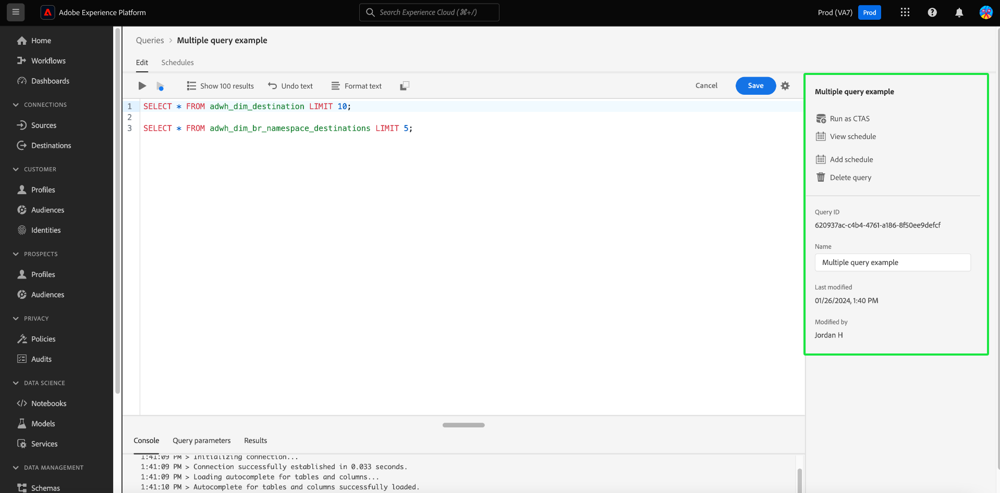

# Användargränssnittshandbok för frågeredigeraren

>[!NOTE]
>
>Den gamla redigeraren togs bort den 24 maj 2024. Det är inte längre tillgängligt för användning. Nu kan du använda [Förbättrad frågeredigerare](#enhanced-editor-toggle) skriva, validera och köra frågor

Frågeredigeraren är ett interaktivt verktyg från Adobe Experience Platform Query Service som gör att du kan skriva, validera och köra frågor för kundupplevelsedata i [!DNL Experience Platform] användargränssnitt. Frågeredigeraren har stöd för att utveckla frågor för analys och datautforskande, och gör att du kan köra interaktiva frågor i utvecklingssyfte samt icke-interaktiva frågor för att fylla i datauppsättningar i [!DNL Experience Platform].

Mer information om funktioner och koncept för tjänsten Query finns i [Översikt över frågetjänsten](../home.md). Mer information om hur du navigerar i användargränssnittet för frågetjänsten på [!DNL Platform], se [Översikt över användargränssnittet i frågetjänsten](./overview.md).

## Komma igång {#getting-started}

Frågeredigeraren erbjuder flexibel körning av frågor genom att ansluta till frågetjänsten och frågor som bara körs när den här anslutningen är aktiv.

## Åtkomst till frågeredigeraren {#accessing-query-editor}

I [!DNL Experience Platform] Gränssnitt, välj **[!UICONTROL Queries]** i den vänstra navigeringsmenyn för att öppna arbetsytan för frågetjänsten. För att börja skriva frågor väljer du **[!UICONTROL Create Query]** längst upp till höger på skärmen. Den här länken är tillgänglig från någon av sidorna på arbetsytan för frågetjänsten.

### Ansluter till frågetjänsten {#connecting-to-query-service}

Frågeredigeraren tar några sekunder att initiera och ansluta till frågetjänsten när den öppnas. Konsolen talar om för dig när den är ansluten, vilket visas nedan. Om du försöker köra en fråga innan redigeraren har anslutit, fördröjs körningen tills anslutningen är klar.

### Hur frågor körs från Frågeredigeraren {#run-a-query}

Frågor som körs i Frågeredigeraren körs interaktivt, vilket innebär att frågan avbryts om du stänger webbläsaren eller navigerar bort. Detsamma gäller för frågor som skapas för att generera datauppsättningar från frågeutdata.

## Redigera frågor med den förbättrade Frågeredigeraren {#query-authoring}

>[!NOTE]
>
>Den gamla redigeraren togs bort den 24 maj 2024. Det är inte längre tillgängligt för användning. Nu kan du använda den förbättrade frågeredigeraren för att skriva, validera och köra frågor.

Med Frågeredigeraren kan du skriva, köra och spara frågor om kundupplevelsedata. Alla frågor som körs eller sparas i Frågeredigeraren är tillgängliga för alla användare i organisationen som har tillgång till Frågetjänsten.

### Inställningar {#settings}

En inställningsikon ovanför inmatningsfältet i Frågeredigeraren innehåller alternativ för att aktivera/inaktivera mörkt tema eller inaktivera/aktivera automatisk komplettering.

>[!TIP]
>
>Du kan [!UICONTROL Disable syntax auto complete] när du redigerar en fråga utan att förlora förloppet.

Om du vill aktivera mörka eller ljusa teman väljer du inställningsikonen () följt av alternativet i listrutan som visas.

#### Komplettera automatiskt {#auto-complete}

Frågeredigeraren föreslår automatiskt potentiella SQL-nyckelord tillsammans med tabell- eller kolumninformation för frågan när du skriver den. Funktionen för automatisk komplettering är aktiverad som standard och kan inaktiveras eller aktiveras när som helst från inställningarna för Frågeredigeraren.

Konfigurationsinställningen som slutförs automatiskt är per användare och sparas för den användarens efterföljande inloggningar. Om du inaktiverar den här funktionen hindras flera metadatakommandon från att bearbetas och ger rekommendationer som vanligtvis underlättar för författaren när han/hon redigerar frågor.

<!-- Currently editing the auto complete setting info. -->

### Kör flera sekventiella frågor {#execute-multiple-sequential-queries}

Använd den förbättrade frågeredigeraren för att skriva mer än en fråga och köra alla frågor sekventiellt. Körningen av flera frågor i en sekvens skapar varje loggpost. Endast resultatet av den första frågan visas dock i frågeredigeringskonsolen. Kontrollera frågeloggen om du behöver felsöka eller bekräfta de frågor som kördes. Se [dokumentation för frågeloggar](./query-logs.md) för mer information.

>[!NOTE]
> 
>Om en CTAS-fråga körs efter den första frågan i Frågeredigeraren skapas en tabell, men det finns inga utdata i Frågeredigeringskonsolen.

### Kör markerad fråga {#execute-selected-query}

Om du har skrivit flera frågor men bara behöver köra en fråga, kan du markera den valda frågan och välja
[!UICONTROL Run selected query] -ikon. Den här ikonen är som standard inaktiverad tills du väljer frågesyntax i redigeraren.

![Frågeredigeraren med [!UICONTROL Run selected query] är markerad.](../images/ui/query-editor/run-selected-query.png)

### Avbryt frågeredigeringssession {#cancel-query}

Ta kontroll över frågekörningen och förbättra produktiviteten genom att avbryta frågor som körs länge. Den här åtgärden rensar frågeredigeraren under en frågekörning. Frågan fortsätter att köras i bakgrunden. Om det är en CTAS-fråga kommer den fortfarande att generera en utdatamängd. Om du vill avbryta körningen i redigeraren och fortsätta att komponera en SQL-sats väljer du **[!UICONTROL Cancel query]** efter att en fråga har körts.

![Frågeredigeraren med [!UICONTROL Cancel query] markerad.](../images/ui/query-editor/cancel-query-run.png)

En bekräftelsedialogruta visas. Välj **[!UICONTROL Confirm]** för att avbryta frågekörningen.

### Resultatantal {#result-count}

Frågeredigeraren har maximalt 50 000 radutdata. Du kan välja hur många rader som ska visas samtidigt i frågeredigeringskonsolen. Om du vill ändra antalet rader som visas i konsolen väljer du **[!UICONTROL Result count]** och välj mellan alternativen 50, 100, 150, 300 och 500.

## Skriver frågor {#writing-queries}

[!UICONTROL Query Editor] är organiserat för att göra det så enkelt att skriva frågor som möjligt. Skärmbilden nedan visar hur redigeraren visas i användargränssnittet, med SQL-postfältet och **Spela upp** markerad.

För att minimera utvecklingstiden rekommenderar vi att du utvecklar frågor med begränsningar för antalet rader som returneras. Till exempel: `SELECT fields FROM table WHERE conditions LIMIT number_of_rows`. När du har verifierat att frågan ger det förväntade resultatet tar du bort gränserna och kör frågan med `CREATE TABLE tablename AS SELECT` för att generera en datauppsättning med utdata.

## Skrivverktyg i Frågeredigeraren {#writing-tools}

- **Automatisk syntaxmarkering:** Gör det enklare att läsa och ordna SQL.

- **SQL-nyckelord har slutförts automatiskt:** Börja skriva frågan, använd sedan piltangenterna för att navigera till önskad term och trycka på **Retur**.

- **Tabell och fält har fyllts i automatiskt:** Börja skriva det tabellnamn som du vill använda `SELECT` navigera sedan till tabellen du letar efter med piltangenterna och tryck på **Retur**. När en tabell har markerats identifieras fält i den tabellen automatiskt.

### Formatera text {#format-text}

The [!UICONTROL Format text] gör din fråga mer läsbar genom att lägga till en standardiserad syntaxformatering. Välj **[!UICONTROL Format text]** för att standardisera all text i Frågeredigeraren.

>[!NOTE]
>
>The [!UICONTROL Format text] fungerar inte med anonyma block. Om du vill lära dig att kedja en eller flera SQL-satser sekventiellt läser du i [anonym blockdokumentation](../key-concepts/anonymous-block.md).

![Frågeredigeraren med [!UICONTROL Format text] och SQL-satserna är markerade.](../images/ui/query-editor/format-text.png)

<!-- ### Undo text {#undo-text}

If you format your SQL in the Query Editor, you can undo the formatting applied by the [!UICONTROL Format text] feature. To return your SQL back to its original form, select **[!UICONTROL Undo text]**.

![The Query Editor with [!UICONTROL Undo text] and the SQL statements highlighted.](../images/ui/query-editor/undo-text.png) -->

### Kopiera SQL {#copy-sql}

Välj kopieringsikonen om du vill kopiera SQL från Frågeredigeraren till Urklipp. Den här kopieringsfunktionen är tillgänglig för både frågemallar och nyskapade frågor i Frågeredigeraren.

### Frågeinformation {#query-details}

Om du vill visa en fråga i Frågeredigeraren väljer du en sparad mall i dialogrutan [!UICONTROL Templates] -fliken. Panelen Frågeinformation innehåller mer information och verktyg för att hantera den valda frågan. Här visas även användbara metadata, t.ex. den senaste gången frågan ändrades och vem som ändrade den, om tillämpligt.

>[!NOTE]
>
>The [!UICONTROL View schedule], [!UICONTROL Add schedule] och [!UICONTROL Delete query] är bara tillgängliga när frågan har sparats som en mall. The [!UICONTROL Add schedule] går direkt till schemaläggningsverktyget från Frågeredigeraren. The [!UICONTROL View schedule] går direkt till schemalagret för den frågan. Läs dokumentationen om frågescheman för att lära dig mer om [skapa frågescheman i användargränssnittet](./query-schedules.md#create-schedule).

På informationspanelen kan du generera en utdatauppsättning direkt från användargränssnittet, ta bort eller namnge den visade frågan, visa frågekörningsschemat och lägga till frågan i ett schema.

Om du vill generera en utdatamängd väljer du **[!UICONTROL Run as CTAS]**. The **[!UICONTROL Enter output dataset details]** visas. Ange ett namn och en beskrivning och välj **[!UICONTROL Run as CTAS]**. Den nya datauppsättningen visas i **[!UICONTROL Datasets]** Fliken Bläddra. Se [visa datauppsättningsdokumentation](../../catalog/datasets/user-guide.md#view-datasets) om du vill veta mer om tillgängliga datauppsättningar för din organisation.

>[!NOTE]
>
>The [!UICONTROL Run as CTAS] alternativet är bara tillgängligt om frågan har **not** har schemalagts.

![The [!UICONTROL Enter output dataset details] -dialogrutan.](../images/ui/query-editor/output-dataset-details.png)

När du har kört **[!UICONTROL Run as CTAS]** visas ett bekräftelsemeddelande som meddelar dig om åtgärden har slutförts. Det här popup-meddelandet innehåller en länk som gör det enkelt att navigera till arbetsytan för frågeloggar. Se [dokumentation för frågeloggar](./query-logs.md) om du vill ha mer information om frågeloggar.

### Sparar frågor {#saving-queries}

Frågeredigeraren innehåller en funktion för att spara en fråga och arbeta med den senare. Om du vill spara en fråga väljer du **[!UICONTROL Save]** i det övre högra hörnet av Frågeredigeraren. Innan en fråga kan sparas måste ett namn anges för frågan med hjälp av **[!UICONTROL Query Details]** -panelen.

>[!NOTE]
>
>Frågor som namngivits och sparats i med Frågeredigeraren är tillgängliga som mallar på kontrollpanelen Fråga [!UICONTROL Templates] -fliken. Se [malldokumentation](./query-templates.md) för mer information.

När du sparar en fråga i Frågeredigeraren visas ett bekräftelsemeddelande som informerar dig om den slutförda åtgärden. Det här popup-meddelandet innehåller en länk som gör det enkelt att navigera till arbetsytan för schemaläggning av frågor. Se [dokumentation för schemafrågor](./query-schedules.md) om du vill lära dig hur du kör frågor på en anpassad cadence.

### Schemalagda frågor {#scheduled-queries}

Frågor som har sparats som en mall kan schemaläggas från Frågeredigeraren. Med schemaläggningsfrågor kan du automatisera frågekörningar på en anpassad cache. Du kan schemalägga frågor baserat på frekvens, datum och tid och även välja en utdatamängd för dina resultat om det behövs. Frågescheman kan även inaktiveras eller tas bort via användargränssnittet.

Scheman ställs in i Frågeredigeraren. När du använder Frågeredigeraren kan du bara lägga till ett schema i en fråga som redan har skapats och sparats. Samma begränsning gäller inte API:t för frågetjänsten.

>[!NOTE]
>
>Schemalagda frågor som misslyckas tio på varandra följande körningar placeras automatiskt i en [!UICONTROL Quarantined] status. En fråga med den här statusen kräver att du gör något innan fler körningar kan utföras. Se [frågor i karantän](./monitor-queries.md#quarantined-queries) mer information.

Läs dokumentationen om frågescheman för att lära dig mer om [skapa frågescheman i användargränssnittet](./query-schedules.md). Du kan även läsa mer om hur du lägger till scheman med API:t i [slutpunktsguide för schemalagda frågor](../api/scheduled-queries.md).

Alla schemalagda frågor läggs till i listan i [!UICONTROL Scheduled queries] -fliken. Från den arbetsytan kan du övervaka statusen för alla schemalagda frågejobb via gränssnittet. På [!UICONTROL Scheduled queries] kan du hitta viktig information om frågekörningar och prenumerera på aviseringar. Den tillgängliga informationen omfattar status, schemainformation och felmeddelanden/koder om en körning misslyckas. Se [Övervaka dokument för schemalagda frågor](./monitor-queries.md) för mer information.

### Söka efter tidigare frågor {#previous-queries}

Alla frågor som körs från Frågeredigeraren hämtas i loggtabellen. Du kan använda sökfunktionerna i **[!UICONTROL Log]** för att hitta frågekörningar. Sparade frågor listas i **[!UICONTROL Templates]** -fliken.

Om en fråga har schemalagts [!UICONTROL Scheduled Queries] -fliken ger förbättrad synlighet via användargränssnittet för dessa frågefunktioner. Se [frågeövervakningsdokumentation](./monitor-queries.md) för mer information.

>[!NOTE]
>
>Frågor som inte körs sparas inte av loggen. För att frågan ska vara tillgänglig i frågetjänsten måste den köras eller sparas i frågeredigeraren.

## Köra frågor med Frågeredigeraren {#executing-queries}

Om du vill köra en fråga i Frågeredigeraren kan du ange SQL i redigeraren eller läsa in en tidigare fråga från **[!UICONTROL Log]** eller **[!UICONTROL Templates]** och markera **Spela upp**. Status för frågekörning visas i **[!UICONTROL Console]** nedan och utdata visas i **[!UICONTROL Results]** -fliken.

### Konsol {#console}

Konsolen ger information om status och funktion för frågetjänsten. Konsolen visar anslutningsstatus till frågetjänsten, frågeåtgärder som körs och eventuella felmeddelanden som är ett resultat av dessa frågor.

>[!NOTE]
>
>Konsolen visar bara fel som uppstått efter körningen av en fråga. Det visar inte de frågevalideringsfel som inträffar innan en fråga körs.

### Frågeresultat {#query-results}

När en fråga är klar visas resultatet i **[!UICONTROL Results]** -flik, bredvid **[!UICONTROL Console]** -fliken. I den här vyn visas frågans tabellutdata, med mellan 50 och 500 resultatrader beroende på vad du väljer [antal resultat](#result-count). I den här vyn kan du verifiera att frågan ger förväntat resultat. Om du vill generera en datauppsättning med frågan tar du bort begränsningar för returnerade rader och kör frågan med `CREATE TABLE tablename AS SELECT` för att generera en datauppsättning med utdata. Se [skapa datauppsättningar, genomgång](./create-datasets.md) för instruktioner om hur du genererar en datauppsättning från frågeresultat i Frågeredigeraren.

## Användningsexempel {#use-cases}

Frågetjänsten ger lösningar på en mängd olika användningsområden i olika branscher och affärsscenarier. Dessa praktiska exempel visar tjänstens flexibilitet och effekt när det gäller att ta itu med olika behov. Till [Upptäck hur frågetjänsten kan ge mervärde till dina specifika affärsbehov](../use-cases/overview.md), utforska den omfattande samlingen av falldokument. Lär dig använda frågetjänsten för att få insikter och lösningar för ökad effektivitet och affärsframgångar.

<!-- This video is from 2019. The logic is sounds but the workflow is too outdated. -->

## Köra frågor med självstudievideo om frågetjänsten {#query-tutorial-video}

I följande video visas hur du kör frågor i Adobe Experience Platform-gränssnittet och i en PSQL-klient. I videon visas också hur du använder enskilda egenskaper i ett XDM-objekt, Adobe-definierade funktioner och hur du använder CREATE TABLE AS SELECT-frågor (CTAS).

>[!NOTE]
>
>Gränssnittet som visas i videon är inaktuellt, men logiken som används i arbetsflödet är densamma.

>[!VIDEO](https://video.tv.adobe.com/v/29796?quality=12&learn=on)

## Nästa steg

Nu när du vet vilka funktioner som är tillgängliga i Frågeredigeraren och hur du navigerar i programmet kan du börja skapa egna frågor direkt i [!DNL Platform]. Mer information om hur du kör SQL-frågor mot datauppsättningar i [!DNL Data Lake], se guiden på [köra frågor](../best-practices/writing-queries.md).
