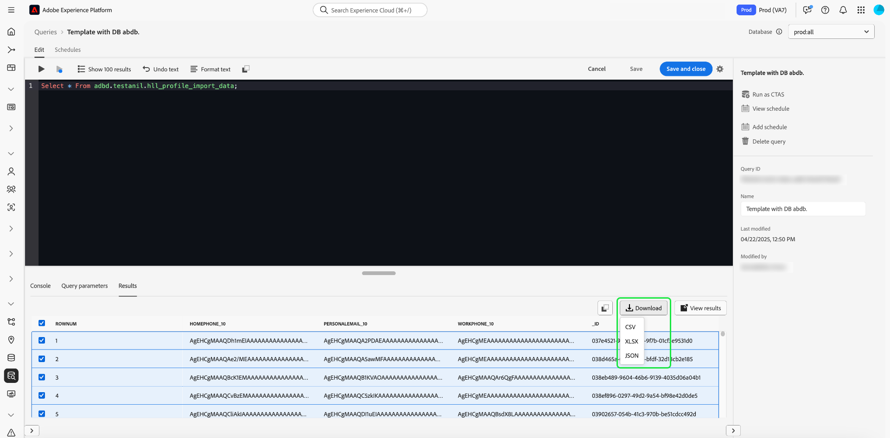

# Användargränssnittshandbok för frågeredigeraren

Frågeredigeraren är ett interaktivt verktyg som tillhandahålls av Adobe Experience Platform Query Service, som gör att du kan skriva, validera och köra frågor för kundupplevelsedata i [!DNL Experience Platform]-användargränssnittet. Frågeredigeraren har stöd för att utveckla frågor för analys och datautforskande. Du kan även köra interaktiva frågor i utvecklingssyfte och icke-interaktiva frågor för att fylla i datauppsättningar i [!DNL Experience Platform].

Mer information om begrepp och funktioner i tjänsten Query Service finns i [Översikt över frågetjänsten](../home.md). Mer information om hur du navigerar i användargränssnittet för frågetjänsten på [!DNL Experience Platform] finns i [Översikt över användargränssnittet för frågetjänsten](./overview.md).

## Komma igång {#getting-started}

Frågeredigeraren erbjuder flexibel körning av frågor genom att ansluta till frågetjänsten och frågor som bara körs när den här anslutningen är aktiv.

## Åtkomst till frågeredigeraren {#accessing-query-editor}

I [!DNL Experience Platform]-gränssnittet väljer du **[!UICONTROL Queries]** i den vänstra navigeringsmenyn för att öppna arbetsytan för frågetjänsten. Om du vill börja skriva frågor väljer du **[!UICONTROL Create Query]** längst upp till höger på skärmen. Den här länken är tillgänglig från någon av sidorna på arbetsytan för frågetjänsten.

### Ansluter till frågetjänsten {#connecting-to-query-service}

Frågeredigeraren tar några sekunder att initiera och ansluta till frågetjänsten när den öppnas. Konsolen talar om för dig när den är ansluten, vilket visas nedan. Om du försöker köra en fråga innan redigeraren har anslutit, fördröjs körningen tills anslutningen är klar.

### Hur frågor körs från Frågeredigeraren {#run-a-query}

Frågor som körs i Frågeredigeraren körs interaktivt, vilket innebär att frågan avbryts om du stänger webbläsaren eller navigerar bort. Detsamma gäller för frågor som skapas för att generera datauppsättningar från frågeutdata.

## Redigera frågor med den förbättrade Frågeredigeraren {#query-authoring}

Med Frågeredigeraren kan du skriva, köra och spara frågor om kundupplevelsedata. Alla frågor som körs eller sparas i Frågeredigeraren är tillgängliga för alla användare i organisationen som har tillgång till Frågetjänsten.

### Databasväljare {#database-selector}

Välj en databas som ska frågas i listrutan i det övre högra hörnet i Frågeredigeraren. Den valda databasen visas i listrutan.

### Inställningar {#settings}

En inställningsikon ovanför inmatningsfältet i Frågeredigeraren innehåller alternativ för att aktivera/inaktivera mörkt tema eller inaktivera/aktivera automatisk komplettering.

>[!TIP]
>
>Du kan [!UICONTROL Disable syntax auto complete] när du redigerar en fråga utan att förlora förloppet.

Om du vill aktivera mörka eller ljusa teman väljer du inställningsikonen () följt av alternativet i listrutan som visas.

#### Komplettera automatiskt {#auto-complete}

Frågeredigeraren föreslår automatiskt potentiella SQL-nyckelord tillsammans med tabell- eller kolumninformation för frågan när du skriver den. Funktionen för automatisk komplettering är aktiverad som standard och kan inaktiveras eller aktiveras när som helst från inställningarna för Frågeredigeraren.

Konfigurationsinställningen som slutförs automatiskt är per användare och sparas för den användarens efterföljande inloggningar. Om du inaktiverar den här funktionen hindras flera metadatakommandon från att bearbetas och ger rekommendationer som vanligtvis underlättar för författaren när han/hon redigerar frågor.

### Kör flera sekventiella frågor {#execute-multiple-sequential-queries}

Använd den förbättrade frågeredigeraren för att skriva mer än en fråga och köra alla frågor sekventiellt. Körningen av flera frågor i en sekvens skapar varje loggpost. Endast resultatet av den första frågan visas dock i frågeredigeringskonsolen. Kontrollera frågeloggen om du behöver felsöka eller bekräfta de frågor som kördes. Mer information finns i [frågeloggsdokumentationen](./query-logs.md).

>[!NOTE]
> 
>Om en CTAS-fråga körs efter den första frågan i Frågeredigeraren skapas en tabell, men det finns inga utdata i Frågeredigeringskonsolen.

### Kör markerad fråga {#execute-selected-query}

Om du har skrivit flera frågor men bara behöver köra en fråga, kan du markera den valda frågan och välja
[!UICONTROL Run selected query]-ikon. Den här ikonen är som standard inaktiverad tills du väljer frågesyntax i redigeraren.

![Frågeredigeraren med ikonen [!UICONTROL Run selected query] markerad.](../images/ui/query-editor/run-selected-query.png)

### Avbryt frågeredigeringssession {#cancel-query}

Ta kontroll över frågekörningen och förbättra produktiviteten genom att avbryta frågor som körs länge. Den här åtgärden rensar frågeredigeraren under en frågekörning. Frågan fortsätter att köras i bakgrunden. Om det är en CTAS-fråga kommer den fortfarande att generera en utdatamängd. Om du vill avbryta körningen i redigeraren och fortsätta komponera en SQL-sats väljer du **[!UICONTROL Cancel query]** efter att du har kört en fråga.

![Frågeredigeraren med [!UICONTROL Cancel query] markerat.](../images/ui/query-editor/cancel-query-run.png)

En bekräftelsedialogruta visas. Välj **[!UICONTROL Confirm]** om du vill avbryta frågekörningen.

### Resultatantal {#result-count}

Frågeredigeraren har maximalt 50 000 radutdata. Du kan välja hur många rader som ska visas samtidigt i frågeredigeringskonsolen. Om du vill ändra antalet rader som visas i konsolen väljer du listrutan **[!UICONTROL Result count]** och väljer bland alternativen 50, 100, 150, 300, 500 och 1 000.

>[!NOTE]
>
>Eftersom Experience Platform-gränssnittet kan hantera upp till 1 000 rader ignoreras överföring av ett LIMIT-värde över 1 000.

## Skriver frågor {#writing-queries}

[!UICONTROL Query Editor] är organiserat för att göra skrivfrågor så enkla som möjligt. Skärmbilden nedan visar hur redigeraren visas i användargränssnittet, med SQL-inmatningsfältet och **Spela upp** markerat.

För att minimera utvecklingstiden rekommenderar vi att du utvecklar frågor med begränsningar för antalet rader som returneras. Exempel: `SELECT fields FROM table WHERE conditions LIMIT number_of_rows`. När du har verifierat att din fråga skapar förväntade utdata tar du bort gränserna och kör frågan med `CREATE TABLE tablename AS SELECT` för att generera en datauppsättning med utdata.

## Skrivverktyg i Frågeredigeraren {#writing-tools}

Använd Frågeredigerarens skrivverktyg för att förbättra frågeredigeringsprocessen. Det finns alternativ för att formatera text, kopiera SQL, hantera frågeinformation och spara eller schemalägga ditt arbete medan du arbetar.

### Formatera text {#format-text}

Funktionen [!UICONTROL Format text] gör din fråga mer läsbar genom att lägga till en standardiserad syntaxformatering. Välj **[!UICONTROL Format text]** om du vill standardisera all text i Frågeredigeraren.

>[!NOTE]
>
>Funktionen [!UICONTROL Format text] fungerar inte med anonyma block. Mer information om hur du kedjer en eller flera SQL-satser sekventiellt finns i [dokumentationen för det anonyma blocket](../key-concepts/anonymous-block.md).

![Frågeredigeraren med [!UICONTROL Format text] och SQL-satserna markerade.](../images/ui/query-editor/format-text.png)

<!-- ### Undo text {#undo-text}

If you format your SQL in the Query Editor, you can undo the formatting applied by the [!UICONTROL Format text] feature. To return your SQL back to its original form, select **[!UICONTROL Undo text]**.

![The Query Editor with [!UICONTROL Undo text] and the SQL statements highlighted.](../images/ui/query-editor/undo-text.png) -->

### Kopiera SQL {#copy-sql}

Välj kopieringsikonen om du vill kopiera SQL från Frågeredigeraren till Urklipp. Den här kopieringsfunktionen är tillgänglig för både frågemallar och nyskapade frågor i Frågeredigeraren.

### Frågeinformation {#query-details}

Om du vill visa en fråga i frågeredigeraren väljer du en sparad mall på fliken [!UICONTROL Templates]. Panelen Frågeinformation innehåller mer information och verktyg för att hantera den valda frågan. Här visas även användbara metadata, t.ex. den senaste gången frågan ändrades och vem som ändrade den, om tillämpligt.

>[!NOTE]
>
>Alternativen [!UICONTROL View schedule], [!UICONTROL Add schedule] och [!UICONTROL Delete query] är bara tillgängliga efter att frågan har sparats som en mall. Alternativet [!UICONTROL Add schedule] tar dig direkt till schemaläggningsverktyget från Frågeredigeraren. Alternativet [!UICONTROL View schedule] tar dig direkt till schemalagret för den frågan. I dokumentationen för frågescheman finns mer information om hur du [skapar frågescheman i användargränssnittet](./query-schedules.md#create-schedule).

På informationspanelen kan du generera en utdatauppsättning direkt från användargränssnittet, ta bort eller namnge den visade frågan, visa frågekörningsschemat och lägga till frågan i ett schema.

Om du vill generera en utdatamängd väljer du **[!UICONTROL Run as CTAS]**. Dialogrutan **[!UICONTROL Enter output dataset details]** visas. Ange ett namn och en beskrivning och välj sedan **[!UICONTROL Run as CTAS]**. Den nya datauppsättningen visas på fliken **[!UICONTROL Datasets]** Bläddra. Mer information om tillgängliga datauppsättningar för din organisation finns i [dokumentationen för att visa datauppsättningar](../../catalog/datasets/user-guide.md#view-datasets).

>[!NOTE]
>
>Alternativet [!UICONTROL Run as CTAS] är bara tillgängligt om frågan har **inte** schemalagts.

![Dialogrutan [!UICONTROL Enter output dataset details].](../images/ui/query-editor/output-dataset-details.png)

När du har utfört åtgärden **[!UICONTROL Run as CTAS]** visas ett bekräftelsemeddelande som meddelar dig om den slutförda åtgärden. Det här popup-meddelandet innehåller en länk som gör det enkelt att navigera till arbetsytan för frågeloggar. Mer information om frågeloggar finns i [frågeloggsdokumentationen](./query-logs.md).

### Sparar frågor {#saving-queries}

Frågeredigeraren innehåller en funktion för att spara en fråga och arbeta med den senare. Om du vill spara en fråga väljer du **[!UICONTROL Save]** i det övre högra hörnet i Frågeredigeraren. Innan en fråga kan sparas måste ett namn anges för frågan med hjälp av panelen **[!UICONTROL Query Details]**.

>[!NOTE]
>
>Frågor som namngivits och sparats i med hjälp av Frågeredigeraren är tillgängliga som mallar på fliken [!UICONTROL Templates] i frågekontrollpanelen. Mer information finns i [malldokumentationen](./query-templates.md).

När du sparar en fråga i Frågeredigeraren visas ett bekräftelsemeddelande som informerar dig om den slutförda åtgärden. Det här popup-meddelandet innehåller en länk som gör det enkelt att navigera till arbetsytan för schemaläggning av frågor. Läs [dokumentationen för schemafrågor](./query-schedules.md) om du vill veta hur du kör frågor på en anpassad cache.

### Schemalagda frågor {#scheduled-queries}

Frågor som har sparats som en mall kan schemaläggas från Frågeredigeraren. Med schemaläggningsfrågor kan du automatisera frågekörningar på en anpassad cache. Du kan schemalägga frågor baserat på frekvens, datum och tid och även välja en utdatamängd för dina resultat om det behövs. Frågescheman kan även inaktiveras eller tas bort via användargränssnittet.

Scheman ställs in i Frågeredigeraren. När du använder Frågeredigeraren kan du bara lägga till ett schema i en fråga som redan har skapats och sparats. Samma begränsning gäller inte API:t för frågetjänsten.

>[!NOTE]
>
>Schemalagda frågor som misslyckas tio på varandra följande körningar får automatiskt statusen [!UICONTROL Quarantined]. En fråga med den här statusen kräver att du gör något innan fler körningar kan utföras. Mer information finns i dokumentationen för [frågor i karantän](./monitor-queries.md#quarantined-queries).

I dokumentationen för frågescheman finns mer information om hur du [skapar frågescheman i användargränssnittet](./query-schedules.md). Om du vill lära dig hur du lägger till scheman med API:t läser du [slutpunktshandboken för schemalagda frågor](../api/scheduled-queries.md).

Alla schemalagda frågor läggs till i listan på fliken [!UICONTROL Scheduled queries]. Från den arbetsytan kan du övervaka statusen för alla schemalagda frågejobb via gränssnittet. På fliken [!UICONTROL Scheduled queries] kan du hitta viktig information om frågekörningar och prenumerera på aviseringar. Den tillgängliga informationen omfattar status, schemainformation och felmeddelanden/koder om en körning misslyckas. Mer information finns i dokumentet [Övervaka schemalagda frågor](./monitor-queries.md).

### Söka efter tidigare frågor {#previous-queries}

Alla frågor som körs från Frågeredigeraren hämtas i loggtabellen. Du kan använda sökfunktionen på fliken **[!UICONTROL Log]** för att hitta frågekörningar. Sparade frågor visas på fliken **[!UICONTROL Templates]**.

Om en fråga har schemalagts ger fliken [!UICONTROL Scheduled Queries] förbättrad synlighet via gränssnittet för dessa frågefunktioner. Mer information finns i [frågeövervakningsdokumentationen](./monitor-queries.md).

>[!NOTE]
>
>Frågor som inte körs sparas inte av loggen. För att frågan ska vara tillgänglig i frågetjänsten måste den köras eller sparas i frågeredigeraren.

### Objektwebbläsare {#object-browser}

Använd objektwebbläsaren för att enkelt söka efter och filtrera datauppsättningar. Objektwebbläsaren minskar tiden som går åt till att söka efter tabeller och datauppsättningar i stora miljöer med många datauppsättningar. Med smidig åtkomst till relevanta data och metadata kan du fokusera mer på att skapa frågor och inte på navigering.

Om du vill navigera i databasen med objektets webbläsare anger du ett tabellnamn i sökfältet eller väljer **[!UICONTROL Tables]** för att expandera listan med tillgängliga datauppsättningar och tabeller. När du använder sökfältet filtreras listan med tillgängliga tabeller dynamiskt baserat på dina indata.

Alla datauppsättningar som finns i [den valda databasen](#database-dropdown) visas i en navigeringsruta till vänster om Frågeredigeraren.

Schemat som visas i objektwebbläsaren är ett observerbart schema. Det innebär att du kan använda det för att övervaka ändringar och uppdateringar i realtid när ändringarna syns direkt. De observerbara schemana hjälper till att säkerställa datasynkronisering och hjälper till med felsökning och analysåtgärder.

#### Aktuell begränsning {#current-limitation}

Systemet bearbetar frågor sekventiellt, vilket innebär att bara en fråga kan köras i taget. När en fråga bearbetas går det inte att komma åt ytterligare tabeller i den vänstra navigeringen.

#### Åtkomst till tabellmetadata {#table-metadata}

Förutom snabba sökningar kan du nu enkelt komma åt metadata för alla tabeller genom att markera ikonen i bredvid tabellnamnet. Detta ger dig detaljerad information om den markerade tabellen, som hjälper dig att fatta välgrundade beslut när du skriver frågor.

#### Utforska underordnade tabeller

Om du vill utforska underordnade eller länkade tabeller väljer du listrutepilen bredvid ett tabellnamn i listan. Detta utökar tabellen så att den visar alla associerade underordnade tabeller och ger en tydlig vy av datastrukturen och möjliggör mer komplexa frågekonstruktioner. Ikonen bredvid fältnamnet anger kolumnens datatyp så att du lättare kan identifiera den vid komplexa frågor.

## Köra frågor med Frågeredigeraren {#executing-queries}

Om du vill köra en fråga i frågeredigeraren kan du ange SQL i redigeraren eller läsa in en tidigare fråga från fliken **[!UICONTROL Log]** eller **[!UICONTROL Templates]** och välja **Spela upp**. Status för frågekörning visas på fliken **[!UICONTROL Console]** nedan och utdata visas på fliken **[!UICONTROL Results]**.

### Konsol {#console}

Konsolen ger information om status och funktion för frågetjänsten. Konsolen visar anslutningsstatus till frågetjänsten, frågeåtgärder som körs och eventuella felmeddelanden som är ett resultat av dessa frågor.

>[!NOTE]
>
>Konsolen visar bara fel som uppstått efter körningen av en fråga. Det visar inte de frågevalideringsfel som inträffar innan en fråga körs.

## Frågeresultat {#query-results}

När en fråga har slutförts visas resultaten på fliken **[!UICONTROL Results]** bredvid fliken **[!UICONTROL Console]**. I den här vyn visas frågans tabellutdata, med mellan 50 och 1 000 resultatrader beroende på ditt valda [resultatantal](#result-count). I den här vyn kan du verifiera att frågan ger förväntat resultat. Om du vill generera en datauppsättning med din fråga tar du bort begränsningar för returnerade rader och kör frågan med `CREATE TABLE tablename AS SELECT` för att generera en datauppsättning med utdata. Se självstudiekursen [om att generera datauppsättningar](./create-datasets.md) för instruktioner om hur du genererar en datauppsättning från frågeresultat i Frågeredigeraren.

### Hämta frågeresultat {#download-query-results}

>[!AVAILABILITY]
>
>Hämtningsfunktionerna är bara tillgängliga för kunder med tillägget Data Distiller. Kontakta din Adobe-representant om du vill veta mer om Data Distiller.

När du har kört en fråga hämtar du resultaten i CSV-, XLSX- eller JSON-format för offlineanalys, rapportering eller kalkylbladsarbetsflöden. Den här funktionen effektiviserar arbetsflödena för marknadsförings- och analysteam genom att ge omedelbar tillgång till frågeresultat för offlineanalys, rapportering och Excel-baserade processer.

Om du vill hämta dina frågeresultat väljer du **[!UICONTROL Download]** i det övre högra hörnet på fliken Frågeredigeraren **[!UICONTROL Result]**. Välj sedan **[!UICONTROL CSV]**, **[!UICONTROL XLSX]** eller **[!UICONTROL JSON]** i listrutan. Filen hämtas automatiskt till den lokala datorn. Välj det format som passar ditt användningssätt, CSV för export med låg vikt, XLSX för formaterade kalkylblad eller JSON för strukturerad datahantering.

>[!NOTE]
>
>Om knappen **[!UICONTROL Download]** saknas kontrollerar du frågeresultaten. Knappen visas bara när posterna returneras. Om inga poster returneras visar fliken **[!UICONTROL Result]** meddelandet&quot;Inga resultat&quot; och hämtningsalternativet är inaktiverat.

>[!NOTE]
>
>När du öppnar en CSV-fil i Excel kanske följande varning visas:  &quot;Möjlig dataförlust. Vissa funktioner kan gå förlorade om du sparar arbetsboken i kommaavgränsat format (.csv). Om du vill bevara dessa funktioner sparar du den i ett Excel-filformat.&quot; Tänk dessutom på att datum- och tidsformateringen kan variera beroende på filtyp. CSV-filer behåller det format som visas i frågeresultatet, medan XLSX-filer kan tillämpa lokaliserad formatering automatiskt i Excel. Om den här varningen visas kan du fortsätta. Om du vill bevara Excel-specifik formatering sparar du filen som XLSX i stället.

### Visa resultat i helskärmsläge {#view-results}

När du har kört en fråga väljer du **[!UICONTROL View results]** på fliken **[!UICONTROL Result]** för att öppna en helskärmsvy av resultatet i tabellform.

Använd förhandsgranskning i helskärmsläge för att enkelt skanna breda tabeller och inspektera radnivådetaljer utan vågrät rullning. I helskärmsläget visas utdata i ett stödraster som kan storleksändras, vilket gör det enklare att granska stora datauppsättningar och skanna över kolumner.

>[!NOTE]
>
>Förhandsgranskningen är skrivskyddad och ändrar inte frågan eller datauppsättningen.

### Kopiera resultat {#copy-results}

Använd den förbättrade kopieringsfunktionen i Frågeredigeraren för att kopiera frågeresultat som kommaavgränsade värden (CSV) och klistra in dem i kalkylbladsverktyg som Excel för omedelbar validering eller rapportering. Den här funktionen förbättrar läsbarheten, bevarar formateringen och effektiviserar arbetsflödena utan att behöva använda verktyg från tredje part.

Du kan kopiera frågeresultat antingen från fliken [!UICONTROL Result] eller från förhandsgranskningen av helskärmsresultatet. På fliken **[!UICONTROL Result]** väljer du kopieringsikonen () om du vill kopiera alla frågeresultat till Urklipp. Om du vill aktivera kopieringsikonen markerar du först en rad. Du kan markera enskilda rader eller markera alla rader samtidigt med kryssrutan överst.

Du kan också välja **[!UICONTROL View results]** för att öppna förhandsvisningen i helskärmsläge. I den här dialogrutan markerar du enskilda rader eller använder kryssrutan i det övre vänstra hörnet för att markera alla rader och väljer sedan kopieringsikonen () för att kopiera markerade data.

### Föregående resultattabell (begränsad tillgänglighet) {#legacy-results-table}

>[!AVAILABILITY]
>
>Den äldre resultattabellen är bara tillgänglig för att markera användare via en funktionsflagga och kanske inte visas i den aktuella frågeredigeraren. Om ditt team använder dra-och-markera-arbetsflöden kontaktar du Adobe representant för att få åtkomst.

Den äldre versionen av Frågeredigeraren är avsedd för användare som använder flexibla, manuella arbetsflöden för data, t.ex. QA eller kalkylbladsbaserad granskning.

Det har stöd för inbyggda webbläsarbaserade dragningsmarkeringar, så att du kan markera och kopiera valfri del av utdata, inklusive enskilda celler eller block, med standardmarkeringsbeteendet. Det här är en kontrast till den förbättrade tabellen, som använder strukturerad radmarkering och dedikerade kopieringsåtgärder.

Kopierade data är tabbavgränsade, så när du klistrar in dem i verktyg som Excel förblir kolumnerna justerade och läsbara. Kolumnrubriker inkluderas också när du drar över rubrikraden.

## Exempel {#examples}

Frågetjänsten ger lösningar på en mängd olika användningsområden i olika branscher och affärsscenarier. Exemplen visar på tjänstens flexibilitet och effekt när det gäller att tillgodose olika behov. Om du vill [ta reda på hur frågetjänsten kan tillföra värde till dina specifika affärsbehov](../use-cases/overview.md) kan du utforska den omfattande samlingen av falldokument. Lär dig använda frågetjänsten för att få insikter och lösningar för ökad effektivitet och affärsframgångar.

<!-- This video is from 2019. The logic is sounds but the workflow is too outdated. -->

## Köra frågor med självstudievideo om frågetjänsten {#query-tutorial-video}

I följande video visas hur du kör frågor i Adobe Experience Platform-gränssnittet och i en PSQL-klient. I videon visas också hur du använder enskilda egenskaper i ett XDM-objekt, Adobe-definierade funktioner och hur du använder CREATE TABLE AS SELECT-frågor (CTAS).

>[!NOTE]
>
>Gränssnittet som visas i videon är inaktuellt, men logiken som används i arbetsflödet är densamma.

>[!VIDEO](https://video.tv.adobe.com/v/3470200?quality=12&learn=on&captions=swe)

## Nästa steg

Nu när du vet vilka funktioner som är tillgängliga i Frågeredigeraren och hur du navigerar i programmet kan du börja skapa egna frågor direkt i [!DNL Experience Platform]. Mer information om hur du kör SQL-frågor mot datauppsättningar i [!DNL Data Lake] finns i guiden om [att köra frågor](../best-practices/writing-queries.md).
