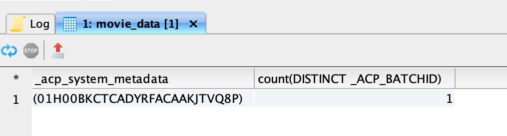

# Utforska, felsöka och verifiera batchimport med SQL

I det här dokumentet förklaras hur du verifierar och validerar poster i kapslade batchar med SQL. I det här dokumentet får du lära dig att:

- Få tillgång till data och batchmetadata
- Felsöka och säkerställ dataintegriteten genom att fråga grupper

>[!NOTE]
>
>Vissa skärmbilder i den här guiden tas från [!DNL DBVisualizer]. Mer information om hur du [ansluter frågetjänsten med DBVisualizer](../clients/dbvisulaizer.md) eller andra [BI-verktyg från tredje part](../clients/overview.md) finns i den länkade dokumentationen.

## Förhandskrav

För att du ska få en bättre förståelse för de begrepp som beskrivs i det här dokumentet bör du ha kunskap om följande ämnen:

- **Inläsning av data**: Se [översikten över datafrågor](../../ingestion/home.md) om du vill veta grunderna för hur data importeras till Experience Platform, inklusive de olika metoder och processer som används.
- **Gruppinmatning**: Se [API-översikt för gruppinmatning](../../ingestion/batch-ingestion/overview.md) om du vill veta mer om grundläggande begrepp för gruppinmatning. Närmare bestämt vad en&quot;batch&quot; är och hur den fungerar i Experience Platform dataöverföringsprocess.
- **Systemmetadata i datauppsättningar**: Se [Katalogtjänstöversikt](../../catalog/home.md) om du vill veta hur systemmetadatafält används för att spåra och fråga efter inlästa data.
- **Experience Data Model (XDM)**: Läs [schemas användargränssnittsöversikt](../../xdm/ui/overview.md) och [&#39;basics of schema composition&#39;](../../xdm/schema/composition.md) om du vill veta mer om XDM-scheman och hur de representerar och validerar strukturen och formatet för data som hämtas till Experience Platform.

## Få tillgång till data och batchmetadata {#access-dataset-batch-metadata}

Om du vill vara säker på att systemkolumner (metadatakolumner) inkluderas i frågeresultatet använder du SQL-kommandot `set drop_system_columns=false` i Frågeredigeraren. Detta konfigurerar beteendet för SQL-frågesessionen. Indata måste upprepas om du startar en ny session.

Om du sedan vill visa systemfälten för datauppsättningen kör du en SELECT all-sats för att visa resultaten från datauppsättningen, till exempel `select * from movie_data`. Resultatet innehåller två nya kolumner till höger `_acp_system_metadata` och `_ACP_BATCHID`. Metadatakolumnerna `_acp_system_metadata` och `_ACP_BATCHID` hjälper till att identifiera logiska och fysiska partitioner av inkapslade data.


När data importeras till Experience Platform tilldelas den en logisk partition baserat på inkommande data. Denna logiska partition representeras av `_acp_system_metadata.sourceBatchId`. Detta ID hjälper till att gruppera och identifiera datagrupperna logiskt innan de bearbetas och lagras.

När data har bearbetats och importerats till datasjön tilldelas den en fysisk partition som representeras av `_ACP_BATCHID`. Detta ID återspeglar den faktiska lagringspartitionen i datavjön där inmatade data finns.

### Använd SQL för att förstå logiska och fysiska partitioner {#understand-partitions}

För att förstå hur data grupperas och distribueras efter intag kan du använda följande fråga för att räkna antalet distinkta fysiska partitioner (`_ACP_BATCHID`) för varje logisk partition (`_acp_system_metadata.sourceBatchId`).

```SQL
SELECT  _acp_system_metadata, COUNT(DISTINCT _ACP_BATCHID) FROM movie_data
GROUP BY _acp_system_metadata
```

Resultatet av den här frågan visas i bilden nedan.



Dessa resultat visar att antalet indatabatchar inte nödvändigtvis matchar antalet utdatabatchar eftersom systemet avgör det mest effektiva sättet att gruppera och lagra data i datasjön.

I det här exemplet antas att du har infogat en CSV-fil i Experience Platform och skapat en datauppsättning med namnet `drug_checkout_data`.

Filen `drug_checkout_data` är en djupt kapslad uppsättning med 35 000 poster. Använd SQL-satsen `SELECT * FROM drug_orders;` för att förhandsgranska den första uppsättningen poster i den JSON-baserade `drug_orders`-datauppsättningen.

Bilden nedan visar en förhandsvisning av filen och dess poster.


### Använd SQL för att generera insikter om batchbearbetningsprocess {#sql-insights-on-batch-ingestion}

Använd SQL-satsen nedan för att få insikter i hur dataöverföringsprocessen har grupperat och bearbetat indataposterna i grupper.

```sql
SELECT _acp_system_metadata,
       Count(DISTINCT _acp_batchid) AS numoutputbatches,
       Count(_acp_batchid)          AS recordcount
FROM   drug_orders
GROUP  BY _acp_system_metadata 
```

Frågeresultaten visas i bilden nedan.


Resultatet visar hur effektiv och beteendemässig dataöverföringsprocessen är. Även om tre indatabatchar skapades - var och en innehållande 2000-, 24000- och 9000-poster - när posterna kombinerades och deduplicerades, så återstod bara en unik batch.

>[!NOTE]
>
>Alla poster som är synliga i en datauppsättning är de som har importerats. En lyckad gruppinmatning innebär inte att alla poster som skickades från källinmatningen finns. Du måste söka efter misslyckade försök att få tillgång till data för att hitta de batchar/poster som inte har gjort det.

## Validera en batch med SQL {#validate-a-batch-with-SQL}

Validera och verifiera sedan de poster som har importerats till datauppsättningen med SQL.

>[!TIP]
>
>Om du vill hämta batch-ID:t och frågeposterna som är kopplade till det batch-ID:t måste du först skapa en batch i Experience Platform. Om du vill testa processen själv kan du importera CSV-data till Experience Platform. Läs guiden om hur du [mappar en CSV-fil till ett befintligt XDM-schema med hjälp av AI-genererade rekommendationer](../../ingestion/tutorials/map-csv/recommendations.md).

När du har infogat en grupp måste du navigera till [!UICONTROL Datasets activity tab] för den datauppsättning som du har infogat data i.

I Experience Platform-gränssnittet väljer du **[!UICONTROL Datasets]** i den vänstra navigeringen för att öppna kontrollpanelen [!UICONTROL Datasets]. Välj sedan namnet på datauppsättningen på fliken [!UICONTROL Browse] för att komma åt skärmen [!UICONTROL Dataset activity].


Vyn [!UICONTROL Dataset activity] visas. Den här vyn innehåller information om den valda datauppsättningen. Den innehåller alla kapslade batchar som visas i ett tabellformat.

Välj en batch i listan över tillgängliga batchar och kopiera [!UICONTROL Batch ID] från informationspanelen till höger.


Använd sedan följande fråga för att hämta alla poster som inkluderades i datauppsättningen som en del av den gruppen:

```sql
SELECT * FROM movie_data
WHERE  _acp_batchid='01H00BKCTCADYRFACAAKJTVQ8P' 
LIMIT 1;
```

Nyckelordet `_ACP_BATCHID` används för att filtrera [!UICONTROL Batch ID].

>[!TIP]
>
>Satsen `LIMIT` är användbar om du vill begränsa antalet rader som visas, men ett filtervillkor är mer önskvärt.

När du kör frågan i Frågeredigeraren kortas resultatet av till 100 rader. Frågeredigeraren är utformad för snabba förhandsgranskningar och utredningar. Om du vill hämta upp till 50 000 rader kan du använda ett tredjepartsverktyg som DBVisualizer eller DBeaver.

## Nästa steg {#next-steps}

Genom att läsa det här dokumentet lärde du dig att verifiera och validera poster i importerade batchar som en del av dataöverföringsprocessen. Du fick också insikt i hur du får åtkomst till data batch-metadata, hur du förstår logiska och fysiska partitioner och hur du får frågor om specifika grupper med hjälp av SQL-kommandon. Denna kunskap kan hjälpa er att säkerställa dataintegriteten och optimera er datalagring på Experience Platform.

Därefter bör du öva på datainhämtning för att tillämpa de inlärda begreppen. Infoga en exempeldatauppsättning i Experience Platform med antingen de medföljande exempelfilerna eller dina egna data. Om du inte redan har gjort det läser du självstudiekursen om hur du [importerar data till Adobe Experience Platform](../../ingestion/tutorials/ingest-batch-data.md).

Du kan också lära dig hur du [ansluter och verifierar frågetjänsten med ett antal klientprogram](../clients/overview.md) för att förbättra dina dataanalysfunktioner.
