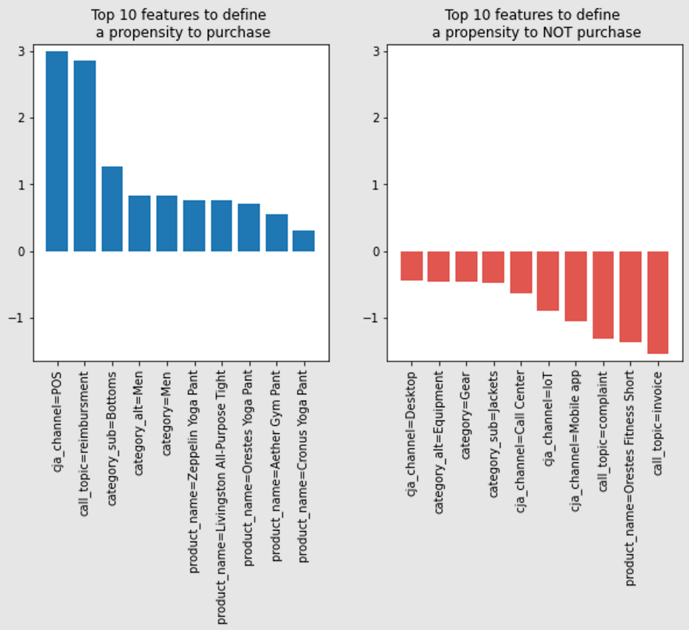

# Bestäm en benägenhetspoäng med hjälp av en maskininlärningsgenererad prediktiv modell

Med hjälp av frågetjänsten kan du utnyttja prediktiva modeller, som benägenhetspoäng, som bygger på maskininlärningsplattformen för att analysera data från Experience Platform.

Den här guiden förklarar hur du använder frågetjänsten för att skicka data till din maskininlärningsplattform för att utbilda en modell i en bärbar dator. Den utbildade modellen kan tillämpas på data med SQL för att förutsäga kundens benägenhet att köpa för varje besök.

## Komma igång

Som en del av den här processen kräver att du utbildar en maskininlärningsmodell, vilket krävs i det här dokumentet för att du ska kunna lära dig en eller flera maskininlärningsmiljöer.

Det här exemplet använder [!DNL Jupyter Notebook] som en utvecklingsmiljö. Det finns många alternativ, men [!DNL Jupyter Notebook] rekommenderas eftersom det är ett webbprogram med öppen källkod som har låga datorkrav. Det kan vara [hämtat från den officiella webbplatsen](https://jupyter.org/).

Om du inte redan har gjort det följer du stegen för att [koppla [!DNL Jupyter Notebook] med Adobe Experience Platform Query Service](../clients/jupyter-notebook.md) innan du fortsätter med den här guiden.

Biblioteken som används i det här exemplet omfattar:

```console
python=3.6.7
psycopg2
sklearn
pandas
matplotlib
numpy
tqdm
```

## Importera analystabeller från Platform till [!DNL Jupyter Notebook] {#import-analytics-tables}

För att generera en prognosmodell måste en projektion av analysdata som lagras i Platform importeras till [!DNL Jupyter Notebook]. Från en [!DNL Python] 3 [!DNL Jupyter Notebook] som är kopplade till frågetjänsten importerar följande kommandon en kundbeteendedatauppsättning från Luma, en fiktiv klädbutik. När plattformsdata lagras i XDM-format (Experience Data Model) måste ett exempel-JSON-objekt skapas som följer schemats struktur. I dokumentationen finns instruktioner om hur du [generera JSON-exempelobjektet](../../xdm/ui/sample.md).

![The [!DNL Jupyter Notebook] kontrollpanel med flera kommandon markerade.](../images/use-cases/jupyter-commands.png)

I utdata visas en tabell med alla kolumner från Lumas beteendedatauppsättning i [!DNL Jupyter Notebook] kontrollpanel.

![Det tabellinspelade resultatet av Lumas importerade kundbeteendedatauppsättning i [!DNL Jupyter Notebook].](../images/use-cases/behavioural-dataset-results.png)

## Förbered data för maskininlärning {#prepare-data-for-machine-learning}

En målkolumn måste identifieras för att kunna utbilda en maskininlärningsmodell. Som köpbenägenhet är målet för det här användningsexemplet, `analytic_action` -kolumnen väljs som målkolumn från Luma-resultatet. Värdet `productPurchase` är indikatorn på ett kundköp. The `purchase_value` och `purchase_num` kolumner tas också bort eftersom de är direkt relaterade till produktinköpsåtgärden.

Följande kommandon används för att utföra dessa åtgärder:

```python
#define the target label for prediction
df['target'] = (df['analytic_action'] == 'productPurchase').astype(int)
#remove columns that are dependent on the label
df.drop(['analytic_action','purchase_value'],axis=1,inplace=True)
```

Därefter måste data från Luma-datauppsättningen omvandlas till lämpliga representationer. Två steg krävs:

1. Omvandla de kolumner som representerar tal till numeriska kolumner. Om du vill göra det explicit konverterar du datatypen i `dataframe`.
1. Omvandla kategoriserade kolumner även till numeriska kolumner.

```python
#convert columns that represent numbers
num_cols = ['purchase_num', 'value_cart', 'value_lifetime']
df[num_cols] = df[num_cols].apply(pd.to_numeric, errors='coerce')
```

En teknik som kallas *en aktiverad kodning* används för att konvertera kategoriserade datavariabler som kan användas med maskinvaru- och djuplärande algoritmer. Detta förbättrar i sin tur både förutsägelser och en modells tillförlitlighet. Använd `Sklearn` bibliotek som representerar varje kategoriserat värde i en separat kolumn.

```python
from sklearn.preprocessing import OneHotEncoder

#get the categorical columns
cat_columns = list(set(df.columns) - set(num_cols + ['target']))

#get the dataframe with categorical columns only
df_cat = df.loc[:,cat_columns]

#initialize sklearn's OneHotEncoder
enc = OneHotEncoder(handle_unknown='ignore')

#fit the data into the encoder
enc.fit(df_cat)

#define OneHotEncoder's columns names
ohc_columns = [[c+'='+c_ for c_ in cat] for c,cat in zip(cat_columns,enc.categories_)]
ohc_columns = [item for sublist in ohc_columns for item in sublist]

#finalize the data input to the ML models
X = pd.DataFrame( np.concatenate((enc.transform(df_cat).toarray(),df[num_cols]),axis=1),
                 columns =  ohc_columns + num_cols)

#define target column
y = df['target']
```

Data definierade som `X` är i tabellform och visas enligt nedan:

![Det tabellariserade resultatet av X inom [!DNL Jupyter Notebook].](../images/use-cases/x-output-table.png)


Nu när nödvändiga data för maskininlärning är tillgängliga kan de passa de förkonfigurerade maskininlärningsmodellerna i [!DNL Python]&#39;s `sklearn` bibliotek. [!DNL Logistics Regression] används för att utbilda benägenhetsmodellen och gör det möjligt att se noggrannheten hos testdata. I så fall är den cirka 85%.

The [!DNL Logistic Regression] Algoritmen och delningsmetoden för tågtest, som används för att uppskatta prestanda för maskininlärningsalgoritmer, importeras i kodblocket nedan:

```python
from sklearn.linear_model import LogisticRegression
from sklearn.model_selection import train_test_split

X_train, X_test, y_train, y_test = train_test_split(
    X, y, test_size=0.33, random_state=42)

clf = LogisticRegression(max_iter=2000, random_state=0).fit(X_train, y_train)

print("Test data accuracy: {}".format(clf.score(X_test, y_test)))
```

Testdatatypen är 0,8518518518518519.

Genom att använda Logistics Regression kan ni visualisera orsakerna till ett köp och sortera de funktioner som avgör benägenheten utifrån deras rangordnade betydelse i fallande ordning. De första kolumnerna anger ett högre orsakssamband som leder till köpbeteendet. De senare kolumnerna visar faktorer som inte leder till köpbeteende.

Koden för att visualisera resultatet som två stapeldiagram är följande:

```python
from matplotlib import pyplot as plt

#get feature importance as a sorted list of columns
feature_importance = np.argsort(-clf.coef_[0])
top_10_features_purchase_names = X.columns[feature_importance[:10]]
top_10_features_purchase_values = clf.coef_[0][feature_importance[:10]]
top_10_features_not_purchase_names = X.columns[feature_importance[-10:]]
top_10_features_not_purchase_values = clf.coef_[0][feature_importance[-10:]]

#plot the figures
fig, (ax1, ax2) = plt.subplots(1, 2,figsize=(10,5))

ax1.bar(np.arange(10),top_10_features_purchase_values)
ax1.set_xticks(np.arange(10))
ax1.set_xticklabels(top_10_features_purchase_names,rotation = 90)
ax1.set_ylim([np.min(clf.coef_[0])-0.1,np.max(clf.coef_[0])+0.1])
ax1.set_title("Top 10 features to define \n a propensity to purchase")

ax2.bar(np.arange(10),top_10_features_not_purchase_values, color='#E15750')
ax2.set_xticks(np.arange(10))
ax2.set_xticklabels(top_10_features_not_purchase_names,rotation = 90)
ax2.set_ylim([np.min(clf.coef_[0])-0.1,np.max(clf.coef_[0])+0.1])
ax2.set_title("Top 10 features to define \n a propensity to NOT purchase")

plt.show()
```

En visualisering av resultatet i ett lodrätt stapeldiagram visas nedan:



Flera mönster kan urskiljas från stapeldiagrammet. Kanalens Point of Sales (POS) och Call-frågor som ersättning är de viktigaste faktorerna som bestämmer ett köpbeteende. Medan samtalsämnen som klagomål och fakturor är viktiga roller att definiera beteendet för ej inköp. Det här är kvantifierbara, användbara insikter som marknadsförarna kan utnyttja för att genomföra marknadsföringskampanjer för att bemöta benägenheten att köpa dessa kunder.

## Använd frågetjänsten för att tillämpa den tränade modellen {#use-query-service-to-apply-trained-model}

När den utbildade modellen har skapats måste den tillämpas på de data som finns i Experience Platform. För att göra detta måste logiken i maskininlärningsflödet konverteras till SQL. De två huvudkomponenterna i den här övergången är följande:

- Först måste SQL ersätta [!DNL Logistics Regression] för att få sannolikhet för en förutsägelseetikett. Modellen som skapades av Logistics Regression producerade regressionsmodellen `y = wX + c`  där vikter `w` och spärra/knip `c` är modellens utdata. SQL-funktioner kan användas för att multiplicera vikter för att få en sannolikhet.

- För det andra, den tekniska process som uppnåtts i [!DNL Python] med en aktiverad kodning måste också ingå i SQL. I den ursprungliga databasen har vi till exempel `geo_county` kolumn för att lagra regionen, men kolumnen konverteras till `geo_county=Bexar`, `geo_county=Dallas`, `geo_county=DeKalb`. Följande SQL-sats utför samma omformning, där `w1`, `w2`och `w3` kan ersättas med de vikter som hämtas från modellen i [!DNL Python]:

```sql
SELECT  CASE WHEN geo_state = 'Bexar' THEN FLOAT(w1) ELSE 0 END AS f1,
        CASE WHEN geo_state = 'Dallas' THEN FLOAT(w2) ELSE 0 END AS f2,
        CASE WHEN geo_state = 'Bexar' THEN FLOAT(w3) ELSE 0 END AS f3,
```

Om du vill använda numeriska funktioner kan du multiplicera kolumnerna direkt med vikterna enligt SQL-satsen nedan.

```sql
SELECT FLOAT(purchase_num) * FLOAT(w4) AS f4,
```

När siffrorna har hämtats kan de porteras till en sigmoid-funktion där algoritmen Logistics Regression (Logistikregressionsalgoritm) ger de slutliga prognoserna. I programsatsen nedan `intercept` är antalet skärningspunkter i regressionen.
        

```sql
SELECT CASE WHEN 1 / (1 + EXP(- (f1 + f2 + f3 + f4 + FLOAT(intercept)))) > 0.5 THEN 1 ELSE 0 END AS Prediction;
```
 
### Ett exempel från början till slut

I en situation där du har två kolumner (`c1` och `c2`), om `c1` har två kategorier, [!DNL Logistic Regression] algoritmen har tränats med följande funktion:
 

```python
y = 0.1 * "c1=category 1"+ 0.2 * "c1=category 2" +0.3 * c2+0.4
```
 
Motsvarigheten i SQL är följande:

```sql
SELECT
  CASE WHEN 1 / (1 + EXP(- (f1 + f2 + f3 + FLOAT(0.4)))) > 0.5 THEN 1 ELSE 0 END AS Prediction
FROM
  (
    SELECT
      CASE WHEN c1 = 'Cateogry 1' THEN FLOAT(0.1) ELSE 0 END AS f1,
      CASE WHEN c1 = 'Cateogry 2' THEN FLOAT(0.2) ELSE 0 END AS f2,
      FLOAT(c2) * FLOAT(0.3) AS f3
    FROM TABLE
  )
```
 
The [!DNL Python] Koden för att automatisera översättningsprocessen är följande:

```python
def generate_lr_inference_sql(ohc_columns, num_cols, clf, db):
    features_sql = []
    category_sql_text = "case when {col} = '{val}' then float({coef}) else 0 end as f{name}"
    numerical_sql_text = "float({col}) * float({coef}) as f{name}"
    for i, (column, coef) in enumerate(zip(ohc_columns+num_cols, clf.coef_[0])):
        if i < len(ohc_columns):
            col,val = column.split('=')
            val = val.replace("'","%''%")
            sql = category_sql_text.format(col=col,val=val,coef=coef,name=i+1)
        else:
            sql = numerical_sql_text.format(col=column,coef=coef,name=i+1)
        features_sql.append(sql)
    features_sum = '+'.join(['f{}'.format(i) for i in range(1,len(features_sql)+1)])
    final_sql = '''
    select case when 1/(1 + EXP(-({features} + float({intercept})))) > 0.5 then 1 else 0 end as Prediction
    from
        (select {cols}
        from {db})
    '''.format(features=features_sum,cols=",".join(features_sql),intercept=clf.intercept_[0],db=db)
    return final_sql
```

När SQL används för att härleda databasen blir utdata följande:

```python
sql = generate_lr_inference_sql(ohc_columns, num_cols, clf, "fdu_luma_raw")
cur.execute(sql)    
samples = [r for r in cur]
colnames = [desc[0] for desc in cur.description]
pd.DataFrame(samples,columns=colnames)
```

Resultatet i tabellform visar den benägenhet man kan köpa för varje kundsession med `0` vilket betyder ingen benägenhet att köpa och `1` vilket innebär en bekräftad köpbenägenhet.


## Arbeta med provdata: Bootstrap {#working-on-sampled-data}

Om datastorleken är för stor för den lokala datorn för att lagra data för modellutbildning kan du ta exempel istället för fullständiga data från Query Service. Om du vill veta hur mycket data som behövs för att ta prov från frågetjänsten kan du använda en teknik som kallas för bootstrapping. I detta avseende innebär startsträckning att modellen har tränats flera gånger med olika provexemplar, och variationen av modellens noggrannhet mellan olika provexemplar kontrolleras. Om du vill justera exemplet på benägenhetsmodellen ovan måste du först kapsla in hela maskininlärningsarbetsflödet i en funktion. Koden är följande:

```python
def end_to_end_pipeline(df):
    
    #define the target label for prediction
    df['target'] = (df['analytic_action'] == 'productPurchase').astype(int)
    #remove columns that are dependent on the label
    df.drop(['analytic_action','purchase_value'],axis=1,inplace=True)
    
    num_cols = ['purchase_num','value_cart','value_lifetime']
    df[num_cols] = df[num_cols].apply(pd.to_numeric, errors='coerce')
    
    #get the categorical columns
    cat_columns = list(set(df.columns) - set(num_cols + ['target']))

    #get the dataframe with categorical columns only
    df_cat = df.loc[:,cat_columns]

    #initialize sklearn's One Hot Encoder
    enc = OneHotEncoder(handle_unknown='ignore')

    #fit the data into the encoder
    enc.fit(df_cat)

    #define one hot encoder's columns names
    ohc_columns = [[c+'='+c_ for c_ in cat] for c,cat in zip(cat_columns,enc.categories_)]
    ohc_columns = [item for sublist in ohc_columns for item in sublist]

    #finalize the data input to the ML models
    X = pd.DataFrame( np.concatenate((enc.transform(df_cat).toarray(),df[num_cols]),axis=1),
                     columns =  ohc_columns + num_cols)

    #define target column
    y = df['target']
    
    X_train, X_test, y_train, y_test = train_test_split(
    X, y, test_size=0.33, random_state=42)

    clf = LogisticRegression(max_iter=2000,random_state=0).fit(X_train, y_train)

    return clf.score(X_test, y_test)
```

Den här funktionen kan sedan köras flera gånger i en slinga, till exempel 10 gånger. Skillnaden jämfört med föregående kod är att exemplet nu inte tas från hela tabellen utan bara från ett urval rader. Exempelkoden nedan tar till exempel bara 1 000 rader. Exaktheten för varje iteration kan lagras.

```python
from tqdm import tqdm

bootstrap_accuracy = []
for i in tqdm(range(100)):
    
    #sample data from QS
    cur.execute('''SELECT *
    FROM fdu_luma_raw
    ORDER BY random()
    LIMIT 1000
    ''')    
    samples = [r for r in cur]
    colnames = [desc[0] for desc in cur.description]
    df_samples = pd.DataFrame(samples,columns=colnames)
    df_samples.fillna(0,inplace=True)
    
    #train the propensity model with sampled data and output its accuracy
    bootstrap_accuracy.append(end_to_end_pipeline(df_samples))
    
bootstrap_accuracy = np.sort(bootstrap_accuracy)
```

Den startstrukturerade modellens noggrannhet sorteras sedan. Därefter blir den 10:e och 90:e kvantifieringen av modellens noggrannhet ett 95-procentigt konfidensintervall för modellens noggrannhet med den angivna samplingsstorleken.


I figuren ovan anges att om du bara tar 1 000 rader för att utbilda dina modeller kan du förvänta dig att noggrannheten ska ligga mellan cirka 84 % och 88 %. Du kan justera `LIMIT` -sats i frågor om frågetjänsten baserat på dina behov för att säkerställa modellernas prestanda.
