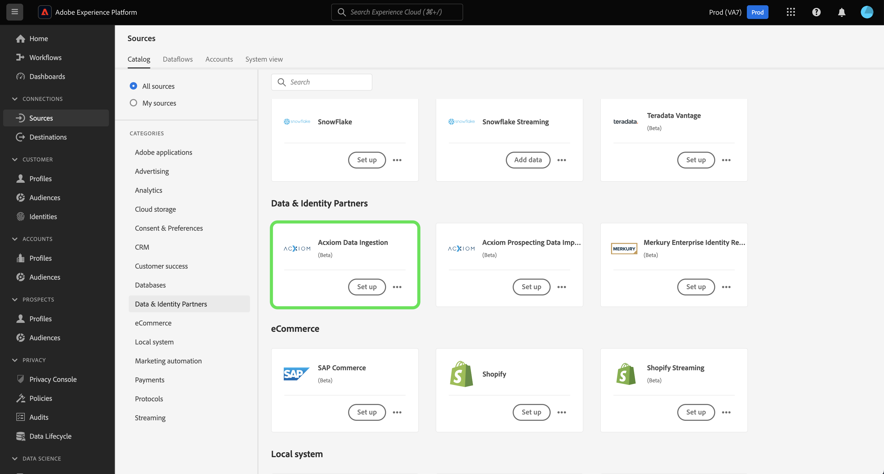

# Versionsinformation om Adobe Experience Platform

**Releasedatum: 19 mars 2024**

>[!TIP]
>
>Använd [ordlistan för Adobe Experience Platform](/help/landing/glossary.md) för att bekanta dig med terminologin som används i plattformen för kunddata i realtid och Adobe Experience Platform. Om du inte hittar en viss term som du letar efter kan du lämna återkoppling på sidan för att begära att nya termer läggs till i ordlistan.

Uppdateringar av befintliga funktioner i Experience Platform:

- [Katalogtjänst](#catalog-service)
- [Datainsamling](#data-collection)
- [Dataförberedelse](#data-prep)
- [Mål](#destinations)
- [Experience Data Model (XDM)](#xdm)
- [Segmenteringstjänst](#segmentation)
- [Källor](#sources)

## Katalogtjänst {#catalog-service}

Catalog Service är det system som registrerar var data finns och hur de härstammar från Adobe Experience Platform. Alla data som tas in i Experience Platform lagras i datasjön som filer och kataloger medan katalogen innehåller metadata och beskrivningar av dessa filer och kataloger för sök- och övervakningsändamål.

| Funktion | Beskrivning |
| --- | --- |
| Fler åtgärder | Nu kan du använda funktionen ”Fler åtgärder” i detaljvyn för att utföra ytterligare åtgärder på en datauppsättning, vilket gör åtgärderna mer flexibla och hjälper dig att hantera dina data. Du kan antingen ta bort datasetet eller aktivera det för användning med kundprofilen i realtid från detaljsidan för ett valt dataset. **Obs:** Om du aktiverar ett dataset för profilinmatning måste datasetets schema vara kompatibelt med kundprofilen i realtid. ![Arbetsytan Datauppsättningar med rullgardinsmenyn [!UICONTROL ... More] markerad.](../2024/assets/march/more-actions.png "Arbetsytan Datauppsättningar med rullgardinsmenyn Mer markerad."){width="100" zoomable="yes"}. Läs dokumentationen i användarhandboken för [datauppsättningar](../../catalog/datasets/user-guide.md) för mer information. |

{style="table-layout:auto"}

Mer information om katalogtjänsten finns i [katalogtjänstöversikten](../../catalog/home.md).

## Dataförberedelse {#data-prep}

Med dataförberedelse kan utvecklare mappa, omvandla och validera data till och från Experience Data Model (XDM).

**Nya eller uppdaterade funktioner**

| Funktion | Beskrivning |
| --- | --- |
| Nya mappningsfunktioner för Adobe Analytics | Nu kan du använda följande funktioner för att extrahera händelsedata från Adobe Analytics: <ul><li>`aa_get_event_id`</li><li>`aa_get_event_value`</li><li>`aa_get_product_categories`</li><li>`aa_get_product_names`</li><li>`aa_get_product_quantities`</li><li>`aa_get_product_prices`</li><li>`aa_get_product_event_values`</li><li>`aa_get_product_evars`</li></ul> Mer information om de här funktionerna finns i [handboken om dataförberedelser](../../data-prep/functions.md#analytics-functions) |

{style="table-layout:auto"}

Mer information om dataförberedelse finns i [översikten över dataförberedelse](../../data-prep/home.md).

## Datainsamling {#data-collection}

Adobe Experience Platform tillhandahåller en uppsättning tekniker som gör att du kan samla in kundupplevelsedata på klientsidan och skicka dem till Adobe Experience Platform Edge Network där de kan berikas, omvandlas och distribueras till mål inom eller utanför Adobe.

**Nya funktioner**

| Typ | Funktion | Beskrivning |
| --- | --- | --- |
| Tillägg | [!DNL Merkury]Taggtillägg | [[!DNL Merkury] Taggtillägget](https://exchange.adobe.com/apps/ec/600027/merkury-tag) ger branschledande matchningsfrekvenser för anonyma webbplatsbesökare till ett [!DNL Merkury]-ID. Varumärken kan utnyttja kraften i taggen [!DNL Merkury] och Adobe för att leverera personliga webbplatsupplevelser i realtid. Dessutom möjliggör taggen [!DNL Merkury] tillväxt av digitala data från första part tillsammans med anslutna kundprofiler online och offline. |

{style="table-layout:auto"}

Läs [datainsamlingsöversikten](../../tags/home.md) om du vill veta mer om datainsamling.

## Mål  {#destinations}

[!DNL Destinations] är förbyggda integrationer med målplattformar som möjliggör sömlös aktivering av data från Adobe Experience Platform. Du kan använda mål för att aktivera dina kända och okända data för marknadsföringskampanjer över flera kanaler, e-postkampanjer, riktad reklam och många andra användningsområden.

**Nya och uppdaterade mål** {#new-updated-destinations}

| Mål | Typ | Beskrivning |
| ----------- | --------- | ----------- |
| [(Beta) Dataförbättringsanslutning för Acxiom](../../destinations/catalog/data-partner/acxiom-data-enhancement.md) | Nyhet | Använd den här anslutningen för att aktivera förstapartsprofiler från Real-Time CDP till Acxiom för databerikning och användning i olika marknadsföringskanaler. Du kan sedan använda Acxiom-källan för att importera profilerna med förbättrade data och arbeta med dem i Real-Time CDP. |
| [(Beta) Anslutningen prospektuteslutning för Acxiom ](../../destinations/catalog/data-partner/acxiom-prospect-suppression.md) | Nyhet | Exportera dina förstapartsmålgrupper till Acxiom-målet, så att Acxiom kan undertrycka kända eller konverterade kunder. Använd sedan källkopplingen [Acxiom import av prospekteringsdata](../../sources/connectors/data-partners/acxiom-prospecting-data-import.md) för att fylla på och aktivera prospektlistor från Acxiom med dina kända eller konverterade kunder borttagna. |
| [Amazon Ads-anslutning](../../destinations/catalog/advertising/amazon-ads.md) | Uppdatering | När du exporterar data till Amazon Ads-målet kan du nu dirigera data till Amazon DSP eller Amazon Marketing Cloud (nyhet). |
| [LiveRamp-anslutning för registrering](../../destinations/catalog/advertising/liveramp-onboarding.md) | Uppdatering | LiveRamp-registreringsmålet har nu stöd för leveranser till instanser i Europa och Australien [!DNL LiveRamp] [!DNL SFTP]. Den maximala storleken på den exporterade filen ökades också till 10 miljoner rader (från 5 miljoner tidigare). |

{style="table-layout:auto"}

<!--

**New or updated functionality** {#destinations-new-updated-functionality}

-->

Mer allmän information om destinationer finns i [målöversikten](../../destinations/home.md).

## Experience Data Model (XDM) {#xdm}

XDM är en specifikation med öppen källkod som tillhandahåller gemensamma strukturer och definitioner (scheman) för data som förs in i Adobe Experience Platform. Genom att följa XDM-standarder kan all data om kundupplevelsen införlivas i en gemensam representation för att leverera insikter på ett snabbare och mer integrerat sätt. Du kan få värdefulla insikter från kundåtgärder, definiera kundmålgrupper genom segment och använda kundattribut för personalisering.

**Nya funktioner**

| Funktion | Beskrivning |
| --- | --- |
| Stöd för datatypen Experience Platform gränssnittsmappning | Anpassa XDM-datastrukturen (Experience Data Model) ytterligare genom att definiera kartfält i Experience Platform användargränssnitt. Nu kan du skapa kartfält i schemaredigeraren för att modellera flexibla datastrukturer eller lagra nyckelvärdepar på ett effektivt sätt. Välj ”Mappning” i rullgardinsmenyn Typ när du definierar ett nytt fält för att konfigurera underfält och tilldela dem till fältgrupper. Mappningsvärdestyper som stöds är sträng och heltal. {width="100" zoomable="yes"}  Se gränssnittsguiden för information om hur du [definierar mappningsfält i användargränssnittet](../../xdm/ui/fields/map.md). |

{style="table-layout:auto"}

Mer information om XDM i Experience Platform finns i [XDM-systemöversikt](../../xdm/home.md).

## Segmenteringstjänst {#segmentation}

Med [!DNL Segmentation Service] kan du segmentera data som lagras i [!DNL Experience Platform] och som relaterar till individer (t.ex. kunder, potentiella kunder, användare eller organisationer) till målgrupper. Du kan skapa målgrupper med hjälp av segmentdefinitioner eller andra källor från dina [!DNL Real-Time Customer Profile]-data. Dessa målgrupper är centralt konfigurerade och underhållna på [!DNL Experience Platform] och är tillgängliga för alla Adobe-lösningar.

**Ny funktion**

| Funktion | Beskrivning |
| ------- | ----------- |
| Massåtgärder | Målgruppslagret har nu stöd för massåtgärder. Med hjälp av massåtgärder kan du snabbt välja flera målgrupper för att flytta dem till en mapp, lägga till taggar, lägga till åtkomstetiketter eller ta bort dem.   {width="100" zoomable="yes"}  Mer information om den här funktionen finns i [Översikt över målgruppsportalen](../../segmentation/ui/audience-portal.md#bulk-actions). |

{style="table-layout:auto"}

Mer information om segmenteringstjänsten finns i [Översikt över segmenteringstjänsten](../../segmentation/home.md).

## Källor {#sources}

Experience Platform tillhandahåller ett RESTful API och ett interaktivt användargränssnitt som gör att du enkelt kan konfigurera källanslutningar för olika dataleverantörer. Med dessa källanslutningar kan du autentisera och ansluta till externa lagringssystem och CRM-tjänster, ställa in tider för inmatningskörningar och hantera datainmatningens genomströmning.

**Nya och uppdaterade källor**

| Funktion | Typ | Beskrivning |
| --- | --- | --- |
| [!BADGE Beta]{type=Informative} [!DNL Acxiom Data Ingestion] | Nyhet | Använd [[!DNL Acxiom Data Ingestion] källan](../../sources/tutorials/ui/create/data-partners/acxiom-data-ingestion.md) för att mata in [!DNL Acxiom]-data i Real-time Customer Data Platform och berika förstapartsprofiler. Sedan kan du använda dina [!DNL Acxiom]-berikade förstapartsprofiler för att förbättra målgrupper och aktivera i alla marknadsföringskanaler.   {width="100" zoomable="yes"}   Läs [[!DNL Acxiom Data Ingestion] översikten](../../sources/connectors/data-partners/acxiom-data-ingestion.md) för information om hur du kommer igång. |
| [!BADGE Beta]{type=Informative} [!DNL Stripe] | Nyhet | Använd [[!DNL Stripe] källan](../../sources/connectors/payments/stripe.md) för att mata in data som dina kunder har samlat in under inköpsflödet i Experience Platform. När du har matat in data kan använda dem för att skapa personaliserade erbjudanden och låsa upp bättre affärsinsikter.   {width="100" zoomable="yes"}   Läs [[!DNL Stripe] översikten](../../sources/connectors/payments/stripe.md) för information om hur du kommer igång. |
| Användargränssnittsstöd för [!DNL Snowflake Streaming] | Nyhet | Du kan nu använda [[!DNL Snowflake Streaming] källan](../../sources/tutorials/ui/create/databases/snowflake-streaming.md) i användargränssnittet för Experience Platform för att strömma data från din [!DNL Snowflake]-databas.   {width="100" zoomable="yes"}   Läs [[!DNL Snowflake Streaming] översikten](../../sources/connectors/databases/snowflake-streaming.md) för information om hur du kommer igång. |

{style="table-layout:auto"}

Mer information om källor finns i [källöversikten](../../sources/home.md).
