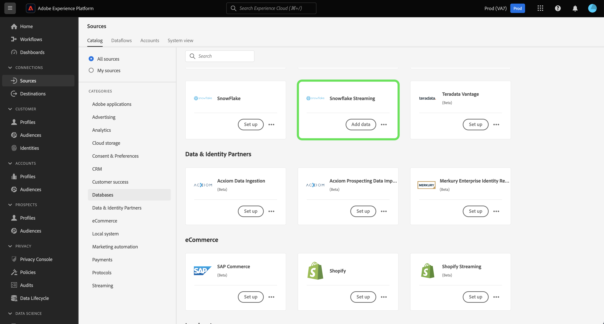

# Versionsinformation för Adobe Experience Platform

**Releasedatum: 19 mars 2024**

>[!TIP]
>
>Använd [Adobe Experience Platform ordlista](/help/landing/glossary.md) för att bekanta sig med terminologi som används i Real-time Customer Data Platform och Adobe Experience Platform. Om du inte kan hitta en viss term som du söker efter kan du använda alternativen för feedback på sidan och begära att nya termer läggs till i ordlistan.

Uppdateringar av befintliga funktioner i Experience Platform:

- [Katalogtjänst](#catalog-service)
- [Datainsamling](#data-collection)
- [Dataförberedelse](#data-prep)
- [Mål ](#destinations)
- [Experience Data Model (XDM)](#xdm)
- [Segmenteringstjänst](#segmentation)
- [Källor](#sources)

## Katalogtjänst {#catalog-service}

Katalogtjänsten är arkivsystemet för dataplatser och -länkar inom Adobe Experience Platform. Alla data som importeras till Experience Platform lagras i datarjön som filer och kataloger, men i Katalog finns metadata och beskrivning av dessa filer och kataloger för sökning och övervakning.

| Funktion | Beskrivning |
| --- | --- |
| Fler åtgärder | Om du vill göra åtgärderna mer flexibla och hjälpa dig att hantera dina data kan du nu använda funktionen&quot;Fler åtgärder&quot; från detaljvyn för att utföra ytterligare uppgifter på en datauppsättning. Du kan antingen ta bort datauppsättningen eller aktivera den för användning med kundprofilen i realtid från informationssidan för en vald datauppsättning. **Obs!** Om du aktiverar en datauppsättning för profilinmatning måste datauppsättningens schema vara kompatibelt med kundprofilen i realtid. ![Arbetsytan Datauppsättningar med [!UICONTROL ... More] listrutan är markerad.](../2024/assets/march/more-actions.png "Arbetsytan Datauppsättningar med listrutan Mer markerad."){width="100" zoomable="yes"}. Läs [användarhandbok för datauppsättningar](../../catalog/datasets/user-guide.md) dokumentation för tilläggsinformation. |

{style="table-layout:auto"}

Mer information om katalogtjänsten finns i [Katalogtjänst - översikt](../../catalog/home.md).

## Dataförberedelse {#data-prep}

Med Data Prep kan datatekniker mappa, omvandla och validera data till och från Experience Data Model (XDM).

**Nya eller uppdaterade funktioner**

| Funktion | Beskrivning |
| --- | --- |
| Nya mappningsfunktioner för Adobe Analytics | Nu kan du använda följande funktioner för att extrahera händelsedata från Adobe Analytics: <ul><li>`aa_get_event_id`</li><li>`aa_get_event_value`</li><li>`aa_get_product_categories`</li><li>`aa_get_product_names`</li><li>`aa_get_product_quantities`</li><li>`aa_get_product_prices`</li><li>`aa_get_product_event_values`</li><li>`aa_get_product_evars`</li></ul> Mer information om dessa funktioner finns i [Handbok för dataprefixfunktioner](../../data-prep/functions.md#analytics-functions) |

{style="table-layout:auto"}

Mer information om Data Prep finns i [Översikt över datapreflight](../../data-prep/home.md).

## Datainsamling {#data-collection}

Adobe Experience Platform erbjuder en serie teknologier som gör att ni kan samla in kundupplevelsedata på klientsidan och skicka dem till Adobe Experience Platform Edge Network där de kan berikas, omformas och distribueras till Adobe eller andra destinationer än Adobe.

**Nya funktioner**

| Typ | Funktion | Beskrivning |
| --- | --- | --- |
| Tillägg | [!DNL Merkury] Taggtillägg | The [[!DNL Merkury] taggtillägg](https://exchange.adobe.com/apps/ec/600027/merkury-tag) ger branschledande matchningsfrekvenser för anonyma webbplatsbesökare till en [!DNL Merkury] ID. Varumärken kan utnyttja [!DNL Merkury] tagga och Adobe för att leverera personaliserade webbplatsupplevelser i realtid. Dessutom kan du [!DNL Merkury] -taggen gör det möjligt att utöka digitala data från första part tillsammans med anslutna kundprofiler online och offline. |

{style="table-layout:auto"}

Läs mer om datainsamling i [datainsamling - översikt](../../tags/home.md).

## Mål  {#destinations}

[!DNL Destinations] är färdiga integreringar med målplattformar som möjliggör smidig aktivering av data från Adobe Experience Platform. Ni kan använda destinationer för att aktivera kända och okända data för flerkanalskampanjer, e-postkampanjer, riktad reklam och många andra användningsfall.

**Nya och uppdaterade destinationer** {#new-updated-destinations}

| Mål | Typ | Beskrivning |
| ----------- | --------- | ----------- |
| [(Beta) Acxiom Data Enhancement Connection](../../destinations/catalog/data-partner/acxiom-data-enhancement.md) | Nytt | Använd den här kopplingen för att aktivera förstahandsprofiler från Real-Time CDP till Acxiom för att berika och använda data i alla marknadsföringskanaler. Du kan sedan använda Acxiom-källan för att importera profiler med förbättrade data och arbeta med dem i Real-Time CDP. |
| [(Beta) Anslutning till Prospect Suppression för Acxiom](../../destinations/catalog/data-partner/acxiom-prospect-suppression.md) | Nytt | Exportera era egna målgrupper till Acxiom-destinationen så att Acxiom kan inaktivera kända eller konverterade kunder. Använd sedan [Import av prospekteringsdata för Acxiom](../../sources/connectors/data-partners/acxiom-prospecting-data-import.md) källanslutning till import och aktivering av listor med potentiella kunder från Acxiom, med dina kända eller konverterade kunder borttagna. |
| [Amazon Ads-anslutning](../../destinations/catalog/advertising/amazon-ads.md) | Uppdatera | När du exporterar data till Amazon Ads-målet kan du nu dirigera data till Amazon DSP eller Amazon Marketing Cloud (nytt). |
| [LiveRamp Onboarding-anslutning](../../destinations/catalog/advertising/liveramp-onboarding.md) | Uppdatera | LiveRamp Onboarding-destinationen har nu stöd för leveranser till Europa och Australien [!DNL LiveRamp] [!DNL SFTP] -instanser. Den maximala storleken på den exporterade filen ökades också till 10 miljoner rader (från 5 miljoner tidigare). |

{style="table-layout:auto"}

<!--

**New or updated functionality** {#destinations-new-updated-functionality}

-->

Mer allmän information om destinationer finns i [destinationer, översikt](../../destinations/home.md).

## Experience Data Model (XDM) {#xdm}

XDM är en öppen källkodsspecifikation som innehåller gemensamma strukturer och definitioner (scheman) för data som hämtas till Adobe Experience Platform. Genom att följa XDM-standarder kan alla kundupplevelsedata införlivas i en gemensam representation för att ge insikter på ett snabbare och mer integrerat sätt. Ni kan få värdefulla insikter från kundåtgärder, definiera kundmålgrupper genom segment och använda kundattribut i personaliseringssyfte.

**Nya funktioner**

| Funktion | Beskrivning |
| --- | --- |
| Stöd för datatypen Experience Platform UI map | Anpassa XDM-datastrukturen (Experience Data Model) ytterligare genom att definiera kartfält i plattformens användargränssnitt. Nu kan du skapa mappningsfält i Schemaredigeraren för att modellera flexibla datastrukturer eller effektivt lagra nyckelvärdepar. Välj &quot;Karta&quot; i listrutan Typ när du definierar ett nytt fält för att konfigurera delfält och tilldela dem till fältgrupper. Värdetyper som stöds är sträng och heltal. {width="100" zoomable="yes"}  Så här lär du dig hur [definiera kartfält i användargränssnittet](../../xdm/ui/fields/map.md), se användargränssnittsguiden. |

{style="table-layout:auto"}

Mer information om XDM i Platform finns i [XDM - systemöversikt](../../xdm/home.md).

## Segmenteringstjänst {#segmentation}

[!DNL Segmentation Service] gör att du kan segmentera data som lagras i [!DNL Experience Platform] som rör enskilda (t.ex. kunder, prospects, användare eller organisationer) till målgrupper. Du kan skapa målgrupper genom segmentdefinitioner eller andra källor från [!DNL Real-Time Customer Profile] data. Dessa målgrupper är centralt konfigurerade och underhållna på [!DNL Platform]och är lätt tillgängliga för alla Adobe-lösningar.

**Ny funktion**

| Funktion | Beskrivning |
| ------- | ----------- |
| Massåtgärder | Målgruppslagret har nu stöd för massåtgärder. Med gruppåtgärder kan du snabbt markera flera målgrupper för att flytta dem till en mapp, lägga till taggar, använda etiketter eller ta bort.   {width="100" zoomable="yes"}  Mer information om den här funktionen finns i [Användargränssnittsguide för segmenteringstjänst](../../segmentation/ui/overview.md#bulk-actions). |

{style="table-layout:auto"}

Mer information om segmenteringstjänsten finns i [Översikt över segmenteringstjänsten](../../segmentation/home.md).

## Källor {#sources}

Experience Platform tillhandahåller ett RESTful-API och ett interaktivt användargränssnitt som gör att du enkelt kan konfigurera källanslutningar för olika dataleverantörer. Dessa källanslutningar gör att du kan autentisera och ansluta till externa lagringssystem och CRM-tjänster, ange tider för matning och hantera dataöverföringshastigheter.

**Nya och uppdaterade källor**

| Funktion | Typ | Beskrivning |
| --- | --- | --- |
| [!BADGE Beta]{type=Informative} [!DNL Acxiom Data Ingestion] | Nytt | Använd [[!DNL Acxiom Data Ingestion] källa](../../sources/tutorials/ui/create/data-partners/acxiom-data-ingestion.md) till inmatning [!DNL Acxiom] till Real-time Customer Data Platform och berika förstahandsprofilerna. Sedan kan du använda [!DNL Acxiom]-berikade förstahandsprofiler för att förbättra målgrupperna och aktivera i alla marknadsföringskanaler.   {width="100" zoomable="yes"}   Läs [[!DNL Acxiom Data Ingestion] översikt](../../sources/connectors/data-partners/acxiom-data-ingestion.md) för information om hur du kommer igång. |
| [!BADGE Beta]{type=Informative} [!DNL Stripe] | Nytt | Använd [[!DNL Stripe] källa](../../sources/connectors/payments/stripe.md) att importera data som era kunder tagit in i Experience Platform under köpflödet. När ni väl har inhämtat data kan ni använda dessa data för att skapa personaliserade erbjudanden och få bättre affärsinsikter.   {width="100" zoomable="yes"}   Läs [[!DNL Stripe] översikt](../../sources/connectors/payments/stripe.md) för information om hur du kommer igång. |
| Stöd för användargränssnitt [!DNL Snowflake Streaming] | Nytt | Nu kan du använda [[!DNL Snowflake Streaming] källa](../../sources/tutorials/ui/create/databases/snowflake-streaming.md) i användargränssnittet i Experience Platform, för att strömma data från [!DNL Snowflake] databas.   {width="100" zoomable="yes"}   Läs [[!DNL Snowflake Streaming] översikt](../../sources/connectors/databases/snowflake-streaming.md) för information om hur du kommer igång. |

{style="table-layout:auto"}

Mer information om källor finns i [källöversikt](../../sources/home.md).
