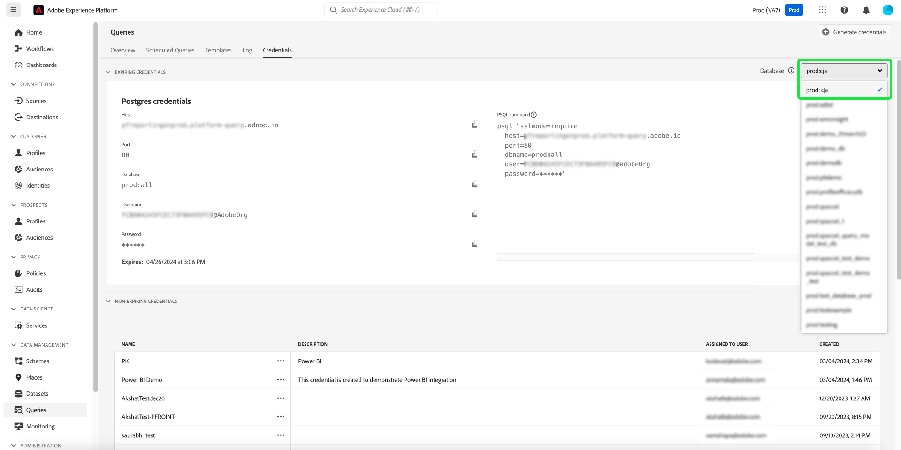

# Versionsinformation för Adobe Experience Platform

**Releasedatum: 21 maj 2024**

>[!TIP]
>
>The [Experience Platform API-dokumentation](https://developer.adobe.com/experience-platform-apis/) är nu interaktivt. Utforska API-slutpunkterna direkt från dokumentationssidorna för att få omedelbar feedback och snabba upp den tekniska implementeringen. [Läs mer](#interactive-api-documentation) om de nya funktionerna.

Uppdateringar av befintliga funktioner i Experience Platform:

- [Katalogtjänst](#catalog-service)
- [Kontrollpaneler](#dashboards)
- [Datastyrning](#governance)
- [Mål ](#destinations)
- [Frågetjänst](#query-service)
- [Segmenteringstjänst](#segmentation)
- [Källor](#sources)

Andra uppdateringar i Adobe Experience Platform:

- [Dokumentationsuppdateringar](#documentation-updates)

## Katalogtjänst {#catalog-service}

Katalogtjänsten är arkivsystemet för dataplatser och -länkar inom Adobe Experience Platform. Alla data som importeras till Experience Platform lagras i datarjön som filer och kataloger, men i Katalog finns metadata och beskrivning av dessa filer och kataloger för sökning och övervakning.

**Nya eller uppdaterade funktioner**

| Funktion | Beskrivning |
| --- | --- |
| Massåtgärder | Datamängdens lager har nu stöd för massåtgärder. Effektivisera datahanteringsprocesserna och se till att datauppsättningarna hanteras effektivt med gruppåtgärder. Använd massåtgärder för att spara tid genom att utföra flera åtgärder på flera datauppsättningar samtidigt.  Massåtgärder omfattar [Flytta till mapp](../../catalog/datasets/user-guide.md#move-to-folders), [Redigera taggar](../../catalog/datasets/user-guide.md#manage-tags)och [Ta bort](../../catalog/datasets/user-guide.md#delete) datauppsättningar.   {width="100" zoomable="yes"}   Mer information om den här funktionen finns i [Användargränssnittshandbok för datauppsättningar](../../catalog/datasets/user-guide.md#bulk-actions). |

{style="table-layout:auto"}

## Kontrollpaneler {#dashboards}

Adobe Experience Platform tillhandahåller flera instrumentpaneler där du kan se viktiga insikter om organisationens data, som de har hämtats in under dagliga ögonblicksbilder.

**Nya eller uppdaterade funktioner**

| Funktion | Beskrivning |
| --- | --- |
| Anpassningsbara insikter för utökad apprapportering | Smidigt [överför resultatet från SQL-analysen till begripliga, affärsvänliga visuella format](../../dashboards/data-distiller/customizable-insights/overview.md). Använd anpassade SQL-frågor för exakt datahantering och för att skapa dynamiska diagram från olika strukturerade datauppsättningar. Du kan använda frågeproffsläget för att utföra komplexa analyser med SQL och sedan dela analysen med icke-tekniska användare via diagram på din anpassade kontrollpanel eller exportera dem i CSV-filer. |

{style="table-layout:auto"}

## Datastyrning {#governance}

Adobe Experience Platform Data Governance är en serie strategier och tekniker som används för att hantera kunddata och säkerställa att regler, begränsningar och policyer som gäller för dataanvändning följs. Det spelar en nyckelroll inom [!DNL Experience Platform] på olika nivåer, inklusive katalogisering, datalinje, märkning av dataanvändning, dataåtkomstregler och åtkomstkontroll av data för marknadsföringsåtgärder.

**Nya funktioner**

| Funktion | Beskrivning |
| --- | --- |
| mTLS-stöd för HTTP API-mål och anpassade Adobe Journey Optimizer-åtgärder | Bygg upp kundförtroendet med de stärkta säkerhetsåtgärderna i protokollet mTLS (Mutual Transport Layer Security). The [Experience Platform HTTP API-mål](../../destinations/catalog/streaming/http-destination.md#mtls-protocol-support) och [Anpassade åtgärder från Adobe Journey Optimizer](https://experienceleague.adobe.com/en/docs/journey-optimizer/using/orchestrate-journeys/about-journey-building/using-custom-actions) har nu stöd för mTLS-protokollet när data skickas till konfigurerade slutpunkter. Ingen ytterligare konfiguration krävs i din anpassade åtgärd eller för HTTP API-målet för att aktivera mTLS. Den här processen sker automatiskt när en mTLS-aktiverad slutpunkt identifieras. Du kan [ladda ned Adobe Journey Optimizer publika certifikat här](../../landing/governance-privacy-security/encryption.md#download-certificates) och [Offentligt certifikat för destinationstjänsten här](../../landing/governance-privacy-security/encryption.md#download-certificates). Se [Experience Platform-dokumentation för datakryptering](../../landing/governance-privacy-security/encryption.md#mtls-protocol-support) om du vill ha mer information om nätverksanslutningsprotokoll när du exporterar data till tredjepartssystem. |

{style="table-layout:auto"}

## Mål  {#destinations}

[!DNL Destinations] är färdiga integreringar med målplattformar som möjliggör smidig aktivering av data från Adobe Experience Platform. Ni kan använda destinationer för att aktivera kända och okända data för flerkanalskampanjer, e-postkampanjer, riktad reklam och många andra användningsfall.

**Ny eller uppdaterad funktionalitet** {#destinations-new-updated-functionality}

| Funktionalitet | Beskrivning |
| ----------- | ----------- |
| Ändra ordning på mappningsfält för batchmål | Du kan nu ändra ordningen på kolumnerna i CSV-exporter genom att dra och släppa mappningsfälten i [mappningssteg](../../destinations/ui/activate-batch-profile-destinations.md#mapping). Ordningen på de mappade fälten i användargränssnittet återspeglas i ordningen på kolumnerna i den exporterade CSV-filen, uppifrån och ned, där den översta raden är den vänstra kolumnen i CSV-filen.   {width="100" zoomable="yes"} |
| Förinställda exportscheman för batchdestinationer | Experience Platform anger nu automatiskt ett standardschema för varje filexport. Läs dokumentationen om [schemalägga målgruppsexport](../../destinations/ui/activate-batch-profile-destinations.md#scheduling) om du vill lära dig hur du ändrar standardschemat. |
| Redigera flera målgruppsaktiveringsplaner för batchdestinationer | Du kan nu redigera aktiveringsschemat för flera målgrupper som exporterats till batchbaserade (filbaserade) mål från **[!UICONTROL Activation data]** -fliken i [målinformationssida](../../destinations/ui/destination-details-page.md#bulk-edit-schedule).   {width="100" zoomable="yes"} |
| Exportera flera målgrupper on demand till batchdestinationer | Nu kan du välja och exportera flera målgrupper till gruppmål via [exportera filer on demand](../../destinations/ui/export-file-now.md) funktionalitet. |

{style="table-layout:auto"}

Mer allmän information om destinationer finns i [destinationer, översikt](../../destinations/home.md).

## Frågetjänst {#query-service}

Med frågetjänsten kan du använda standard-SQL för att fråga data i Adobe Experience Platform [!DNL Data Lake]. Du kan koppla alla datauppsättningar från [!DNL Data Lake] och samla in frågeresultaten som en ny datauppsättning som kan användas för rapportering, datavetenskapen eller för förtäring i kundprofilen i realtid.

**Uppdaterade funktioner**

| Funktion | Beskrivning |
| --- | --- |
| Äldre redigerare är inaktuell | Den äldre redigeraren är föråldrad och går inte längre att använda. I stället för kan du använda [förbättrade funktioner i Frågeredigeraren](../../query-service/ui/user-guide.md#query-authoring) för att skriva, validera och köra frågor. |
| Frågekörningsfördröjning | Ha full kontroll över beräkningstiden genom att ange varningar för fördröjningar av frågekörningar. Du kan välja att få aviseringar om en frågas status inte ändras efter en viss tidsperiod. Ange bara önskad fördröjningstid i plattformsgränssnittet för att få information om frågeförloppet. Mer information om hur du anger den här varningen i användargränssnittet finns i [dokumentation för frågescheman](../../query-service/ui/query-schedules.md#alerts-for-query-status) eller [guide till infogade frågeåtgärder](../../query-service/ui/monitor-queries.md#query-run-delay). |
| Effektivt frågelogglager | Nu kan du använda en förbättrad felsökningseffektivitet och uppgiftskontroll med en [användargränssnitt för anpassade frågeloggar](../../query-service/ui/query-logs.md#filter-logs): <ul><li> Plattformsgränssnittet utesluter nu alla systemfrågor från fliken Loggar som standard. </li><li> Visa systemfrågor genom att avmarkera **Exkludera systemfrågor**. </li></ul>   {width="100" zoomable="yes"}   Använd det strömlinjeformade användargränssnittet för frågeloggar för att få en mer fokuserad vy som hjälper dig att snabbt identifiera och analysera relevanta loggar. |
| Databasväljare | Använd den nya listrutan Databasväljare för att [enkelt komma åt datavyer från Customer Journey Analytics från Power BI eller Tableau](../../query-service/ui/credentials.md#connect-to-customer-journey-analytics). Du kan nu välja önskad databas direkt från plattformsgränssnittet för en smidigare integrering av dina BI-verktyg.   {width="100" zoomable="yes"}   |

{style="table-layout:auto"}

## Segmenteringstjänst {#segmentation}

[!DNL Segmentation Service] gör att du kan segmentera data som lagras i [!DNL Experience Platform] som rör enskilda (t.ex. kunder, prospects, användare eller organisationer) till målgrupper. Du kan skapa målgrupper genom segmentdefinitioner eller andra källor från [!DNL Real-Time Customer Profile] data. Dessa målgrupper är centralt konfigurerade och underhållna på [!DNL Platform]och är lätt tillgängliga för alla Adobe-lösningar.

**Uppdaterad funktion**

| Funktion | Beskrivning |
| --- | --- |
| Importera externt genererade målgrupper | För import av externt genererade målgrupper krävs nu behörigheten Importera målgrupp. Läs mer om behörigheter i [Användargränssnittshandbok för behörigheter](../../access-control/home.md#permissions). |

{style="table-layout:auto"}

## Källor {#sources}

Experience Platform tillhandahåller ett RESTful-API och ett interaktivt användargränssnitt som gör att du enkelt kan konfigurera källanslutningar för olika dataleverantörer. Dessa källanslutningar gör att du kan autentisera och ansluta till externa lagringssystem och CRM-tjänster, ange tider för matning och hantera dataöverföringshastigheter.

Använd källor i Experience Platform för att importera data från ett Adobe-program eller en datakälla från tredje part.

**Nya eller uppdaterade funktioner**

| Funktion | Beskrivning |
| --- | --- |
| OAuth2-klientautentisering för [!DNL Salesforce] källa | Du kan nu använda OAuth2 Client Credential för att autentisera dina [!DNL Salesforce] på Experience Platform. Läs [!DNL Salesforce] källa [API-guide](../../sources/tutorials/api/create/crm/salesforce.md) och [Användargränssnittsguide](../../sources/tutorials/ui/create/crm/salesforce.md) för mer information. |
| Stöd för exempeldataflöde för [!DNL Marketo Engage] källa | The [!DNL Marketo Engage] source har nu stöd för exempeldataflöden. Aktivera exempeldataflödeskonfigurationen för att begränsa ditt intag och testa sedan Experience Platform-funktionerna utan att behöva importera stora mängder data. Mer information finns i guiden [skapa ett dataflöde för [!DNL Marketo Engage] i användargränssnittet](../../sources/tutorials/ui/create/adobe-applications/marketo.md). |
| Uppdateringar till IP-adressen tillåtelselista | Beroende på var du befinner dig måste du lägga till en uppsättning nya IP-adresser till tillåtelselista för att kunna använda strömningskällor. En fullständig lista över de nya IP-adresserna finns i [TILLÅTELSELISTA-guide för IP-adress](../../sources/ip-address-allow-list.md). |

{style="table-layout:auto"}

**Ny eller uppdaterad dokumentation**

| Uppdaterad dokumentation | Beskrivning |
| --- | --- |
| Dokumentationsuppdateringar för [!DNL Google PubSub] | The [!DNL Google PubSub] källdokumentationen har uppdaterats med en omfattande kravguide. Använd det nya avsnittet med förutsättningar för att lära dig hur du skapar ett tjänstkonto, ger behörigheter på ämnes- eller prenumerationsnivå och ställer in konfigurationer för att optimera din användning av [!DNL Google PubSub] källa. Läs [[!DNL Google PubSub] översikt](../../sources/connectors/cloud-storage/google-pubsub.md) för mer information. |

{style="table-layout:auto"}

Mer information om källor finns i [källöversikt](../../sources/home.md).

## Dokumentationsuppdateringar {#documentation-updates}

### API-dokumentation för interaktiv Experience Platform {#interactive-api-documentation}

The [Experience Platform API-dokumentation](https://developer.adobe.com/experience-platform-apis/) är nu interaktivt. Alla API-referenssidor har nu en **Prova** .funktionalitet som du kan använda för att testa API-anrop direkt på dokumentationswebbplatsen. [Hämta autentiseringsuppgifter](/help/landing/api-authentication.md) och börja använda funktionerna för att utforska API-slutpunkterna.

Använd den här nya funktionen för att utforska förfrågningar och svar från API-slutpunkter, för att få omedelbar feedback och snabba upp den tekniska implementeringen. Du kan till exempel gå till [Identitetstjänstens API](https://developer.adobe.com/experience-platform-apis/references/identity-service/) eller [API för schemaregister](https://developer.adobe.com/experience-platform-apis/references/schema-registry/) slutpunkter för att utforska nya **Prova** i rätt spår.

>[!CAUTION]
>
>Tänk på att du med hjälp av den interaktiva API-funktionen på dokumentationssidorna gör riktiga API-anrop till slutpunkterna. Tänk på detta när du experimenterar med produktionssandlådor.

### Personaliserade insikter och engagemang {#personalized-insights-engagement}

En ny komplett dokumentationssida för användningsfall för [föränderligt engångsvärde till livstidsvärde](/help/rtcdp/use-case-guides/evolve-one-time-value-lifetime-value/evolve-one-time-value-to-lifetime-value.md) är nu live. Läs den här dokumentationen om du vill veta hur du kan använda Real-Time CDP och Adobe Journey Optimizer för att konvertera sporadiska besökare till dina webbsajter till lojala kunder.
