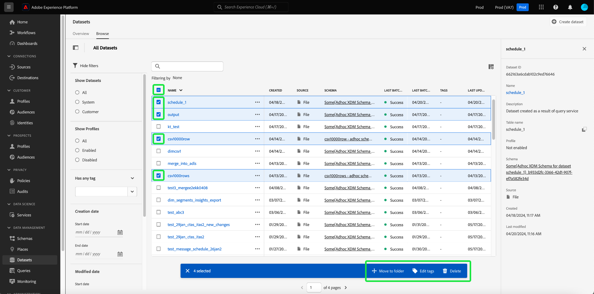

# Versionsinformation om Adobe Experience Platform

**Releasedatum: 21 maj 2024**

>[!TIP]
>
>[API-dokumentationen för Experience Platform](https://developer.adobe.com/experience-platform-apis/) är nu interaktiv. Utforska API-slutpunkterna direkt från dokumentationssidorna för att få omedelbar feedback och snabba på den tekniska implementeringen. [Läs mer](#interactive-api-documentation) om de nya funktionerna.

Uppdateringar av befintliga funktioner i Experience Platform:

- [Katalogtjänst](#catalog-service)
- [Kontrollpaneler](#dashboards)
- [Dataförvaltning](#governance)
- [Mål ](#destinations)
- [Frågetjänst](#query-service)
- [Segmenteringstjänst](#segmentation)
- [Källor](#sources)

Andra uppdateringar i Adobe Experience Platform:

- [Dokumentationsuppdateringar](#documentation-updates)

## Katalogtjänst {#catalog-service}

Catalog Service är det system som registrerar var data finns och hur de härstammar från Adobe Experience Platform. Alla data som tas in i Experience Platform lagras i datasjön som filer och kataloger medan katalogen innehåller metadata och beskrivningar av dessa filer och kataloger för sök- och övervakningsändamål.

**Nya eller uppdaterade funktioner**

| Funktion | Beskrivning |
| --- | --- |
| Massåtgärder | Datauppsättningslagret har nu stöd för massåtgärder. Effektivisera datahanteringsprocesserna och se till att datauppsättningarna hanteras effektivt med massåtgärder. Använd massåtgärder för att spara tid genom att utföra flera åtgärder på flera datauppsättningar samtidigt.  Massåtgärder omfattar [Flytta till mapp](../../catalog/datasets/user-guide.md#move-to-folders), [Redigera taggar](../../catalog/datasets/user-guide.md#manage-tags) och [Ta bort](../../catalog/datasets/user-guide.md#delete) datauppsättningar.   {width="100" zoomable="yes"}   Mer information om den här funktionen finns i [guiden om datauppsättningsgränssnittet](../../catalog/datasets/user-guide.md#bulk-actions). |

{style="table-layout:auto"}

## Kontrollpaneler {#dashboards}

Adobe Experience Platform tillhandahåller flera instrumentpaneler där du kan visa viktiga insikter om organisationens data, som fångas upp under dagliga ögonblicksbilder.

**Nya eller uppdaterade funktioner**

| Funktion | Beskrivning |
| --- | --- |
| SQL Insights för utökad apprapportering | [Överför resultat från SQL-analyser sömlöst till begripliga, affärsvänliga visuella format](../../dashboards/sql-insights-query-pro-mode/overview.md). Använd anpassade SQL-frågor för exakt datahantering och för att skapa dynamiska diagram från olika strukturerade datauppsättningar. Du kan använda det avancerade frågeläget för att utföra komplexa analyser med SQL och sedan dela analysen med icke-tekniska användare via diagram på din anpassade kontrollpanel eller exportera dem i CSV-filer. |

{style="table-layout:auto"}

## Dataförvaltning {#governance}

Dataförvaltning i Adobe Experience Platform är en serie strategier och tekniker som används för att hantera kunddata och säkerställa att regler, begränsningar och policyer som gäller för dataanvändning följs. Den spelar en viktig roll inom [!DNL Experience Platform] på olika nivåer, bland annat katalogföring, datahärkomst, märkning av dataanvändning, dataåtkomstprinciper och åtkomstkontroll av data för marknadsföringsåtgärder.

**Nya funktioner**

| Funktion | Beskrivning |
| --- | --- |
| mTLS-stöd för HTTP API-mål och anpassade åtgärder i Adobe Journey Optimizer | Skapa förtroende hos kunderna med de förstärkta säkerhetsåtgärderna i protokollet Mutual Transport Layer Security (mTLS). [Experience Platform HTTP API](../../destinations/catalog/streaming/http-destination.md#mtls-protocol-support) och [Adobe Journey Optimizer anpassade åtgärder](https://experienceleague.adobe.com/sv/docs/journey-optimizer/using/orchestrate-journeys/about-journey-building/using-custom-actions) stöder nu mTLS-protokollet när data skickas till konfigurerade slutpunkter. Ingen ytterligare konfiguration krävs i din anpassade åtgärd eller HTTP API-mål för att aktivera mTLS; denna process sker automatiskt när en mTLS-aktiverad slutpunkt upptäcks. Du kan [hämta det offentliga certifikatet för Adobe Journey Optimizer här](../../landing/governance-privacy-security/encryption.md#download-certificates) och det offentliga certifikatet för [Destinations Service här](../../landing/governance-privacy-security/encryption.md#download-certificates). Se [dokumentationen om datakryptering för Experience Platform](../../landing/governance-privacy-security/encryption.md#mtls-protocol-support) för mer information om protokoll för nätverksanslutning vid export av data till tredjepartssystem. |

{style="table-layout:auto"}

## Mål  {#destinations}

[!DNL Destinations] är förbyggda integrationer med målplattformar som möjliggör sömlös aktivering av data från Adobe Experience Platform. Du kan använda mål för att aktivera dina kända och okända data för marknadsföringskampanjer över flera kanaler, e-postkampanjer, riktad reklam och många andra användningsområden.

**Ny eller uppdaterad funktionalitet** {#destinations-new-updated-functionality}

| Funktionalitet | Beskrivning |
| ----------- | ----------- |
| Ordna om mappningsfält för gruppmål | Du kan nu ändra ordningen på kolumnerna i dina CSV-exporter genom att dra och släppa mappningsfälten i [mappningssteget](../../destinations/ui/activate-batch-profile-destinations.md#mapping). Ordningen på de mappade fälten i användargränssnittet återspeglar ordningen på kolumnerna i den exporterade CSV-filen, från topp till botten, där den översta raden är kolumnen längst till vänster i CSV-filen.   {width="100" zoomable="yes"} |
| Förvalda standardscheman för export för mål i grupp | Experience Platform anger nu automatiskt ett standardschema för varje filexport. Mer information om hur du ändrar standardschemat finns i dokumentationen om [schemaläggning av målgruppsexport](../../destinations/ui/activate-batch-profile-destinations.md#scheduling). |
| Redigera flera aktiveringsscheman för målgrupper för gruppmål | Du kan nu redigera aktiveringsschemat för flera målgrupper som exporterats till ett gruppmål (filbaserat) från fliken **[!UICONTROL Activation data]** på sidan [målinformation](../../destinations/ui/destination-details-page.md#bulk-edit-schedule).   {width="100" zoomable="yes"} |
| Exportera flera målgrupper på begäran till mål i grupper | Du kan nu välja och exportera flera målgrupper till gruppmål med funktionen [exportera filer på begäran](../../destinations/ui/export-file-now.md). |

{style="table-layout:auto"}

För mer allmän information om mål, se [Översikt över mål](../../destinations/home.md).

## Frågetjänst {#query-service}

Med frågetjänsten kan du använda standard SQL för att söka efter data i Adobe Experience Platform [!DNL Data Lake]. Du kan koppla samman alla datauppsättningar från [!DNL Data Lake] och samla in sökresultaten som en ny datauppsättning för användning i rapportering, arbetsytan för datavetenskap eller för inmatning i kundprofilen i realtid.

**Uppdaterade funktioner**

| Funktion | Beskrivning |
| --- | --- |
| Äldre redigerare är inaktuell | Den äldre redigeraren är föråldrad och går inte längre att använda. I stället kan du använda de [förbättrade funktionerna i frågeredigeraren](../../query-service/ui/user-guide.md#query-authoring) för att skriva, validera och köra dina frågor. |
| Frågekörningsfördröjning | Ha full kontroll över dina beräkningstimmar genom att ställa in varningar för förseningar i dina frågekörningar. Du kan välja att få aviseringar om statusen för en fråga inte ändras efter en viss tidsperiod. Ställ in önskad fördröjningstid i Experience Platform-användargränssnittet för att hålla dig informerad om hur din fråga fortskrider. Mer information om hur du ställer in den här varningen i användargränssnittet finns i [dokumentationen för frågescheman](../../query-service/ui/query-schedules.md#alerts-for-query-status) eller i [guiden till inline-frågeåtgärder](../../query-service/ui/monitor-queries.md#query-run-delay). |
| Effektiviserad inventering av frågeloggar | Du kan nu använda en förbättrad felsökningseffektivitet och uppgiftsövervakning med ett [effektiviserat gränssnitt för frågeloggar](../../query-service/ui/query-logs.md#filter-logs): <ul><li> I Experience Platform-användargränssnittet utesluts nu alla Systemfrågor från fliken Loggar som standard. </li><li> Visa systemfrågor genom att avmarkera **Exkludera systemfrågor**. </li></ul>   {width="100" zoomable="yes"}   Använd det effektiviserade gränssnittet för frågeloggar för att få en mer fokuserad vy som hjälper dig att snabbt identifiera och analysera relevanta loggar. |
| Databasväljare | Använd den nya rullgardinsmenyn för databasväljaren för att [bekvämt komma åt datavyer för Customer Journey Analytics från Power BI eller Tableau](../../query-service/ui/credentials.md#connect-to-customer-journey-analytics). Du kan nu välja önskad databas direkt från Experience Platform-användargränssnittet för en smidigare integrering av dina BI-verktyg.   {width="100" zoomable="yes"}   |

{style="table-layout:auto"}

## Segmenteringstjänst {#segmentation}

Med [!DNL Segmentation Service] kan du segmentera data som lagras i [!DNL Experience Platform] och som relaterar till individer (t.ex. kunder, potentiella kunder, användare eller organisationer) till målgrupper. Du kan skapa målgrupper med hjälp av segmentdefinitioner eller andra källor från dina [!DNL Real-Time Customer Profile]-data. Dessa målgrupper är centralt konfigurerade och underhållna på [!DNL Experience Platform] och är tillgängliga för alla Adobe-lösningar.

**Uppdaterad funktion**

| Funktion | Beskrivning |
| --- | --- |
| Importera externt genererade målgrupper | För att importera externt genererade målgrupper krävs nu behörigheten ”Importera målgrupp”. Om du vill veta mer om behörigheter kan du läsa [guiden för användargränssnittet för behörigheter](../../access-control/home.md#permissions). |

{style="table-layout:auto"}

## Källor {#sources}

Experience Platform tillhandahåller ett RESTful API och ett interaktivt användargränssnitt som gör att du enkelt kan konfigurera källanslutningar för olika dataleverantörer. Med dessa källanslutningar kan du autentisera och ansluta till externa lagringssystem och CRM-tjänster, ställa in tider för inmatningskörningar och hantera datainmatningens genomströmning.

Använd källor i Experience Platform för inmatning av data från ett Adobe-program eller en datakälla från tredje part.

**Nya eller uppdaterade funktioner**

| Funktion | Beskrivning |
| --- | --- |
| Autentisering av OAuth2-klientautentiseringsuppgifter för källan [!DNL Salesforce] | Du kan nu använda OAuth2-klientautentiseringsuppgifter för att autentisera ditt [!DNL Salesforce]-konto på Experience Platform. Läs [!DNL Salesforce]-källans [API-guide](../../sources/tutorials/api/create/crm/salesforce.md) och [användargränssnittsguide](../../sources/tutorials/ui/create/crm/salesforce.md) för mer information. |
| Stöd för exempel på dataflöde för källan [!DNL Marketo Engage] | [!DNL Marketo Engage]-källan har nu stöd för exempeldataflöden. Aktivera konfigurationen för exempeldataflödet för att begränsa inmatningsgraden och prova funktionerna i Experience Platform utan att behöva mata in stora mängder data. Mer information finns i guiden om att [skapa ett dataflöde för [!DNL Marketo Engage] i användargränssnittet](../../sources/tutorials/ui/create/adobe-applications/marketo.md). |
| Uppdateringar av listan över tillåtna IP-adresser | Beroende på var du befinner dig måste du lägga till en uppsättning nya IP-adresser i din lista över tillåtna adresser för att kunna använda streamingkällor. Du hittar en fullständig lista över de nya IP-adresserna i [guiden till listan över tillåtna IP-adresser](../../sources/ip-address-allow-list.md). |

{style="table-layout:auto"}

**Ny eller uppdaterad dokumentation**

| Uppdaterad dokumentation | Beskrivning |
| --- | --- |
| Uppdateringar av dokumentation för [!DNL Google PubSub] | Källdokumentationen för [!DNL Google PubSub] har uppdaterats med en omfattande kravguide. I avsnittet Nya krav kan du lära dig hur du skapar ett servicekonto, ger behörigheter på ämnes- eller prenumerationsnivå och ställer in konfigurationer för att optimera användningen av källan [!DNL Google PubSub]. Läs [[!DNL Google PubSub] översikten](../../sources/connectors/cloud-storage/google-pubsub.md) för mer information. |

{style="table-layout:auto"}

Mer information om källor finns i [källöversikten](../../sources/home.md).

## Dokumentationsuppdateringar {#documentation-updates}

### Interaktiv Experience Platform API-dokumentation {#interactive-api-documentation}

[Experience Platform API-dokumentationen ](https://developer.adobe.com/experience-platform-apis/) är nu interaktiv. Samtliga API-referenssidor har nu en **Prova**-funktionalitet som du kan använda för att testa API-anrop direkt på dokumentationswebbplatsen. [Hämta de nödvändiga autentiseringsuppgifterna](/help/landing/api-authentication.md) och börja använda funktionaliteten för att utforska API-slutpunkterna.

Använd den här nya funktionaliteten för att utforska förfrågningar till och svar från API-slutpunkter för att få omedelbar feedback och påskynda din tekniska implementering. Besök till exempel slutpunkterna [Identitetstjänst API](https://developer.adobe.com/experience-platform-apis/references/identity-service/) eller [Schemaregister-API](https://developer.adobe.com/experience-platform-apis/references/schema-registry/) för att utforska den nya funktionaliteten **Prova** i högerfältet.

>[!CAUTION]
>
>Tänk på att du gör riktiga API-anrop till slutpunkterna när du använder den interaktiva API-funktionen på dokumentationssidorna. Tänk på detta när du experimenterar med produktionssandlådor.

### Personliga insikter och engagemang {#personalized-insights-engagement}

En ny dokumentationssida med heltäckande användningsfall för att [utveckla engångsvärde till livstidsvärde](/help/rtcdp/use-case-guides/evolve-one-time-value-lifetime-value/evolve-one-time-value-to-lifetime-value.md) är nu live. Läs den här dokumentationen för att förstå hur du kan använda Real-Time CDP och Adobe Journey Optimizer för att konvertera sporadiska besökare till dina webbobjekt till lojala kunder.
