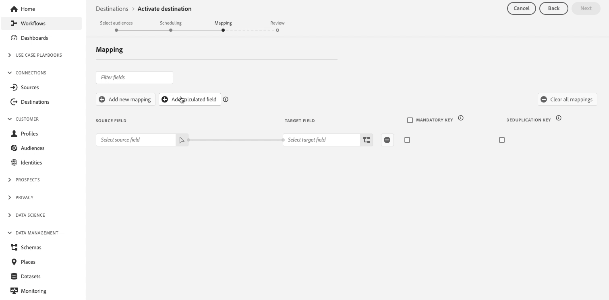

# Versionsinformation om Adobe Experience Platform

**Releasedatum: 29 oktober 2024**

Uppdateringar av befintliga funktioner och dokumentation i Adobe Experience Platform:

- [Datainsamling](#data-collection)
- [Mål ](#destinations)
- [Segmenteringstjänst](#segmentation-service)
- [Sandlådor](#sandboxes)
- [Källor](#sources)

<!-- ## Dashboards {#dashboards}

Experience Platform provides multiple dashboards through which you can view important insights about your organization's data, as captured during daily snapshots.

**New or updated features**

| Feature | Description |
| --- | --- |
| Data Distiller Templates | Explore multiple templates to gain structured insights into audience data. Use dashboards like **Advanced [!UICONTROL Audience Overlaps]**, **[!UICONTROL Audience Comparison]**, **[!UICONTROL Audience Trends]**, and **[!UICONTROL Audience Identity Overlaps]** to make data-driven decisions, optimize segmentation, and enhance engagement strategies. See the [Data Distiller Templates guide](../../dashboards/sql-insights-query-pro-mode/templates/overview.md) for more details. |
| Advanced Audience Overlaps | Quickly analyze audience intersections for specific audiences or view all overlaps to uncover valuable insights across your entire audience set. Use these insights to refine segmentation, reduce redundant messaging, and create more targeted campaigns for improved marketing efficiency. See the [Advanced Audience Overlaps guide](../../dashboards/sql-insights-query-pro-mode/templates/overlaps.md) for more details. |
| Audience Comparison enhancements | View a side-by-side comparison of key metrics between different audience groups using the **Audience Comparison** dashboard. With this dashboard you can select specific time frames and KPIs, such as audience size and identity composition, to make more informed decisions about audience segmentation and targeting strategies. Read the [Audience Comparison guide](../../dashboards/sql-insights-query-pro-mode/templates/comparison.md) for more information. |
| Audience Trends Visualization | Analyze audience metrics over time with the **[!UICONTROL Audience Trends]** dashboard. Visualize trends for audience size, number of identities, and number of single identity profiles to help you monitor audience evolution, measure growth, and refine your engagement strategies. See the [Audience Trends guide](../../dashboards/sql-insights-query-pro-mode/templates/trends.md) for more details. |
| Identity Overlaps Analysis | Analyze identity overlaps in selected audiences with the **[!UICONTROL Audience Identity Overlaps]** dashboard. View identity trends and breakdowns to understand how different identity types relate within your audience, enhancing identity stitching and improving customer segmentation accuracy. Refer to the [Audience Identity Overlaps guide](../../dashboards/sql-insights-query-pro-mode/templates/identity-overlaps.md) for more details. |

{style="table-layout:auto"}

For more information on dashboards, including how to grant access permissions and create custom widgets, begin by reading the [dashboards overview](../../dashboards/home.md). -->

## Datainsamling {#collection}

Adobe Experience Platform erbjuder en rad olika tekniker som gör att ni kan samla in kundupplevelsedata på klientsidan och skicka dem till Experience Platform Edge Network där de kan berikas, omformas och distribueras till Adobe eller andra destinationer än Adobe.

**Nya funktioner**

| Typ | Funktion | Beskrivning |
| --- | --- | --- |
| Taggar och tillägg | Adobe Analytics JSON View | Nu kan du använda taggtillägget Adobe Analytics för att undersöka eVars-, props- och händelseinställningar som JSON, som nu kan inkluderas i Web SDK-tillägget och exporteras för redigering. Du kan också överföra eller kopiera dessa data och lagra dem på din enhet. Mer information finns i [dokumentationen för Adobe Analytics-tillägget](../../tags/extensions/client/analytics/overview.md). |

{style="table-layout:auto"}

Mer information finns i [översikten över datainsamling](../../collection/home.md).

## Mål {#destinations}

[!DNL Destinations] är förbyggda integrationer med målplattformar som möjliggör sömlös aktivering av data från Adobe Experience Platform. Du kan använda mål för att aktivera dina kända och okända data för marknadsföringskampanjer över flera kanaler, e-postkampanjer, riktad reklam och många andra användningsområden.

**Ny eller uppdaterad funktionalitet** {#destinations-new-updated-functionality}

| Funktion | Beskrivning |
| ----------- | ----------- |
| [Stöd för matrisexport är generellt tillgängligt](../../destinations/ui/export-arrays-calculated-fields.md) | Alla kunder kan nu använda alternativet **[!UICONTROL Add calculated field]** när målgrupper *aktiveras till filbaserade mål* för att exportera hela arrayer eller element i arrayer. Observera att du fortfarande måste använda funktionen `array_to_string` för att förenkla arrayen till en sträng i målfilen.   {width="250" align="center" zoomable="yes"} |
| [Förbättringar av rapporteringsnoggrannhet för direktuppspelningsmål](/help/destinations/ui/export-datasets.md) | Från och med oktober 2024 lanserar Adobe en uppdatering som ökar rapporteringsnoggrannheten för direktuppspelningsdestinationer. Den här förbättringen ger bättre anpassning mellan Experience Platform och målplattformarna.   Före den här uppdateringen innehöll **[!UICONTROL Identities failed]** alla aktiveringsförsök. Efter den här uppdateringen inkluderas endast det senaste aktiveringsförsöket i det totala antalet.   Den här förbättringen gäller för närvarande för [Google kundmatchningsmålet](../../destinations/catalog/advertising/google-customer-match.md), men kommer gradvis att lanseras för andra direktuppspelningsmål för Experience Platform. Efter den här förbättringen kan användare av [Google kundmatchningsmål](../../destinations/catalog/advertising/google-customer-match.md) se en förväntad minskning av antalet **[!UICONTROL Identities failed]**. |
| Flexibla konsekvenser för målgruppsutvärdering för [batchmålgruppsaktivering](../../destinations/ui/activate-batch-profile-destinations.md#export-full-files) | Om du kör [flexibel målgruppsutvärdering](../../segmentation/ui/audience-portal.md#flexible-audience-evaluation) för målgrupper som redan är inställda på att aktiveras efter segmentutvärderingen, kommer målgrupperna att aktiveras så snart det flexibla målgruppsutvärderingsjobbet har slutförts, oavsett eventuella tidigare dagliga aktiveringsjobb.   Detta kan leda till att målgrupper exporteras flera gånger om dagen, baserat på dina åtgärder. |

{style="table-layout:auto"}

Mer information finns i [översikten över destinationer](../../destinations/home.md).

## Segmenteringstjänst {#segmentation-service}

[!DNL Segmentation Service] definierar en viss deluppsättning av profiler genom att beskriva de kriterier som skiljer en säljbar grupp människor inom din kundbas. Segmenten kan baseras på registerdata (t.ex. demografisk information) eller tidsseriehändelser som representerar kundinteraktioner med ditt varumärke.

**Nya eller uppdaterade funktioner**

| Funktion | Beskrivning |
| ------- | ----------- |
| [!BADGE Begränsad tillgänglighet]{type=Informative} Flexibel målgruppsutvärdering | Med flexibel målgruppsutvärdering kan ni snabbt skapa nya målgrupper på begäran för tidskänslig kommunikation. Mer information om den här nya funktionen finns i dokumentationen för [målportalen](../../segmentation/ui/audience-portal.md#flexible-audience-evaluation). |

{style="table-layout:auto"}

För mer information om [!DNL Segmentation Service], läs [segmenteringsöversikten](../../segmentation/home.md).

## Sandlådor {#sandboxes}

Adobe Experience Platform är utvecklad för att berika program för digitala upplevelser på global nivå. Företagen kör ofta flera program för digitala upplevelser parallellt och måste ta hänsyn till utveckling, testning och driftsättning av dessa program samtidigt som de måste se till att de uppfyller gällande krav. För att tillgodose det här behovet tillhandahåller Experience Platform sandlådor som partitionerar en enda Platform-sinstans i separata virtuella miljöer för att utveckla och förbättra program för digitala upplevelser.

**Nya eller uppdaterade funktioner**

| Funktion | Beskrivning |
| --- | --- |
| Dela verktygspaket i sandlådan | Nu kan du använda sandlådeverktyg för att enkelt exportera och importera sandlådekonfigurationer mellan sandlådor i olika organisationer. Det finns nu två kategorier med delade paket: <ul><li>**[Privat paket](../../sandboxes/ui/sharing-packages-across-orgs.md#private-packages):** Använd privat paketdelning med organisationer som har godkänt delningsbegäran från källorganisationen.</li><li>**[Offentligt paket](../../sandboxes/ui/sharing-packages-across-orgs.md#public-packages):** Offentliga paket kan delas utan ytterligare godkännanden och kan enkelt importeras med paketets nyttolast.</li></ul> Mer information om de här funktionerna finns i guiden om att [dela paket mellan organisationer](../../sandboxes/ui/sharing-packages-across-orgs.md). |
| [Paketdelning](https://experienceleague.adobe.com/en/docs/experience-platform/sandbox/sandbox-tooling-api/packages#org-linking) i sandlådeverktygs-API | Använd sandlådeverktygets API för att göra förfrågningar till två nya slutpunkter, `/handshake` och `/transfer` för delning mellan organisationer, hämtning och skapande av paketdelningsbegäranden. En ytterligare begäran har lagts till i slutpunkten `/packages` för att hämta ett pakets nyttolast. |

{style="table-layout:auto"}

Mer information om sandlådor finns i [översikten över sandlådor](../../sandboxes/home.md).

## Källor {#sources}

Experience Platform tillhandahåller ett RESTful API och ett interaktivt användargränssnitt som gör att du enkelt kan konfigurera källanslutningar för olika dataleverantörer. Med dessa källanslutningar kan du autentisera och ansluta till externa lagringssystem och CRM-tjänster, ställa in tider för inmatningskörningar och hantera datainmatningens genomströmning.

Använd källor i Experience Platform för inmatning av data från ett Adobe-program eller en datakälla från tredje part.

**Uppdaterad funktion**

| Funktion | Beskrivning |
| --- | --- |
| Stöd för filtrering av standardenheter för aktivitet i [!DNL Marketo Engage] | Du kan använda [!DNL Flow Service]-API:t för att filtrera standardenheter för aktivitet när du hämtar data från [!DNL Marketo Engage]-källan. Läs guiden om [filtrering [!DNL Marketo] standardaktivitetsdata](../../sources/tutorials/api/filter.md#filter-activity-entities-for-marketo-engage) om du vill ha mer information. |

{style="table-layout:auto"}

Mer information finns i [översikten över källor](../../sources/home.md).
