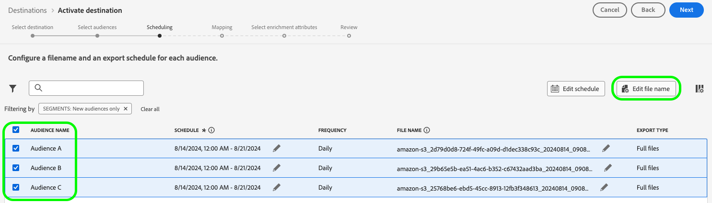

# Versionsinformation för Adobe Experience Platform

**Releasedatum: 20 augusti 2024**

>[!TIP]
>
>Visa en [översikt över exempeldokumentationen ](https://experienceleague.adobe.com/en/docs/experience-platform/rtcdp/use-cases/overview) om användningsfall för att lära dig mer om olika användningsfall, som prospektering, förvärv och mer som din organisation kan uppnå med Real-Time CDP.

Uppdateringar av befintliga funktioner och dokumentation i Experience Platform:

- [Mål ](#destinations)
- [Experience Data Model (XDM)](#xdm)
- [Identitetstjänst](#identity-service)
- [Segmenteringstjänst](#segmentation)
- [Källor](#sources)

## Mål  {#destinations}

[!DNL Destinations] är färdiga integreringar med målplattformar som möjliggör smidig aktivering av data från Adobe Experience Platform. Ni kan använda destinationer för att aktivera kända och okända data för flerkanalskampanjer, e-postkampanjer, riktad reklam och många andra användningsfall.

**Ny eller uppdaterad funktion** {#destinations-new-updated-functionality}

| Funktion | Beskrivning |
| ----------- | ----------- |
| Export av filer on-demand till batchdestinationer är nu allmänt tillgängligt. | Alternativet att exportera filer on demand till batchdestinationer är nu tillgängligt för alla kunder. Mer information finns i den [dedikerade dokumentationen](../../destinations/ui/export-file-now.md). |
| Redigera exportscheman för flera exporterade målgrupper i [schemaläggningssteget](../../destinations/ui/activate-batch-profile-destinations.md#scheduling). | Möjligheten att redigera exportscheman för flera exporterade målgrupper direkt från schemaläggningssteget i arbetsflödet för målgruppsaktivering är nu tillgängligt för alla kunder.  {width="250" align="center" zoomable="yes"} |
| Redigera filnamn för flera exporterade målgrupper i [schemaläggningssteget](../../destinations/ui/activate-batch-profile-destinations.md#scheduling). | Nu kan alla kunder redigera namnen på flera exporterade filer direkt från schemaläggningssteget i målgruppsaktiveringsarbetsflödet.  {width="250" align="center" zoomable="yes"} |
| Ta bort flera målgrupper från ett dataflöde från sidan [Målinformation](../../destinations/ui/destination-details-page.md#bulk-remove). | Alternativet att ta bort flera målgrupper från befintliga dataflöden från sidan **[!UICONTROL Destination Details]** är nu tillgängligt för alla kunder.  {width="250" align="center" zoomable="yes"} |
| Exportera flera filer på begäran till gruppmål från sidan [Målinformation](../../destinations/ui/destination-details-page.md#bulk-export). | Alternativet att exportera flera filer on-demand till gruppmål från sidan **[!UICONTROL Destination Details]** är nu tillgängligt för alla kunder.  {width="250" align="center" zoomable="yes"} |
| Redigera filnamn för flera exporterade målgrupper på sidan [Målinformation](../../destinations/ui/destination-details-page.md#bulk-edit-file-names). | Nu kan du redigera namnen på flera exporterade filer direkt från sidan **[!UICONTROL Destination Details]**.  {width="250" align="center" zoomable="yes"} |
| Ta bort flera datauppsättningar från ett dataflöde från sidan [Målinformation](../../destinations/ui/export-datasets.md#remove-dataset). | Alternativet att ta bort flera datauppsättningar från ett dataflöde är nu tillgängligt för alla kunder.  {width="250" align="center" zoomable="yes"} |

{style="table-layout:auto"}

Mer information finns i [målöversikten](../../destinations/home.md).

## Experience Data Model (XDM) {#xdm}

XDM är en öppen källkodsspecifikation som innehåller gemensamma strukturer och definitioner (scheman) för data som hämtas till Adobe Experience Platform. Genom att följa XDM-standarder kan alla kundupplevelsedata införlivas i en gemensam representation för att ge insikter på ett snabbare och mer integrerat sätt. Ni kan få värdefulla insikter från kundåtgärder, definiera kundmålgrupper genom segment och använda kundattribut i personaliseringssyfte.

**Nya funktioner**

| Funktion | Beskrivning |
| --- | --- |
| Arbetsflöde för att skapa XML-stödda scheman | Använd avancerade maskininlärningsalgoritmer för att analysera dina CSV-exempeldatafiler och automatiskt skapa optimerade scheman med hjälp av standardfält och anpassade fält. Nyckelfunktioner: <ul><li>Skapa schema snabbare: Generera scheman direkt från exempeldatafiler med XML-rekommenderade och genererade XDM-fält.</li><li>Flexibel schemautveckling: Lägg enkelt till eller uppdatera fält i det genererade schemat.</li><li>Smidig integrering: Helt integrerat med det centrala schemaflödet i Schema UL, vilket ger en smidig och sammanhängande användarupplevelse.</li><li>Effektiv granskning och redigering: Visa och uppdatera snabbt schemat med hjälp av Flat View-redigeraren, vilket gör arbetet mer effektivt och användarvänligt.</li></ul> |

{style="table-layout:auto"}

Mer information finns i översikten över att skapa [ML-stödda scheman](../../xdm/ui/ml-assisted-schema-creation.md)

Mer information om XDM i Platform finns i [XDM-systemöversikt](../../xdm/home.md).

## Identitetstjänst {#identity-service}

Använd Adobe Experience Platform identitetstjänst för att skapa en heltäckande bild av era kunder och deras beteenden genom att skapa en bro mellan identiteter på olika enheter och system, så att ni kan leverera slagkraftiga, personliga digitala upplevelser i realtid.

**Uppdaterad dokumentation**

| Funktion | Beskrivning |
| --- | --- |
| Guide för diagramkonfigurationer | Läs [diagramkonfigurationsguiden](../../identity-service/identity-graph-linking-rules/example-configurations.md) om du vill ha information om vanliga diagramscenarier som du kan stöta på när du arbetar med länkningsregler för identitetsdiagram och identitetsdata. Guiden för diagramkonfigurationer innehåller exempel från enkla enpersonsdiagram till komplexa och hierarkiska flerpersonsdiagram. Du kan också använda guiden för exempel på händelser och algoritmkonfigurationer som du kan ange i [diagramsimuleringens användargränssnitt](../../identity-service/identity-graph-linking-rules/graph-simulation.md), samt för att dela upp hur primära identiteter väljs utifrån vissa diagramscenarier. |

{style="table-layout:auto"}

Mer information om identitetstjänsten finns i [Översikt över identitetstjänsten](../../identity-service/home.md).

## Segmenteringstjänst {#segmentation}

Med [!DNL Segmentation Service] kan du segmentera data som lagras i [!DNL Experience Platform] och som relaterar till individer (t.ex. kunder, potentiella kunder, användare eller organisationer) till målgrupper. Du kan skapa målgrupper med hjälp av segmentdefinitioner eller andra källor från dina [!DNL Real-Time Customer Profile]-data. Dessa målgrupper är centralt konfigurerade och underhållna på [!DNL Platform] och är tillgängliga för alla Adobe-lösningar.

**Uppdaterade funktioner**

| Funktion | Beskrivning |
| ------- | ----------- |
| Inmatningsinformation | För målgrupper med ursprung i Custom Upload kan du mer ingående visa information om målgruppens förtäring på sidan med målgruppsinformation. Dessutom kan du lägga till etiketter i nyttolastattributen genom att markera schemat och välja önskade attribut för etiketteringen. Mer information om avsnittet med information om inmatning finns i [guiden för målportalen](../../segmentation/ui/audience-portal.md#ingestion-details). |

{style="table-layout:auto"}

Mer information om [!DNL Segmentation Service] finns i [Segmenteringsöversikt](../../segmentation/home.md).

## Källor

Experience Platform tillhandahåller ett RESTful-API och ett interaktivt användargränssnitt som gör att du enkelt kan konfigurera källanslutningar för olika dataleverantörer. Dessa källanslutningar gör att du kan autentisera och ansluta till externa lagringssystem och CRM-tjänster, ange tider för matning och hantera dataöverföringshastigheter.

Använd källor i Experience Platform för att importera data från ett Adobe-program eller en datakälla från tredje part.

**Uppdaterad dokumentation**

| Uppdaterad dokumentation | Beskrivning |
| --- | --- |
| Utökad dokumentation om uppdatering av dataflöden | Guiden [Uppdatera befintliga källfilsdataflöden i användargränssnittet ](../../sources/tutorials/ui/update-dataflows.md) har uppdaterats för att ge mer information om olika konfigurationer som du kan göra i ett befintligt dataflöde. Handboken har också uppdaterats för att förtydliga det förväntade beteendet när ett inaktiverat dataflöde återaktiveras. |

{style="table-layout:auto"}

Mer information finns i [Källöversikt](../../sources/home.md).