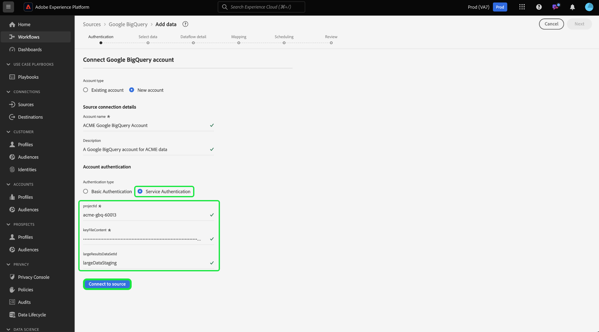

# Versionsinformation om Adobe Experience Platform

**Releasedatum: 24 september 2024**

Uppdateringar av befintliga funktioner och dokumentation i Adobe Experience Platform:

- [Aviseringar](#alerts)
- [Kontrollpaneler](#dashboards)
- [Dataförberedelse](#data-prep)
- [Mål ](#destinations)
- [Experience Data Model (XDM)](#xdm)
- [Identitetstjänst](#identity-service)
- [Frågetjänst](#query-service)
- [Segmenteringstjänst](#segmentation-service)
- [Källor](#sources)

## Aviseringar {#alerts}

Med Experience Platform kan du prenumerera på händelsebaserade aviseringar för olika Platform-aktiviteter. Du kan prenumerera på olika aviseringsregler på fliken [!UICONTROL Alerts] i Platform-användargränssnittet och du kan välja att ta emot aviseringssmeddelanden i själva användargränssnittet eller via e-postmeddelanden.

**Nya eller uppdaterade funktioner**

| Funktion | Beskrivning |
| --- | --- |
| Stöd för utvecklingssandlådor | Du kan nu [prenumerera på aviseringar](../../observability/alerts/ui.md) i både produktions- och utvecklingssandlådor, vilket möjliggör sömlös övervakning i alla miljöer. |
| E-postmallar | [E-postaviseringar](../../observability/alerts/ui.md) innehåller nu detaljerad resursinformation, vilket garanterar att du har all viktig information nära till hands. |
| Förbättrad anpassning | Du kan nu konfigurera [aviseringströsklar](../../observability/alerts/ui.md#alert-threshold) som ger större flexibilitet att anpassa aviseringar efter dina specifika behov för följande aviseringstyper: <ul><li>Fördröjning för segmentjobb</li><li>Fördröjning för segmentexport</li><li>Körningsfördröjning för målflöde</li><li>Körningsfördröjning för identitetstjänstens flöde</li><li>Körningsfördröjning för profilflöde</li><li>Körningsfördröjning för källflöde</li><li>Frågekörningsfördröjning</li><li>Ingen aktiveringshastighet har överskridits</li><li>Felfrekvens för källinmatning har överskridits</ul> |
| Utökade aviseringar | Aviseringar om granskningshändelser är nu tillgängliga för prenumeration på följande [varningsregler](../../observability/alerts/rules.md): <ul><li>Skapa målgrupper</li><li>Målgruppsuppdatering</li><li>Målgruppsborttagning</li><li>Skapa datauppsättning</li><li>Uppdatering av datauppsättning</li><li>Ta bort datauppsättning</li><li>Skapa schema</li><li>Schemauppdatering</li><li>Ta bort schema. |

{style="table-layout:auto"}

Mer information om aviseringar finns i [[!DNL Observability Insights] översikten](../../observability/home.md).

## Kontrollpaneler {#dashboards}

Experience Platform tillhandahåller flera instrumentpaneler där du kan visa viktiga insikter om organisationens data, som de har hämtats in under dagliga ögonblicksbilder.

**Nya eller uppdaterade funktioner**

| Funktion | Beskrivning |
| --- | --- |
| Query Pro-läge - globala filteruppgraderingar | Förbättra analysen med det nya datumfiltret i Query Pro-läget. Förfina insikterna med dynamiska datumparametrar i dina SQL-frågor och filtrera data efter specifika tidsramar. Välj förinställda eller anpassade datumintervall med ett intuitivt användargränssnitt så att instrumentpanelerna är relevanta för alla användare. Förenkla arbetsflödena, bibehåll precisionen och fatta vältajmade beslut. Läs [guiden om att skapa datumfilter](../../dashboards/data-distiller/query-pro-mode/filters/global-filter.md) om du vill ha mer information. |
| Query Pro-lägen - detaljnivå | Lås upp djupare insikter med funktionen Granska genom i Query Pro-läget och navigera smidigt mellan diagram på hög nivå och detaljerade paneler. Använd den här funktionen för att enkelt gå från sammanfattningar till djupgående analyser och utforska trender, kundbeteenden och nyckeltal. Automatiska genomströmningar av filter och genomborrning på flera nivåer håller data konsekventa, vilket ger en smidig utforskning. Förenkla arbetsflödena, håll rätt sammanhang och snabba upp beslutsfattandet. Läs [steg-för-steg-guiden om hur du skapar fördjupningar](../../dashboards/data-distiller/query-pro-mode/drill-through.md) om du vill ha mer information. |
| Query Pro-läge - avancerade tabellattribut | Använd Query Pro Mode för avancerade tabellattribut för att effektivisera datavisualisering, förbättra arbetsflödets effektivitet och förbättra dataskärpan. Lägg till automatisk sortering, storleksändring och sidnumrering i tabellerna direkt från anpassade kontrollpaneler. Sortera kolumner för att prioritera nyckeldata, ändra storlek för optimal läsbarhet och navigera smidigt i stora datauppsättningar utan att ändra SQL-frågorna. Läs guiden [Visa mer](../../dashboards/data-distiller/query-pro-mode/view-more.md) om du vill veta hur du integrerar dessa funktioner och höjer dina datainsikter. |

{style="table-layout:auto"}

Läs [översikt över kontrollpaneler](../../dashboards/home.md) för mer information om kontrollpaneler, bland annat hur du beviljar åtkomstbehörigheter och skapar anpassade widgetar.

## Dataförberedelse {#data-prep}

Använd dataförberedelse för att mappa, omvandla och validera data till och från Experience Data Model (XDM).

**Nya eller uppdaterade funktioner**

| Funktion | Beskrivning |
| --- | --- |
| [!BADGE Beta]{type=Informative} Nya funktioner för dataförberedelser som kan användas i mål | Nu kan du använda följande arrayfunktioner för destinationer:<ul><li>`array_to_string`</li><li>`filterArray`</li><li>`transformArray`</li><li>`flattenArray`</li></ul> Mer information finns i [funktionsguiden för dataförberedelse](../../data-prep/functions.md#arrays). |

{style="table-layout:auto"}

Mer information om dataförberedelse finns i [översikten över dataförberedelse](../../data-prep/home.md).

## Mål  {#destinations}

[!DNL Destinations] är förbyggda integrationer med målplattformar som möjliggör sömlös aktivering av data från Adobe Experience Platform. Du kan använda mål för att aktivera dina kända och okända data för marknadsföringskampanjer över flera kanaler, e-postkampanjer, riktad reklam och många andra användningsområden.

**Nya eller uppdaterade mål** {#new-updated-destinations}

| Mål | Beskrivning |
| --- | --- |
| [Amazon Ads](/help/destinations/catalog/advertising/amazon-ads.md) | Septemberversionen 2024 lägger till mappningsalternativet för att exportera parametern `countryCode` till Amazon Ads. Använd `countryCode` i [mappningssteget](/help/destinations/catalog/advertising/amazon-ads.md#map) om du vill förbättra identitetsmatchningsfrekvensen med Amazon. |

{style="table-layout:auto"}

**Ny eller uppdaterad funktionalitet** {#destinations-new-updated-functionality}

| Funktion | Beskrivning |
| --- | --- |
| [Förbättringar i datauppsättningsexport](/help/destinations/ui/export-datasets.md) | Septemberversionen 2024 av Experience Platform innehåller flera förbättringar av exportfunktionen för datauppsättningar, som ger bättre stöd för olika typer av datagränsanvändning. Bland de här funktionsförbättringarna finns: <ul><li>Nya konfigureringsalternativ för datamappar, inklusive alternativet att lägga till och ta bort undermappar.</li><li>Nya exportalternativ inklusive fullständig filexport (en gång) och möjligheten att ange slutdatum</li><li>Obs! Adobe inför också ett standardslutdatum som är 1 maj 2025 för alla datauppsättningsexportdataflöden som skapats före september-versionen. För dessa dataflöden måste kunderna uppdatera slutdatumet i dataflödet manuellt före slutdatumet, annars avbryts exporten på det här datumet.</li></ul>   {width="250" align="center" zoomable="yes"} |

{style="table-layout:auto"}

Mer information finns i [målöversikten](../../destinations/home.md).

## Experience Data Model (XDM) {#xdm}

XDM är en specifikation med öppen källkod som tillhandahåller gemensamma strukturer och definitioner (scheman) för data som förs in i Adobe Experience Platform. Genom att följa XDM-standarder kan all data om kundupplevelsen införlivas i en gemensam representation för att leverera insikter på ett snabbare och mer integrerat sätt. Du kan få värdefulla insikter från kundåtgärder, definiera kundmålgrupper genom segment och använda kundattribut för personalisering.

**Uppdaterade funktioner**

| Funktion | Beskrivning |
| --- | --- |
| Förbättringar i schemaläggaren | Ta kontroll över dina schemarelationer med ett uppdaterat relationsarbetsflöde i schemaredigeraren. Uppdatera eller ta enkelt bort befintliga relationer direkt från användargränssnittet i Experience Platform, vilket gör schemahanteringen smidigare och mer intuitiv. Justera referensscheman och byt tryggt namn på relationerna, och säkerställ smidig dataintegritet över segmentering och andra viktiga processer. Om du vill veta mer om hur du kan hantera dina schemarelationer på ett effektivt sätt kan du läsa handböckerna om [hur du definierar relationsfält i användargränssnittet](../../xdm/tutorials/relationship-ui.md#create-a-relationship-field-group) och om [B2B-relationer](../../xdm/tutorials/relationship-b2b.md#edit-a-b2b-schema-relationship). |

{style="table-layout:auto"}

Mer information om XDM finns i [XDM-systemöversikt](../../xdm/home.md).

## Identitetstjänst {#identity-service}

Använd identitetstjänsten för Adobe Experience Platform för att skapa en heltäckande bild av dina kunder och deras beteenden genom att skapa en bro mellan identiteter på olika enheter och system, så att du kan leverera slagkraftiga, personliga digitala upplevelser i realtid.

**Uppdaterad dokumentation**

| Funktion | Beskrivning |
| --- | --- |
| Felsökningsguide för länkningsregler för identitetsdiagram | Läs den nya [felsökningsguiden för länkningsregler för identitetsdiagram](../../identity-service/identity-graph-linking-rules/troubleshooting.md) för strategier och felsökningslösningar som du kan vidta för att lösa vanliga problem som du kan stöta på när du arbetar med länkningsregler för identitetsdiagram. |
| Vanliga frågor om länkningsregler för identitetsdiagram | Läs de nya [reglerna för länkning av identitetsdiagram ](../../identity-service/identity-graph-linking-rules/troubleshooting.md#frequently-asked-questions) för att få en lista med svar på vanliga frågor om namnområdesprioritet, algoritmen för identitetsoptimering och andra aspekter av länkningsreglerna för identitetsdiagram. |

{style="table-layout:auto"}

Mer information om identitetstjänsten finns i [översikten över identitetstjänsten](../../identity-service/home.md).

## Frågetjänst {#query-service}

Med frågetjänsten kan du använda standard SQL för att söka efter data i Adobe Experience Platform [!DNL data lake]. Du kan koppla till alla datauppsättningar från datasjön och samla in frågeresultaten som en ny datamängd som kan användas för rapportering, Data Science Workspace eller för förtäring i kundprofilen i realtid.

**Uppdaterade funktioner**

| Funktion | Beskrivning |
| --- | --- |
| Data Distiller-målgrupper | Skapa, hantera och aktivera enkelt målgrupper med SQL-målgruppstillägget i Experience Platform Data Distiller. Definiera målgruppssegment med SQL-kommandon direkt från datasjön, utan att behöva använda rådata i profiler. Förfina målinriktningsstrategierna och synkronisera automatiskt målgrupperna till filbaserade destinationer med denna flexibla, datadrivna strategi. Effektivisera arbetsflödena, optimera målgruppshanteringen och utnyttja datas fulla potential. Läs [guiden om hur du använder SQL-målgruppstillägget](../../query-service/home.md) för att få fler strategier för målgruppen. |
| Data Distiller Statistics - Hyperkuber | Optimera big data-analyser med hyperkuber. Hantera komplexa beräkningar - som distinkta antal och flerdimensionell analys - utan att behöva bearbeta historiska data på nytt. Uppdatera data stegvis, effektivisera arbetsflödena och minska behandlingstiden samtidigt som ni bibehåller exaktheten och effektiviteten. Få snabbare, skalbara och kostnadseffektiva insikter som förändrar beslutsfattandet. Utforska [guiden om hur du använder hyperkuber](../../query-service/hypercubes.md) för att låsa upp avancerad analys. |
| Frågeredigeringsobjektets webbläsare | Öka frågans effektivitet med den nya objektbläddraren i Frågeredigeraren. Sök, filtrera och kom snabbt åt datauppsättningar för att skriva och förfina frågor snabbare. Med schemauppdateringar i realtid och direkt tabellmetadata kan du effektivisera arbetsflöden, minska navigeringstiden och förbättra frågeupplevelsen. Frigör potentialen i era data och optimera analysen. Läs [handboken om hur du använder objektbläddraren](../../query-service/ui/user-guide.md#object-browser) om du vill ha mer information. |
| Beräkna timmar | Få kontroll över resursanvändningen med det nya synliga måttet Beräkningstider för schemalagda frågor. Visa Comput Hours på frågekörningsnivå för att övervaka och optimera resursanvändningen för CTAS/ITAS-batchfrågor. Spåra starttider, slutförandestatus och beräkningstid för varje frågekörning. Finjustera prestanda och minska kostnaderna utan problem. Läs [guiden om beräkningstimmar](../../query-service/ui/query-schedules.md#compute-hours-at-job-level) om du vill ha mer information om hur du maximerar frågans effektivitet. |

{style="table-layout:auto"}

Läs [Översikt över frågetjänsten](../../query-service/home.md) om du vill veta mer om frågetjänsten.

## Segmenteringstjänst {#segmentation-service}

[!DNL Segmentation Service] definierar en viss deluppsättning av profiler genom att beskriva de kriterier som skiljer en säljbar grupp människor inom din kundbas. Segmenten kan baseras på registerdata (t.ex. demografisk information) eller tidsseriehändelser som representerar kundinteraktioner med ditt varumärke.

**Nya eller uppdaterade funktioner**

| Funktion | Beskrivning |
| --- | --- |
| Implementering av enhetlig sökning | Sökbeteendet i Segment Builder kommer nu att använda Unified Search. Detta ger en mer robust upplevelse när man hanterar och söker efter målgrupper som kan återanvända ett segmentmedlemskap. Mer information om den här ändringen finns i [guiden för Segment Builder](../../segmentation/ui/segment-builder.md#rule-builder-canvas). |

{style="table-layout:auto"}

Mer information om [!DNL Segmentation Service] finns i [Segmenteringsöversikt](../../segmentation/home.md).

## Källor {#sources}

Experience Platform tillhandahåller ett RESTful API och ett interaktivt användargränssnitt som gör att du enkelt kan konfigurera källanslutningar för olika dataleverantörer. Med dessa källanslutningar kan du autentisera och ansluta till externa lagringssystem och CRM-tjänster, ställa in tider för inmatningskörningar och hantera datainmatningens genomströmning.

Använd källor i Experience Platform för inmatning av data från ett Adobe-program eller en datakälla från tredje part.

**Uppdaterad funktion**

| Funktion | Beskrivning |
| --- | --- |
| [!BADGE Beta]{type=Informative} Stöd för krypterad datainmatning i användargränssnittet | Du kan nu importera krypterade data från en batchkälla för molnlagring med hjälp av källarbetsytan i användargränssnittet i Experience Platform. Mer information finns i självstudiekursen om [inhämtning av krypterade data i användargränssnittet](../../sources/tutorials/ui/encryped-ingestion.md). |
| Allmän tillgänglighet för källan [!DNL Snowflake Streaming] | [!DNL Snowflake Streaming]-källan finns nu i GA. Använd den här källan för att strömma data från ditt [!DNL Snowflake]-konto till Experience Platform. Läs [[!DNL Snowflake Streaming] översikten](../../sources/connectors/databases/snowflake-streaming.md)om du vill ha mer information. |
| Stöd för autentisering av tjänstkonto i [!DNL Google BigQuery] | Du kan nu ansluta ditt [!DNL Google BigQuery]-konto till Experience Platform med autentisering av tjänstkonto. Läs [[!DNL Google BigQuery] översikten](../../sources/connectors/databases/bigquery.md#generate-your-google-bigquery-credentials) om du vill ha mer information.   {width="250" align="center" zoomable="yes"} |
| Stöd för att hoppa över förhandsgranskning av exempeldata | Du kan nu välja att hoppa över förhandsgranskning av data när du skapar en källanslutning med följande källor: <ul><li>[[!DNL Google BigQuery]](../../sources/tutorials/ui/create/databases/bigquery.md#skip-preview-of-sample-data)</li><li>[[!DNL Salesforce]](../../sources/tutorials/ui/create/crm/salesforce.md#skip-preview-of-sample-data)</li><li>[[!DNL Snowflake]](../../sources/tutorials/ui/create/databases/snowflake.md#skip-preview-of-sample-data)</li></ul> Du kan hoppa över förhandsgranskning av data för att kringgå en timeout som kan uppstå när stora gruppdata importeras. Om du gör det kan det förhindra automatisk validering av beräknade och obligatoriska fält. Om du väljer att hoppa över förhandsgranskning av data kan du behöva validera beräknade och obligatoriska fält manuellt under mappningen. |
| Stöd för att inaktivera chunkning i [!DNL SFTP] | Du kan nu konfigurera en inställning som gör att du kan inaktivera chunkning i källan [!DNL SFTP]. Läs [[!DNL SFTP] översikten](../../sources/connectors/cloud-storage/sftp.md) för mer information. |

{style="table-layout:auto"}

Mer information finns i [översikten över källor](../../sources/home.md).
