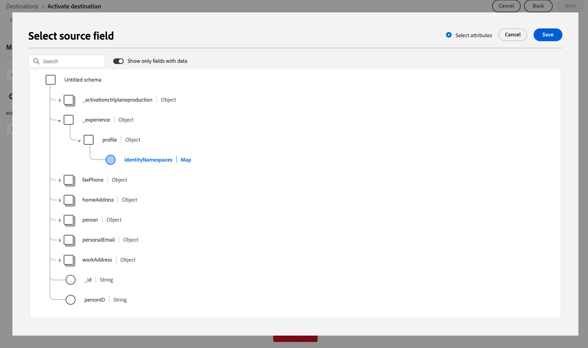

# Versionsinformation för Adobe Experience Platform

**Utgivningsdatum: 26 mars 2025**

Uppdateringar av befintliga funktioner och dokumentation i Adobe Experience Platform:

- [Versionsinformation för Adobe Experience Platform](#adobe-experience-platform-release-notes)

   - [Kontrollpaneler](#dashboards)
   - [Mål ](#destinations)
   - [Federerad målgruppssammansättning](#federated-audience-composition)
   - [Segmenteringstjänst](#segmentation-service)
   - [Källor](#sources)

## Kontrollpaneler {#dashboards}

Experience Platform tillhandahåller flera instrumentpaneler där du kan visa viktiga insikter om organisationens data, som fångas upp under dagliga ögonblicksbilder.

**Nya eller uppdaterade funktioner**

| Funktion | Beskrivning |
| ------- | ----------- |
| Mätvärdesbaserad instrumentpanel för licensanvändning | Instrumentpanelen för licensanvändning innehåller nu ett effektiviserat användargränssnitt med två flikar: **Mätvärden** och **Produkter**. Den nya fliken **Mätvärden** ger en samlad vy av alla spårbara licensmätvärden för dina köpta produkter. Varje mätvärde innehåller en infoikon som visar beskrivningar och tillhörande produkter. Användare kan välja produktions- eller utvecklingssandlådor, se historiska användningstrender i interaktiva diagram och exportera sandlådespecifika data som CSV-filer. Dessa uppdateringar effektiviserar licensspårning och ger tydligare insikter. Läs mer i [guiden för kontrollpanelen för licensanvändning](../../dashboards/guides/license-usage.md) för mer information. |
| Uppdaterad prediktionsfrekvens | Instrumentpanelen för licensanvändning ger nu mer exakta insikter om förväntad förbrukning genom att uppdatera prognoser för användning **veckovis** istället för månadsvis. Dessa prognoser visar uppskattad användning under de kommande sex veckorna baserat på de senaste trenderna. Denna förändring möjliggör snabbare beslutsfattande, tidigare ingripanden och förbättrad licensplanering. Se [guiden för kontrollpanelen för licensanvändning](../../dashboards/guides/license-usage.md#predicted-usage) för ytterligare information. |
| Uppdaterade mätvärdesbeskrivningar i användargränssnittet | Metriska definitioner i instrumentpanelen för licensanvändning har reviderats för tydlighet och konsekvens. Du kan nu se uppdaterade beskrivningar direkt i kontrollpanelen med infogade infoikoner bredvid varje mätvärde på fliken **Mätvärden**. Dessa uppdateringar gör det lättare att förstå hur mätvärden spåras och vilka produkter de gäller. Se [guiden för kontrollpanelen för licensanvändning](../../dashboards/guides/license-usage.md#available-metrics) för mer information. |

{style="table-layout:auto"}

Läs [översikt över kontrollpaneler](../../dashboards/home.md) för mer information om kontrollpaneler, bland annat hur du beviljar åtkomstbehörigheter och skapar anpassade widgetar.

## Mål  {#destinations}

[!DNL Destinations] är förbyggda integrationer med målplattformar som möjliggör sömlös aktivering av data från Adobe Experience Platform. Du kan använda mål för att aktivera dina kända och okända data för marknadsföringskampanjer över flera kanaler, e-postkampanjer, riktad reklam och många andra användningsområden.

**Nya eller uppdaterade destinationer** {#new-updated-destinations}

| Mål | Beskrivning |
| --- | --- |
| [Demandbase People-anslutning](/help/destinations/catalog/advertising/demandbase-people.md) | Använd [!DNL Demandbase People]-anslutningen för att aktivera profiler för dina Demandbase-kampanjer för målgruppsinriktning, anpassning och exkludering. |
| [Bombora-kontoanslutning](/help/destinations/catalog/advertising/bombora.md) | Använd [!DNL Bombora]-anslutningen för att aktivera profiler för dina Bombora-kampanjer för målgruppsinriktning, anpassning och exkludering, baserat på [kontomålgrupper](/help/segmentation/types/account-audiences.md). |
| Uppgradering av [Airship-attribut](/help/destinations/catalog/mobile-engagement/airship-attributes.md) | Från och med 25 mars 2025 kan du se två **[!UICONTROL Airship Attributes]**-kort sida vid sida i målkatalogen. Det här beror på en intern uppgradering av måltjänsten. Den befintliga målanslutningen **[!UICONTROL Airship Attributes]** har bytt namn till **[!UICONTROL (Deprecated) Airship Attributes]** och du har nu tillgång till ett nytt kort med namnet **[!UICONTROL Airship Attributes]**.   Använd anslutningen **[!UICONTROL Airship Attributes]** i katalogen för nya aktiveringsdataflöden. Om du har aktiva dataflöden till målet [!DNL (Deprecated) Airship Attributes] uppdateras de automatiskt. Du behöver därför inte göra något.   Om du skapar dataflöden via [Flow Service-API:et](https://developer.adobe.com/experience-platform-apis/references/destinations/) måste du uppdatera [!DNL flow spec ID] och [!DNL connection spec ID] till följande värden: <ul><li> Flödesspecifikation-id: `a862e0be-966e-4e5a-80d3-1bb566461986`</li><li> Anslutningsspecifikation-id: `594bc002-4a47-49b7-8a98-ac0d21045502`</li> </ul> |

{style="table-layout:auto"}

**Ny eller uppdaterad funktionalitet** {#destinations-new-updated-functionality}

| Funktion | Beskrivning |
| --- | --- |
| [Förbättringar av rapporteringsnoggrannhet för strömningsmål](../../dataflows/ui/monitor-destinations.md) | Från och med mars 2025 lanserar Adobe en uppdatering som ökar rapporteringsnoggrannheten för strömningsdestinationerna. Denna förbättring säkerställer en bättre anpassning mellan rapporteringen i Experience Platform och destinationsplattformarna.   Före den här uppdateringen innehöll **[!UICONTROL Identities failed]** alla aktiveringsåterförsök. Efter den här uppdateringen inkluderas endast det senaste aktiveringsåterförsöket i det totala antalet.   Den här förbättringen gäller för alla strömningsdestinationerna.   Efter denna förbättring kan användare av strömningsdestinationer se en förväntad minskning av antalet **[!UICONTROL Identities failed]**. |
| [Fältexport av karttyp för storföretags- och Edge-destinationer](/help/destinations/ui/export-arrays-maps-objects.md) | När du exporterar data till destinationerna [Amazon Kinesis](/help/destinations/catalog/cloud-storage/amazon-kinesis.md), [HTTP API](/help/destinations/catalog/streaming/http-destination.md), [Azure Event Hubs](/help/destinations/catalog/cloud-storage/azure-event-hubs.md) och [Adobe Target](/help/destinations/catalog/personalization/adobe-target-connection.md) kan du nu välja karttypsfält för export i mappningssteget i aktiveringsarbetsflödet.   {width="250" align="center" zoomable="yes"} |

{style="table-layout:auto"}

Mer information finns i [översikten över destinationer](../../destinations/home.md).

## Federerad målgruppssammansättning {#federated-audience-composition}

Information om de senaste uppdateringarna för federerad målgruppssammansättning finns i [dedikerad versionsinformation](https://experienceleague.adobe.com/sv/docs/federated-audience-composition/using/release-notes) här.

## Segmenteringstjänst {#segmentation-service}

[!DNL Segmentation Service] definierar en viss deluppsättning av profiler genom att beskriva de kriterier som skiljer en säljbar grupp människor inom din kundbas. Segmenten kan baseras på registerdata (t.ex. demografisk information) eller tidsseriehändelser som representerar kundinteraktioner med ditt varumärke.

| Funktion | Beskrivning |
| ------- | ----------- |
| Förbättringar i Målgruppsbyggare för konto | I Målgruppsbyggare kan du nu filtrera attribut så att de bara visar ifyllda attribut, samt visa sammanfattningsdata för dessa ifyllda attribut. Mer information om dessa förbättringar finns i dokumentationen för [Målgruppsbyggare](../../rtcdp/segmentation/audience-builder.md). |
| Flexibel allmän tillgänglighet för utvärdering av målgrupper | Flexibel målgruppsutvärdering är nu allmänt tillgänglig! Du kan använda flexibel målgruppsutvärdering för att skapa nya målgrupper på begäran för tidskänslig kommunikation. Mer information om flexibel målgruppsutvärdering finns i [översikten över den flexibla målgruppsutvärderingen](../../segmentation/methods/flexible-audience-evaluation.md). |

Mer information om [!DNL Segmentation Service] finns i [segmenteringsöversikten](../../segmentation/home.md).

## Källor {#sources}

Experience Platform tillhandahåller ett RESTful API och ett interaktivt användargränssnitt som gör att du enkelt kan konfigurera källanslutningar för olika dataleverantörer. Med dessa källanslutningar kan du autentisera och ansluta till externa lagringssystem och CRM-tjänster, ställa in tider för inmatningskörningar och hantera datainmatningens genomströmning.

Använd källor i Experience Platform för inmatning av data från ett Adobe-program eller en datakälla från tredje part.

**Nya källor**

| Funktion | Beskrivning |
| --- | --- |
| [!DNL Bombora Intent] | Källan [!DNL Bombora Intent] är nu tillgänglig i källkatalogen. Använd den här källan för att: <ul><li>Integrera data från Bomboras företagsöverspänningsavsikt för att identifiera konton som aktivt undersöker dina produkter eller tjänster.</li><li>Prioritera marknadskonton för att skapa exakta segment och genomföra hyperriktade ABM-kampanjer, vilket säkerställer att dina marknadsföringssatsningar fokuserar på de konton som mest sannolikt konverteras.</li><li>Utnyttja avsiktsdrivna strategier för att optimera annonskostnaderna, öka engagemanget och maximera avkastningen.</li></ul> Mer information finns i guiden om att [ansluta ditt [!DNL Bombora] konto till Experience Platform](../../sources/tutorials/ui/create/data-partners/bombora.md). |
| [!DNL Demandbase Intent] | Källan [!DNL Demandbase Intent] är nu tillgänglig i källkatalogen. Använd den här källan för att: <ul><li>Integrera avsiktsdata från Demandbases konto för att identifiera konton med högt intresse som bygger på realtidsengagemang.</li><li>Genom att prioritera de starkaste avsiktssignalerna kan du skapa exakta segment och leverera hyperriktade kampanjer för att säkerställa att dina marknadsföringsinsatser fokuserar på de konton som mest sannolikt konverteras.</li><li>Aktivera avsiktsdrivna strategier för att möjliggöra optimering av annonsutgifter, ökat engagemang och högre avkastning.</li></ul> Mer information finns i guiden om att [ansluta ditt [!DNL Demandbase] konto till Experience Platform](../../sources/tutorials/ui/create/data-partners/demandbase.md). |

{style="table-layout:auto"}

**Uppdaterade funktioner**

| Funktion | Beskrivning |
| --- | --- |
| Förbättringar av källan [!DNL Google Ads] | Du kan nu använda [[!DNL Google Ads] källan](../../sources/connectors/advertising/ads.md) för att mata in samlad data. Du kan använda [!DNL Google Ads Query Builder] för att ange de attribut, segment och resurser som du vill mata in i Experience Platform. Mer information finns i guiden om att [ansluta ditt [!DNL Google Ads] konto till Experience Platform](../../sources/tutorials/ui/create/advertising/ads.md). |
| Förbättringar av källan [!DNL Microsoft Dynamics] | Du kan nu ange primärnyckeln för en angiven [!DNL Microsoft Dynamics]-tabell när du undersöker innehållet och strukturen för dina data. Använd den här funktionen för att optimera dina frågor med källan [!DNL Microsoft Dynamics]. Mer information finns i guiden om att [ansluta din [!DNL Microsoft Dynamics] källa till Experience Platform med hjälp av API:t](../../sources/tutorials/api/create/crm/ms-dynamics.md). |
| Stöd för API-nyckelautentisering i självbetjäningskällor (Batch SDK) | Du kan nu använda API-nyckelautentisering som autentiseringstyp när du integrerar en ny källa med självbetjäningskällor (Batch SDK). Mer information finns i guiden om att [konfigurera din autentiseringsspecifikation i Batch SDK](../../sources/sources-sdk/config/authspec.md). |
| Stöd för attributbaserad åtkomstkontroll i källor | Du kan nu använda attributbaserade åtkomstkontrollsfunktioner mot källans dataflöden. Mer information finns i följande guider: <ul><li>[Tillämpa etiketter i källans dataflöden med hjälp av API:t](../../sources/tutorials/api/labels.md)</li><li>[Tillämpa etiketter i källans dataflöden med hjälp av gränssnittet](../../sources/tutorials/ui/labels.md). |

{style="table-layout:auto"}

Mer information finns i [översikten över källor](../../sources/home.md).
