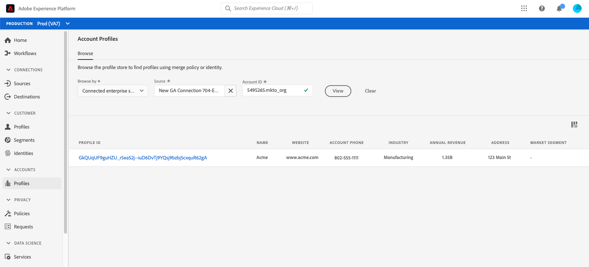
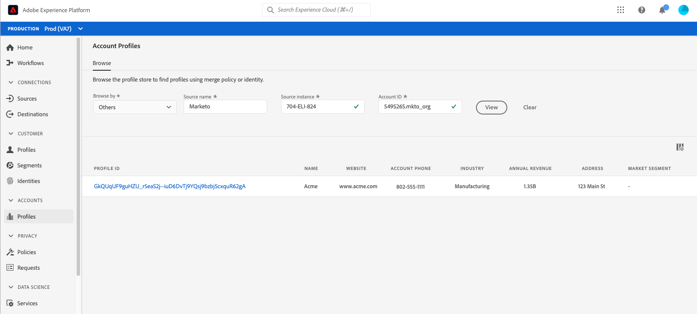
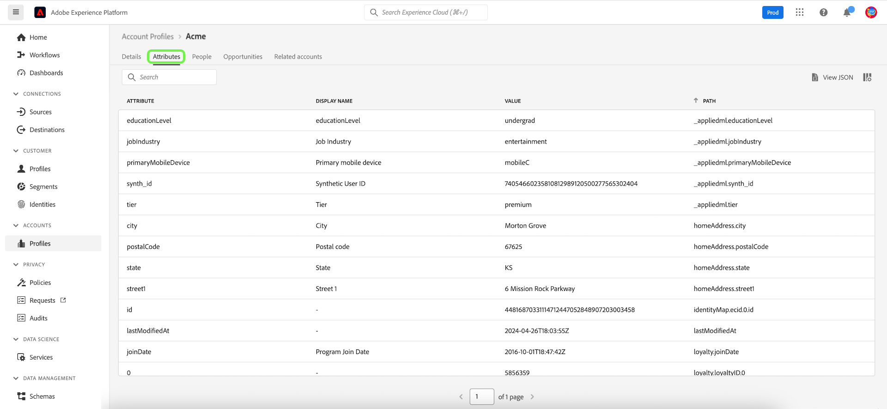

# Användargränssnittshandbok för kontoprofil

>[!NOTE]
>
>Kontoprofiler är bara tillgängliga för Real-time Customer Data Platform B2B Edition-kunder. Om du vill veta mer om Real-Time CDP, inklusive vilka funktioner och funktioner som är tillgängliga för varje licenstyp, börjar du med att läsa [Real-Time CDP-översikten](../overview.md).

Med kontoprofiler kan du samla kontoinformation från flera olika källor. Denna enhetliga vy av ett konto sammanför data från alla era marknadsföringskanaler och de olika system som organisationen för närvarande använder för att lagra kundkontoinformation. Det här dokumentet innehåller en guide till interaktion med kontoprofiler med Real-Time CDP, B2B Edition som finns i Adobe Experience Platform användargränssnitt.

Om du vill veta mer om hur kontoprofiler skapas som en del av B2B-arbetsflödet kan du läsa självstudiekursen [från början till slut](../b2b-tutorial.md).

## Kontoprofiler - översikt {#account-profiles-overview}

Välj **[!UICONTROL Profiles]** under [!UICONTROL Accounts] i den vänstra navigeringen för att visa översikten över kontoprofiler. Under fliken [!UICONTROL Overview] visar kontrollpanelen en bild eller ett diagram med widgetar i en enda startpunkt.

Mer information finns i dokumentationen på kontrollpanelen [[!UICONTROL Account Profiles]](../../dashboards/guides/account-profiles.md). Mer information om hur datamodeller för insikter kan användas för att skapa anpassade diagram för dina instrumentpaneler finns i dokumentationen för [Real-time Customer Data Platform Insights-datamodellen B2B Edition](../../dashboards/data-models/cdp-insights-data-model-b2b.md).

## Konfigurera kontomatchning för lead {#configure-lead-to-account-matching}

>[!IMPORTANT]
>
> Det är bara B2B AI-administratörer som kan aktivera, inaktivera och konfigurera tjänsten lead-to-account matching. När tjänsten inaktiveras tas matchande resultat bort inom 24 timmar.

Om du vill konfigurera lead till kontomatchning väljer du **[!UICONTROL Profiles]** under [!UICONTROL Accounts] i den vänstra navigeringen. På fliken **[!UICONTROL Overview]** väljer du **[!UICONTROL Settings]** i det övre högra hörnet.

Dialogrutan **[!UICONTROL Account settings]** öppnas. Här väljer du **[!UICONTROL Enable lead-to-account-matching]**-växeln för att aktivera funktionen. Använd listrutan för att välja **[!UICONTROL Daily]** för inställningen **[!UICONTROL Matching cadence]**. Slutligen väljer du de relevanta **[!UICONTROL Matching criteria]**-alternativen följt av **[!UICONTROL Save]** för att bekräfta dina inställningar och återgå till skärmen **[!UICONTROL Account Profiles]**.

>[!NOTE]
>
> Adressen kan inte användas som det enda matchande villkoret. Ett eller flera andra matchande villkor måste väljas.

Mer information om lead-till-konto-matchning finns i [Lead to account matching i Real-Time CDP B2B overview](../../rtcdp/b2b-ai-ml-services/lead-to-account-matching.md).

## Bläddra bland kontoprofiler {#browse-account-profiles}

Om du vill bläddra bland kontoprofiler börjar du med att välja **[!UICONTROL Profiles]** under [!UICONTROL Accounts] i den vänstra navigeringen.

På fliken **[!UICONTROL Browse]** kan du utforska kontoprofiler med ett konto-ID från en ansluten företagskälla eller genom att ange källinformation direkt.

### Bläddra efter [!UICONTROL Connected enterprise source] {#browse-by-connected-enterprise-source}

Om du vill bläddra bland kontoprofiler utifrån en ansluten företagskälla väljer du **[!UICONTROL Connected enterprise source]** i listrutan **[!UICONTROL Browse by]** och väljer sedan en ansluten källa med hjälp av väljarknappen bredvid fältet **[!UICONTROL Source]**.

Då öppnas dialogrutan **[!UICONTROL Select source]** där du kan välja en källa baserat på de anslutningar som din organisation har upprättat.

>[!NOTE]
>
>Din organisation kan ha flera konfigurerade källor för samma tjänsteleverantör (till exempel Marketo), så det är viktigt att du granskar anslutningsnamnet, källsystemet och källsystemsinstansen för att vara säker på att du söker efter rätt källinstans.

Mer information om hur du ansluter Enterprise-källor finns i [Källöversikt](../sources/sources-overview.md).

Du kan välja en källa genom att markera alternativknappen bredvid anslutningsnamnet och sedan använda **[!UICONTROL Select]** för att gå tillbaka till fliken [!UICONTROL Browse].

När du har valt en källa måste du nu ange en **[!UICONTROL Account ID]** som är relaterad till källan. Om du till exempel väljer en Salesforce-källa måste du ange ett konto-ID från Salesforce-instansen för att kunna visa den kontoprofil som är kopplad till det ID:t.

>[!NOTE]
>
>För Marketo konto-ID:n finns det två möjliga kontotabeller som du kan referera till. Därför måste du använda en specifik syntax för att se till att du visar rätt konto.
>
>Den vanligaste standardsyntaxen är det konto-ID för Marketo som har lagts till av `.mkto_org` (till exempel `1234567.mkto_org`). Marketo Account-Based Marketing-kunder kan ha ytterligare värden som kan hittas med Marketo konto-ID som bifogas av `.mkto_account`. Kontakta Marketo-administratören om du är osäker på vilken syntax du ska använda.

### Bläddra efter [!UICONTROL Others] {#browse-by-others}

Real-Time CDP, B2B Edition stöder möjligheten att utföra en direktsökning genom att tillåta dig att ange **[!UICONTROL Source name]**, **[!UICONTROL Source instance]** och **[!UICONTROL Account ID]** för ett konto som du vill visa. Genom att ange källnamnet och instansen direkt anger du det sammanhang som krävs för att Experience Platform ska kunna söka efter och visa korrekta kontoprofildata.

Möjligheten att utföra en direktsökning är användbar under omständigheter då det inte går att ansluta direkt till data. Om din organisation till exempel har befintliga datastyrningsprinciper som förhindrar direktanslutning till CRM kan du exportera dessa data till ett molnlagringssystem och sedan importera dem till Experience Platform.

Ett annat exempel kan vara att du utför en omvandling av data mellan den tidpunkt då de lämnar ett system och går in på plattformen. Du kan använda direktsökningsfunktionen för att skapa kontext för data (till exempel ange att det är Marketo-data, trots att det kommer från en Amazon S3-bucket) så att systemet vet var de ska sökas och hur de ska återges korrekt.

Om du vill påbörja en direktsökning väljer du **[!UICONTROL Others]** i listrutan **[!UICONTROL Browse by]** och anger sedan **[!UICONTROL Source name]**, **[!UICONTROL Source instance]** och **[!UICONTROL Account ID]** för kontot som du vill visa.

## Visa kontoprofilinformation {#view-account-profile-details}

När du har använt fliken **[!UICONTROL Browse]** för att hitta en kontoprofil och väljer **[!UICONTROL Profile ID]** öppnas fliken **[!UICONTROL Detail]** för kontoprofilen. Profilinformationen som visas på fliken **[!UICONTROL Detail]** har sammanfogats från flera profilfragment till en enda vy av det enskilda kontot. Detta inkluderar kontoinformation som grundläggande attribut och data för sociala medier.

Standardfälten som visas kan också ändras på organisationsnivå för att visa de kontoprofilattribut som du föredrar.

>[!NOTE]
>
>Liknande funktioner finns för kundprofiler och en steg-för-steg-guide har skapats med instruktioner för att lägga till och ta bort attribut, ändra storlek på paneler osv. Läs anpassningsguiden [för profildetaljer](../../profile/ui/profile-customization.md) om du vill veta mer.

Du kan visa ytterligare information om kontot genom att välja en annan av de tillgängliga flikarna. Flikarna innehåller attribut, personer och fliken för affärsmöjligheter som visar öppna och stängda möjligheter som är kopplade till kontot i företagets system. Mer information om varje flik finns i följande avsnitt.

## Fliken Attribut {#attributes-tab}

Fliken **[!UICONTROL Attributes]** visar all postinformation som hör till kontot. Detta inkluderar attributdata från flera källor som har sammanfogats till en enda vy av kontot.

Förutom att du kan visa data i en lista kan du använda sökfältet för att söka efter specifika attribut eller visa postdata som JSON.

## Fliken Personer {#people-tab}

Fliken **[!UICONTROL People]** innehåller en lista med enskilda personer som är associerade med kontot. Dessa personer kan vara kontakter och leads från olika företagssystem som hanteras av olika team inom organisationen, men i Real-Time CDP, B2B Edition presenteras de tillsammans som en enda lista som gör att du kan få en mer helhetsbild av dina kontokontakter.

>[!NOTE]
>
>Fliken [!UICONTROL People] visar en lista med upp till 25 personer som är associerade med kontot. För konton med fler än 25 associerade personer visas ett slumpmässigt urval på 25 poster.

Förutom att visa dig en ögonblicksbild av information för kontakten, innehåller varje person i listan även en **[!UICONTROL Profile ID]**, som är en klickbar länk som gör att du kan utforska kundprofilen i realtid för den personen. Om du vill veta mer om hur du visar enskilda kundprofiler för dina konton kan du gå till guiden för [bläddringsprofiler i Real-Time CDP, B2B Edition](../profile/profile-browse.md).

## Fliken Affärsmöjligheter {#opportunities-tab}

Fliken **[!UICONTROL Opportunities]** innehåller information om öppna och stängda affärsmöjligheter som är relaterade till kontot. Dessa möjligheter kan förtäras i Experience Platform från flera olika källor, men Real-Time CDP B2B Edition gör det enkelt för marknadsförarna att se alla dessa möjligheter på ett och samma ställe.

>[!NOTE]
>
>Fliken [!UICONTROL Opportunities] visar en lista med upp till 25 affärsmöjligheter som är associerade med kontot. För konton med fler än 25 tillhörande möjligheter visas ett slumpmässigt urval på 25 poster.

Varje affärsmöjlighet innehåller information som namn på affärsmöjligheten, belopp, fas och huruvida affärsmöjligheten är öppen, stängd, vunnen eller förlorad.

## Fliken Relaterade konton {#related-accounts-tab}

Fliken **[!UICONTROL Related accounts]** innehåller information om andra konton som kan vara relaterade till kontot som du bläddrar i. Mer detaljerad information om funktionerna finns i [översikten över relaterade konton](/help/rtcdp/b2b-ai-ml-services/related-accounts.md).

>[!NOTE]
>
>* En relaterad kontogrupp kan ha maximalt 30 kontoprofiler. Om fler än 30 kontoprofiler befunnits vara relaterade delas de godtyckligt i flera grupper, där var och en inte har fler än 30 medlemmar. Gruppen Relaterade konton i en kontoprofil omfattar alltid sig själv.
>* Fliken [!UICONTROL Related accounts] visar för närvarande en lista med upp till 25 relaterade konton som är kopplade till det konto du bläddrar i. Detta är en begränsning som kommer att åtgärdas i en framtida uppdatering. Trots den här gränssnittsbegränsningen används alla profiler för målgruppsanpassning när du använder relaterade konton i segmentdefinitioner för grupper med 30 relaterade kontoprofiler.

Varje relaterat konto innehåller information om t.ex. kontoprofils-ID och namn, kontokällnyckeln och ytterligare information om hemsida, adress, överordnat konto, telefon, bransch och årsomsättning.

Du kan använda relaterade konton i den här listan för segmenteringsändamål. Se ett exempel på [segmentering](/help/rtcdp/segmentation/b2b.md#related-account) för att förstå hur du kan använda relaterade konton för att utöka din räckvidd i segmentdefinitioner.