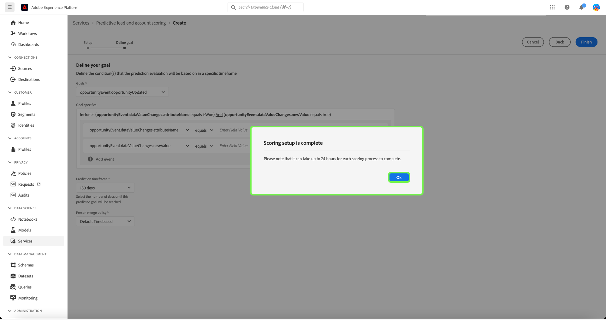

# Hantera prediktiv lead- och kontobedömning i Adobe Real-time Customer Data Platform, B2B Edition

>[!NOTE]
>
>Endast användare med behörigheten Hantera B2B AI kan skapa, ändra och ta bort poängmål.

I den här självstudiekursen får du hjälp med att hantera poängmål för den prediktiva lead- och kontopoängstjänsten. Poängmålen kan vara antingen för personprofilen eller kontoprofilen

## Skapa ett nytt musikspår

Om du vill skapa en ny poäng väljer du **[!UICONTROL Services]** i sidlisten och välj **[!UICONTROL Create score]**.

The **[!UICONTROL Basic information]** visas. Du uppmanas att välja en profiltyp, ange ett namn och en valfri beskrivning. När du är klar väljer du **[!UICONTROL Next]**.

The **[!UICONTROL Define your goal]** visas. Välj listrutepilen och välj sedan en måltyp i listrutan som visas.

The **[!UICONTROL Goal specifics]** öppnas. Markera listrutepilen och välj sedan målfältets namn i listrutan som visas.

The **[!UICONTROL Goal conditions]** markeringen visas. Markera listrutepilen och välj sedan ett villkor i listrutan som visas.

The **[!UICONTROL Goal value]** visas. Konfigurera sedan [!UICONTROL Goal specifics]. Välj [!UICONTROL Enter Field Value] och ange målvärde.

>[!NOTE]
>
>Det går att lägga till flera målvärden.

Om du vill lägga till fler fält väljer du **[!UICONTROL Add field]**.

Om du vill konfigurera tidsramen för förutsägelse väljer du listrutepilen och väljer sedan önskad tidsram.

Den valda sammanfogningsprincipen avgör hur fältvärdena för en personprofil väljs. Använd listrutepilen och välj önskad kopplingsprofil och välj sedan **[!UICONTROL Finish]**.

The **[!UICONTROL Scoring setup is complete]** visas som bekräftar att det nya poängtalet har skapats. Välj **[!UICONTROL OK]**.

>[!NOTE]
>
>Det kan ta upp till 24 timmar för varje poängprocess att slutföra.

Du kommer tillbaka till **[!UICONTROL Services]** -fliken där du kan se det nya resultatet som har skapats i listan med bakgrundsmusik.

Välj bakgrundsmusik om du vill visa information och ytterligare information om den senaste körningen.

Mer detaljerad information om felkoder som kan visas under den senaste körningen finns i avsnittet om [leads AI pipeline-felkoder](#leads-ai-pipeline-error-codes) i det här dokumentet.

## Redigera ett musikspår

Om du vill redigera ett musikspår väljer du ett musikspår i **[!UICONTROL Services]** och markera **[!UICONTROL Edit]** från panelen med ytterligare information till höger på skärmen.

The **[!UICONTROL Edit instance]** visas där du kan redigera beskrivningen för poängen. Gör ändringarna och markera **[!UICONTROL Save]**.

>[!NOTE]
>
>Det går inte att ändra poängkonfigurationen eftersom detta kommer att utlösa omskolning och ompoängtering av modellen. Det motsvarar att ta bort poängen och skapa en ny poäng. Om du vill redigera poängkonfigurationen måste du klona poängen eller skapa en ny poäng.

Du kommer tillbaka till **[!UICONTROL Services]** -fliken. Välj bakgrundsmusik om du vill visa den uppdaterade beskrivningsinformationen på panelen med ytterligare information till höger på skärmen.

## Klona en poäng

Om du vill klona ett musikspår väljer du ett musikspår i **[!UICONTROL Services]** och markera **[!UICONTROL Clone]** från panelen med ytterligare information till höger på skärmen.

The **[!UICONTROL Basic information]** visas. Profiltypen, namnet och beskrivningen klonas från det ursprungliga resultatet. Ändra informationen och välj **[!UICONTROL Next]**.

The **[!UICONTROL Define your goal]** visas. Slutför målavsnittet på samma sätt som när du skapar ett nytt poängvärde och väljer **[!UICONTROL Finish]**.

Du kommer tillbaka till **[!UICONTROL Services]** där du kan se det nya klonade poängen i listan.

>[!NOTE]
>
>The **[!UICONTROL Define your goal]** -avsnittet klonas inte från det ursprungliga poängtalet.

## Ta bort ett musikspår

Om du vill ta bort ett musikspår väljer du ett musikspår i **[!UICONTROL Services]** och markera **[!UICONTROL Delete]** från panelen med ytterligare information till höger på skärmen.

The **[!UICONTROL Delete documentation]** bekräftelsedialogrutan visas. Välj **[!UICONTROL Delete]**.

>[!NOTE]
>
>Om du tar bort poängdefinitionen tas även alla prediktiva poäng i personprofilen eller kontoprofilen bort, men inte fältgruppen som skapats för poängdefinitionen. Fältgruppen lämnas &quot;överbliven&quot; i datamodellen.

Du kommer tillbaka till **[!UICONTROL Services]** där du inte längre kan se poängen i listan.

## Leads-AI-pipeline-felkoder

| Felkod | Felmeddelande |
| --- | --- |
| 401 | FEL 401. Leads-AI-pipeline har stoppats: det finns inte tillräckligt med giltiga konton för kontopoängsättningen. Antal konton: {}. |
| 402 | FEL 402. Leads-AI-pipeline har stoppats: det finns inte tillräckligt med giltiga kontakter för att göra en kontaktbedömning. Antal kontakter: {}. |
| 403 | FEL 403. Leads-AI-pipeline har stoppats: inte tillräckligt med aktivitetsvolym för modellutbildning. Antal händelser: {}. |
| 404 | FEL 404. Leads-AI-pipeline har stoppats: inte tillräckligt många konverteringar för modellutbildning. Antal konverteringar: {}. |
| 405 | FEL 405. Leads-AI-pipeline har stoppats: för låg aktivitet för giltig modellutbildning. Only {} percent of accounts has activity. |
| 406 | FEL 406. Leads-AI-pipeline har stoppats: för låg aktivitet för giltig modellutbildning. Only {} percent of contacts has activity. |
| 407 | FEL 407. Leads-AI-pipeline har stoppats: typer av bedömningsdataaktiviteter matchar inte utbildningsdata. |
| 408 | FEL 408. Leads-AI-pipeline har stoppats: Felfrekvensen är för hög för aktivitetsfunktioner. Frekvens saknas: {}. |
| 409 | FEL 409. Leads-AI-pipeline har stoppats: för lågt test auc. Testa auc: {}. |
| 410 | FEL 410. Leads-AI-pipeline har stoppats: test auc är för lågt efter parameterjustering. Testa auc: {}. |
| 411 | FEL 411. Leads-AI-pipeline har stoppats: Utbildningsdata har inte tillräckligt många konverteringar för att skapa en tillförlitlig modell. Konverteringar: {}. |
| 412 | FEL 412. Leads-AI-pipeline har stoppats: testdata har ingen konvertering för att beräkna AUC-ROC. |

| Varnings-/infokod | Meddelande |
| --- | --- |
| 100 | INFORMATION 100. Leads AI-kvalitetskontroll: Antal konton: {}. |
| 101 | INFORMATION 101. Leads AI-kvalitetskontroll: antalet kontakter är: {}. |
| 102 | INFORMATION 102. Leads AI-kvalitetskontroll: antalet möjligheter är: {}. |
| 103 | INFORMATION 103. Leads AI-kvalitetskontroll: testningen av auc är låg. Starta parameterjustering. Testljud: {}. |
| 200 | VARNING 200. Leads AI-kvalitetskontroll: frekvensen av saknade firmografiska funktioner är: {}. |
| 201 | VARNING 201. Leads AI-kvalitetskontroll: aktivitetsfunktionerna saknas: {}. |

## Nästa steg

Genom att följa den här självstudiekursen kan du nu skapa och hantera bakgrundsmusik. Mer information finns i följande dokument:

* [Prediktiv lead- och kontobedömning](/help/rtcdp/b2b-ai-ml-services/predictive-lead-and-account-scoring.md)
* [Övervaka prediktiva lead- och kontopoängjobb](/help/dataflows/ui/b2b/monitor-profile-enrichment.md)
