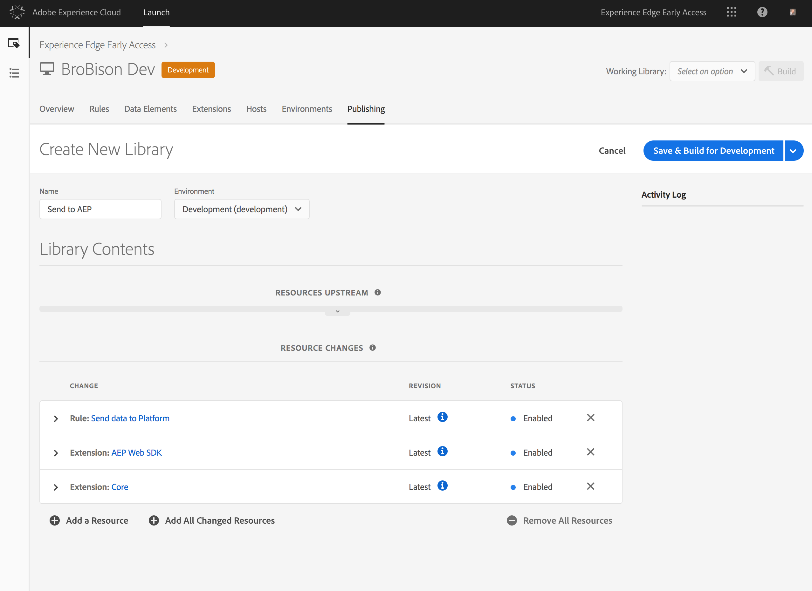
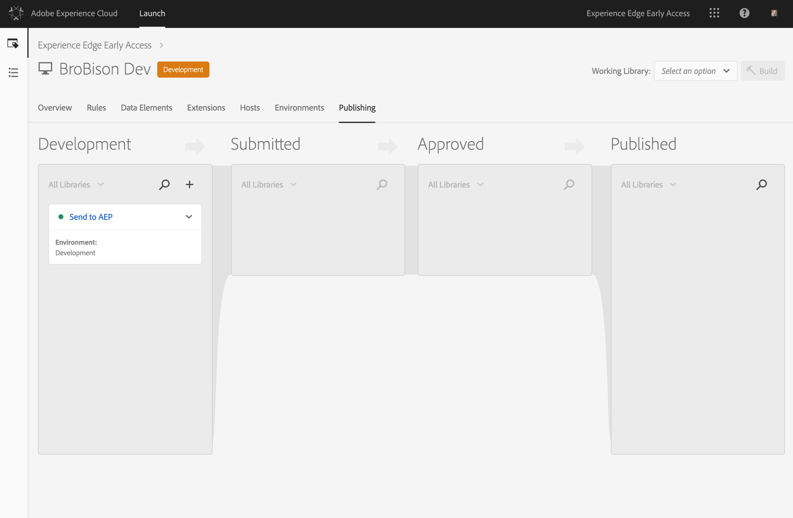

# Självstudiekurs: Implementera webbplatstaggar med Adobe Launch

I den här självstudiekursen beskrivs hur du implementerar webbplatstaggar för att skicka data till Adobe Experience Platform med Adobe Launch.

## Förutsättningar

* Det nödvändiga schemat och den nödvändiga datauppsättningen skapas i Platform.
* Den nödvändiga konfigurationen har distribuerats i Experience Edge och har det matchande konfigurations-ID:t och Edge-domänen.
* Företagets CMS har redan konfigurerats för att leverera ett JavaScript-objekt på varje sida med de data du behöver skicka till plattformen.

## Steg

Den här självstudiekursen innehåller följande steg:

1. Installera Adobe Experience Platform Web SDK-tillägget.
1. Skapa en regel som talar om för Launch vilka data som ska skickas.
1. Paketera tillägget och regeln i ett bibliotek.

## Installera Adobe Experience Platform Web SDK-tillägget

Installera först Adobe Experience Platform Web SDK-tillägget.

1. Öppna fliken **[!UICONTROL Extensions]** i Launch.

   

1. Välj Adobe Experience Platform Web SDK-tillägget i Launch Extension CatalogKonfigurationsskärmen öppnas.

   

   Mer information finns i [Tillägg](https://docs.adobe.com/content/help/en/launch/using/reference/manage-resources/extensions/overview.html) i Launch-dokumentationen.

1. Konfigurera tillägget.

   De enda inställningar du behöver just nu är:

   * **Konfigurations-ID:** Ange det konfigurations-ID som du fick från din Adobe-representant.
   * **Edge Domain:** Ange den edge-domän du har fått från din Adobe-representant.

1. Klicka **[!UICONTROL Save]** och fortsätt till nästa steg.

## Skapa en regel som talar om för Launch vilka data som ska skickas

Skapa sedan en regel som meddelar Launch vilka data du vill skicka till Adobe Experience Platform och när du vill skicka dem.

1. Konfigurera under fliken **[!UICONTROL Rules]** en händelse som ska utlösas på varje ny sida på webbplatsen när Launch-biblioteket läses in.

   

1. Lägg till en åtgärd.

   Om du vill konfigurera åtgärden anger du var datalagret ska hittas. Datalagret är ett JavaScript-objekt som finns på sidan och som levereras från samma CMS-system som återger webbsidan. Ange JavaScript-sökvägen till dataobjektet.

   

   Det dataobjekt som du skickar måste vara en giltig XDM som kan valideras mot schemat som används av datauppsättningen som är ansluten till ditt konfigurations-ID.

1. Klicka på **[!UICONTROL Keep Changes]**.

Mer information finns i [Regler](https://docs.adobe.com/content/help/en/launch/using/reference/manage-resources/rules.html) i Launch-dokumentationen.

## Paketera tillägget och regeln i ett bibliotek

Därefter [paketerar du tillägget](https://docs.adobe.com/content/help/en/launch/using/reference/publish/overview.html) och den nya regeln tillsammans i ett bibliotek och testar ändringarna i en utvecklingsmiljö.

När du är klar med testningen ska du befordra biblioteket genom arbetsflödet så att det kan distribueras till produktionsplatsen. Data flödar nu från varje enskild användare till Adobe Experience Platform.

Mer information finns i [Bibliotek](https://docs.adobe.com/content/help/en/launch/using/reference/publish/libraries.html) i Launch-dokumentationen.