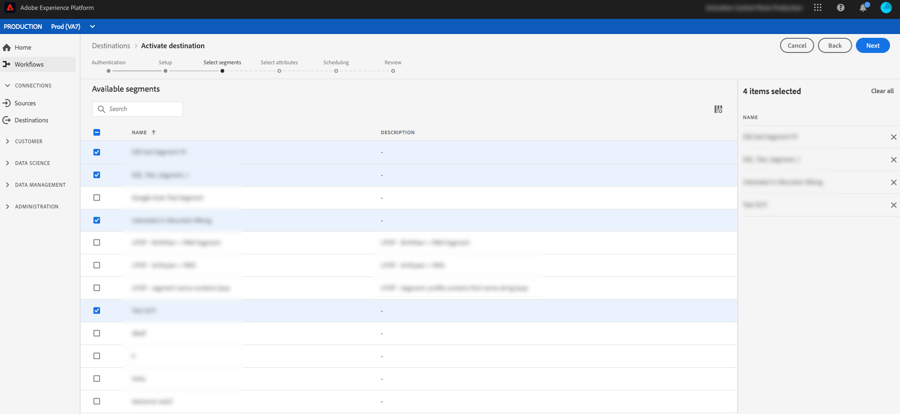
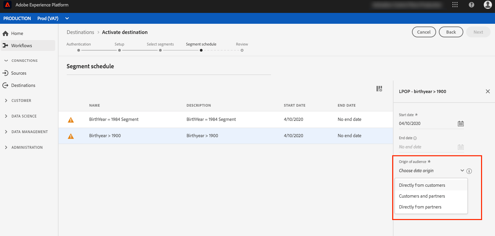
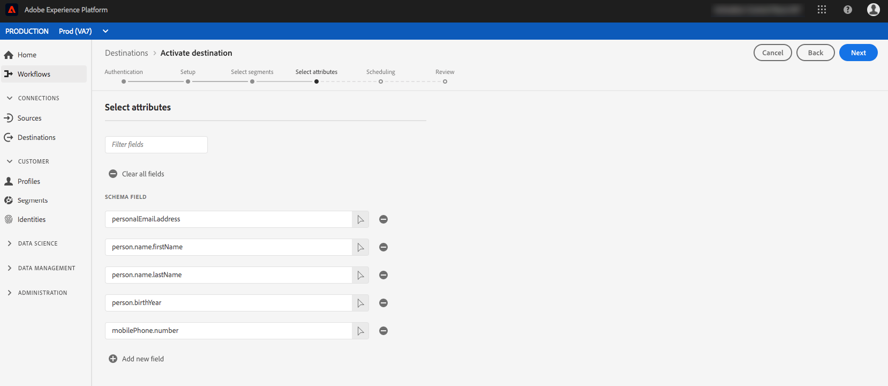

# Aktivera profiler och segment till ett mål

Aktivera data i kunddataplattformen i Adobe i realtid genom att mappa segment till mål. Följ stegen nedan för att uppnå detta.

## Förutsättningar {#prerequisites}

Om du vill aktivera data till mål måste du ha [anslutit ett mål](/help/rtcdp/destinations/connect-destination.md). Om du inte redan har gjort det går du till [målkatalogen](/help/rtcdp/destinations/destinations-catalog.md), bläddrar bland de mål som stöds och ställer in ett eller flera mål.

## Aktivera data {#activate-data}

Stegen i aktiveringsarbetsflödet varierar något mellan måltyperna. Det fullständiga arbetsflödet för alla måltyper beskrivs nedan.

### Välj vilket mål som data ska aktiveras till {#select-destination}

Gäller för: Alla destinationer

1. Navigera till **[!UICONTROL Destinations]** > **[!UICONTROL Browse]**i CDP-användargränssnittet i realtid i Adobe och välj det mål där du vill aktivera dina segment.
   
2. Klicka på målets namn. Detta tar dig till aktiveringsarbetsflödet.
   Observera att om det redan finns ett aktiveringsarbetsflöde för ett mål kan du se de segment som för närvarande aktiveras för målet. Välj **[!UICONTROL Edit activation]** i den högra listen och följ stegen nedan för att ändra aktiveringsinformationen.
3. Välj **[!UICONTROL Activate]**.

<br> 

### **[!UICONTROL Select Segments]** steg {#select-segments}

Gäller för: Alla destinationer


Markera ett eller flera segment som ska aktiveras för målet på **[!UICONTROL Activate destination]** **[!UICONTROL Select Segments]** sidan i arbetsflödet. Tryck på **[!UICONTROL Next]** för att gå vidare till nästa steg.


<br> 

### **[!UICONTROL Identity mapping]** steg {#identity-mapping}

Gäller för: sociala mål och Google Customer Match-annonsmål


För *sociala mål* kan du i **[!UICONTROL Identity mapping]** steget välja källattribut att mappa som målidentiteter i målet. Det här steget är valfritt eller obligatoriskt, beroende på vilken primär identitet du använder i schemat. <br> 

*E-postadress som primär identitet*: Om du använder e-postadress som primär identitet i ditt schema kan du hoppa över steget Identitetsmappning, vilket visas nedan:


<br> 

*Ett annat ID som primär identitet*: Om du använder ett annat ID, till exempel *Rewards ID* eller *Loyalty ID*, som primär identitet i ditt schema, måste du manuellt mappa e-postadressen från ditt identitetsschema som en målidentitet i det sociala målet, vilket visas nedan:


Välj `Email_LC_SHA256` som målidentitet om du har hashas i kundens e-postadresser när data hämtas till Adobe Experience Platform, enligt [!DNL Facebook] e- [posthashkraven](/help/rtcdp/destinations/facebook-destination.md#email-hashing-requirements). <br> Välj `Email` som målidentitet om e-postadresserna du använder inte är hashas. Adobe CDP i realtid hash-kodar e-postadresserna så att de uppfyller [!DNL Facebook] kraven.


<br> 

### **[!UICONTROL Configure]** steg {#configure}

Gäller för: Destinationer för e-postmarknadsföring och molnlagring


Det här steget är valfritt. I **[!UICONTROL Configure]** steget kan du konfigurera filnamnen för varje segment som du exporterar. Standardfilnamnen består av målnamn, segment-ID och datum- och tidsindikator. Du kan till exempel redigera de exporterade filnamnen för att skilja mellan olika kampanjer eller för att lägga till tiden för dataexport till filerna.

Välj **[!UICONTROL Next]** att använda standardfilnamnen eller klicka på pennikonen för att öppna ett modalt fönster och redigera filnamnen. Observera att filnamn är begränsade till 255 tecken.


I filnamnsredigeraren kan du välja olika komponenter att lägga till i filnamnet. Målnamnet och segment-ID kan inte tas bort från filnamn. Utöver dessa kan du lägga till följande:

* **[!UICONTROL Segment name]**: Du kan lägga till segmentnamnet till filnamnet.
* **[!UICONTROL Date and time]**: Välj mellan att lägga till ett `MMDDYYYY_HHMMSS` format eller en Unix 10-siffrig tidsstämpel för den tidpunkt då filerna genereras. Välj ett av dessa alternativ om du vill att ett dynamiskt filnamn ska skapas för varje stegvis export.
* **[!UICONTROL Custom text]**: Lägg till egen text i filnamnen.

Select **[!UICONTROL Apply changes]** to confirm your selection.

>[!IMPORTANT]
> 
>Om du inte markerar **[!UICONTROL Date and Time]** komponenten kommer filnamnen att vara statiska och den nya exporterade filen kommer att skriva över den tidigare filen på lagringsplatsen vid varje export. Detta är det rekommenderade alternativet när du kör ett återkommande importjobb från en lagringsplats till en e-postmarknadsföringsplattform.


<br> 

### **[!UICONTROL Segment Schedule]** steg {#segment-schedule}

Gäller för: reklamdestinationer, sociala destinationer


På **[!UICONTROL Segment schedule]** sidan kan du ange startdatum för att skicka data till målet samt hur ofta data ska skickas till målet.

>[!IMPORTANT]
>
>För sociala mål måste du välja målgruppens ursprung i det här steget. Du kan bara fortsätta till nästa steg efter att du har valt något av alternativen i bilden nedan.



<br> 

### **[!UICONTROL Scheduling]** steg {#scheduling}

Gäller för: mål för e-postmarknadsföring och molnlagring


På **[!UICONTROL Scheduling]** sidan kan du se startdatumet för att skicka data till målet samt hur ofta data skickas till målet. Dessa värden kan inte redigeras.

<br> 

### **[!UICONTROL Select attributes]** steg {#select-attributes}

Gäller för: mål för e-postmarknadsföring och molnlagring


På **[!UICONTROL Select Attributes]** sidan markerar du **[!UICONTROL Add new field]** och väljer de attribut som du vill skicka till målet.

>[!NOTE]
>
> CDP i realtid i Adobe fyller markeringen med fyra rekommenderade attribut från schemat: `person.name.firstName`, `person.name.lastName`, `personalEmail.address`, `segmentMembership.status`.

Filexporten varierar enligt följande beroende på om `segmentMembership.status` är markerat:
* Om `segmentMembership.status` fältet är markerat innehåller exporterade filer **aktiva** medlemmar i den första fullständiga ögonblicksbilden samt **aktiva** och **utgångna** medlemmar i efterföljande stegvisa exporter.
* Om `segmentMembership.status` fältet inte är markerat innehåller exporterade filer endast **aktiva** medlemmar i den ursprungliga fullständiga ögonblicksbilden och i efterföljande stegvisa exporter.


Vi rekommenderar att ett av attributen är en [unik identifierare](/help/rtcdp/destinations/email-marketing-destinations.md#identity) från ditt schema. Mer information om obligatoriska attribut finns i Identitet i artikeln [E-postmarknadsföringsmål](/help/rtcdp/destinations/email-marketing-destinations.md#identity) .

>[!NOTE]
> 
>Om några dataanvändningsetiketter har tillämpats på vissa fält i en datauppsättning (i stället för på hela datauppsättningen), tillämpas dessa fältetiketter vid aktiveringen på följande villkor:
>* Fälten används i segmentdefinitionen.
>* Fälten konfigureras som projicerade attribut för målmålet.

>
> 
Titta på skärmbilden nedan. Om fältet till exempel `person.name.firstName` hade vissa etiketter för dataanvändning som strider mot målets användningsfall för marknadsföring, skulle du se en överträdelse av dataanvändningsprincipen i granskningssteget (steg 9). Mer information finns i [Datastyrning i CDP](/help/rtcdp/privacy/data-governance-overview.md#destinations)i realtid.



<br> 

### **[!UICONTROL Review]** steg {#review}

Gäller för: alla destinationer


På **[!UICONTROL Review]** sidan visas en sammanfattning av markeringen. Välj **[!UICONTROL Cancel]** om du vill dela upp flödet, **[!UICONTROL Back]** om du vill ändra inställningarna eller **[!UICONTROL Finish]** om du vill bekräfta urvalet och börja skicka data till målet.

>[!IMPORTANT]
>
>I det här steget söker CDP i realtid efter brott mot dataanvändningspolicyn. Nedan visas ett exempel där en princip överträds. Du kan inte slutföra arbetsflödet för segmentaktivering förrän du har löst konflikten. Mer information om hur du löser policyöverträdelser finns i [Politiska åtgärder](/help/rtcdp/privacy/data-governance-overview.md#enforcement) i dokumentationsavsnittet för datastyrning.


Om inga principöverträdelser har identifierats markerar du **[!UICONTROL Finish]** för att bekräfta ditt val och börja skicka data till målet.


## Redigera aktivering {#edit-activation}

Följ stegen nedan för att redigera befintliga aktiveringsflöden i realtid med CDP:

1. Markera **[!UICONTROL Destinations]** i det vänstra navigeringsfältet, klicka på **[!UICONTROL Browse]** fliken och klicka på målnamnet.
2. Välj **[!UICONTROL Edit activation]** i den högra listen för att ändra vilka segment som ska skickas till målet.

## Verifiera att segmentaktiveringen lyckades {#verify-activation}

### Destinationer för e-postmarknadsföring och molnlagring {#esp-and-cloud-storage}

För e-postmarknadsföringsmål och molnlagringsmål skapar Adobe Real-time CDP en tabbavgränsad `.csv` eller `.txt` fil på den lagringsplats som du angav. Förvänta dig att en ny fil ska skapas på din lagringsplats varje dag. Standardfilformatet är:
`<destinationName>_segment<segmentID>_<timestamp-yyyymmddhhmmss>.csv|txt`

Observera att du kan redigera filformatet. Mer information finns i [Konfigurera](/help/rtcdp/destinations/activate-destinations.md#configure) -steget för molnlagringsmål och e-postmarknadsföringsmål.

Med standardfilformatet kan de filer du får tre dagar i följd se ut så här:

```console
Salesforce_Marketing_Cloud_segment12341e18-abcd-49c2-836d-123c88e76c39_20200408061804.csv
Salesforce_Marketing_Cloud_segment12341e18-abcd-49c2-836d-123c88e76c39_20200409052200.csv
Salesforce_Marketing_Cloud_segment12341e18-abcd-49c2-836d-123c88e76c39_20200410061130.csv
```

De här filerna finns på lagringsplatsen och du har fått en bekräftelse på att aktiveringen har slutförts. Om du vill veta hur de exporterade filerna är strukturerade kan du [hämta en CSV-exempelfil](assets/sample_export_file_segment12341e18-abcd-49c2-836d-123c88e76c39_20200408061804.csv). Den här exempelfilen innehåller profilattributen `person.firstname`, `person.lastname`, `person.gender`, `person.birthyear`och `personalEmail.address`.

### Annonsmål

Kontrollera ditt konto på respektive annonsmål att du aktiverar dina data. Om aktiveringen lyckades, fylls målgrupperna i er annonsplattform.

### Målgrupper i sociala nätverk

En lyckad aktivering [!DNL Facebook]innebär att en [!DNL Facebook] anpassad målgrupp skapas i [[!UICONTROL Facebook Ads Manager]](https://www.facebook.com/adsmanager/manage/). Segmentmedlemskap i målgruppen skulle läggas till och tas bort eftersom användarna är kvalificerade eller diskvalificerade för de aktiverade segmenten.

>[!TIP]
>
>Integrationen mellan CDP i realtid i Adobe och [!DNL Facebook] stöder historiska efterfyllningar. Alla historiska segmentkvalifikationer skickas till [!DNL Facebook] när du aktiverar segmenten till målet.

## Inaktivera aktivering {#disable-activation}

Följ stegen nedan för att inaktivera ett befintligt aktiveringsflöde:

1. Markera **[!UICONTROL Destinations]** i det vänstra navigeringsfältet, klicka på **[!UICONTROL Browse]** fliken och klicka på målnamnet.
2. Klicka på **[!UICONTROL Enabled]** kontrollen till höger för att ändra aktiveringsflödets status.
3. I fönstret **Uppdatera dataflöde** väljer du **Bekräfta** för att inaktivera aktiveringsflödet.
