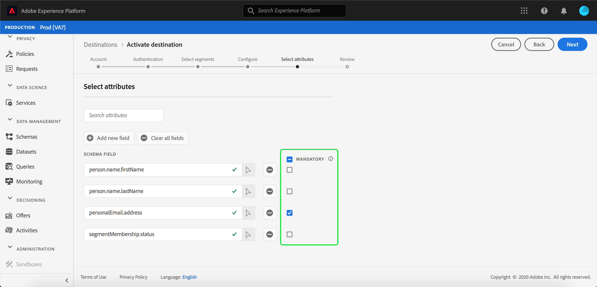

# Aktivera profiler och segment till ett mål

Aktivera data i kunddataplattformen i realtid genom att mappa segment till mål. Följ stegen nedan för att uppnå detta.

## Förutsättningar {#prerequisites}

Om du vill aktivera data till mål måste du ha [anslutit ett mål](/help/rtcdp/destinations/connect-destination.md). Om du inte redan har gjort det går du till [målkatalogen](/help/rtcdp/destinations/destinations-catalog.md), bläddrar bland de mål som stöds och ställer in ett eller flera mål.

## Aktivera data {#activate-data}

Stegen i aktiveringsarbetsflödet varierar något mellan måltyperna. Det fullständiga arbetsflödet för alla måltyper beskrivs nedan.

### Välj vilket mål som data ska aktiveras till {#select-destination}

Gäller för: Alla destinationer

Navigera till **[!UICONTROL Destinations]** > **[!UICONTROL Browse]**i CDP-användargränssnittet i realtid och välj den destination där du vill aktivera segmenten.


Välj namnet på målet för att navigera till aktiveringsarbetsflödet.


Observera att om det redan finns ett aktiveringsarbetsflöde för ett mål, kan du se vilka segment som för närvarande aktiveras för målet. Välj **[!UICONTROL Edit activation]** i den högra listen och följ stegen nedan för att ändra aktiveringsinformationen.

När du har valt ett mål väljer du **[!UICONTROL Activate]**.

### [!UICONTROL Select Segments] steg {#select-segments}

Gäller för: Alla destinationer


Markera ett eller flera segment som ska aktiveras för målet på **[!UICONTROL Activate destination]** **[!UICONTROL Select Segments]** sidan i arbetsflödet. Välj **[!UICONTROL Next]** att fortsätta till nästa steg.


### [!UICONTROL Identity mapping] steg {#identity-mapping}

Gäller för: sociala mål och Google Customer Match-annonsmål


För sociala mål kan du välja källattribut att mappa som målidentiteter i målet. Det här steget är valfritt eller obligatoriskt, beroende på vilken primär identitet du använder i schemat.

Om du använder e-postadress som primär identitet i ditt schema kan du hoppa över steget Identitetsmappning, vilket visas nedan:


Om du använder ett annat ID, t.ex. &quot;Rewards ID&quot; eller &quot;Loyalty ID&quot;, som primär identitet i ditt schema, måste du manuellt mappa e-postadressen från ditt identitetsschema som en målidentitet i det sociala målet, vilket visas nedan:


Välj `Email_LC_SHA256` som målidentitet om du har hashas i kundens e-postadresser när data hämtas till Adobe Experience Platform, enligt [!DNL Facebook] e- [posthashkraven](/help/rtcdp/destinations/facebook-destination.md#email-hashing-requirements).

Välj `Email` som målidentitet om e-postadresserna du använder inte är hashas. CDP-koden i realtid hash-kodar e-postadresserna så att de uppfyller [!DNL Facebook] kraven.


### **[!UICONTROL Configure]** steg {#configure}

Gäller för: Destinationer för e-postmarknadsföring och molnlagring


I **[!UICONTROL Configure]** steget kan du konfigurera schemat och filnamnen för varje segment som du exporterar. Det är obligatoriskt att konfigurera schemat, men det är valfritt att konfigurera filnamnet.

Om du vill lägga till ett schema för segmentet väljer du **[!UICONTROL Create schedule]**.


En pover visas med alternativ för att skapa segmentschemat.

- **Filexport**: Du kan antingen exportera hela eller inkrementella filer. När du exporterar en fullständig fil publiceras en fullständig ögonblicksbild av alla profiler som är kvalificerade för det segmentet. När du exporterar en inkrementell fil publiceras det delta i profiler som är kvalificerade för det segmentet sedan den senaste exporten.
- **Frekvens**: Om du **[!UICONTROL Export full files]** väljer det här alternativet kan du exportera **[!UICONTROL Once]** eller **[!UICONTROL Daily]**. Om **[!UICONTROL Export incremental files]** alternativet är markerat kan du bara exportera **[!UICONTROL Daily]**. När du exporterar en fil **[!UICONTROL Once]** exporteras den en gång. Vid export av en fil **[!UICONTROL Daily]** exporteras filen varje dag från startdatumet till slutdatumet kl. 12:00 UTC (7:00 PM EST) om fullständiga filer har valts och kl. 12:00 UTC (7:00 AM EST) om inkrementella filer har valts.
- **Datum**: Om du **[!UICONTROL Once]** väljer det här alternativet kan du välja datumet för engångsexporten. Om du **[!UICONTROL Daily]** väljer det här alternativet kan du välja start- och slutdatum för exporten.


Standardfilnamnen består av målnamn, segment-ID och datum- och tidsindikator. Du kan till exempel redigera de exporterade filnamnen för att skilja mellan olika kampanjer eller för att lägga till tiden för dataexport till filerna.

Välj pennikonen för att öppna ett modalt fönster och redigera filnamnen. Observera att filnamn är begränsade till 255 tecken.


I filnamnsredigeraren kan du välja olika komponenter att lägga till i filnamnet. Målnamnet och segment-ID kan inte tas bort från filnamn. Utöver dessa kan du lägga till följande:

- **[!UICONTROL Segment name]**: Du kan lägga till segmentnamnet till filnamnet.
- **[!UICONTROL Date and time]**: Välj mellan att lägga till ett `MMDDYYYY_HHMMSS` format eller en Unix 10-siffrig tidsstämpel för den tidpunkt då filerna genereras. Välj ett av dessa alternativ om du vill att ett dynamiskt filnamn ska skapas för varje stegvis export.
- **[!UICONTROL Custom text]**: Lägg till egen text i filnamnen.

Select **[!UICONTROL Apply changes]** to confirm your selection.

>[!IMPORTANT]
> 
>Om du inte markerar **[!UICONTROL Date and Time]** komponenten kommer filnamnen att vara statiska och den nya exporterade filen kommer att skriva över den tidigare filen på lagringsplatsen vid varje export. Detta är det rekommenderade alternativet när du kör ett återkommande importjobb från en lagringsplats till en e-postmarknadsföringsplattform.


När du är klar med konfigurationen av alla segment väljer du **[!UICONTROL Next]** att fortsätta.

### **[!UICONTROL Segment schedule]** steg {#segment-schedule}

Gäller för: reklamdestinationer, sociala destinationer


På **[!UICONTROL Segment schedule]** sidan kan du ange startdatum för att skicka data till målet samt hur ofta data ska skickas till målet.

>[!IMPORTANT]
>
>För sociala mål måste du välja målgruppens ursprung i det här steget. Du kan bara fortsätta till nästa steg efter att du har valt något av alternativen i bilden nedan.


### **[!UICONTROL Scheduling]** steg {#scheduling}

Gäller för: mål för e-postmarknadsföring och molnlagring


På **[!UICONTROL Scheduling]** sidan kan du se startdatumet för att skicka data till målet samt hur ofta data skickas till målet. Dessa värden kan inte redigeras.

### **[!UICONTROL Select attributes]** steg {#select-attributes}

Gäller för: mål för e-postmarknadsföring och molnlagring


På **[!UICONTROL Select attributes]** sidan markerar du **[!UICONTROL Add new field]** och väljer de attribut som du vill skicka till målet.

>[!NOTE]
>
> CDP fyller markeringen i realtid med fyra rekommenderade attribut från schemat: `person.name.firstName`, `person.name.lastName`, `personalEmail.address`, `segmentMembership.status`.

Filexporter varierar på följande sätt, beroende på om `segmentMembership.status` är markerat:
- Om `segmentMembership.status` fältet är markerat innehåller de exporterade filerna **[!UICONTROL Active]** medlemmar i den första fullständiga ögonblicksbilden och **[!UICONTROL Active]** medlemmar i den efterföljande stegvisa **[!UICONTROL Expired]** exporten.
- Om `segmentMembership.status` fältet inte är markerat innehåller exporterade filer endast **[!UICONTROL Active]** medlemmar i den första fullständiga ögonblicksbilden och i efterföljande stegvisa exporter.



Dessutom kan du markera olika attribut som obligatoriska. Om du markerar ett attribut som obligatoriskt innebär det att det exporterade segmentet måste innehålla det attributet. Det innebär att den kan användas som en extra form av filtrering. Det är **inte** nödvändigt att markera ett attribut som obligatoriskt.

Vi rekommenderar att ett av attributen är en [unik identifierare](/help/rtcdp/destinations/email-marketing-destinations.md#identity) från ditt schema. Mer information om obligatoriska attribut finns i avsnittet om identitet i dokumentationen för [e-postmarknadsföringsmål](/help/rtcdp/destinations/email-marketing-destinations.md#identity) .

>[!NOTE]
> 
>Om några dataanvändningsetiketter har tillämpats på vissa fält i en datauppsättning (i stället för på hela datauppsättningen), tillämpas dessa fältetiketter vid aktiveringen på följande villkor:
>- Fälten används i segmentdefinitionen.
>- Fälten konfigureras som projicerade attribut för målmålet.

>
> 
Om fältet till exempel `person.name.firstName` har vissa etiketter för dataanvändning som är i konflikt med målets användningsfall för marknadsföring, visas en överträdelse av dataanvändningsprincipen i granskningssteget. Mer information finns i [Datastyrning i CDP](/help/rtcdp/privacy/data-governance-overview.md#destinations)i realtid.

### **[!UICONTROL Review]** steg {#review}

Gäller för: alla destinationer


På **[!UICONTROL Review]** sidan visas en sammanfattning av markeringen. Välj **[!UICONTROL Cancel]** om du vill dela upp flödet, **[!UICONTROL Back]** om du vill ändra inställningarna eller **[!UICONTROL Finish]** om du vill bekräfta urvalet och börja skicka data till målet.

>[!IMPORTANT]
>
>I det här steget söker CDP i realtid efter brott mot dataanvändningspolicyn. Nedan visas ett exempel där en princip överträds. Du kan inte slutföra arbetsflödet för segmentaktivering förrän du har löst konflikten. Mer information om hur du löser policyöverträdelser finns i [Politiska åtgärder](/help/rtcdp/privacy/data-governance-overview.md#enforcement) i dokumentationsavsnittet för datastyrning.


Om inga principöverträdelser har identifierats markerar du **[!UICONTROL Finish]** för att bekräfta ditt val och börja skicka data till målet.


## Redigera aktivering {#edit-activation}

Följ stegen nedan för att redigera befintliga aktiveringsflöden i realtid med CDP:

1. Markera **[!UICONTROL Destinations]** i det vänstra navigeringsfältet, klicka på **[!UICONTROL Browse]** fliken och klicka på målnamnet.
2. Välj **[!UICONTROL Edit activation]** i den högra listen för att ändra vilka segment som ska skickas till målet.

## Verifiera att segmentaktiveringen lyckades {#verify-activation}

### Destinationer för e-postmarknadsföring och molnlagring {#esp-and-cloud-storage}

För e-postmarknadsföringsmål och molnlagringsmål skapar CDP i realtid en tabbavgränsad fil `.csv` eller `.txt` fil på den lagringsplats som du angav. Förvänta dig att en ny fil ska skapas på din lagringsplats varje dag. Standardfilformatet är:
`<destinationName>_segment<segmentID>_<timestamp-yyyymmddhhmmss>.csv|txt`

Observera att du kan redigera filformatet. Mer information finns i [Konfigurera](/help/rtcdp/destinations/activate-destinations.md#configure) -steget för molnlagringsmål och e-postmarknadsföringsmål.

Med standardfilformatet kan de filer du får tre dagar i följd se ut så här:

```console
Salesforce_Marketing_Cloud_segment12341e18-abcd-49c2-836d-123c88e76c39_20200408061804.csv
Salesforce_Marketing_Cloud_segment12341e18-abcd-49c2-836d-123c88e76c39_20200409052200.csv
Salesforce_Marketing_Cloud_segment12341e18-abcd-49c2-836d-123c88e76c39_20200410061130.csv
```

De här filerna finns på lagringsplatsen och du har fått en bekräftelse på att aktiveringen har slutförts. Om du vill veta hur de exporterade filerna är strukturerade kan du [hämta en CSV-exempelfil](assets/sample_export_file_segment12341e18-abcd-49c2-836d-123c88e76c39_20200408061804.csv). Den här exempelfilen innehåller profilattributen `person.firstname`, `person.lastname`, `person.gender`, `person.birthyear`och `personalEmail.address`.

### Annonsmål

Kontrollera ditt konto på respektive annonsmål att du aktiverar dina data. Om aktiveringen lyckades, fylls målgrupperna i er annonsplattform.

### Målgrupper i sociala nätverk

En lyckad aktivering [!DNL Facebook]innebär att en [!DNL Facebook] anpassad målgrupp skapas i [[!UICONTROL Facebook Ads Manager]](https://www.facebook.com/adsmanager/manage/). Segmentmedlemskap i målgruppen skulle läggas till och tas bort eftersom användarna är kvalificerade eller diskvalificerade för de aktiverade segmenten.

>[!TIP]
>
>Integrationen mellan CDP i realtid och [!DNL Facebook] stöder historiska efterfyllningar av målgrupper. Alla historiska segmentkvalifikationer skickas till [!DNL Facebook] när du aktiverar segmenten till målet.

## Inaktivera aktivering {#disable-activation}

Följ stegen nedan för att inaktivera ett befintligt aktiveringsflöde:

1. Markera **[!UICONTROL Destinations]** i det vänstra navigeringsfältet, klicka på **[!UICONTROL Browse]** fliken och klicka på målnamnet.
2. Klicka på **[!UICONTROL Enabled]** kontrollen till höger för att ändra aktiveringsflödets status.
3. I fönstret **Uppdatera dataflöde** väljer du **Bekräfta** för att inaktivera aktiveringsflödet.
