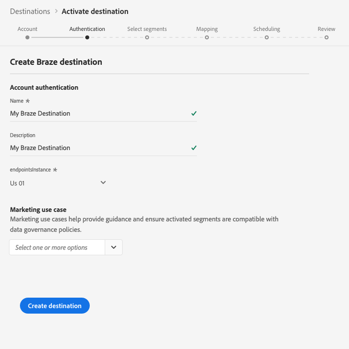
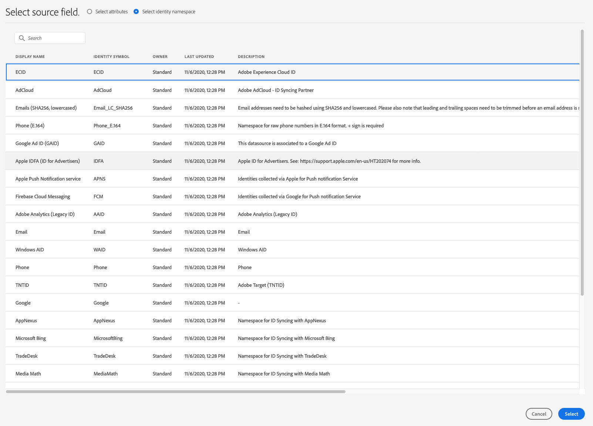

# (Beta) [!DNL Braze] -mål

>[!IMPORTANT]
>
>Braze-målet i Adobe Experience Platform är för närvarande i Beta. Dokumentationen och funktionaliteten kan komma att ändras.

## Översikt {#overview}

Målet hjälper dig att [!DNL Braze] skicka profildata till [!DNL Braze].

[!DNL Braze] är en heltäckande plattform för kundengagemang som driver relevanta och minnesvärda upplevelser mellan kunder och varumärken de älskar.

Om du vill skicka profildata till [!DNL Braze]måste du först ansluta till målet.

## Destinationsspecifikationer {#destination-specs}

Observera följande information som är specifik för [!DNL Braze] målet:

* Du kan skicka vilken [identitet](../../identity-service/namespaces.md) som helst till [!DNL Braze] målet, förutsatt att du mappar den till [!DNL Braze][`external_id`](https://www.braze.com/docs/api/basics/#external-user-id-explanation).
* [!DNL Adobe Experience Platform] segment exporteras till [!DNL Braze] under `AdobeExperiencePlatformSegments` attributet.

## Användningsfall {#use-cases}

Som marknadsförare vill jag rikta in mig på användare i ett mål för mobilengagemang, med inbyggda segment [!DNL Adobe Experience Platform]. Dessutom vill jag leverera personaliserade upplevelser till dem, baserat på attribut från deras [!DNL Adobe Experience Platform] profiler, så snart segment och profiler uppdateras i [!DNL Adobe Experience Platform].

## Exporttyp {#export-type}

**[!DNL Profile-based]** - du exporterar alla medlemmar i ett segment tillsammans med de önskade schemafälten (till exempel: e-postadress, telefonnummer, efternamn) och/eller identiteter enligt fältmappningen.
[!DNL Adobe Experience Platform] segment exporteras till [!DNL Braze] under `AdobeExperiencePlatformSegments` attributet.

## Anslut till mål {#connect-destination}

1. In **[!UICONTROL Connections]** > **[!UICONTROL Destinations]**, select [!DNL Braze], and select **[!UICONTROL Configure]**.

   

   >[!NOTE]
   >
   >Om det redan finns en anslutning till det här målet kan du se en **[!UICONTROL Activate]** knapp på målkortet. Mer information om skillnaden mellan **[!UICONTROL Activate]** och **[!UICONTROL Configure]** finns i avsnittet [Katalog](../destinations/destinations-workspace.md#catalog) i dokumentationen för målarbetsytan.
   >
   >

1. I [!UICONTROL Account] steget måste du ange din [!DNL Braze] kontotoken. Det här är din [!DNL Braze] [!DNL API] nyckel. Här finns detaljerade instruktioner om hur du får fram din [!DNL API] nyckel: [REST API Key Overview](https://www.braze.com/docs/api/api_key/). Ange token och klicka på **[!UICONTROL Connect to destination]**.

   

1. Klicka på **[!UICONTROL Next]**.

1. I [!UICONTROL Authentication] steget måste du ange [!DNL Braze] anslutningsinformationen:
   * **[!UICONTROL Name]**: Ange ett namn som du känner igen det här målet med i framtiden.
   * **[!UICONTROL Description]**: Ange en beskrivning som hjälper dig att identifiera det här målet i framtiden.
   * **[!UICONTROL Endpoint Instance]**: fråga din [!DNL Braze] representant vilken slutpunktsinstans du ska använda.
   * **[!UICONTROL Marketing use case]**: Användningsfall vid marknadsföring anger för vilken avsikt data ska exporteras till destinationen. Du kan välja bland Adobe-definierade användningsfall för marknadsföring eller skapa ett eget marknadsföringsexempel. Mer information om användningsfall för marknadsföring finns på sidan [Datastyrning i Adobe Experience Platform](../privacy/data-governance-overview.md#destinations) . Mer information om de enskilda Adobe-definierade användningsfallen för marknadsföring finns i översikten över [dataanvändningspolicyn](../../data-governance/policies/overview.md#core-actions).

   

1. Klicka på **[!UICONTROL Create destination]**. Målet har skapats. Du kan klicka **[!UICONTROL Save & Exit]** om du vill aktivera segment senare eller välja **[!UICONTROL Next]** att fortsätta arbetsflödet och välja segment som ska aktiveras. I båda fallen finns mer information i nästa avsnitt, [Aktivera segment](#activate-segments), för resten av arbetsflödet.

## Aktivera segment {#activate-segments}

Mer information om arbetsflödet för [aktivering finns i Aktivera profiler och segment till ett mål](activate-destinations.md#select-attributes) .

## Fältmappning {#field-mapping}

Om du vill skicka målgruppsdata korrekt från [!DNL Adobe Experience Platform] till [!DNL Braze] målet måste du gå igenom fältmappningssteget.

Mappningen består av att skapa en länk mellan dina [!DNL Experience Data Model] (XDM) schemafält i ditt [!DNL Platform] konto och deras motsvarande motsvarigheter från målmålet.

Följ de här stegen för att mappa XDM-fälten korrekt till [!DNL Braze] målfälten:

1. In the [!UICONTROL Mapping] step, click **[!UICONTROL Add new mapping]**.

   

2. Klicka på pilknappen bredvid det tomma fältet i [!UICONTROL Source Field] avsnittet.

   

3. I [!UICONTROL Select source field] fönstret kan du välja mellan två kategorier med XDM-fält:
   * [!UICONTROL Select attributes]: Använd det här alternativet om du vill mappa ett specifikt fält från XDM-schemat till ett [!DNL Braze] attribut.

      

   * [!UICONTROL Select identity namespace]: Använd det här alternativet om du vill mappa ett [!DNL Platform] identitetsnamnutrymme till ett [!DNL Braze] namnutrymme.

      
   Välj källfält och klicka sedan på **[!UICONTROL Select]**.

4. Klicka på mappningsikonen till höger om fältet i [!UICONTROL Target Field] avsnittet.

   

5. I [!UICONTROL Select target field] fönstret kan du välja mellan tre kategorier av målfält:
   * [!UICONTROL Select attributes]: Använd det här alternativet om du vill mappa dina XDM-attribut till [!DNL Braze] standardattribut.
   * [!UICONTROL Select identity namespace]: Använd det här alternativet om du vill mappa [!DNL Platform] identitetsnamnutrymmen till [!DNL Braze] identitetsnamnutrymmen.
   * [!UICONTROL Select custom attributes]: Använd det här alternativet om du vill mappa XDM-attribut till anpassade [!DNL Braze] attribut som du har definierat i ditt [!DNL Braze] konto.
      * Du kan också använda det här alternativet för att byta namn på befintliga XDM-attribut till [!DNL Braze]. Om du till exempel mappar ett `lastName` XDM-attribut till ett anpassat `Last_Name` attribut i [!DNL Braze], skapas `Last_Name` attributet i [!DNL Braze], om det inte redan finns, och mappas XDM- `lastName` attributet till det.

   

   Välj målfält och klicka sedan på **[!UICONTROL Select]**.

6. Nu bör du se fältmappningen i listan.

   

7. Om du vill lägga till fler mappningar upprepar du steg 1 till 6.

### Exempel {#mapping-example}

Säg att ditt XDM-profilschema och din [!DNL Braze] instans innehåller följande attribut och identiteter:

|  | XDM-profilschema | [!DNL Braze] Instans |
|---|---|---|
| Attribut | <ul><li>person.name.firstName</code></li><li>person.name.lastName</code></li><li>mobilePhone.number</code></li></ul> | <ul><li>FirstName</code></li><li>LastName</code></li><li>Telefonnummer</code></li></ul> |
| Identiteter | <ul><li>E-post</code></li><li>Google Ad ID (GAID)</code></li><li>Apple ID för annonsörer (IDFA)</code></li></ul> | <ul><li>external_id</code></li></ul> |

Den korrekta mappningen skulle se ut så här:

## Exporterade data {#exported-data}

Kontrollera ditt [!DNL Braze] konto om du vill verifiera om data har exporterats till [!DNL Braze] målet. [!DNL Adobe Experience Platform] segment exporteras till [!DNL Braze] under `AdobeExperiencePlatformSegments` attributet.

## Dataanvändning och styrning {#data-usage-governance}

Alla [!DNL Adobe Experience Platform] mål följer dataanvändningsprinciper när data hanteras. Mer information om hur [!DNL Adobe Experience Platform] datastyrning används finns i [Datastyrning i CDP](/help/rtcdp/privacy/data-governance-overview.md)i realtid.

