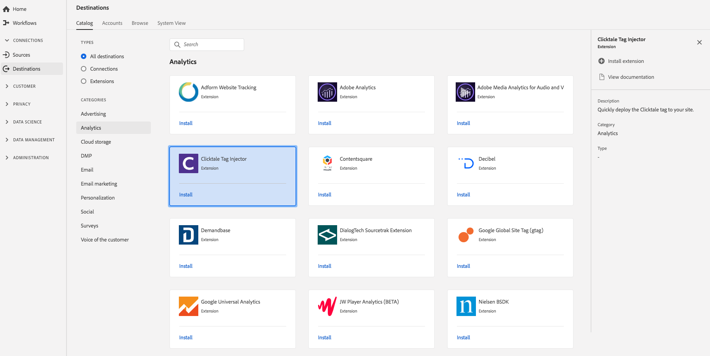

# [!DNL Clicktale] extension {#clicktale-extension}

## Översikt {#overview}

[!DNL Clicktale's] integrering med Experience Platform Launch gör det möjligt att driftsätta [!DNL Clicktale] kod och att mappa dataelement i Launch med [!DNL Clicktale's] Visual Editor.

[!DNL Clicktale] är ett analystillägg i Adobe Real-time Customer Data Platform. Mer information om tilläggsfunktionerna finns på tilläggssidan på [Adobe Exchange](https://exchange.adobe.com/experiencecloud.details.100082.html).

Det här målet har tillägget Experience Platform Launch. Mer information om hur Launch-tillägg fungerar i CDP i realtid i Adobe finns i Översikt över tillägg i Experience Platform Launch.

## Förutsättningar {#prerequisites}

Det här tillägget är tillgängligt i [!DNL Destinations] katalogen för alla kunder som har köpt CDP i realtid i Adobe.

Om du vill använda det här tillägget måste du ha tillgång till Experience Platform Launch. Experience Platform Launch erbjuds Adobe Experience Cloud-kunder som en inkluderad värdeskapande funktion. Kontakta din organisations administratör för att få åtkomst till Launch och be dem att ge dig behörighet att installera tillägg så att du kan installera dem **[!UICONTROL manage_properties]** .

## Installera tillägg {#install-extension}

Så här installerar du [!DNL Clicktale] tillägget:

1. I CDP-gränssnittet [för](http://platform.adobe.com/)Adobe i realtid går du till **[!UICONTROL Destinations > Catalog]**.
2. Välj tillägget i katalogen eller använd sökfältet.
3. Klicka på målet för att markera det och välj sedan **[!UICONTROL Install Extension]** i den högra listen. Om **[!UICONTROL Install Extension]** kontrollen är nedtonad saknar du **[!UICONTROL manage_properties]** behörigheten. Se [Förutsättningar](#prerequisites).
4. I **[!UICONTROL Select available Launch property]** fönstret väljer du den Launch-egenskap i vilken du vill installera tillägget. Du kan också skapa en ny egenskap i Launch. En egenskap är en samling regler, dataelement, konfigurerade tillägg, miljöer och bibliotek. Lär dig mer om egenskaper i delen  Egenskaper i Launch-dokumentationen.
5. Arbetsflödet tar dig till Launch för att slutföra installationen.

Mer information om alternativen för tilläggskonfigurationen finns på [sidan](https://exchange.adobe.com/experiencecloud.details.100082.html) Klickbart tillägg i Adobe Exchange.

Du kan också installera tillägget direkt i [Experience Platform Launch-gränssnittet](https://launch.adobe.com/). Se [Lägga till ett nytt tillägg](https://docs.adobe.com/content/help/en/launch/using/reference/manage-resources/extensions/overview.html#add-a-new-extension) i Launch-dokumentationen.

## Så här använder du tillägget {#how-to-use}

När du har installerat tillägget kan du börja konfigurera regler för det direkt i Launch.

I Launch kan du konfigurera regler för dina installerade tillägg så att händelsedata skickas till tilläggsmålet endast i vissa situationer. Mer information om hur du ställer in regler för tillägg finns i [Regeldokumentation](https://docs.adobe.com/help/en/launch/using/reference/manage-resources/rules.html).

## Konfigurera, uppgradera och ta bort tillägg {#configure-upgrade-delete}

Du kan konfigurera, uppgradera och ta bort tillägg i startgränssnittet.

>[!TIP]
>
>Om tillägget redan är installerat på en av dina egenskaper visas fortfarande CDP-gränssnittet för tillägget i realtid i Adobe **[!UICONTROL Install]** för tillägget. Stäng av installationsarbetsflödet enligt beskrivningen i [installationstillägget](#install-extension) för att komma åt Starta och konfigurera eller ta bort tillägget.

Information om hur du uppgraderar ditt tillägg finns i [Tilläggsuppgradering](https://docs.adobe.com/content/help/en/launch/using/reference/manage-resources/extensions/extension-upgrade.html) i Launch-dokumentationen.

