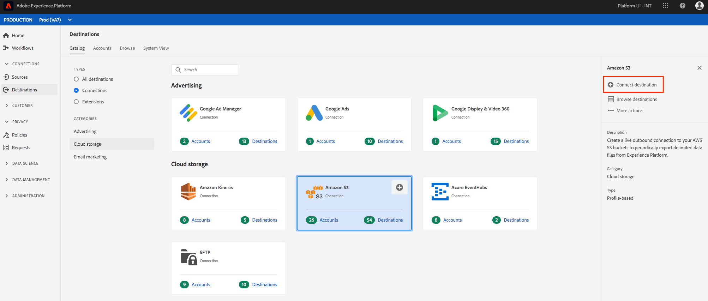
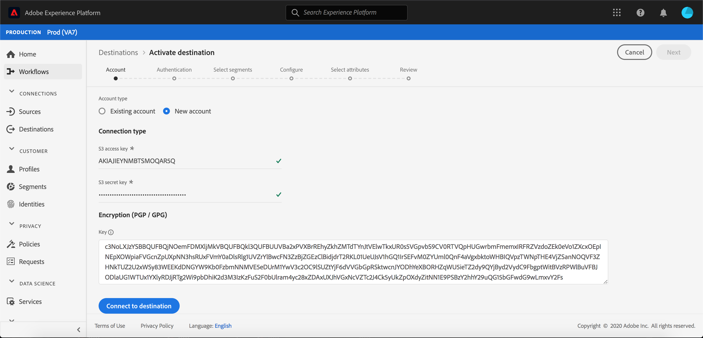
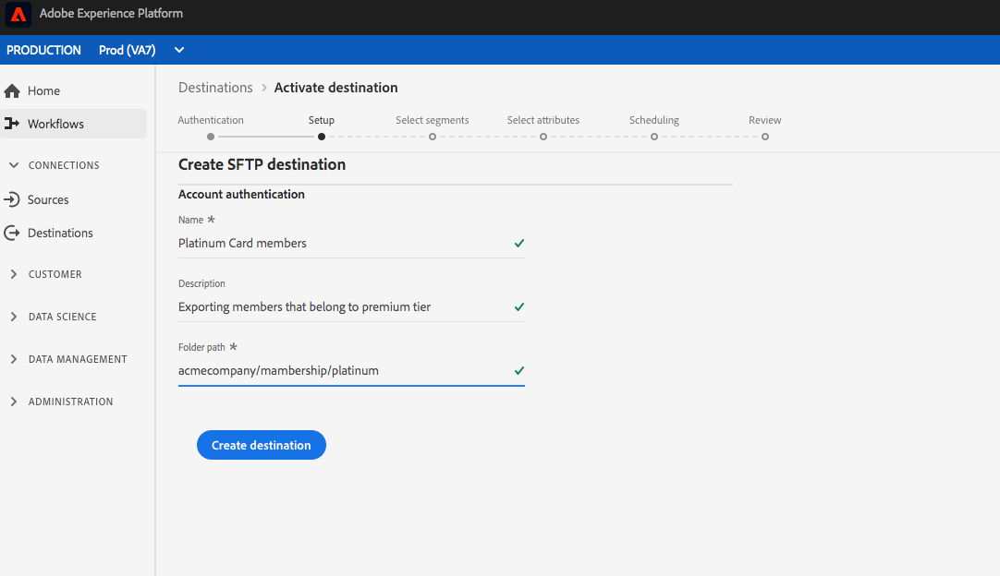
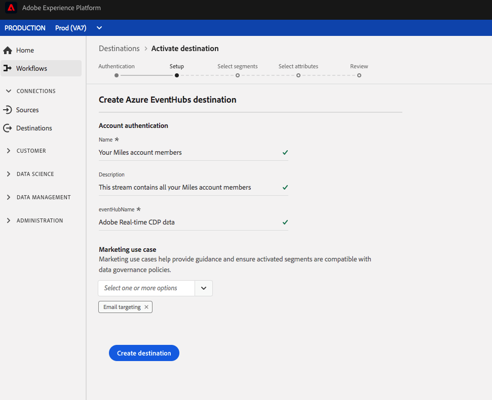

# Arbetsflöde för att skapa molnlagringsmål

## Översikt

På den här sidan beskrivs hur du kan ansluta till molnlagringsplatser i kunddataplattformen Adobe Real-time.

1. I **[!UICONTROL Connections]** > **[!UICONTROL Destinations]** väljer du önskat molnlagringsmål och väljer sedan **[!UICONTROL Configure]**.

   

   >[!NOTE]
   >
   >Om det redan finns en anslutning till det här målet kan du se en **[!UICONTROL Activate]** knapp på målkortet. Mer information om skillnaden mellan **[!UICONTROL Activate]** och **[!UICONTROL Configure]** finns i avsnittet [Katalog](/help/rtcdp/destinations/destinations-workspace.md#catalog) i dokumentationen för målarbetsytan.

2. Om du tidigare har konfigurerat en anslutning till molnlagringsmålet markerar du den befintliga anslutningen i **[!UICONTROL Authentication]** steget **[!UICONTROL Existing Account]** . Du kan också välja **[!UICONTROL New Account]** att konfigurera en ny anslutning till molnlagringsmålet. Fyll i autentiseringsuppgifter för ditt konto och välj **[!UICONTROL Connect to destination]**. Du kan också bifoga den RSA-formaterade offentliga nyckeln för att lägga till kryptering till de exporterade filerna. Observera att den här offentliga nyckeln **måste** skrivas som en Base64-kodad sträng.   Mer information om inloggningsuppgifter finns i [Amazon S3](/help/rtcdp/destinations/amazon-s3-destination.md) -målet, [[!DNL Amazon Kinesis]](/help/rtcdp/destinations/amazon-kinesis-destination.md) -målet, - [[!DNL Azure Event Hubs]](/help/rtcdp/destinations/azure-event-hubs-destination.md) målet och [SFTP](/help/rtcdp/destinations/sftp-destination.md) -målet i **autentiseringssteget** .

   >[!NOTE]
   >
   >CDP i realtid i Adobe stöder validering av autentiseringsuppgifter i autentiseringsprocessen och visar ett felmeddelande om du anger felaktiga autentiseringsuppgifter för din molnlagringsplats. Detta säkerställer att du inte slutför arbetsflödet med felaktiga inloggningsuppgifter.

   

3. I **[!UICONTROL Setup]** steget anger du ett **[!UICONTROL Name]** och ett **[!UICONTROL Description]** för aktiveringsflödet.  
I det här steget kan du även välja vilket som helst **[!UICONTROL Marketing use case]** som ska gälla för det här målet. Fall av marknadsanvändning anger avsikten för vilken data ska exporteras till destinationen. Du kan välja bland Adobe-definierade användningsfall för marknadsföring eller skapa ett eget marknadsföringsexempel. Mer information om användningsfall för marknadsföring finns på sidan [Datastyrning i CDP](/help/rtcdp/privacy/data-governance-overview.md#destinations) i realtid. Mer information om de enskilda Adobe-definierade användningsfallen för marknadsföring finns i översikten över [dataanvändningspolicyn](/help/data-governance/policies/overview.md#core-actions).  
För Amazon S3-destinationer anger du **[!UICONTROL Bucket name]** och **[!UICONTROL Folder path]** i molnlagringsdestinationen dit filerna ska levereras. Välj **[!UICONTROL Create Destination]** när du har fyllt i fälten ovan.

   

   För SFTP-mål anger du **[!UICONTROL Folder path]** var filerna ska levereras. Välj **[!UICONTROL Create Destination]** när du har fyllt i fälten ovan.

   

   Ange namnet på din befintliga dataström i ditt [!DNL Amazon Kinesis] konto för [!DNL Amazon Kinesis] destinationer. Adobe CDP i realtid exporterar data till den här strömmen. Välj **[!UICONTROL Create Destination]** när du har fyllt i fälten ovan.

   

   Ange namnet på din befintliga dataström i ditt [!DNL Azure Event Hubs] konto för [!DNL Amazon Kinesis] destinationer. Adobe CDP i realtid exporterar data till den här strömmen. Välj **[!UICONTROL Create Destination]** när du har fyllt i fälten ovan.

   

4. Målet har skapats. Du kan välja **[!UICONTROL Save & Exit]** om du vill aktivera segment senare eller om du vill fortsätta med arbetsflödet och välja vilka segment **[!UICONTROL Next]** som ska aktiveras. I båda fallen finns mer information i nästa avsnitt, [Aktivera segment](#activate-segments), för resten av arbetsflödet för att exportera data.

## Aktivera segment {#activate-segments}

Mer information om arbetsflödet för [aktivering finns i Aktivera profiler och segment till ett mål](/help/rtcdp/destinations/activate-destinations.md) .