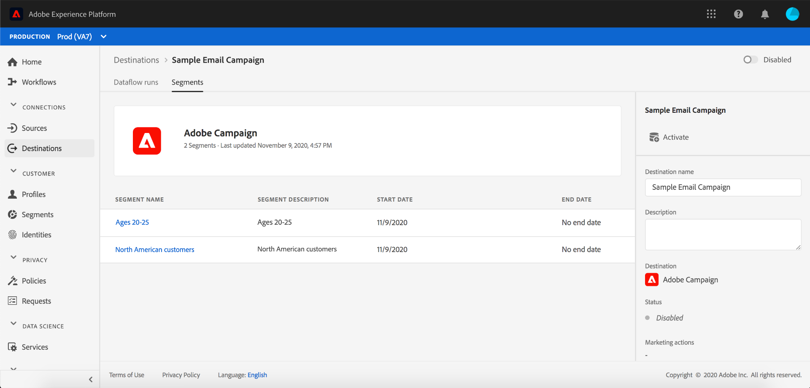

# Sidan med målinformation

I Adobe Experience Platform användargränssnitt kan du visa och övervaka attributen och aktiviteterna för dina mål. Dessa uppgifter omfattar målets namn och ID, kontroller för att aktivera eller inaktivera destinationer och mycket annat. Detaljer för batchdestinationer omfattar även mått för aktiverade profilposter och en historik över dataflöden.

>[!NOTE]
>
>Målinformationssidan är en del av arbetsytan i användargränssnittet för plattformen. [!UICONTROL Destinations] Mer information finns i översikten över [[!UICONTROL Destinations]](./destinations-workspace.md) arbetsytan.

Navigera till fliken och markera namnet på ett gruppmål som du vill visa på arbetsytan i plattformens användargränssnitt **[!UICONTROL Destinations]** **[!UICONTROL Browse]** .

Målets informationssida visas med de tillgängliga kontrollerna. Om du visar information om ett batchmål visas även en kontrollpanel.

## Höger räl

Den högra listen visar grundläggande information om målet.

Följande tabell omfattar de kontroller och den information som tillhandahålls av den högra spåret:

| Högerrälsartikel | Beskrivning |
| --- | --- |
| [!UICONTROL Activate] | Välj den här kontrollen om du vill redigera vilka segment som mappas till målet. Mer information finns i guiden om hur du [aktiverar segment till ett mål](/help/rtcdp/destinations/activate-destinations.md) . |
| [!UICONTROL Destination name] | Det här fältet kan redigeras för att uppdatera målets namn. |
| [!UICONTROL Description] | Det här fältet kan redigeras för att uppdatera eller lägga till en valfri beskrivning till målet. |
| [!UICONTROL Destination] | Representerar målplattformen som målgrupperna skickas till. Mer information finns i [målkatalogen](./destinations-catalog.md) . |
| [!UICONTROL Status] | Anger om målet är aktiverat eller inaktiverat. |
| [!UICONTROL Marketing actions] | Anger de marknadsföringsåtgärder (användningsfall) som gäller för den här destinationen i datastyrningssyfte. |
| [!UICONTROL Category] | Anger måltypen. Mer information finns i [målkatalogen](./destinations-catalog.md) . |
| [!UICONTROL Connection type] | Anger det formulär som era målgrupper skickas till. Möjliga värden är &quot;[!UICONTROL Cookie]&quot; och &quot;[!UICONTROL Profile-based]&quot;. |
| [!UICONTROL Frequency] | Anger hur ofta målgrupperna skickas till målet. Möjliga värden är &quot;[!UICONTROL Streaming]&quot; och &quot;[!UICONTROL Batch]&quot;. |
| [!UICONTROL Identity] | Representerar det identitetsnamnutrymme som accepteras av målet, till exempel `GAID`, `IDFA`eller `email`. Mer information om godkända namnutrymmen för identiteter finns i [översikten över](../../identity-service/namespaces.md)namnutrymmen för identiteter. |
| [!UICONTROL Created by] | Anger den användare som skapade det här målet. |
| [!UICONTROL Created] | Anger UTC-datum/tid när det här målet skapades. |

## [!UICONTROL Enabled]/[!UICONTROL Disabled] växla

Du kan använda växlingsknappen **[!UICONTROL Enabled]/[!UICONTROL Disabled]** för att starta och pausa all dataexport till målet.

## [!UICONTROL Dataflow runs]

Fliken innehåller mätdata om dataflödet som körs till batchdestinationer [!UICONTROL Dataflow runs] . En lista över enskilda körningar och deras specifika mått visas tillsammans med följande summor för profilposter:

* **[!UICONTROL Profile records activated]**: Det totala antalet profilposter som har skapats eller uppdaterats för aktivering.
* **[!UICONTROL Profile records skipped]**:  Det totala antalet profilposter som hoppas över för aktivering baserat på utträde eller saknade attribut.

>[!NOTE]
>
>Dataflödeskörningar genereras baserat på måldataflödets schemafrekvens. En separat dataflödeskörning görs för varje sammanfogningsprincip som tillämpas på ett segment.

Om du vill visa information om ett visst dataflöde väljer du körningens starttid i listan. Informationssidan för ett dataflöde innehåller ytterligare information, t.ex. storleken på de data som bearbetas och en lista över eventuella fel som inträffat med information om feldiagnostik.

## [!UICONTROL Segments]

På fliken [!UICONTROL Segments] visas en lista med segment som har mappats till målet, inklusive startdatum och slutdatum (om tillämpligt). Om du vill visa information om ett visst segment väljer du dess namn i listan.

>[!NOTE]
>
>Mer information om hur du utforskar detaljsidan för ett segment finns i översikten över [segmenteringsgränssnittet](../../segmentation/ui/overview.md#segment-details).

## Nästa steg

Det här dokumentet innehåller funktioner för sidan med målinformation. Mer information om hur du hanterar mål i användargränssnittet finns i översikten på [[!UICONTROL Destinations] arbetsytan](./destinations-workspace.md).