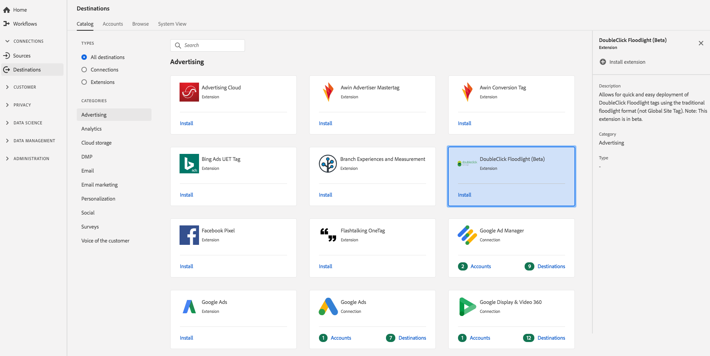

# [!DNL DoubleClick Floodlight] (Beta)-tillägg

## Översikt {#overview}

Med det här tillägget kan du snabbt och enkelt distribuera [!DNL DoubleClick Floodlight] taggar med det traditionella flyttalsformatet (inte Global Site Tag). Obs! Det här tillägget är i betaversion.

[!DNL DoubleClick Floodlight] (Beta) är ett annonstillägg i Real-time Customer Data Platform. Mer information om tilläggsfunktionen finns i supportdokumentationen för [!DNL Google] DoubleClick Floodlight .

Det här målet är ett Adobe Experience Platform Launch-tillägg. Mer information om hur plattformstillägg fungerar i CDP i realtid i Adobe finns i Översikt över [Adobe Experience Platform Launch-tillägg](/help/rtcdp/destinations/experience-platform-launch-extensions.md).

## Förutsättningar {#prerequisites}

Det här tillägget är tillgängligt i [!DNL Destinations] katalogen för alla kunder som har köpt CDP i realtid i Adobe.

Om du vill använda det här tillägget måste du ha tillgång till Adobe Experience Platform Launch. Platform Launch erbjuds Adobe Experience Cloud-kunder som en inkluderad, värdeskapande funktion. Kontakta din organisations administratör för att få åtkomst till plattformsstart och be dem att ge dig behörighet att installera tillägg så att du kan installera dem **[!UICONTROL manage_properties]** .

## Installera tillägg {#install-extension}

Så här installerar du DoubleClick Floodlight-tillägget (beta):

1. I CDP-gränssnittet [för](http://platform.adobe.com/)Adobe i realtid går du till **[!UICONTROL Destinations]** > **[!UICONTROL Catalog]**.
2. Välj tillägget i katalogen eller använd sökfältet.
3. Klicka på målet för att markera det och välj sedan **[!UICONTROL Configure]** i den högra listen. Om **[!UICONTROL Configure]** kontrollen är nedtonad saknar du **[!UICONTROL manage_properties]** behörigheten. Se [Förutsättningar](#prerequisites).
4. I **[!UICONTROL Select available Platform Launch property]** fönstret väljer du den Platform Launch-egenskap där du vill installera tillägget. Du kan också skapa en ny egenskap i Platform Launch. En egenskap är en samling regler, dataelement, konfigurerade tillägg, miljöer och bibliotek. Lär dig mer om egenskaper i delen  Egenskaper i dokumentationen för plattformsinstallationen.
5. Arbetsflödet tar dig till Platform Launch för att slutföra installationen.

Du kan också installera tillägget direkt i [Adobe Experience Platform Launch-gränssnittet](https://launch.adobe.com/). Se [Lägga till ett nytt tillägg](https://docs.adobe.com/content/help/en/launch/using/reference/manage-resources/extensions/overview.html#add-a-new-extension) i dokumentationen för plattformsstarten.

## Så här använder du tillägget {#how-to-use}

När du har installerat tillägget kan du börja konfigurera regler för det direkt i Platform Launch.

I Platform Launch kan du konfigurera regler för dina installerade tillägg så att händelsedata skickas till tilläggsmålet endast i vissa situationer. Mer information om hur du ställer in regler för tillägg finns i [Regeldokumentation](https://docs.adobe.com/help/en/launch/using/reference/manage-resources/rules.html).

## Konfigurera, uppgradera och ta bort tillägg {#configure-upgrade-delete}

Du kan konfigurera, uppgradera och ta bort tillägg i plattformens startgränssnitt.

>[!TIP]
>
>Om tillägget redan är installerat på en av dina egenskaper visas fortfarande CDP-gränssnittet för tillägget i realtid i Adobe **[!UICONTROL Install]** för tillägget. Starta installationsarbetsflödet enligt beskrivningen i [installationstillägget](#install-extension) för att komma till Platform Launch och konfigurera eller ta bort tillägget.

Information om hur du uppgraderar ditt tillägg finns i [Tilläggsuppgradering](https://docs.adobe.com/content/help/en/launch/using/reference/manage-resources/extensions/extension-upgrade.html) i dokumentationen för Platform Launch.

