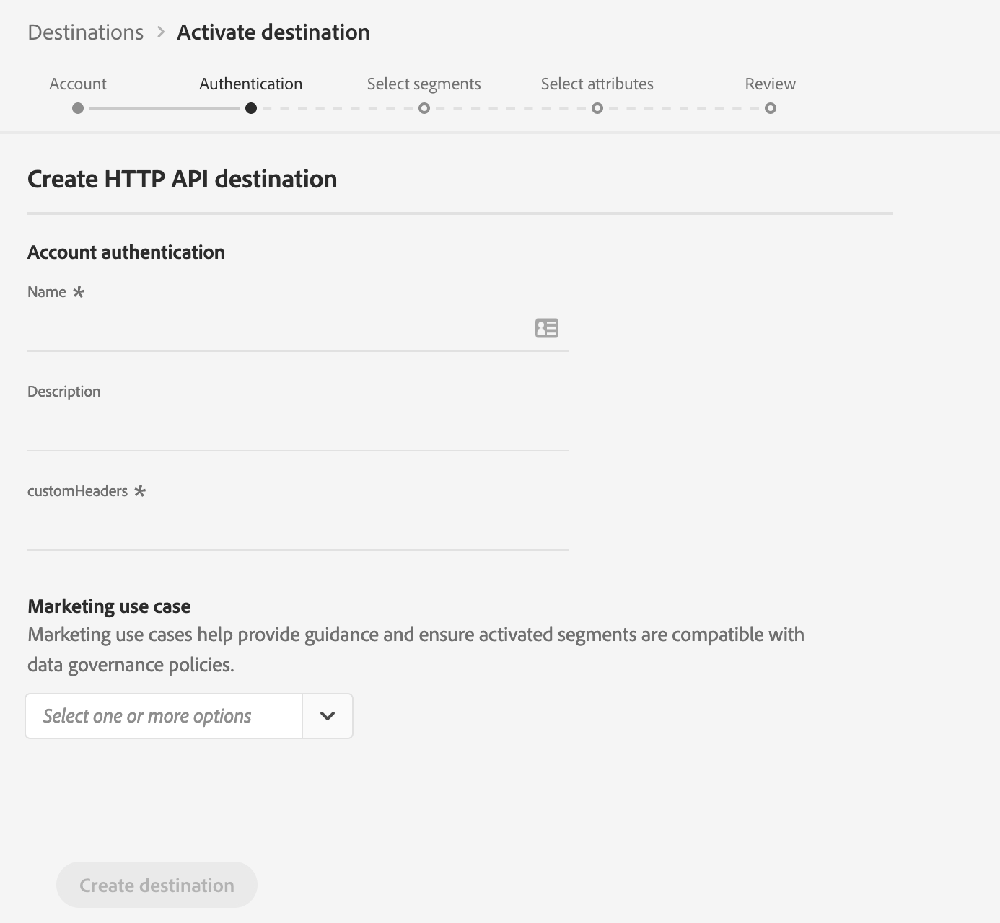

# (Alfa) [!DNL HTTP] Mål

>[!IMPORTANT]
>
>Målplatsen i CDP i realtid i Adobe är för närvarande alfavärden. [!DNL HTTP] Dokumentationen och funktionaliteten kan komma att ändras.

## Översikt {#overview}

Målet är [!DNL HTTP] ett [!DNL Adobe Real-Time Customer Data Platform] direktuppspelningsmål som gör det enklare att skicka profildata till [!DNL HTTP] slutpunkter från tredje part.

Om du vill skicka profildata till [!DNL HTTP] slutpunkter måste du först ansluta till målet i [!DNL Adobe Real-Time Customer Data Platform](#connect-destination).

## Use Cases {#use-cases}

Målet är kunder som behöver exportera XDM-profildata och målgruppssegment till generiska [!DNL HTTP] [!DNL HTTP] slutpunkter.

[!DNL HTTP] slutpunkterna kan antingen vara kundernas egna system eller tredjepartslösningar.

## Anslut till mål {#connect-destination}

1. In **[!UICONTROL Connections]** > **[!UICONTROL Destinations]**, select [!DNL  HTTP API], and select **[!UICONTROL Configure]**.

   

   >[!NOTE]
   >
   >Om det redan finns en anslutning till det här målet kan du se en **[!UICONTROL Activate]** knapp på målkortet. Mer information om skillnaden mellan **[!UICONTROL Activate]** och **[!UICONTROL Configure]** finns i avsnittet [Katalog](../destinations/destinations-workspace.md#catalog) i dokumentationen för målarbetsytan.
   

2. I [!UICONTROL Account] steget måste du definiera anslutningsinformationen för HTTP-slutpunkten. Markera **[!UICONTROL New account]** och ange anslutningsinformation för den HTTP-slutpunkt som du vill ansluta till.
   * **[!UICONTROL httpEndpoint]**: den fullständiga HTTP-slutpunkten [!DNL URL] som du vill skicka profildata till.
      * Du kan också lägga till frågeparametrar i [!UICONTROL httpEndpoint][!DNL URL].
   * **[!UICONTROL authEndpoint]**: Den fullständiga HTTP-slutpunkten [!DNL URL] som används för [!DNL OAuth2] autentisering.
   * **[!UICONTROL Client ID]**: den [!DNL clientID] parameter som används i [!DNL OAuth2] klientens autentiseringsuppgifter.
   * **[!UICONTROL Client Secret]**: den [!DNL clientSecret] parameter som används i [!DNL OAuth2] klientens autentiseringsuppgifter.

   >[!NOTE]
   >
   >Endast [!DNL OAuth2] klientautentiseringsuppgifter stöds för närvarande.

   
3. Klicka på **[!UICONTROL Connect to destination]**.
4. När anslutningen är klar klickar du på **[!UICONTROL Next]**.
5. I [!UICONTROL Authentication] steget anger du autentiseringsuppgifterna för kontot:
   * **[!UICONTROL Name]**: Ange ett namn som du känner igen det här målet med i framtiden.
   * **[!UICONTROL Description]**: Ange en beskrivning som hjälper dig att identifiera det här målet i framtiden.
   * **[!UICONTROL Custom Headers]**: Ange eventuella anpassade rubriker som du vill ska ingå i målanropen, enligt följande format: `header1:value1,header2:value2,...headerN:valueN`.

      >[!IMPORTANT]
      >
      >Den aktuella implementeringen kräver minst en anpassad rubrik. Den här begränsningen kommer att åtgärdas i en framtida uppdatering.
   

6. **[!UICONTROL Marketing use case]**: Fall av marknadsanvändning anger avsikten för vilken data ska exporteras till destinationen. Du kan välja bland Adobe-definierade användningsfall för marknadsföring eller skapa ett eget marknadsföringsexempel. Mer information om användningsfall för marknadsföring finns på sidan [Datastyrning i CDP](../privacy/data-governance-overview.md#destinations) i realtid. Mer information om de enskilda Adobe-definierade användningsfallen för marknadsföring finns i översikten över [dataanvändningspolicyn](../../data-governance/policies/overview.md#core-actions).
7. Klicka på **[!UICONTROL Create destination]**.

## Aktivera segment

Mer information om arbetsflödet för [aktivering finns i Aktivera profiler och segment till ett mål](activate-destinations.md#select-attributes) .

## Målattribut

Under [[!UICONTROL Select attributes]](activate-destinations.md#select-attributes) steget, när du [aktiverar segment](activate-destinations.md) till ett [!DNL HTTP] mål, rekommenderar vi att du väljer en unik identifierare från [unionsschemat](../../profile/home.md#profile-fragments-and-union-schemas). Välj den unika identifieraren och eventuella andra XDM-fält som du vill exportera till målet.

## Exporterade data {#exported-data}

Dina exporterade [!DNL Experience Platform] data kommer in i ditt [!DNL HTTP] mål i JSON-format. Händelsen nedan innehåller till exempel e-postadressprofilattributet för en målgrupp som har kvalificerat sig för ett visst segment och avslutat ett annat segment. Identiteterna för den här potentiella kunden är [!DNL ECID] och e-post.

```json
{
  "person": {
    "email": "yourstruly@adobe.con"
  },
  "segmentMembership": {
    "ups": {
      "7841ba61-23c1-4bb3-a495-00d3g5fe1e93": {
        "lastQualificationTime": "2020-05-25T21:24:39Z",
        "status": "exited"
      },
      "59bd2fkd-3c48-4b18-bf56-4f5c5e6967ae": {
        "lastQualificationTime": "2020-05-25T23:37:33Z",
        "status": "existing"
      }
    }
  },
  "identityMap": {
    "ecid": [
      {
        "id": "14575006536349286404619648085736425115"
      },
      {
        "id": "66478888669296734530114754794777368480"
      }
    ],
    "email_lc_sha256": [
      {
        "id": "655332b5fa2aea4498bf7a290cff017cb4"
      },
      {
        "id": "66baf76ef9de8b42df8903f00e0e3dc0b7"
      }
    ]
  }
}
```
