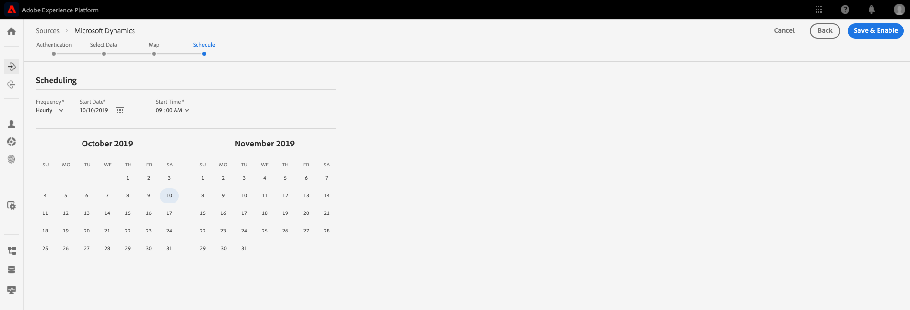
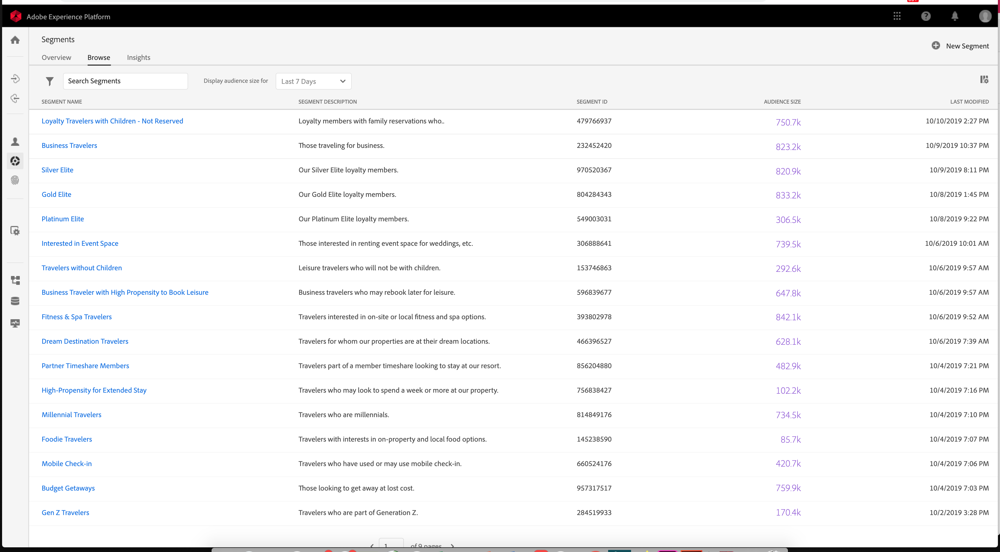
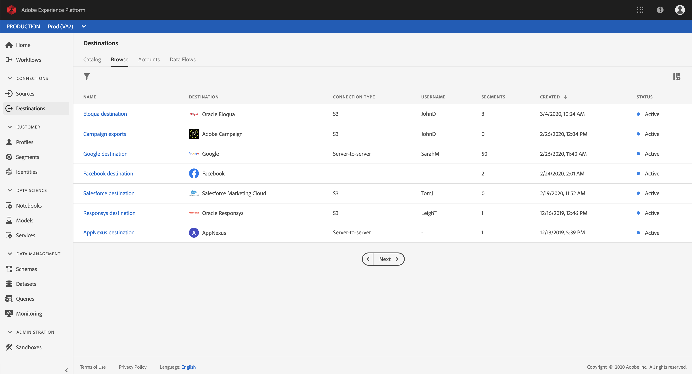

# Komma igång med Adobe kunddataplattform i realtid

Den här guiden leder dig genom en exempelimplementering av kunddataplattformen Adobe Real-time (CDP). Du kan använda det som exempel när du konfigurerar en egen implementering. Även om den här guiden innehåller specifika exempel länkas den till ytterligare information som du kan använda när du skapar din konfiguration.

I det här exemplet visas styrkan hos Adobe Real-time Customer Data Platform, som drivs av Adobe Experience Platform, att:

* Hämta in data från flera källor
* Sammanfoga dem i en enda [!DNL real-time customer profile]
* Leverera en enhetlig, relevant och personaliserad upplevelse på olika enheter.

## Användningsfall

Luma, ett sportklädföretag, försöker alltid förbättra sin kundupplevelse. De har ett nytt initiativ för att öka den presentrelaterade försäljningen. De vill också minska överexponering, till exempel irriterande annonser som följer kunderna runt.

För närvarande spenderar de för mycket på media som återannonserar mot objekt som besökaren inte kommer att köpa längre fram. Luma vill till exempel inte omdirigera någon med ett objekt som var avsett som ett engångsköp för någon annan.

Just nu sprids Lumas data över flera källor. Därför står de inför stora utmaningar:

* Marknadsföringsorganisationen måste arbeta med olika team som var och en äger en datakälla, inklusive en webbplats, en mobilapp, lojalitetssystem, CRM och så vidare.
* När marknadsföringsteamet får tillgång till informationen är den ofta inaktuell och inte längre relevant för deras tidskänsliga kampanj.
* De måste sammanställa data så att de riktas mot en person, inte mot kanaler.

Därför har Luma följande affärsmål:

* Skapa en helhetsbild i realtid av kunderna utifrån deras olika datakällor.
* Anpassa marknadsföringskampanjer med relevanta meddelanden i olika kanaler och enheter.

För att uppnå dessa mål måste marknadsföringsteamet kunna hantera kunddata i stor skala.

Med CDP från Adobe Experience Platform i realtid kan Lumas marknadsföringsorganisation

1. Samla in data från olika plattformar och se till att de är tillgängliga längre fram i kedjan för andra marknadsföringsaktiviteter.
1. Skapa en enda realtidsbild av kunderna, oavsett var de kommer från.
1. Skapa en enhetlig, relevant och personaliserad upplevelse över alla kontaktytor.

## Steg

Den här självstudiekursen innehåller följande steg:

1. Bygg [kundprofilen](#customer-profile).
1. [Anpassa](#personalizing-the-user-experience) användarupplevelsen.
1. Använd [flera datakällor](#using-multiple-data-sources).
1. [Konfigurera en datakälla](#configuring-a-data-source).
1. [Samla in data](#bringing-the-data-together-for-a-specific-customer) för en viss kund.
1. Konfigurera [segment](#segments).
1. Ställ in [mål](#destinations).
1. [Dra ihop profilen på olika enheter](#cross-device-identity-stitching).
1. [Analysera profilen](#analyzing-the-profile).

## Kundprofil

När kunderna först besöker er webbplats vet ni ingenting om dem.


När de navigerar hämtas data in i realtid och skickas inte bara till en rapportsvit i Adobe Analytics, utan också direkt till Adobe Experience Platform. När data samlas in börjar ni skapa en enda bild av konsumenten utifrån beteendedata i [!DNL Experience Platform's real-time customer profile].

Många besökare på webbplatsen är antagligen återkommande kunder som tidigare har köpt från Luma.  Det är viktigt för Luma att personalisera meddelanden och erbjudanden för både nya och återkommande besökare samt kända kunder.

### Ny kunds första besök

En oidentifierad besökare går till exempel till Men&#39;s -avsnittet på Lumawebbplatsen och visar några vardagliga tröjor.


När kunden klickar för att få veta mer om dessa produkter samlas dessa produktvisningar in i Adobe Analytics och skickas till [!DNL Experience Platform].

<!---->

Luma kan mappa besökarens beteende till en användarprofil på Adobe Experience Platform och börja sammanställa en mer detaljerad bild av den kundens beteende.

### Få en mer detaljerad bild av kunden

När kunden fortsätter att interagera med webbplatsen uppstår en tydligare bild. Anta till exempel att besökaren lägger till en produkt i kundvagnen och loggar in.

När kunden loggar in identifierar hon sig som Sarah Rose.


Två identiteter slås samman:

* Data för anonym surfning
* Befintliga data som är kopplade till Sarah Rose konto

Båda identiteterna kombineras till en enda profil i [!DNL Experience Platform]. Luma har nu en enhetlig bild av den här konsumenten.

Baserat på den anonyma besökarens surfbeteende i Men&#39;s-delen av webbplatsen, kan det ha förutsatts att kunden var en man. Nu när hon är inloggad känner Luma igen Sarah Rose. Luma använder kraften i programmet för [!DNL Real-time Customer Profile] att förfina de meddelanden hon får i alla kanaler.

## Anpassa användarupplevelsen

Sarah hälsas välkommen med ett lojalitetsmeddelande och tackar för att hon blivit Bronze-medlem med mer information om förmåner och hur hon kan förbättra sin status och sina poäng.

Hon klickar på startsidan för att bläddra bland fler.


Sarah får en personaliserad hemsida som levereras dynamiskt baserat på hennes erfarenheter [!DNL Real-time Customer Profile] i Adobe Experience Platform.

Hon ser relevant innehåll, tack vare Adobe Sensei-driven personalisering i Adobe Target, som tar hänsyn till hennes tidigare inköp och tillhörighet till löpande kläder och utrustning. Luma skräddarsyr även männens kataloginnehåll mot löpverk för män baserat på hennes senaste surfning.

Längre ned på sidan visas Sarah med aktuella produkter och ett nytt rekommendationsfack som bygger på hennes senast visade artiklar.

Det personliga innehållet hjälper Sarah att snabbt hitta relevanta objekt. Detta ökar antalet konverteringar och ger en mer attraktiv kundupplevelse.

### Få tillbaka kunden

Sarah blir distraherad och lämnar sajten. Luma kan använda sina data i Adobe Experience Platform för att ta med henne till webbplatsen.

Adobe kunddataplattform i realtid, som drivs av Adobe Experience Platform, är framtagen för kundupplevelsehantering. Med programmet kan man

* Förenkla integrering och aktivering av data
* Styr känd och okänd dataanvändning
* Snabbare användning av marknadsföring i stor skala

## Använda flera datakällor

Teamet på Luma har alla sina beteendedata och kunddata på ett och samma ställe.


De kan importera data från alla följande källor:

* Data om befintliga Adobe Experience Cloud-lösningar
* Andra källor än Adobe, t.ex. Lumas lojalitetsprogram, callcenter och systemdata för försäljningsställen
* Direktuppspelningsdata i realtid från Luma-datakällor
* Realtidsdata från Adobe-lösningar (inga nya taggar krävs)

Alla dessa data från olika källor sammanfogas i en enda enhetlig kundprofil.

## Konfigurera en datakälla

Använd [!DNL Real-time Customer Data Platform] för att ta in nya datakällor på plattformen. CDP i realtid innehåller en katalog med datakällor som kan läggas till i profilen med bara några klick.


Om du till exempel vill importera Lumas CRM-data filtrerar du katalogen efter *CRM* och alla färdiga anslutningar som innehåller *CRM* visas. Så här lägger du till [!DNL Microsoft Dynamics CRM] data:

1. Auktorisera anslutningen.

   

1. Välj vad du vill importera från en rekommenderad lista med förmappade XDM-tabeller.

   <!--     -->

   Välj till exempel **[!UICONTROL Contacts]**. En förhandsgranskning av kontaktdata läses in automatiskt så att du kan kontrollera att allt ser ut som förväntat.

   Adobe Experience-plattformen tar mycket av det manuella arbetet bort genom att automatiskt mappa standardfält till [!DNL Experience Data Model] (XDM)-profilschemat.

1. Granska fältmappningarna.

   <!--     -->

   Kontrollera till exempel att e-postfältet för kontakter är korrekt mappat.\
   Du kan välja att förhandsgranska data och utföra avancerad mappning.

1. Ange ett schema.

   

Klart. Du har precis lagt till [!DNL Microsoft CRM] som en datakälla i [!DNL Experience Platform].

### Märk inkapslade data för användningsprinciper

Luma har många interna policyer som begränsar användningen av vissa typer av insamlad information och måste också uppfylla juridiska och sekretessrelaterade problem när det gäller dataanvändning. Med Adobe Experience Platform [!DNL Data Governance]kan fördefinierade dataanvändningsetiketter användas på datauppsättningar (och specifika fält i dessa datauppsättningar), vilket gör att Luma kan kategorisera sina data enligt specifika användningsbegränsningar.


När dataanvändningsetiketterna har tillämpats kan Luma sedan använda [!DNL Data Governance] för att skapa dataanvändningsprinciper. Dataanvändningsprinciper är regler som beskriver den typ av åtgärder som du får utföra på data som innehåller vissa etiketter. När man försöker utföra en åtgärd i realtid med CDP som utgör en policyöverträdelse förhindras åtgärden och en varning ges om vilken policy som överträtts och varför.

## Sammanföra data för en viss kund

I det här scenariot söker du efter profiler för Sarah Rose. Hennes profil visas med det mejl som hon använde för att logga in.

<!--  -->

All profilinformation Luma har om Sarah visar. Detta inkluderar hennes personuppgifter som adress och telefonnummer, kommunikationsinställningar och de segment hon är berättigad till.

| Kategori | Beskrivning |
|---|---|
| Identiteter | Visar de identiteter som har kopplats ihop i [!DNL Platform] utifrån Sarah interaktioner med Luma över kanaler och enheter. Hennes ECID från webbplatsen visas. Hennes identitet innefattar också ECID från hennes mobilapp, hennes e-post-ID, ett CRM-ID från den nyligen tillagda [!DNL Microsoft Dynamics] datauppsättningen och ett lojalitets-ID som skickas till Adobe Experience Platform från Lumas lojalitetssystem. |
| Händelser | Visar alla Sarah interaktionsdata med Luma-varumärket. Detta inkluderar det som hon just tittat på, allt som hon tittat på tidigare, de e-postmeddelanden hon fått, hennes interaktioner med callcenter och vilken kanal och enhet som var och en av interaktionerna ägde rum på. |

CDP-profilen i realtid minskar arbetsflödet för Luma-marknadsföringsteamet från veckor till minuter och frigör möjligheter till personalisering baserat på denna helhetsbild av kunden. Profilen sammanfogar beteendedata från när hon surfar på webbplatsen innan hon loggade in, med sin befintliga kundprofil, vilket skapar en heltäckande bild av Sarah.

Marknadsföringsteamet kan använda det här förbättrade verktyget för [!DNL Real-time Customer Profile] att bättre personalisera Sarah upplevelse och öka varumärkeslojaliteten med Luma.

## Segment

Tack vare de kraftfulla segmenteringsfunktionerna i Adobe Experience Platform kan marknadsförarna kombinera attribut, händelser och befintliga segment baserat på data som samlats in i [!DNL Real-time Customer Profile]programmet.

<!--  -->

I det här scenariot uppvisade Sarah nyligen interaktioner på webbplatsen ett annat beteende än hennes tidigare handlingar. Hon köper vanligtvis damkläder. Posten i kundvagnen är dock en stor tröja för män.

Lumas datavetenskap har tagit fram modeller kring benägenheten att köpa. En modell visar på en plötslig förändring i klädkategori (t.ex. kvinnor/män) eller storlek för den befintliga konsumenten. Sara ändrade inköpsbeteende tyder på att hon inte handlar för sig själv.

<!--  -->

### Definiera ett segment

Ändra eller skapa ett segment som representerar övergivna varukorgar som verkar vara på väg att köpa en gåva:

```sql
Profile: Category != Preferred Category 
AND 
Product Size != Preferred Size 
in last 7 days.  
AND 
Abandoned Cart 
AND 
Loyalty member 
```

<!-- -->

Eftersom Sarah lade till en gåva i vagnen och övergav den kan Luma rikta in sig på henne med ett kostnadsfritt presenterbjudande.

## Mål 

När du har lagt till segmentet&quot;Gift Giving Cart Abandoners&quot; kan du se ungefär hur många som ingår i det här segmentet. Ni kan vidta åtgärder för det och göra det tillgängligt för personalisering i alla kanaler.

Klicka på **[!UICONTROL Send to destinations]**.

På Adobe CDP i realtid kan Luma agera sömlöst på sina målgruppssegment för personalisering.\
Här ser vi alla destinationer som Luma kan skicka till både Adobe och andra lösningar än Adobe:



### Välja mål

I det här scenariot vill Luma återrikta målgruppen med personalisering över dessa destinationer:

* Google, för visning

   <!--* Facebook -->
* Adobe Campaign, för e-post

<!--  -->

### Schemaläggningsmål

Du kan också schemalägga att segmentet ska börja eller sluta vid en viss tidpunkt. Segmentet kommer att bokföras och uppdateras automatiskt på de konfigurerade plattformarna på de schemalagda datumen.

>[!NOTE]
>Om du klickar i datumfältet kan du välja att schemalägga automatiskt för 90 dagar framåt.

Klicka **[!UICONTROL Save]** för att gå till nästa sida.

När en kund i den här målgruppen gör ett köp inaktiveras deras medlemskap i den här målgruppen i realtid. De är inte längre kvalificerade eftersom deras status har ändrats.

Detta sparar pengar åt Lumas mediegrupp genom att inte använda upp lager för en publik som inte är kvalificerad.

### Tillämpa dataanvändningsprinciper för mål

Adobe Experience Platform innehåller sekretess- och säkerhetskontroller för att avgöra om ett segment är tillgängligt för aktivering till ett visst mål. Aktiveringen är aktiverad eller begränsad baserat på det marknadsföringssyfte eller de marknadsföringssyften som var tilldelat destinationen när den skapades, samt dataanvändningsprinciper som definierats av organisationen.

Om din aktivitet bryter mot reglerna visas en varning. Den här varningen innehåller information om datalänkning som kan hjälpa dig att identifiera varför policyn överträds och vad du kan göra för att åtgärda överträdelsen.

Med de här kontrollerna kan [!DNL Experience Platform] Luma följa regler och marknadsföra ansvarsfullt. Dessa reglage är flexibla och kan ändras för att uppfylla kraven från Lumas säkerhets- och styrningsteam, så att de tryggt kan uppfylla regionala och organisatoriska krav för att hantera kända och okända kunddata.

### Arbetsyta för dataflöde

När du sparar visas det segment som är mappat från den enhetliga profilen till de tre valda målen i en visuell dataflödesyta.


## Enhetsidentitetssammanfogning

Sarah surfar på en sajt för sociala medier på sin mobila enhet, och hon ser en Luma-annons. Det påminner henne om det hon lämnade i vagnen.

Senare öppnar hon sitt mejl och ser de omdirigerade mejlen. Hon klickar på en länk till Luma i ett mejl.

Länken tar Sarah till Lumas mobilsajt där hon ser en mycket personaliserad upplevelse som drivs av Adobe Target.

* Hon är välkommen som Bronze-medlem.
* Hon ser presentmeddelandet.
* Hon ser även meddelandet&quot;Free Gift Wrap&quot;, som ingår i medlemskapet i Bronze.
* Hon är fortfarande inriktad på hjältebilden baserat på hennes tillhörighet att springa.

Hon köper tröjan, lägger till en present och skriver en present. Hon har också möjlighet att komma ihåg det här evenemanget och få en påminnelse nästa år om att gå till present just nu. Hon säger ja, och är schemalagd till en e-postkampanj nästa år för att påminna henne om att köpa en till gåva.

Tack vare funktioner för att hindra åhörarna kommer Sarah inte att vara inriktad på de där männens tröja framåt.

## Analyserar profilen

Luma-marknadsförare använder Adobe Experience Platform för att se på presentgiversegmentet på CDP Dashboard i realtid. De ser resultaten av detta initiativ över tiden och ser att det växer. Kunderna svarar på erbjudanden och spenderar mer pengar.

Dessa insikter gör det möjligt för marknadsförarna att agera på den här signalen, som stärktes av att informationen fanns tillgänglig i CDP och att kunder som Sarah var kopplade till segmentet.

Luma använder dessa CDP-data för att öka lojaliteten och få nöjda kunder.
