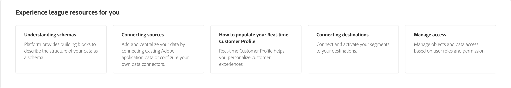

# Startsida för [!DNL Real-Time Customer Data Platform]

Hemsidan för Adobe Real-Time Customer Data Platform (Real-Time CDP) är den första sida som visas när du har loggat in på Real-Time CDP.

Real-Time CDP hemsida innehåller en widget för att komma igång som gör att du snabbt kan komma åt flera olika funktioner och ett mätavsnitt som visar uppdaterad information om data i din organisation.

Det här dokumentet innehåller en översikt över Real-Time CDP hemsida och instrumentpanel för mätvärden.

## Komma igång-widget

Widgeten [!UICONTROL Getting started with Real-Time Customer Profile] är uppdelad i fyra avsnitt:

* **Infoga data i Experience Platform**: Den här widgeten dirigerar dig till källkatalogen. Använd källkatalogen för att välja en källa och importera data till Experience Platform. Välj **[Konfigurera källor]** för att navigera till källkatalogen. Mer information finns i [översikten över källor](../sources/home.md).
* **Modelldatastrukturer**: Den här widgeten dirigerar dig till översikten över scheman. Använd översikten för att bläddra efter befintliga scheman eller skapa en plan som beskriver datastrukturen. Välj **[!UICONTROL Create schema]** om du vill navigera till gränssnittet för att skapa scheman. Mer information finns i översikten [scheman](../xdm/home.md).
* **Skapa målgrupper**: Den här widgeten dirigerar dig till segmentbyggaren i användargränssnittet. Använd Segment Builder för att interagera med profildataelement och definiera villkoren för segmentdefinitionen. Välj **[!UICONTROL Create audience]** om du vill navigera till segmentbyggaren. Mer information finns i [Översikt över segmenteringstjänsten](../segmentation/home.md).
* **Skicka data till mål**: Den här widgeten dirigerar dig till målkatalogen. Använd målkatalogen för att välja en destination som du sedan kan ansluta till och skicka målgrupper till. Välj **[!UICONTROL Set up destinations]** för att navigera till målkatalogen. Mer information finns i [översikten över destinationer](../destinations/home.md).

## Kontrollpanel för mått {#metrics-dashboard}

>[!CONTEXTUALHELP]
>id="platform_home_metrics_totalProfiles"
>title="Totalt antal profiler"
>abstract="Det totala antalet profiler ni har inom Experience Platform. Antalet baseras på organisationens kopplingsprofil och inkluderar inte profilfragment. Antalet profiler uppdateras en gång var 24:e timme."
>additional-url="https://experienceleague.adobe.com/docs/experience-platform/profile/ui/user-guide.html?lang=sv-SE#profile-count" text="Läs mer i dokumentationen"

Kontrollpanelen för mätvärden visar aktuell information om dina Experience Platform-data. Kontrollpanelen är uppdelad i två avsnitt:

### The leaderboard

På resultatlistan visas det aktuella totala antalet scheman, datamängder, profiler och målgrupper i organisationen samt deras senaste uppdateringsdatum.

* **Totalt antal scheman**: Räknaren **Totalt antal scheman** visar antalet scheman i systemet. Räknaren uppdateras när ett schema skapas. Mer information finns i översikten [scheman](../xdm/home.md).
* **Totalt antal datauppsättningar**: Räknaren **Totalt antal datauppsättningar** visar antalet datauppsättningar i systemet och datamängden i Experience Platform. Den här räknaren uppdateras när en datauppsättning skapas. Mer information om datauppsättningar finns i [översikten över datauppsättningar](../catalog/datasets/overview.md).
* **Totalt antal profiler**: Antalet **profiler** visar det totala antalet profiler som din organisation har inom Experience Platform. Det innehåller inte profilfragment. Det här är er totala adresserbara målgrupp. Det här antalet använder standardprincipen [för sammanslagning](profile/merge-policies.md) som angetts i konfigurationen för sammanslagningsprincipen i kundprofilen i realtid. Antalet profiler uppdateras en gång var 24:e timme. Välj **[!UICONTROL Profiles]** om du vill navigera till sidan Profilöversikt och visa alla dina profilmått. Mer information om profiler finns i [Översikt över kundprofiler i realtid](../profile/home.md).
* **Totalt antal målgrupper**: Räknaren **Totalt antal målgrupper** visar det totala antalet målgrupper som skapats för din organisation. Numret uppdateras när nya målgrupper skapas. Mer information om målgrupper finns i [Översikt över segmenteringstjänsten](../segmentation/home.md).

### Senaste objekt

Senaste objekt listar de senaste ändringarna i organisationen. I exemplet nedan gäller de senaste ändringarna datamängder, källor, målgrupper och destinationer.

* **Senaste datauppsättningar**: Kortet **[!UICONTROL Recent datasets]** visar de fem senaste datauppsättningarna som skapats inom organisationen. Listan uppdateras när en ny datauppsättning skapas. Välj en datauppsättning om du vill visa information om objektet eller välj **[!UICONTROL View all]** om du vill visa en lista över datauppsättningar. Därifrån kan du välja en specifik källa för information. Mer information om datauppsättningar finns i [översikten över datauppsättningar](../catalog/datasets/overview.md).
* **Senaste källor**: Måttkortet **[!UICONTROL Recent sources]** visar de fem senaste källorna som skapats inom organisationen. Listan uppdateras när en ny källa skapas. Välj en källa om du vill visa information om objektet eller välj **[!UICONTROL View all]** om du vill se en lista över källor. Därifrån kan du välja en specifik källa för information. Mer information om källor finns i [Översikt över källor](../sources/home.md).
* **Senaste målgrupper**: Måttkortet **[!UICONTROL Recent audiences]** visar de fem senaste målgrupperna som skapats inom organisationen. Listan uppdateras när en ny målgrupp skapas. Välj en målgrupp om du vill visa information för det objektet eller välj **[!UICONTROL View all]** om du vill se en lista över målgrupper. Mer information om målgrupper finns i [Översikt över segmenteringstjänsten](../segmentation/home.md).
* **Senaste destinationer**: Måttkortet **[!UICONTROL Recent destinations]** visar de fem senaste destinationerna som skapats inom organisationen. Listan uppdateras när ett nytt mål skapas. Välj ett mål om du vill visa information om objektet eller välj **[!UICONTROL View all]** om du vill se en lista över mål. Mer information finns i [översikten över destinationer](../destinations/home.md).

## Resurser

Resurswidgeten innehåller ytterligare dokumentationsresurser som du kan referera till. Bland dessa finns:

* [Scheman](../xdm/schema/composition.md)
* [Koppla samman källor](../sources/home.md)
* [Så här fyller du i kundprofilen i realtid](../profile/home.md)
* [Koppla mål](../destinations/home.md)
* [Hantera åtkomst](../access-control/abac/overview.md)

<!-- ### Successful profile records

In the leaderboard **[!UICONTROL Successful profile records]** shows the total number of records that have been successfully processed into the profile.

There is also a metric card that shows the percentage of successful records. Select **[!UICONTROL View datasets]** to see more details about the profile records. Hover over the colored area of the graph to see additional details:

The number of successful profile records is updated hourly. 

For more information about profiles, see [A unified view of your customer in Real-Time CDP](profile/profile-overview.md).

### Total profile records

The **[!UICONTROL Total profile records]** metric card shows the total number of data records enabled to feed into the profiles, and the percentage that are successful, updated once per day. This does not include all data in the data lake, because some data might not be enabled to feed into the profiles.

 Hover over the colored area of the graph to see additional details about the successful profiles:

Select **[!UICONTROL View profiles]** to see more details about the profile records.

For more information about profiles, see [A unified view of your customer in Real-Time CDP](profile/profile-overview.md).

For more information about viewing a specific profile, see [Profile viewer](profile/profile-viewer.md).

### Failed profile records

In the leaderboard, **[!UICONTROL Failed profile records]** counts the number of records that failed to process into the profile.

The **[!UICONTROL Failed profile records]** metric card shows this count, and includes a graphical representation that helps you see how failures have trended during the time shown below the graphic. This chart is updated hourly. Select **[!UICONTROL View datasets]** to see more details about the profile records.

The number of failed profile records is updated hourly. -->
